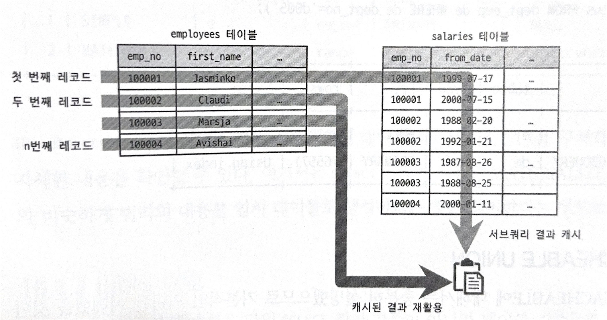

# 10. 실행계획

## 실행 계획 분석

```sql
EXPLAIN SELECT * 
        FROM party p 
        INNER JOIN `users` u 
        ON u.user_id = p.host_id;
+----+-------------+-------+------------+------+-----------------------------+------+---------+------+------+----------+--------------------------------------------+
| id | select_type | table | partitions | type | possible_keys               | key  | key_len | ref  | rows | filtered | Extra                                      |
+----+-------------+-------+------------+------+-----------------------------+------+---------+------+------+----------+--------------------------------------------+
|  1 | SIMPLE      | u     | NULL       | ALL  | PRIMARY                     | NULL | NULL    | NULL |    7 |   100.00 | NULL                                       |
|  1 | SIMPLE      | p     | NULL       | ALL  | FKq9cc5ph54opg7on9nq7ygw8sp | NULL | NULL    | NULL |   33 |   100.00 | Using where; Using join buffer (hash join) |
+----+-------------+-------+------------+------+-----------------------------+------+---------+------+------+----------+--------------------------------------------
```

- `EXPLAIN`명령을 통해 쿼리 문장의 특성에 따라 표 형태로 사용된 테이블 개수 만큼 행이 출력
- 쿼리 바깥, 먼저 접근한 테이블일수록 위에 출력
- 쿼리 안, 나중에 접근한 테이블일수록 아래에 출력

### 1. `id` 칼럼
- 특정 쿼리에서 여러 개의 `SELECT` 연산이 발생함
- 이때 단위 `SELECT` 쿼리에 붙는 유니크한 식별자 값을 `id`라고 함
- id가 작다고 먼저 접근한 것은 아님

> #### 조인 시
> - 하나의 `SELECT`에서 여러 테이블을 조인하면 테이블의 개수만큼 id 값이 생길 것이라 예상하지만,
> - `SELECT` 쿼리가 하나이고, 여러 테이블이 조인되면 같은 id값이 부여됨

### 2. `select_type` 칼럼
- 각 단위의 `SELECT` 쿼리가 어떤 타입인지 표시하는 칼럼
> #### `SIMPLE`
> - `UNION`, 서브쿼리를 사용하지 않는 단순한 `SELECT` 쿼리에서 사용
> - 실행계획에서 `SIMPLE`인 쿼리는 단 하나만 존재
> - 일반적으로 가장 바깥의 쿼리의 `select_type`이 `SIMPLE`로 표시
> 
> #### `PRIMARY`
> - `UNION`, 서브쿼리를 가지는 `SELECT`쿼리의 실행계획에서 가장 바깥 쪽의 `SELECT` 쿼리에서 표시
> - `SIMPLE`과 비슷하게 단 하나만 존재
> 
> #### `UNION`
> - `UNION`으로 결합하는 쿼리 중 두 번째 이후의 `SELECT`쿼리에 표시
> - 이때 첫 번째의 `SELECT`쿼리는 쿼리 결과를 모아 임시 테이블로 저장하는 `DERIVED`로 표시됨
> 
> #### `DEPENDENT UNION`
> - `UNION`과 비슷하게, `UNION`, `UNION ALL`로 결합되는 쿼리에서 표시
> - 단, 내부 쿼리가 외부의 값을 참조해서 처리될 때만 `DEPENDENT UNION`으로 표시됨
>
> #### `UNION RESULT`
> - `UNION`결과를 담아두는 테이블을 의미
> - MySQL 8.0부터 `UNION ALL`에 한해 임시 테이블을 사용하지 않도록 기능
> 
> ```sql
> mysql> EXPLAIN SELECT * FROM party p WHERE p.title LIKE '%a%' 
>                UNION 
>                SELECT * FROM party p WHERE p.category = 'DELIVERY';
> +----+--------------+------------+------------+------+---------------+------+---------+------+------+----------+-----------------+
> | id | select_type  | table      | partitions | type | possible_keys | key  | key_len | ref  | rows | filtered | Extra           |
> +----+--------------+------------+------------+------+---------------+------+---------+------+------+----------+-----------------+
> |  1 | PRIMARY      | p          | NULL       | ALL  | NULL          | NULL | NULL    | NULL |   33 |    11.11 | Using where     |
> |  2 | UNION        | p          | NULL       | ALL  | NULL          | NULL | NULL    | NULL |   33 |    25.00 | Using where     |
> |  3 | UNION RESULT | <union1,2> | NULL       | ALL  | NULL          | NULL | NULL    | NULL | NULL |     NULL | Using temporary |
> +----+--------------+------------+------------+------+---------------+------+---------+------+------+----------+-----------------+
> ```
> - 위 예시처럼, 마지막 `UNION RESULT`의 `table` 칼럼은 `<union1,2>`로 되어있음
> - 이는 id=1인 테이블과 id=2인 테이블 쿼리의 결과를 `UNION`함을 의미
> - 만약 동일한 쿼리에서 `UNION`을 `UNION ALL`로 변경하면 임시 테이블에 결과를 넣지 않기 때문에 `UNION RESULT`가 필요 없어짐
> 
> #### `SUBQUERY`
> - `FROM`절 이외에서 사용되는 서브쿼리만 표시
> - `FROM`절에 사용된 쿼리의 `select_type`은 `DERIVED` (파생 테이블)
> - 나머지 서브쿼리는 모두 `SUBQUERY`로 표시됨
> 
> #### `DEPENDENT SUBQEURY`
> - 위에서 언급한 `DEPENDENT UNION`처럼, 바깥 쿼리에서 정의한 칼럼을 사용할 때 안쪽의 서브쿼리에서 해당 값으로 표시됨
> - 외부 쿼리가 먼저 수행된 후 내부 쿼리가 실행되어야 하므로 일반 서브쿼리보다 성능이 낮음
> 
> #### `DERIVED`
> - `FROM`절에 위치한 단위 `SELECT`쿼리의 실행결과로 임시테이블을 생성할 때 사용
> - MySQL 5.6 이후부터 임시 테이블에도 인덱스를 추가하여 최적화 가능
> - 즉, `FROM`절에 위치한 단위쿼리라도 최적화를 통해 조인으로 처리가능 (불필요한 서브쿼리 제거)
> 
> #### `DEPENDENT DERIVED`
> - `FROM`절의 서브쿼리에서 외부 칼럼을 참조할 때 표시
> - 이때 조인 시 래터럴 조인을 사용해야 함
> - 즉, 래터럴 조인을 사용하면 `select_type`의 값은 `DEPENDENT DERIVED`
> 
> #### `UNCACHEABLE SUBQUERY`
> - 서브쿼리에서 캐시를 사용하지 않을 때 표시
> - 서브쿼리가 하나만 있을 때, 해당 쿼리가 한 번만 실행되는 건 아님
> - 하지만 조건이 같은 서브쿼리가 실행될 때는 이전의 실행 결과를 캐싱하여 사용
> 
> - `SUBQUERY`와 `DEPENDENT SUBQUERY`시 위 예시처럼 캐시가 사용됨
>   - `SUBQUERY`인 경우는 캐시가 한 번만 생성되지만
>   - `DEPENDENT SUBQUERY`일 때는 외부 쿼리의 값에 의존하여 캐시가 만들어짐
> - 이때 서브쿼리에 포함된 요소로 인해 캐시가 불가능한 경우 존재 -> 이 경우 `UNCACHEABLE SUBQUERY`가 표시됨
>   1. 사용자 변수가 사용된 경우
>   2. `NOT-DETERMINISTIC` 속성의 루틴이 서브쿼리내에서 사용된 경우
>   3. 호출할 때마다 결과값이 달라지는 함수가 사용된 경우 (`UUID()`, `RAND()`)
> 
> #### `UNCACHEABLE UNION`
> - `UNION` 연산에서 위와 같은 경우로 캐싱을 사용하지 못할 때 표시
> 
> #### `MATERIALIZED`
> - 주로 `FROM`절, `IN` 형태의 쿼리에 사용된 서브쿼리 최적화를 위해 사용
> - `IN`절이 사용될 때, 외부 쿼리의 테이블의 레코드마다 서브쿼리의 테이블을 매번 읽어야 했음
> - MySQL 5.7 이후부터, 서브쿼리의 내용을 임시 테이블로 구체화(`Materialization`) 후 임시 테이블과 외부 쿼리의 테이블을 조인하는 형태로 최적화
> - 이 경우 `MATERIALIZED`로 표시됨

### 3. `table` 칼럼
- 실행 계획은 `SELECT` 쿼리 기준이 아닌, 테이블 기준으로 표시됨
- 만약 테이블을 사용하지 않거나, 없는 테이블에서 `SELECT` 쿼리가 발생한다면, 오류를 발생시키지 않음
```sql
mysql> EXPLAIN SELECT NOW();
+----+-------------+-------+------------+------+---------------+------+---------+------+------+----------+----------------+
| id | select_type | table | partitions | type | possible_keys | key  | key_len | ref  | rows | filtered | Extra          |
+----+-------------+-------+------------+------+---------------+------+---------+------+------+----------+----------------+
|  1 | SIMPLE      | NULL  | NULL       | NULL | NULL          | NULL | NULL    | NULL | NULL |     NULL | No tables used |
+----+-------------+-------+------------+------+---------------+------+---------+------+------+----------+----------------+
```
- 별도의 테이블을 사용하지 않을 때, `table`칼럼의 값은 `NULL`로 처리됨
- 만약 `<derived N>`, 또는 `<derived N, M>`과 같은 형태일 때는 id가 N, M인 쿼리 결과로부터 만들어진 임시 테이블임을 의미

```sql
> +----+--------------+------------+---------+-------------------+--------+-------------+
> | id | select_type  | table      | type    | key               | rows   | Extra       |
> +----+--------------+------------+---------+-------------------+--------+-------------+
> |  1 | PRIMARY      | <derived2> | ALL     | NULL              | 331143 | NULL        |
> |  1 | PRIMARY      | e          | eq_ref  | PRIMARY           | 1      | NULL        |
> |  2 | DERIVED      | dept_emp   | ALL     | ix_empno_fromdate | 331143 | Using index |
> +----+--------------+------------+---------+-------------------+--------+-------------+
```
- 위와 같은 실행계획일 때 다음과 같이 추론할 수 있음
  - 첫 번째 라인 테이블이 `<derived2>`이므로 id=2인 라인이 먼저 실행되고, 해당 결과가 임시 테이블로 만들어짐
  - 세 번째 라인(id = 2)은 `select_type`이 `DERIVED`이다. 이는 dept_emp 테이블을 읽어 파생 테이블을 생성함
  - 첫 번째와 두 번째 라인이 같은 id를 가지고 있는 것으로 보아, 2개의 테이블이 조인된다고 추론 가능 (`<derived2>`가 드라이빙, `e`가 드리븐)


### 4. `partitions` 칼럼
- MySQL 8.0 이후부터 `EXPLAIN`만으로 파티션 관련 실행계획까지 확인 가능
- 파티션 : 하나의 테이블이지만 물리적인 저장 위치를 다르게 함
- 실행계획을 통해 어떤 파티션에서 데이터를 가져오는지 확인 가능
```sql
> +----+--------------+-------------+------------------------+--------+-------+
> | id | select_type  | table       | partitions             | type   | rows  |
> +----+--------------+-------------+------------------------+--------+-------+
> |  1 | SIMPLE       | employees_2 | p1996_2000, p2001_2005 | ALL    | 21743 |
> +----+--------------+-------------+------------------------+--------+-------+
```
- 위와 같은 실행계획에서, 파티션 칼럼을 통해 `p1996_2000`, `p2001_2005`의 파티션을 읽었지만, `type`칼럼이 `ALL`로, 모든 풀 테이블 스캔을 진행했다고 확인할 수 있다.
- 파티션은 물리적으로 개별 테이블처럼 별도 저장공간을 가지기 때문에, 테이블을 풀 스캔한 것이 아니라 `p1996_2000`, `p2001_2005`파티션에 대해서만 풀 스캔을 실행함


### 5. `type` 칼럼
- `type`칼럼은 테이블의 레코드를 어떻게 읽었는지를 나타냄
- 인덱스로 읽었는지, 풀 스캔으로 테이블을 읽었는지 알 수 있다.
- 표시되는 값들 중 `ALL`을 제외하면, 모두 인덱스를 사용하는 접근 방법이다.
- 

> - 아래에 나열되는 순으로 성능이 빠르다.
> #### `system`
> - 레코드가 1건만 존재하거나, 테이블이 존재하지 않을 때의 접근 방법
> - `InnoDB` 스토리지 엔진을 사용할 때는 해당 X
> 
> #### `const`
> - 테이블의 레코드 건수와 상관없이, 프라이머리 키, 혹은 유니크 칼럼을 통한 조걸절을 가지며 동시에 1건만 반환하는 쿼리의 처리 방식이다.
> - 유니크한 속성을 가진 값으로 테이블을 조회하므로 단 하나의 레코드만 나온다
> - 만약 프라이머리 키의 일부만으로 조회를 할 때는 `const`가 아닌, `ref`로 표시됨
> - 동등 조건을 통해 유니크한 값이 반환됨을 보장할 수 있을 때 표시됨
> ```sql
> mysql> explain select * from `users` where user_id = 1;
> +----+-------------+-------+------------+-------+---------------+---------+---------+-------+------+----------+-------+
> | id | select_type | table | partitions | type  | possible_keys | key     | key_len | ref   | rows | filtered | Extra |
> +----+-------------+-------+------------+-------+---------------+---------+---------+-------+------+----------+-------+
> |  1 | SIMPLE      | users | NULL       | const | PRIMARY       | PRIMARY | 8       | const |    1 |   100.00 | NULL  |
> +----+-------------+-------+------------+-------+---------------+---------+---------+-------+------+----------+-------+
> ```
> - 위 예시처럼 프라이머리 키인 `user_id`로 조회했을 때, 한 건의 레코드만 반환되는 것이 확실하므로 `ref`의 값이 `const`로 처리됨
> 
> #### `eq_ref`
> - 여러 테이블이 조인되는 쿼리에서 표시됨
> - 조인에서 처음 읽은 테입르의 칼럼 값을 다음 테이블의 프라이머리 키, 혹은 유니크 키 칼럼과 검색 조건을 이룰 때 사용
> - 즉, 조인에서 두 번째 이후에 읽는 테이블에서 반드시 1건이 보장될 때 사용 가능함
> 
> #### `ref`
> - `eq_ref`와 달리 조인 순서와 상관없이 사용됨 (프라이머리 키, 유니크 키 조건 X)
> - 인덱스와 관계없이 동등조건으로 검색될 때만 사용됨
> - 유니크한 레코드를 반환하는 `eq_ref`보다는 성능이 느리지만, 동등 조건일때만 비교되므로 빠른 레코드 조회 중 하나
> 
> #### `fulltext`
> - 전문검색 인덱스를 통해 레코드를 반환할 때 사용하는 접근방법
> - 만약 일반 `WHERE`절과 전문검색 조건이 동시에 사용될 때, fulltext보다 일반 인덱스 접근이 더 빨리 처리된다.
> - 즉, 전문검색 쿼리를 사용할 때는 조건별로 성능을 확인해야 함.
> 
> #### `ref_or_null`
> - `ref`와 접근 방식이 같지만 `NULL`비교도 추가된 방식
> 
> #### `unique_subquery`
> - `WHERE`조건절에서 사용되는 `IN`형태의 쿼리를 위한 접근
> - 서브쿼리에서 중복되지 않는 유니크한 값만 반환해야할 때 사용됨
> - 반환 값에 중복이 없다는 것이 자명할 때 사용됨 (중복 제거 작업 X)
> 
> #### `index_subquery`
> - `IN`연산자에서는 괄호 안에 데이터가 중복되어서는 안됨
> - 이때 `IN` 안의 서브쿼리가 인덱스를 통해 중복을 제거할 수 있을 때 `index_subquery`가 사용됨
>
> #### `range`
> - 흔히 아는 인덱스 레인지 스캔 형태의 접근 방법
> - 인덱스를 하나의 값이 아닌 범위로 검색하는 경우
> 
> #### `index_merge`
> - 2개 이상의 인덱스를 이용해 각 결과를 도출해 내고, 그 결과를 병합하는 방식
> - 여러 인덱스를 읽으므로 `range`보다 효율이 떨어짐
> - 2개 이상의 결과를 다루기 때문에 중복제거 같은 추가작업을 요함
> 
> #### `index`
> - 주어진 인덱스에 대해 풀 스캔을 진행하는 접근 방법
> - 테이블을 풀 스캔하는 것과 동일하지만, 인덱스의 파일 크기가 작기 때문에 테이블을 풀 스캔하는 것보다는 나음
>   - `range`, `const`, `ref`로 처리하지 못하는 경우
>   - 인덱스에 포함된 칼럼만으로 처리가능한 경우
>   - `GORUP BY`, `ORDER BY`같은 정렬 작업이 인덱스를 통해 가능한 경우
> 
> #### `ALL`
> - 흔히 아는 테이블을 풀스캔하는 동작방식
> - 위에서 언급한 접근방식으로 처리불가할 때 가장 마지막에 선택하는 비효율적인 방식

### 6. `possible_keys` 칼럼
- 여러 실행계획 중 후보로 선정되었던 접근 방법에서사용되는 인덱스 목록
- 해당 인덱스가 무조건 사용된 것은 아님

### 7. `key` 칼럼
- `possible_keys`와 다르게, 최종 선택된 인덱스
- `key`에 의도한 인덱스가 적혀있는지 확인하는게 중요
- `type`칼럼이 `index_merge`이 아닌 경우에는 반드시 표시되는 인덱스는 하나
- 만약 인덱스를 사용하지 않는다면 `NULL`로 표시

### 8. `key_len` 칼럼
- 쿼리를 처리하기 위해 인덱스의 각 레코드에서 몇 바이트까지 사용했는지 알려주는 지

```sql
mysql> explain select * from `users` where user_id = 1;
+----+-------------+-------+------------+-------+---------------+---------+---------+-------+------+----------+-------+
| id | select_type | table | partitions | type  | possible_keys | key     | key_len | ref   | rows | filtered | Extra |
+----+-------------+-------+------------+-------+---------------+---------+---------+-------+------+----------+-------+
|  1 | SIMPLE      | users | NULL       | const | PRIMARY       | PRIMARY | 8       | const |    1 |   100.00 | NULL  |
+----+-------------+-------+------------+-------+---------------+---------+---------+-------+------+----------+-------+
```
- 위 예시로는 `key_len`이 8바이트이다.
- `user_id`가 `bigint`타입이고, 해당 타입은 8바이트이다.
- 만약 다중 칼럼으로 인덱스가 구성되어있고, 해당 인덱스를 사용했을 때 어디까지의 칼럼을 사용햇는지 확인 가능하다
- 또한 `NULLABLE`인 칼럼에 대해, 할당된 바이트 크기보다 하나 더 크게 표시될 수 있다.

### 9. `ref` 칼럼
- `type`이 `ref`일 때 어던 값이 제공되었는지 보여줌
- 상숫값이면 `const`로 표시되고,
- 테이블의 칼럼이면 테이블과 칼럼명이 표시된다.

### 10. `rows` 칼럼
- 실행계획의 효율성 판단을 위해 예측한 반환 레코드 건수이다.
- 스토리지 엔진별로 가진 통계 정보를 참조해 예상하기에 정확하지 않음
- 예측한 값과 테이블의 총 레코드 개수가 같으면, 옵티마이저는 해당 테이블을 풀 스캔해야한다고 판단한 것
- 만약 일부의 레코드만 읽어도 된다고 판단되면, 이보다 작은 값을 `rows`칼럼으로 표시함

### 11. `filtered` 칼럼
- `rows`칼럼은 인덱스를 사용하는 조건에만 일치하는 레코드 건수를 예측한 것
- 반면 `filtered`는, 필터링되어 버려지는 레코드의 비율이 아닌, 필터링되고 남은 레코드의 비율
  - `filtered`값이 `16.03%`라는 건, 조건문에서 조건을 충족하는 레코드의 수가 `16.03%`이라는 뜻
- 즉, 인덱스 조건에만 만족하는 레코드의 개수인 `rows`와 필터링되고 남은 레코드의 비율인 `filtered`를 곱한 값이 `WHERE`문의 실제 레코드 개수를 의미
```sql
+----+-------------+-------+-------+--------------+------+----------+
| id | select_type | table | type  | key          | rows | filtered |
+----+-------------+-------+-------+--------------+------+----------+
|  1 | SIMPLE      | e     | ref   | ix_firstname | 233  | 16.03    |
+----+-------------+-------+-------+--------------+------+----------+
|  2 | SIMPLE      | s     | ref   | PRIMARY      | 10   | 0.48     |
+----+-------------+-------+-------+--------------+------+----------+

+----+-------------+-------+-------+--------------+------+----------+
| id | select_type | table | type  | key          | rows | filtered |
+----+-------------+-------+-------+--------------+------+----------+
|  1 | SIMPLE      | s     | ref   | ix_salary    | 3314  | 11.11   |
+----+-------------+-------+-------+--------------+------+----------+
|  2 | SIMPLE      | e     | ref   | PRIMARY      | 1    | 5.00     |
+----+-------------+-------+-------+--------------+------+----------+
```

- 위 두 실행계획은 테이블 (s, e)의 조인 순서를 다르게 한 것
  - 첫번째 실행계획은 $rows * filtered = 233 * 16.03 = 27$건이다.
  - 반면 두번째 실행계획은 $3314 * 11.11 = 368$건이다.
- 레코드의 건수가 적은 테이블이 드라이빙 테이블이 되어야 하므로 첫 번째의 실행계획이 조금 더 효율적인 방식임을 확인할 수 있음
- 이에 `filtered`의 값이 얼마나 값을 정확히 예측하냐에 따라 성능이 달라질 수 있음
