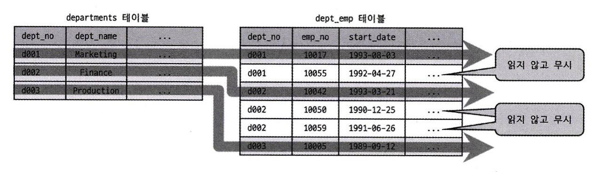

# 10.3.12 Extra 칼럼

쿼리 실행 계획에서 성능에 관련된 중요한 내용이 Extra 칼럼에 자주 표시된다.

일반적으로 2~3개씩 내부적인 처리 알고리즘에 대해 조금 더 깊이있는 내용을 보여주는 경우가 많다.

이제 Extra 칼럼에 표시될 수 있는 문장을 하나씩 자세히 살펴보자.

## 1. const row not found

- 쿼리의 실행 계획에서 const 접근 방법으로 테이블을 읽었지만 실제로 해당 테이블에 레코드가 1건도 존재하지 않는 경우 표시되는 내용
- Extra 칼럼에 이 메시지가 표시된다면 테스트용 데이터를 저장하고 다시 실행 계획을 확인해보자.

## 2. Deleting all rows

- MyISAM 스토리지 엔진처럼 스토리지 엔진의 핸들러 차원에서 테이블의 모든 레코드를 삭제하는 기능을 제공하는 스토리지 엔진 테이블인 경우 표시되는 문구
- WHERE 조건절이 없는 DELETE 문장의 실행 계획에서 자주 표시된다.
- 테이블의 모든 레코드를 삭제하는 핸들러 기능(API)을 한 번 호출함으로써 처리됐다는 것을 의미한다.
- MySQL 8.0에서는 InnoDB와 MyISAM 엔진 모두 실행 계획에 Deleting all rows를 표기하지 않는다.
    - 모든 레코드를 삭제하고자 한다면 조건절 없는 DELETE 보다 TRUNCATE TABLE을 사용하자.

## 3. Distinct

```sql
EXPLAIN
SELECT DISTINCT d.dept_no
FROM departments d, dept_emp de WHERE de.dept_no=d.dept_no;
```

| id | select_type | table | type | key | Extra |
| --- | --- | --- | --- | --- | --- |
| 1 | SIMPLE | d | index | ux_deptname | Using index; Using temporary |
| 1 | SIMPLE | de | ref | PRIMARY | Using index; Distinct |
- 위 쿼리에서 양측 테이블에 모두 존재하는 dept_no를 중복없이 가져오고자 한다.
- 두 테이블을 조인하여 그 결과에 DISTINCT 처리를 넣게 된다.



- DISTINCT 처리를 위해 조인하지 않아도 되는 항목은 무시하고 필요한 것만 조인한다.
- 위 그림 및 실행 계획에서 dept_emp 테이블에서는 꼭 필요한 레코드만 읽었다는 것을 표현하고 있다.

## 4. FirstMatch

- 세미 조인 최적화 중 FirstMatch 전략 사용 시 `FirstMatch(table_name)` 메시지가 출력된다.

| id | table | type | key | rows | Extra |
| --- | --- | --- | --- | --- | --- |
| 1 | e | ref | ix_firstname | 233 | NULL |
| 1 | t | ref | PRIMARY | 1 | Using where; Using index; FirstMatch(e) |
- 위 실행 계획의 경우 e (employees) 테이블을 기준으로 t (titles) 테이블에서 첫 번째로 일치하는 한 건만 검색한다는 것을 의미한다.

## 5. Full scan on NULL key

- MySQL 서버가 쿼리를 실행하는 중 선행 비교 조건이 NULL을 만나면 차선책으로 서브쿼리 테이블에 대해서 풀 테이블 스캔을 사용할 것이라는 사실을 알려주는 키워드
- 선행 비교 조건이 NOT NULL로 정의된 경우 차선책은 선택되지 않고 Extra 칼럼에도 표기되지 않는다.

## 6. Impossible HAVING

- 쿼리에 사용된 HAVING 절의 조건을 만족하는 레코드가 없을 때 Extra 칼럼에 표시되는 키워드이다.

```sql
EXPLAIN
SELECT e.emp_no, COUNT(*) AS cnt
FROM employees e
WHERE e.emp_no=10001
GROUP BY e.emp_no
HAVING e.emp_no IS NULL;
```

- 위 쿼리의 경우 e.emp_no는 NOT NULL 칼럼이기에, HAVING 조건절이 만족할 수 없다.
- 보통 쿼리가 제대로 작성되지 못한 경우이기에 쿼리 내용을 다시 점검하는 것이 좋다.

## 7. Impossible WHERE

- Impossible HAVING 처럼 WHERE 조건이 항상 FALSE가 될 수밖에 없는 경우 표시된다.

## 8. LooseScan

- 세미 조인 최적화 중 LooseScan 최적화 전략 사용 시 `LooseScan` 키워드가 표시된다.

## 9. No matching min/max row

- WHERE 조건절을 만족하는 레코드가 한 건도 없는 경우 `Impossible WHERE`이 표시될 것이다.
- MIN() 인아 MAX() 같은 집합 함수가 있는 쿼리의 조건절에 일치하는 레코드가 없을 때는 Extra 칼럼에 `No matching min/max row` 메시지가 출력된다.

## 10. no matching row in const table

- 조인에 사용된 테이블에서 const 방법으로 접근할 때 일치하는 레코드가 없다면 표시되는 메시지이다.
- Impossible WHERE 처럼 실행 계획을 만들기 위한 기초 자료가 없음을 의미한다.

```sql
EXPLAIN
SELECT *
FROM dept_emp de,
	(SELECT emp_no FROM employees WHERE emp_no=0) tb1
WHERE tb1.emp_no=de.emp_no AND de.dept_no='d005';
```

## 11. No matching rows after partition pruning

- 파티션된 테이블에 대해 UPDATE 또는 DELETE 명령의 실행 계획에서 표시될 수 있다.
- 해당 파티션에서 UPDATE 하거나 DELETE 할 대상 레코드가 없을 때 표시된다.
- 단순히 대상 레코드가 없음을 의미하는 것이 아니라, 대상 파티션이 없다는 것을 의미한다.

## 12. No tables used

- 다른 DBMS와 달리 MySQL 서버는 FROM 절이 없는 쿼리도 허용된다.
- 이처럼 FROM 절 자체가 없거나 FROM 절에 상수 테이블을 의미하는 DUAL(칼럼과 레코드를 각각 1개씩만 가지는 가상의 상수 테이블)이 사용될 때 표시되는 메시지이다.

## 13. Not exists

- A 테이블에는 존재하지만 B 테이블에는 없는 값을 조회해야 할 때가 있다.
- 이때 주로 NOT IN(subquery) 형태나 NOT EXISTS 연산자를 주로 사용한다.
- 이러한 형태의 조인을 안티-조인(Anti-JOIN)이라고 한다.
- 똑같은 처리를 아우터 조인(LEFT OUTER JOIN)을 이용해서도 구현할 수 있다.

```sql
EXPLAIN
SELECT *
FROM dept_emp de,
	LEFT JOIN departments d ON de.dept_no=d.dept_no
WHERE d.dept_no IS NULL;
```

- 위 처럼 아우터 조인을 이용해 안티-조인을 수행하는 경우 Extra 칼럼에  표시되는 키워드이다.
- Not exists 메시지는 옵티마이저가 드라이빙 테이블의 레코드를 이용해 드리븐 테이블 조인 시 존재 여부만 판단한다는 것을 의미한다.
- 즉 조인 조건에 일치하는 레코드가 여러 건이 있다고 해도 딱 1건만 조회해보고 처리를 완료하는 최적화

## 14. Plan isn’t ready yet

- 해당 커넥션에서 아직 쿼리의 실행 계획을 수립하지 못한 상태인 경우 표시되는 키워드이다.
- MySQL 8.0  버전에서는 다른 커넥션에서 실행 중인 쿼리의 실행 계획을 살펴볼 수 있다.
    - `SHOW PROCESSLIST;` 를 통해 리스트 확인
    - `EXPLAIN FOR CONNECTION {id};` 를 통해 다른 커넥션의 실행 계획 확인

## 15. Range checked for each record(index map: N)

```sql
EXPLAIN
SELECT *
FROM employees e1, employees e2
WHERE e2.dmp_no >= e1.emp_no;
```

- employees가 1번부터 1억 번까지 있다고 가정해보자.
- 이때 옵티마이저는 e2를 읽을 때 인덱스 레인지 스캔과 풀 테이블 스캔 중 어느 것이 효율적일지 판단해야하는데, 이때 **레코드마다 인덱스 레인지 스캔을 체크**하는 것이 `Range checked for each record` 이다.
- 위 쿼리에서 `e1.emp_no`가 1인 경우에는 e2 테이블의 1억 건 전부를 읽어야 한다.
    - 이때는 인덱스 레인지 스캔이 유리하다.
- `e1.emp_no`가 100000000인 경우에는 e2 테이블을 1건만 읽으면 된다.
    - 이때는 풀 테이블 스캔이 유리하다.

|  | 다섯 번째 자리 | 네 번째 자리 | 세 번째 자리 | 두 번째 자리 | 첫 번째 자리 |
| --- | --- | --- | --- | --- | --- |
| 비트맵 값 | 1 | 1 | 0 | 0 | 1 |
| 인덱스 | ix_nick_phone | ix_nick_gender | ix_nick_region | ix_nick_name | PRIMARY |
- `Range checked for each record(index map: N)` 에서 N은 0x00 형태의 16진수로 표시된다.
    - N은 사용할지 말지를 판단하는 후보 인덱스의 순번을 나타낸다.
    - **테이블의 N에 해당하는 인덱스들의 사용 여부를 매 레코드 단위로 결정하면서 처리한다는 의미이다.**
    - 예를들어 N이 `0x11001` 으로 표현되었고, 인덱스 구성이 위 테이블과 같다면
    - `PRIMARY`, `ix_nick_gender`, `ix_nick_phone` 인덱스의 사용 여부를 매 레코드 단위로 체크하는 것
    - 즉 각 비트맵의 자릿수가 1인 순번의 인덱스가 체크 대상이다.

## 16. Recursive

- MySQL 8.0 버전부터 CTE(Common Table Expression)를 이용해 재귀 쿼리를 작성할 수 있게 됐다.

```sql
WITH RECURSIVE cte (n) AS
(
	SELECT 1
	UNION ALL
	SELECT n + 1 FROM cte WHERE n < 5
)
SELECT * FROM cte;
```

- 위 쿼리의 WITH 절에서 실행하는 작업은 아래와 같다.
    1. “n”이라는 칼럼 하나를 가진 cte라는 이름의 내부 임시 테이블을 생성
    2. “n” 칼럼의 값이 1부터 5까지 1씩 증가하게 해서 레코드 5건을 만들어서 cte 내부 임시 테이블에 저장
- 위처럼 CTE를 이용한 재귀 쿼리의 실행 계획은 Extra 칼럼에 Recursive 구문이 표시된다.

## 17. Rematerialize

- MySQL 8.0 부터 추가된 래터럴 조인 시 래터럴로 조인되는 테이블은 선행 테이블의 레코드별로 서브쿼리를 실행해서 그 결과를 임시 테이블에 저장한다.
- 이 과정을 Rematerializing 이라고 하며, 이렇게 매번 임시 테이블이 새로 생성되는 경우 표시된다.

## 18. Select tables optimized away

- MIN() 또는 MAX() 만 SELECT 절에 사용되거나 GROUP BY로 MIN(), MAX()를 조회하는 쿼리가 인덱스를 오름차순 또는 내림차순으로 1건만 읽은 형태의 최적화가 적용될 때 Extra 칼럼에 나타나는 문구이다.
- MyISAM 테이블에서는 GROUP BY 없이 COUNT(*)만 SELECT 할 때도 이런 형태의 최적화가 적용된다.
    - MyISAM 테이블은 전체 레코드 건수를 별도로 관리하기에 인덱스나 데이터를 읽지 않아도 되기 때문
    - 하지만 WHERE 조건절이 있는 쿼리는 이런 최적화를 적용하지 못한다.

## 19. Start temporary, End temporary

- 세미 조인 최적화 중 Duplicate Weed-out 최적화 전략 사용 시 표시되는 키워드
    - 불필요한 중복 건을 제거하기 위해서 내부 임시 테이블을 사용한다.
- 조인되어 내부 임시 테이블에 저장되는 테이블을 식별할 수 있도록
    - 첫 번째 테이블에 Start temporary 문구를 보여주고
    - 조인이 끝나는 부분에 End temporary 문구를 표시해준다.

```sql
EXPLAIN
SELECT * FROM employees e
FROM e.emp_no IN (SELECT s.emp_no FROM salaries s WHERE s.salary>150000);
```

| id | select_type | table | type | key | Extra |
| --- | --- | --- | --- | --- | --- |
| 1 | SIMPLE | s | range | ix_salary | Using where; Using index; Start temporary |
| 1 | SIMPLE | e | eq_ref | PRIMARY | End temporary |
- **위 예제는 salaries 테이블부터 시작해 employees 테이블 까지의 내용을 임시 테이블에 저장한다는 의미**

## 20. unique row not found

- 두 개의 테이블이 각각 유니크(PK 포함) 칼럼으로 아우터 조인을 수행하는 쿼리에서 아우터 테이블에 일치하는 레코드가 존재하지 않는 경우 표시되는 코멘트

## 21. Using filesort

- ORDER BY 처리를 위해 인덱스를 이용하지 못하는 경우 MySQL 서버가 조회된 레코드를 다시 한 번 정렬해야한다.
- 이때 Extra 칼럼에 “Using filesort”가 표시되며, 이는 **조회된 레코드 정렬용 메모리 버퍼에 복사해 퀵 소트 또는 힙 소트 알고리즘을 이용해 정렬을 수행하게 된다는 의미**이다.
- ORDER BY가 사용된 쿼리의 실행 꼐획에만 나타날 수 있다.

## 22. Using index(커버링 인덱스)

- 데이터 파일을 전혀 읽지 않고 인덱스만 읽어서 쿼리를 모두 처리할 수 있을 때 표시되는 키워드이다.
- 인덱스를 이용해 처리하는 쿼리에서 가장 큰 부하를 차지하는 부분은 인덱스 검색에서 일치하는 키 값들의 레코드를 읽기 위해 데이터 파일을 검색하는 작업이다.
    - 최악의 경우 인덱스를 통해 검색된 결과 레코드 한 건 마다 디스크를 한 번씩 읽어야 할 수도 있다.
- 필요한 칼럼이 모두 인덱스에 있는 경우 데이터 파일을 읽어올 필요가 없어진다.
    - InnoDB에서는 클러스터링 인덱스의 특성으로 PK 값은 기본적으로 인덱스에 포함된다고 생각하자.

## 23. Using index condition

- MySQL 옵티마이저가 인덱스 컨티션 푸시 다운(Index condition pushdown) 최적화 시 표시되는 메시지

## 24. Using index for group-by

- GROUP BY 처리를 위해 MySQL 서버는 그루핑 기준 칼럼을 이용해 정렬 작업을 수행하고, 다시 정렬된 결과를 그루핑하는 형태의 고부하 작업을 필요로 한다.
- 하지만 GROUP BY 처리가 인덱스(B-Tree 인덱스에 한해서)를 이용 시 별도의 추가 정렬 없이 정렬된 인덱스 칼럼을 순서대로 읽으면서 그루핑 작업만 수행할 수 있다.
- GROUP BY 처리가 인덱스를 이용할 때 쿼리 실행 계획의 Extra 칼럼에 표시되는 문구이다.
    - **단 루스 인덱스 스캔에 한하여 나타나는 문구이다.**
- **이때 GROUP BY 처리를 위해 단순히 인덱스를 순서대로 쭉 읽는 것과, 인덱스의 필요한 부분만 듬성듬성 읽는 루스 인덱스 스캔은 다르다.**

### 타이트 인덱스 스캔을 통한 GROUP BY 처리

- 인덱스를 이용해 GROUP BY를 처리할 수 있더라도 AVG(), SUM(), COUNT() 처럼 조회하려는 값이 모든 인덱스를 다 읽어야 할 때는 필요한 레코드를 듬성듬성 읽는 것이 불가능하다.
- 이러한 쿼리의 실행 계획에는 `Using index for group-by` 메시지가 출력되지 않는다.

### 루스 인덱스 스캔을 통한 GROUP BY 처리

- **단일 칼럼으로 구성된 인덱스에서는 그루핑 칼럼 말고는 아무것도 조회하지 않는 쿼리에서 루스 인덱스 스캔을 사용할 수 있다.**
- **다중 칼럼으로 구성된 인덱스의 경우 GROUP BY 절이 인덱스를 사용할 수 있어야 함은 물론이고 MIN() 이나 MAX() 같이 조회하는 값이 인덱스의 첫번째 또는 마지막 레코드만 읽어도 되는 쿼리에도 루스 인덱스 스캔이 사용된다.**
- WHERE 조건절이 존재하는 경우에는 이러한 루스 인덱스 스캔 사용 조건이 더 까다로워지기에 주의하자.

## 25. Using index for skip scan

- MySQL 옵티마이저가 인덱스 스킵 스캔 최적화를 사용하면 이 키워드가 표시된다.
- **루스 인덱스 스캔이 확장된 인덱스 스킵 스캔은 아직 부족한 부분은 있지만 쿼리 최적화에서 중요한 부분이므로 내부적인 처리 방식을 잘 이해해두어야 한다.**

## 26. Using join buffer(Block Nested Loop), Using join buffer(Batched Key Access), Using join buffer(hash join)

- 일반적으로 빠른 쿼리 실행을 위해 조인되는 칼럼은 인덱스를 생성한다.
- **실제로 조인에 필요한 인덱스는 조인되는 양쪽 테이블 칼럼 모두가 필요한 것이 아니라, 조인에서 뒤에 있는 테이블의 칼럼에만 필요하다.**
- **MySQL 옵티마이저도 조인되는 두 테이블에 있는 각 칼럼에서 인덱스를 조사하고, 인덱스가 없는 테이블이 있으면 그 테이블을 먼저 읽어 조인을 실행한다.**
- **뒤에 있는 드리븐 테이블은 검색 위주로 사용되기에 인덱스 유무에 따라 성능 차이가 커지기 때문이다.**
- 조인 수행 시 조인 칼럼에 적절한 인덱스가 없다면 MySQL 서버는 네스티드 루프 조인이나 해시 조인을 사용한다.
- 이때 실행 계획의 Extra 칼럼에 `Using join buffer` 메시지가 표시된다.

## 27. Using MRR

- MySQL 엔진은 실행 계획을 수립하고 그 계획에 맞게 스토리지 엔진의 API를 호출해서 쿼리를 처리한다.
- 이 이유로 아무리 많은 레코드를 읽는 과정이라 할지라도 스토리지 엔진은 MySQL 엔진이 넘겨주는 키 값을 기준으로 레코드를 한 건 한 건 읽어서 반환하는 방식으로밖에 작동하지 못하는 한계점이 있다.
- 실제 매번 읽어서 반환하는 레코드가 동일 페이지에 있다 하더라도 레코드 단위로 API 호출이 필요하다.
- 위 단점의 보완을 위해, **MRR(Multi Range Read)**라는 최적화가 도입되었다.
    - MySQL 엔진이 여러 개의 키 값을 한 번에 스토리지 엔진으로 전달하고
    - 스토리지 엔진은 넘겨받은 키 값을 정렬하여 최소한의 페이지 접근 만으로 필요한 레코드를 읽는다.

## 28. Using sort_union(…), Using union(…), Using intersect(…)

- 쿼리가 index_merge 접근 방법으로 실행되는 경우에는 2개 이상의 인덱스가 동시에 사용된다.
- 이때 실행 계획의 Extra 칼럼에는 **두 인덱스로 부터 읽은 결과를 어떻게 병합했는지 상세한 설명을 위해 다음 3개 중에서 하나의 메시지를 선택적으로 출력**한다.
    - **Using intersect(…)**: 각각의 인덱스 사용 조건이 AND로 연결된 경우 각 처리 결과에서 교집합 추출
    - **Using union(…)**: 각 인덱스 사용 조건이 OR로 연결된 경우 각 처리 결과에서 합집합 추출
    - **Using sort_union(…)**: Using union과 같은 작업을 수행하지만, Using union으로 처리될 수 없는 경우(OR로 연결된 대량의 range 조건들) 이 방식으로 처리된다.
        - Using union과의 차이점은 Using sort_union은 PK만 먼저 읽어서 정렬 및 병합 이후 비로소 레코드를 읽어 반환할 수 있다는 것이다.

## 29. Using temporary

- MySQL 서버에서 쿼리를 처리하는 동안 중간 결과를 담아 두기 위해 임시 테이블을 사용한다.
- 이 키워드가 표시되면 임시 테이블을 사용한 것인데 메모리 또는 디스크에 생성된다.
- 사용된 임시 테이블이 메모리에 생성됐는지 디스크에 생성됐는지는 실행 계획만으론 판단할 수 없다.
- “Using temporary”가 표시되지 않았음에도 임시 테이블을 사용하는 경우도 존재한다.

## 30. Using where

- **MySQL 서버는 내부적으로 크게 MySQL 엔진과 스토리지 엔진이라는 두 개의 레이어로 나눠볼 수 있다.**
- **각 스토리지 엔진은 디스크나 메모리 상에서 필요한 레코드를 읽거나 저장하는 작업을 하며**
- **MySQL 엔진은 스토리지 엔진으로 부터 받은 레코드를 가공 또는 연산하는 작업을 수행한다.**
- MySQL 엔진 레이어에서 별도 가공을 해서 필터링(여과) 작업을 처리한 경우에만 이 코멘트가 표시된다.

## 31. Zero limit

- 때로는 MySQL 서버에서 데이터 값이 아닌 쿼리 결괏값의 메타데이터만 필요한 경우도 있다.
    - 쿼리의 결과가 몇 개의 칼럼을 가지고, 각 칼럼의 타입은 무엇인지 등의 정보만 필요한 경우
    - 이 경우 쿼리 마지막에 `LIMIT 0` 를 사용한다.
- 이때 옵티마이저는 사용자의 의도를 알고 실제 테이블 레코드 읽기 없이 메타 정보만 반환한다.
- 이 경우 실행 계획의 Extra 칼럼에는 “Zero limit” 메시지가 출력된다.