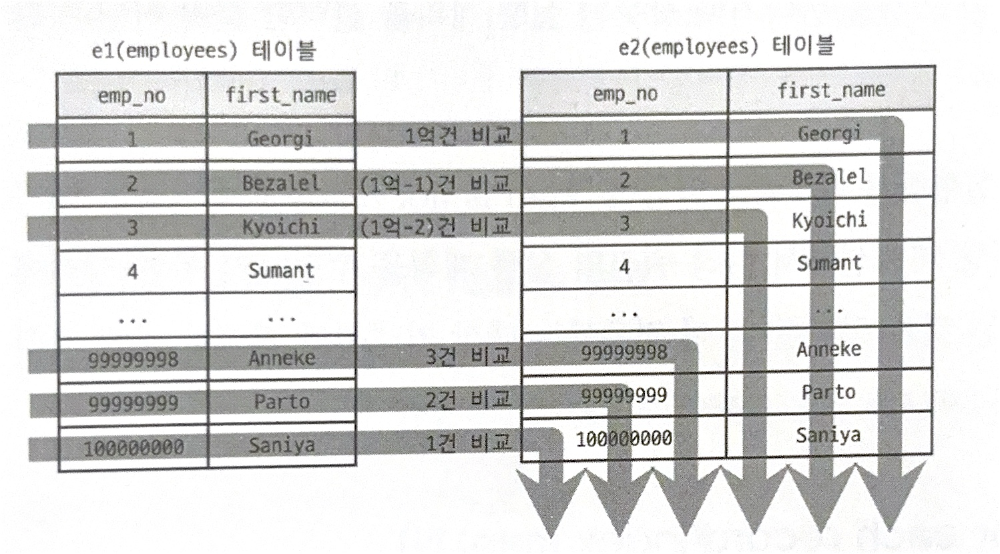
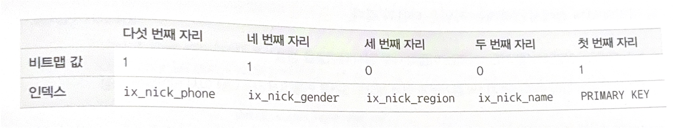
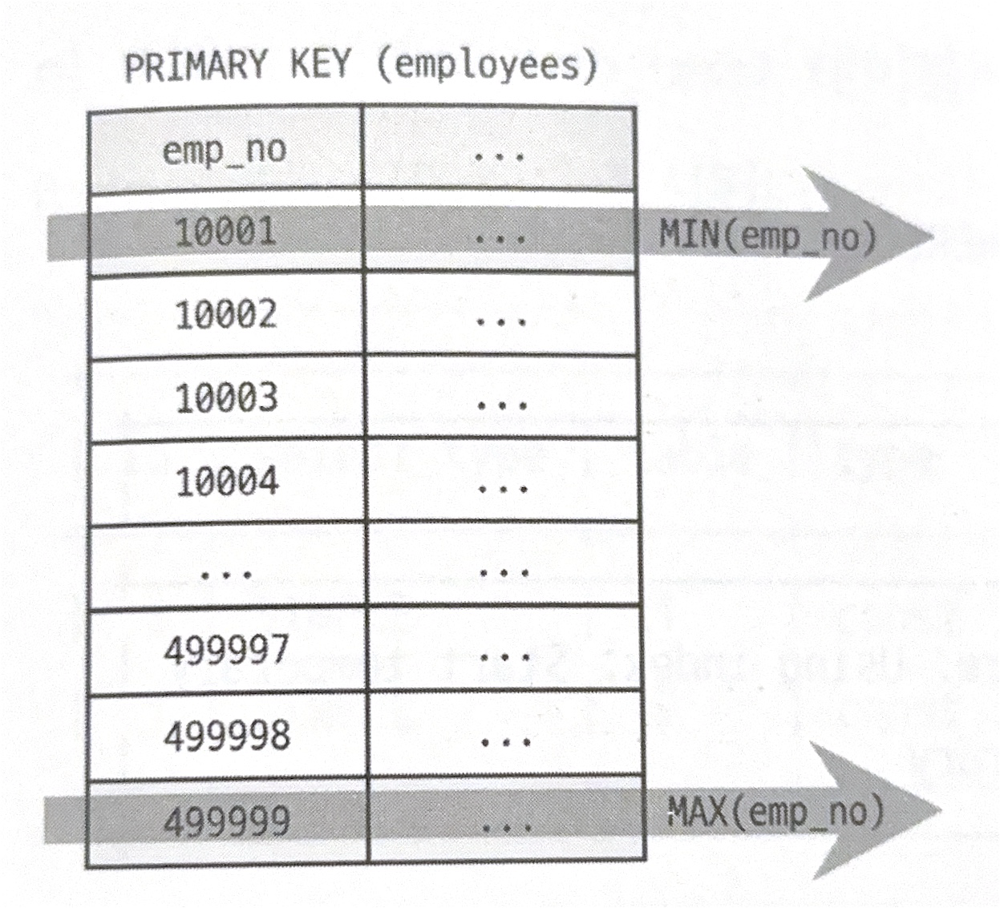
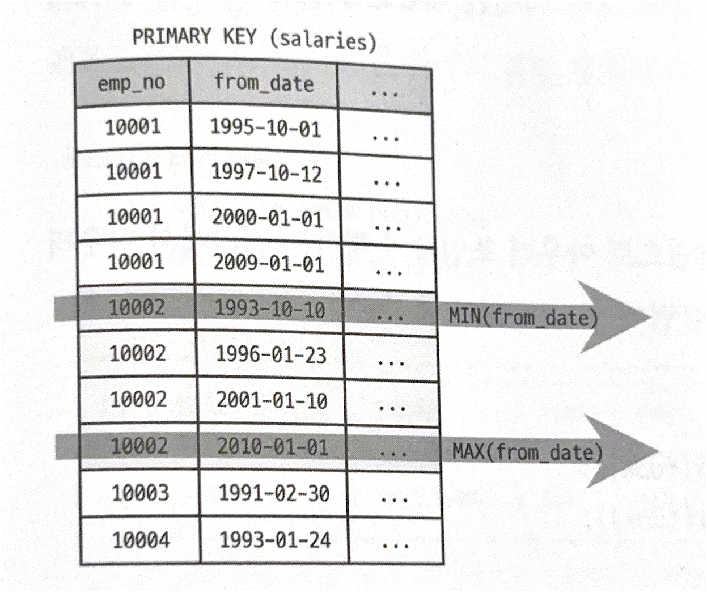
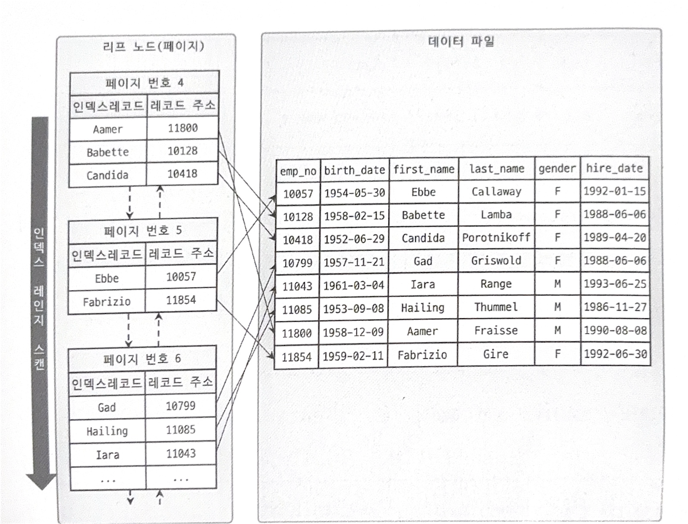

## 10. 실행계획 (2)

### Extra 칼럼
- `Extra`의 의미와는 다르게, 성능과 연관된 내용이 표시됨 (중요)
- 일반적으로 2~3개씩 사용됨
- 내부적 알고리즘에 대한 깊은 내용을 담음

#### 1. `const row not found`
- `const`방식으로 테이블을 읽었지만, 아무런 값도 일치하지 않을 때 표시됨
- `const`방식은 단 한 건의 레코드를 반환함이 자명한 방식

#### 2. `Deleting all rows`
- 핸들러 차원에서 테이블의 모든 레코드를 삭제할 떄 표시됨
- 이 문구는 한 개의 핸들러 API를 호출한 것
  - 여러 건을 삭제할 때는 레코드 건수만큼 핸들러 함수가 호출됨
  - 하지만 위 방식은 한 번의 호출로 빠르게 처리가능

#### 3. `Distinct`
- 단순히 `DISTINCT`키워드를 사용해서 표시되지 않음
- 테이블 조인 시, 드리븐 테이블의 중복된 항목들을 무시했음을 의미

```sql
mysql> EXPLAIN
       SELECT DISTINCT d.dept_no
       FROM departments d, dept_emp de WHERE d.dept_no = de.dept_no;

+----+-------------+--------+-------+-------------+------------------------------+
| id | select_type | table  | type  | key         | Extra                        |
+----+-------------+--------+-------+-------------+------------------------------+
|  1 | SIMPLE      | d      | index | ux_deptname | Using indx; Using temporary  |
|  1 | SIMPLE      | de     | ref   | PRIMARY     | Using index; Distinct        |
+----+-------------+--------+-------+-------------+------------------------------+
```
- d 테이블과 de 테이블을 조인한 위 예시에서,
  - de 테이블의 중복되는 dept_no를 무시하고 필요한 것들만 조인 진행


#### 4. `FirstMatch`
- 세미 조인 최적화 중 `Firstmatch`전략이 사용되었을 때 표시
- 조건에서 첫 번째로 일치하는 한 건만 검색하여 최적화를 진행


#### 5. `Full scan on NULL key`
- `col1 IN (SELECT col2 FROM ...)`과 같은 쿼리에서 자주 발생
  - 이때 `col1`이 NULL이 된다면 `col1 NULL IN (SELECT col2 FROM ...)`으로 변환됨
- 위 쿼리를 실행 중, col1이 NULL을 만났을 때 서브쿼리에 대해 풀 테이블 스캔을 사용할 것이라는 것을 알려주는 값
- `NULL IN`에 대한 `NULL`연산은 아래와 같음
> 1. 서브 쿼리에 한 건이라도 결과 레코드가 있으면 최종 결과는 NULL
> 2. 서브 쿼리가 단 한 건도 결과 레코드를 가지지 않는다면 최정 결과는 false
- 즉, 도중에 col1이 NULL이 된다면, 서브 쿼리의 모든 레코드를 확인해야 최종 결과를 확정할 수 있으니 풀 테이블 스캔을 진행해야한다.
- 만약 칼럼의 값에 대해 NULL이 아니라면, `col1 IS NOT NULL`과 같은 조건문을 `NOT IN`, `IN` 조건문 앞에 넣어 풀 테이블 스캔을 방지할 수 있다.

#### 6. `Impossible HAVING`
- 쿼리에 `HAVING` 절이 사용됐지만, 이에 해당하는 레코드가 없을 때 표시됨
```sql
mysql> EXPLAIN
       SELECT em.emp_no, COUNT(*) AS cnt
       FROM employees e 
       WHERE e.emp_no = 10001
       GROUP BY e.emp_no
       HAVING e.emp_no is NULL;
```
- 위와 같은 쿼리가 있을 때, `e.emp_no`가 PK이므로 NOT NULL인 칼럼이기 때문에 `HAVING` 절을 만족하지 않는다.

#### 7. `Impossible WHERE`
- 위 `Impossible HAVING`와 비슷하게, `WHERE`문의 조건이 항상 FALSE가 되는 경우 표시됨

#### 8. `LooseScan`
- 세미 조인 최적화에서 `LooseScan`최적화가 사용되었을 때 표시됨

#### 9. `No matching min/max row`
- `WHERE`문을 만족하는 레코드가 없고, MIN() / MAX() 같은 집합 함수가 사용되었을 때 `No matching min/max row`가 표시됨 (집합함수의 결과로 NULL 출력)

> - 위와 같은 조건문에 만족하지 않는 경우 (`No matching ~`),
> - 데이터가 부족한 것인지 혹은 쿼리 설계가 잘못된 것인지 판단하는 능력 필요

#### 10. `No matching row in const table`
- 조인이 사용된 테이블에서 const로 접근할 때 일치하는 레코드가 없을 시 표시됨
- `Impossible WHERE`와 같은 종류

#### 11. `No matching rows after partition pruning`
- 조건에 맞는 파티션이 없어, 테이블에 대해 레코드를 UPDATE, DELETE를 하지 못할 때 표시됨
- 만약, 조건에 맞는 파티션이 있으나, 조건에 맞는 레코드가 없다면 이는 `Using where`로 표시됨 (구분 주의)


#### 12. `No tables used`
- `FROM`절이 없거나, 상수 테이블을 사용하는 쿼리에서 표시됨

#### 13. `Not exists`
- A, B 테이블 조인시, A에는 있지만 B에는 없는 데이터를 조회하는 경우 아우터 조인을 활용함
- 이때 안티-조인을 활용하는 쿼리에 대해 표시됨
- 드라이빙 테이블에 대해 레코드가 존재하는지 아닌지만 판단

#### 14. `Plan isn't ready yet`
```sql
mysql> SHOW PROCESSLIST; --// 프로세스 리스트 확인
mysql> EXPLAIN FOR CONNECTION $(프로세스ID) --// 특정 프로세스의 실행계획 확인
```
- 위 쿼리를 통해, 특정 프로세스의 쿼리의 실행계획을 확인 가능
- 이 명령어를 통해 다른 커넥션의 실행계획이 수립되지 않은 쿼리를 확인할 때 표시됨

#### 15. `Range checked for each record(index map: N)`
- 두 테이블을 조인하는 쿼리에서 발생
- 드라이빙 테이블을 읽을 때 레코드마다 인덱스 레인지 스캔을 체크할 때 발생
```sql
mysql> EXPLAIN
       SELECT * 
       FROM employees e1, employees e2 
       WHERE e2.emp_no >= e1.emp_no;
```
- 위와 같은 쿼리에서 e1을 읽고 e2를 읽을 때, 풀 테이블 스캔 or 인덱스 레인지 스캔 중 비용이 적은 연산을 선택해야 함
  - e1.emp_no = 1일 때, e2.emp_no >= 1이므로 e2의 모든 레코드를 전부 읽어야 함
  - e1.emp_no = max(emp_no)일 때, e2.emp >= max(emp_no) 이므로 e2의 레코드 단 한 건만 읽으면 됨
- 이와 같이 e1 테이블의 레코드를 읽을 때마다 e1.emp_no 값이 계속 바뀌므로 비용 계산에 대한 기준이 계속 바뀌게 됨

> ##### 정리
> - e1.emp_no가 작을 때는 e2테이블을 풀 테이블 스캔
> - e1.emp_no가 클 때는 인덱스 레인지 스캔
> - 이런 기준은 e2레코드를 읽을 때마다 계산해야함 -> `Range checked for each record`


- `Extra`출력에서, (index map: (16진수))가 표시됨
- 이는 비트마스킹으로 어떤 인덱스가 후보로 사용되는지를 표시한 것

```sql
mysql> CREATE TABLE tb_member(
    ....
    INDEX ix_nick_name (mem_nickname, mem_name),
    INDEX ix_nick_region (mem_nickname, mem_region),
    INDEX ix_nick_gender (mem_nickname, mem_gender),
    INDEX ix_nick_phone (mem_nickname, mem_phone)
       )

+----+-------------+--------+-------+-------------------------------------------------+
| id | select_type | table  | type  | Extra                                           |
+----+-------------+--------+-------+-------------------------------------------------+
|  1 | SIMPLE      | e1     | ALL   | NULL                                            |
|  1 | SIMPLE      | e2     | ALL   | Range checked for each record (index map: 0x19) |
+----+-------------+--------+-------+-------------------------------------------------+

```
- 위 DDL과 같이 4개의 인덱스가 순서대로 생성되었다고 가정,
- 이때 `Extra`에 index map은 0x19(이진수로 11001)
- 위 이진수의 비트맵 각 자릿수는 인덱스의 순번을 의미



- `ix_nick_phone`, `ix_nick_gender`, `PRIMARY KEY`가 후보로 사용되었음을 의미

#### 16. `Recursive`
- CTE(Common Table Expression)를 이용한 재귀쿼리를 사용할 때 표시됨
```sql
mysql> WITH RECURSIVE cte (n) AS 
     (
     SELECT 1
     UNION ALL
     SELECT n + 1 FROM cte WHERE n < 5
     )
     SELECT * FROM cte;
```
1. `n`이라는 칼럼을 가진 cte라는 임시 테이블 생성
2. `n`을 1부터 5까지 증가하여 레코드 5건을 cte테이블에 저장

#### 17. `Rematerialize`
- MySQL 8.0의 래터럴 조인으로 조인결과를 임시 테이블에 저장할 때 표시됨
- 래터럴 조인은, 드라이빙 테이블의 레코드마다 드리븐 테이블의 조건에 맞는 레코드들이 다를 때 사용하는 조인
```sql
mysql> EXPLAIN
       SELECT * FROM employees e 
       LEFT JOIN LATERAL (SELECT * 
                          FROM salareis s 
                          WHERE s.emp_no = e.emp_no 
                          ORDER BY s.from_date DESC LIMIT 2) s2 ON s2.emp_no = e.emp_no
       WHERE e.first_anme = 'Matt';
```
- emp_no가 같은 레코드 중 최신순의 2건만 가져와 조인하는 쿼리
- 이는 emp_no마다 임시 테이블이 생성됨 (즉, 아우터 쿼리의 결과에 종속됨)

#### 18. `Select tables optimized away`
- MIN(), MAX() 함수가 SELECT절에만 사용되거나, GROUP BY로 인덱스를 한 건만 읽을 때 표시됨
- MYISAM 테이블에 대해서는 COUNT(*)만 사용해도 위와같은 최적화 진행 (테이블마다 COUNT(*)값을 따로 관리하기 때문)


- 위는 SELECT문에서만 MIN(), MAX() 집계함수를 사용했을 때의 최적화
- 테이블을 풀, 혹은 레인지 스캔할 필요 없이 단 한건 씩만 읽으면 됨

<br>


- 위는 WHERE조건문이 있는 MIN(), MAX() 사용 쿼리의 최적화
- WHERE문에서 사용되는 칼럼에 인덱스가 있을 때만 최적화 가능
- 인덱스 레인지 스캔을 통해 범위를 특정하고, 해당 범위에 대해 최대, 최솟값을 가지는 레코드를 반환할 수 있음

#### 19. `Start temporary, End temporary`
- 세미조인 최적화 중 `Duplicate Weed-out`최적화 전략이 사용될 때 표시
- `Duplicate Weed-out`은 조인 결과를 임시테이블로 만들고, 중복되는 레코드를 제거하는 최적화

```sql
mysql> EXPLAIN
       SELECT * FROM employees e 
       WHERE e.emp_no IN (SELECT s.empno FROM salaries s WHERE s.salary > 150000);

+----+-------------+--------+--------+-------------------------------------------------+
| id | select_type | table  | type   | Extra                                           |
+----+-------------+--------+--------+-------------------------------------------------+
|  1 | SIMPLE      | s      | range  | Using where; Using index; Start temporary       |
|  1 | SIMPLE      | e      | eq_ref | End temporary                                   |
+----+-------------+--------+--------+-------------------------------------------------+
```
- e, s 두 테이블이 조인되어, 조인이 시작되는 s 테이블에 대해 `Start temporary`문구가 들어가고,
- 조인이 끝나는 e 테이블에 대해 `End temporary`가 표시된다.
- 즉, s, e 테이블의 내용을 임시 테이블에 저장 후, 중복된 내용을 제거한다는 의미이다.
=
#### 20. `unique row not found`
- 두 개의 테이블이 각각 유니크 칼럼으로 아우터 조인을 수행하고 반환하는 레코드가 없을 때 표시된다.


#### 21. `Using filesort`
- ORDER BY를 처리가 인덱스를 사용하지 못할 때 표시된다.
- 정렬을 위해 조회된 레코드를 다시 한번 정렬해야하므로 성능이 비교적 떨어진다.
- 조회된 레코드를 메모리 버퍼에 복사하고, 이를 소팅 알고리즘을 통해 정렬을 수행한다.
- `Using filesort`문구가 뜨면 인덱스를 생성하는 것이 좋음

#### 22. `Using index (커버링 인덱스)`
- 레코드 조회 시 데이터 파일을 읽지 않고 오로지 인덱스만으로 쿼리를 처리할 수 있을 때 표시됨
- 디스크 파일을 읽지 않기 때문에 성능이 좋은 최적화를 나타냄


- 위와 같이 first_name에 대해 인덱스가 있다고 가정하자
```sql
mysql> EXPLAIN
       SELECT first_name, birth_date 
       FROM employees 
       WHERE first_name BETWEEN 'Babette' AND 'Gad';
```
- 위 쿼리를 수행하기 위해 WHERE의 first_name칼럼에 조건이 걸려있으므로 인덱스를 충분히 사용 가능하다
- 하지만 SELECT문의 birth_date는 인덱스에 존재하지 않고, 디스크 파일을 읽어야 가져올 수 잇는 칼럼이다.
- 즉, 각 레코드는 birth_date를 위해 디스크를 읽어야하는, 결과 레코드의 개수만큼 디스크 IO가 발생하게 되는 문제가 발생한다.

```sql
+----+-------------+----------------+--------+---------------+
| id | select_type | table          | type   | Extra         |
+----+-------------+----------------+--------+---------------+
|  1 | SIMPLE      | employees      | ALL    | Using where   |
+----+-------------+----------------+--------+---------------+
```
- 커버링 인덱스 최적화가 진행되지 않았으므로 `Extra`에는 `Using index`가 없음

<br>

```sql
mysql> EXPLAIN
       SELECT first_name 
       FROM employees 
       WHERE first_name BETWEEN 'Babette' AND 'Gad';
```
- 반면 SELECT문에 first_name만 있는 쿼리는 인덱스에서 모든 데이터를 가져올 수 있으므로 디스크에 접근하지 않아도 됨 (커버링 인덱스 O)

```sql
+----+-------------+----------------+--------+----------------------------+
| id | select_type | table          | type   | Extra                      |
+----+-------------+----------------+--------+----------------------------+
|  1 | SIMPLE      | employees      | range  | Using where; Using index   |
+----+-------------+----------------+--------+----------------------------+
```

<br>

- 추가로, InnoDB의 인덱스에는 기본적으로 해당 테이블의 PK가 들어있으므로 SELECT에 PK가 들어있어도 커버링 인덱스를 충분히 사용 가능함

> ### `Using index` in extra vs `index` in type
> - `Using index` : 커버링 인덱스 (성능 좋음)
> - `index` : 인덱스 풀 스캔 (인덱스를 사용하지만 풀 스캔이므로 인덱스를 효율적으로 사용하는 것 아님)

#### 23. `Using index condition`
- 옵티마이저가 인덱스 컨디션 푸시다운 최적화를 사용할 때 표시됨
- 인덱스 컨디션 푸시다운은 인덱스를 사용하지 못하는 칼럼이더라도 스토리지 엔진에서 같이 체크할 수 있게 하는 최적화
- 이를 통해 불필요한 디스크 접근을 최소화함


#### 24. `Using index for group-by`
- GROUP BY를 인덱스를 통해 처리할 수 있을 때 표시됨
- 이때 GROUP BY 처리를 위해 인덱스를 사용하는 2가지 방식이 있음

> ##### 1. 인덱스 스캔을 통한 GROUP BY 처리
> - 인덱스를 통해 GROUP BY를 처리할 수 있더라도, AVG() · SUM() · COUNT()같은 모든 행을 다 읽어야하는 경우 존재
> - 이때는 필요한 레코드만 읽을 수 없음
> - 이러한 상황에서는 `Using index for group-by`가 표시되지 않음


> ##### 2. 루스 인덱스 스캔을 통한 GROUP BY 처리
> - GROUP BY 칼럼에서 사용하는 칼럼이 인덱스를 사용할 수 있을 때 루스 스캔 사용 가능
> - MIN(), MAX() 사용 가능
> - WHERE조건절에서 사용하는 인덱스에 따라 루스 인덱스 스캔 가능 여부가 달라짐
> <br>
> 1. WHERE 조건절이 없을 때 
>    - 사용 가능
> 2. WHERE 조건절이 있지만, 검색을 위해 인덱스를 사용하지 않는 경우
>    - 먼저 GROUP BY를 통해 인덱스를 읽고, WHERE 조건 비교 진행
>    - 이때는 GROUP BY가 모든 레코드를 가져와야하므로 루스 인덱스 스캔 사용 X
> 3. WHERE 조건절이 있고, 검색을 위해 인덱스를 사용할 때
>    - GROUP BY와 똑같은 인덱스를 사용할 때만 루스 인덱스 스캔 사용 가능
>    - 만약 WHERE조건에 의해 검색된 레코드 개수가 매우 적을 때는 굳이 루스 인덱스 스캔을 사용하지 않음


#### 25. `Using index for skip scan`
- 인덱스 스킵 스캔 최적화를 진행할 때 표시됨

#### 26. `Using join buffer (Block Nested Loop, Batched Key Access, hash join)`
- 테이블 간의 조인 시, 드리븐 테이블에 적절한 인덱스가 없을 때 표시됨 (블록 네스티드 루프 조인, 해시 조인)
- 조인을 위해 조인 버퍼를 사용

#### 27. `Using MRR`
- 레코드 한 건마다 스토리지 엔진에 전달하면 동일한 페이지를 반환하는 비효율이 발생할 수 있음
- 이에 MySQL 엔진은 여러 레코드를 모아, 스토리지 엔진에 전달하여, 최소한의 페이지에만 접근할 수 있도록 최적화함
- 이러한 Multi Range Read 최적화가 발생했을 때 표시됨

#### 28. `Using sort_union(...) | union(...) | intersect(...)`
- `index_merge` 접근 방법에 대해 2개 이상의 인ㄷ게스가 동시에 사용될 수 있음
- 이에 `Extra`칼럼은 인덱스 병합 방식에 대해 상세하게 표시함

> ##### `Using intersect`
> - 각각의 인덱스 사용 조건이 AND로 결합된 경우, 교집합을 추출했다는 의미

> ##### `Using union(...)`
> - 각각의 인덱스 사용 조건이 OR로 결합된 경우, 합집합을 추출했다는 의미

> ##### `Using sort_union(...)`
> - `Using union`과 동작방식은 비슷하나, 프라이머리 키만 먼저 읽고 정렬을 수행한 뒤 병합 후 레코드를 읽어서 반환함

#### 29. `Using temporary`
- 쿼리를 처리하는 동안 중간 결과를 담기 위해 임시 테이블을 사용할 때 표시됨
- 이를 통해 메모리에 생성되었는지, 디스크에 생성됐는지 알 수는 없음

```sql
mysql> EXPLAIN
       SELECT *
       FROM employees 
       GROUP BY gender 
       ORDER BY MIN(emp_no);
```
- 위 쿼리는 GROUP BY에서 사용한 인덱스를 ORDER BY에서 사용하지 못하므로 임시 테이블을 만들어야하는 대표적인 예시이다.

```sql
+----+-------------+----------------+--------+-----------------------------------+
| id | select_type | table          | type   | Extra                             |
+----+-------------+----------------+--------+-----------------------------------+
|  1 | SIMPLE      | employees      | index  | Using temporary; Using filesort   |
+----+-------------+----------------+--------+-----------------------------------+
```

#### 30. `Using where`
- MySQL 엔진에서 결과 레코드를 가공했을 때 표시됨
> ##### MySQL 엔진
> - 스토리지 엔진으로부터 받은 레코드를 가공 혹은 연산 진행
> - WHERE문의 체크 조건은 MySQL 엔진에서 처리
> ##### 스토리지 엔진
> - 디스크 혹은 메모리에 위치한 필요한 레코드를 읽고 저장하는 역할 수행
> - WHERE문의 작업 범위 결정 조건은 스토리지 엔진에서 처리

```sql
mysql> EXPLAIN
       SELECT *
       FROM employees 
       WHERE emp_no BETWEEN 10001 AND 10002
       AND gender = 'F';
```
- 위 쿼리에서 `emp_no BETWEEN 10001 AND 10002`은 작업 범위 결정 조건
- `gender = 'F'`은 체크 조건
- 작업 범위 결정 조건을 만족하는 레코드가 100건이고,
- 두 조건을 모두 만족하는 레코드가 37건이라고 할때,
- gender = 'F' 조건에 대해 필터링이 진행되었으므로 MySQL엔진에서 필터링이 진행되었다는 것을 알 수 있음

```sql
+----+-------------+----------------+--------+---------+------+----------+--------------+
| id | select_type | table          | type   | key     | rows | filtered | Extra        |
+----+-------------+----------------+--------+---------+------+----------+--------------+
|  1 | SIMPLE      | employees      | range  | PRIMARY | 100  |    37.00 | Using where  |
+----+-------------+----------------+--------+---------+------+----------+--------------+
```
- `filtered` : 37.00 -> MySQL 엔진에서 37%의 레코드만 필터링되어 남았음을 의미

#### 31. `Zero limit`
- 데이터 값이 아닌, 메타데이터(데이터 스키마)가 필요한 경우 존재
- 이에 LIMIT 0을 통해 옵티마이저는 사용자가 메타데이터를 조회하고자함을 알아차림
- 이때 `Zero limit`이 표시됨

```sql
mysql> EXPLAIN SELECT * FROM employees LIMIT 0;

+----+-------------+--------+-------+------------+
| id | select_type | table  | type  | Extra      |
+----+-------------+--------+-------+------------+
|  1 | SIMPLE      | NULL   | NULL  | Zero limit |
+----+-------------+--------+-------+------------+
```
