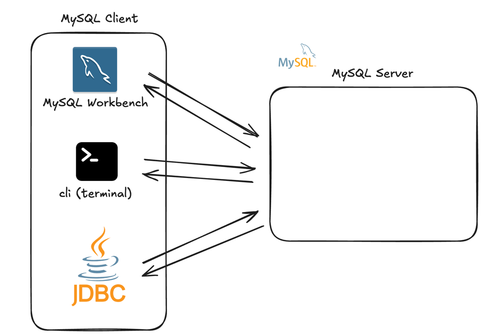
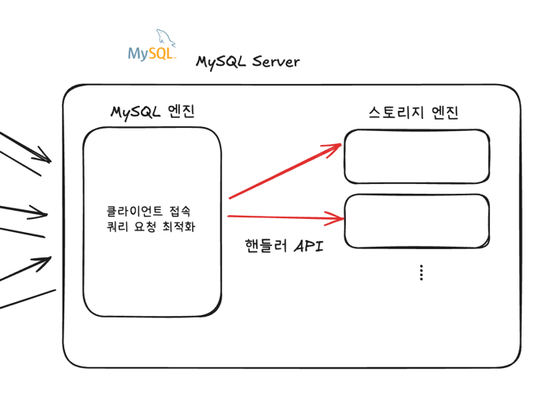
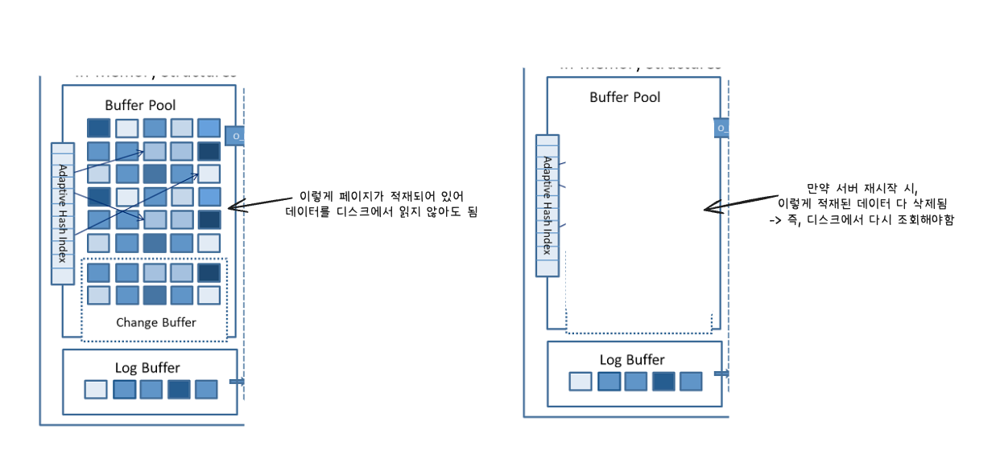
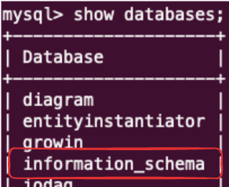
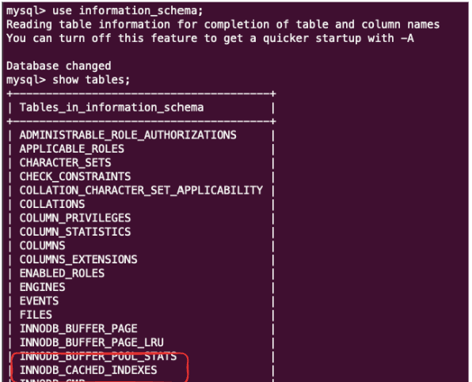
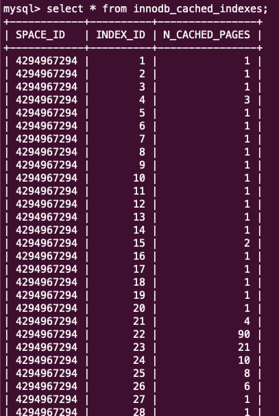
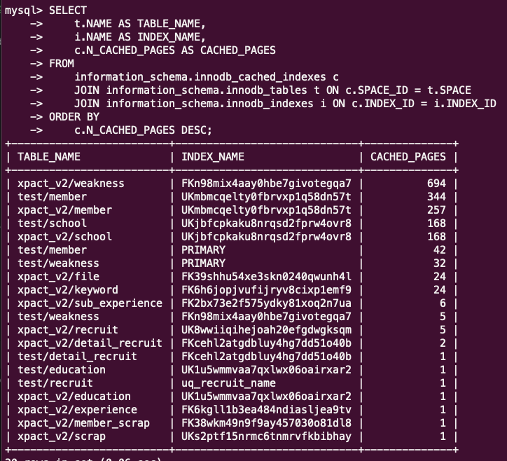

#### MySQL 서버
- 백그라운드에서 실행되는 데이터베이스 애플리케이션
- SQL요청을 받아 결과를 반환
- 실제 데이터를 저장

#### MySQL 클라이언트
- MySQL에 접속하기 위한 도구
- 예) MySQL Workbench, mysql CLI, JDBC 등...



---

## MySQL(MySQL Server)의 구조
### 1. MySQL 엔진
- 클라이언트의 접속 및 쿼리 요청 처리 (웹 개발에서의 프론트 역할)
- MySQL 서버 당 하나 존재

### 2. 스토리지 엔진
- SQL 문장 분석 및 최적화 (웹 개발에서의 백엔드 역할)
- 어떻게 데이터를 저장하고 가져올지?
- 실질적인 성능과 직결
- 테이블에서 사용할 스토리지 엔진 선택 가능
- MySQL 서버 당 여러 개 존재할 수 있음 (MyISAM, InnoDB)

#### InnoDB
- 현재 MySQL 8.0의 기본 스토리지 엔진

#### MyISAM
- MySQL 8.0에서는 레거시 엔진 (호환성으로 인해 유지용으로만 남)
- 거의 사용되지 않음
- 트랜잭션 미지원
- 외래키 미지원 등....


### 3. 핸들러 API
- MySQL 엔진에서 스토리지 엔진으로의 데이터 읽기/쓰기 요청 


- 마치 MySQL엔진은 클라이언트로부터 요청(SQL)을 받아서 스토리지 엔진으로 데이터를 요청함
- 프론트(MySQL엔진) - 백(스토리지엔진) 같은 관계와 유사

---

## MySQL 스레드 구조
- 프로세스 기반이 아닌 스레드 기반 -> 여러 개의 스레드로 동작함
- 사용되는 스레드는 포그라운드 백그라운드 스레드로 나뉨

### 포그라운드 스레드 (클라이언트 스레드)
- MySQL 서버에 접속한 클라이언트를 담당
- 데이터 버퍼나 캐시에서 데이터를 가져옴 -> **디스크에서 데이터를 패치해오는 것이 아님**

> 포그라운드 스레드는 커넥션 풀과 동일한 개념인가?
> 아님 -> 커넥션 풀은 MySQL 서버 외부에서 클라이언트의 연결을 담당하는 모음
> 포그라운드 스레드는 커넥션 풀을 통해 MySQL 서버로 들어온 클라이언트를 담당

- MyISAM : 디스크에서 데이터를 가져오는 작업까지 포그라운드 스레드가 맡음
- InnoDB : 디스크에서 데이터를 가져오는 작업은 백그라운드 스레드로 넘김

### 백그라운드 스레드
- `InnoDB` 스토리지 엔진에서 디스크의 데이터 혹은 인덱스 파일에서 데이터를 읽어오는 스레드
- 로그를 기록 & 데이터를 디스크에 저장


---

## 메모리 할당 및 사용 구조

### 글로벌 메모리 영역
- 하나의 공간만 할당
- 모든 포그라운드 스레드에 의해 공유
- 예) 테이블 캐시, InnoDB 버퍼 풀, InnoDB 어댑티브 해시 인덱스, InnoDB 리두 로그 버퍼

> MyISAM의 메모리 영역은 없는건지..? (InnoDB 엔진만 있음)


### 로컬 메모리 영역
- 각 포그라운드 스레드 별로 독립적으로 할당 (스레드끼리 공유되지 않음)
- 포그라운드 스레드 개수 증가 -> 메모리 부족 가능성 존재
- 예) 정렬 버퍼, 조인 버퍼, 바이너리 로그 캐시, 네트워크 버퍼


---


## 플러그인 스토리지 엔진 모델
- MySQL의 다양한 기능들이 모듈화 되어있어 특정 모듈만 커스텀 플러그인으로 변경 가능
- 즉, 스토리지 엔진을 자신이 개발한 엔진으로 교체 가능

- 하나의 쿼리 -> 여러 개의 하위 작업으로 나뉨
- 이때 하위 작업들이 MySQL 엔진 / 스토리지 엔진 중 어디서 실행되는지 아는 것이 중요
- -> 이부분은 플러그인 스토리지 엔진 모델이랑은 연관은 없어보임..... but 중요한 내용이라 함


## 컴포넌트
- 플러그인 방식의 단점을 보완하기 위해, MySQL 8.0부터 컴포넌트 아키텍처 지원
- 단점 : 플러그인끼리 통신 X, 의존관계 설정 X 등...
- 컴포넌트는 플러그인의 단점을 해결한 비슷한 것


---

## 쿼리 실행 구조
- 요청받은 SQL을 파싱 -> 전처리 진행 -> 최적화를 진행 (MySQL 엔진)
- 이렇게 최적화된 SQL을 스토리지 엔진에서 실행


### 1. 쿼리 파서
- SQL을 토큰으로 분리하여 파서 트리 생성
- 파싱은 yacc을 통해 진행됨 (BNF문법을 c코드로 변환)

```SQL
SELECT name FROM user WHERE id = 1;
```

- 위 구문을 토큰 단위로 분리
    - `SELECT`, `name`, `FROM`, `user`, `WHERE`, `id`, `=`, `1`


### 2. 전처리기
- 파서 트리에서의 구조적 문제의 유무를 확인
- 각 객체(테이블, 칼럼 등..)의 존재 여부와 접근 권한 확인

```SQL
SELECT name FROM user WHERE id = 1;
```

- 실제로 `user`라는 테이블이 존재하는지? 있다면 접근할 수 있는 권한이 있는지?
- `user`테이블에 `name`이라는 컬럼이 있는지? 있다면 접근 가능한지?


### 3. 옵티마이저
- 가장 빠르게 처리되는 방법을 결정 -> `DBMS의 두뇌`
- 옵티마이저가 빠른 선택을 할 수 있도록 쿼리를 잘 짜 유도하는 것이 쿼리 최적화

```SQL
SELECT name FROM user WHERE id = 1;
```

- 여러 가지 실행 방법을 고려 (인덱스 사용 여부, 조인 순서 등...)
- 가장 비용이 낮은 방법을 선택


### 4. 실행 엔진 (쿼리 실행기)
- 옵티마이저에서 생성한 계획으로 스토리지 엔진 호출
- 결과를 클라이언트에게 반환


### 5. 스토리지 엔진 (핸들러)
- 쿼리에 따라 데이터를 디스크에 저장하거나, 디스크로부터 읽어오는 역할


### 스레드 풀
- 포그라운드 스레드 개수를 일정하게 유지 -> 포그라운드 스레드 개수가 증가함을 막음
- 만약 설정한 모든 스레드가 일을 처리하고 있으면 -> 큐에서 대기 
> 만약 스레드 풀을 사용하지 않는다면, 사용자가 접속할 때마다 포그라운드 스레드가 생성되어 메모리 초과 발생할 수도 잇음


### 메타데이터
- MySQL 8.0에서는 테이블 구조 정보, 프로그램 정보를 InnoDB 테이블에 저장
- mysql.ibd라는 테이블스페이스 -> 중요한 정보를 담고 있음

---

## InnoDB 스토리지 엔진 아키텍처
- 가장 대표적으로 사용되는 스토리지 엔진
- 레코드 단위의 잠금 제공 -> 락이 작음

> ### 클러스터링 뜻
> - 단순히 `정렬 되어있는가?`를 의미
> - `프라이머리 키를 기준으로 클러스터링 되어 저장된다.` : 프라이머리 키 순서로 디스크에 저장된다.


> ### 클러스터 인덱스
> - 프라이머리 키로 정렬된 인덱스 (인덱스 이자 테이블 자체)


> ### 세컨더리 인덱스
> - 프라이머리 키가 아닌 컬럼에 대한 인덱스
> - 개발자가 직접 지정하여 생성
> - 물리적인 주소를 가지지 않고, 프라이머리 키를 가지고 있음


```SQL
CREATE TABLE user (
      id INT PRIMARY KEY,     -- 클러스터 인덱스
      name VARCHAR(20),
      age INT,
      INDEX idx_name (name)   -- 세컨더리 인덱스
);
```

- `InnoDB 스토리지` : 데이터 자체가 프라이머리 키 순서대로 디스크에 저장되는 클러스터 인덱스
- 외래 키 지원

### MVCC (Multi Version Concurrency Control)
- InnoDB 스토리지 엔진 전용
- 레코드를 잠그지 않고 일관된 읽기를 제공하는 기술
- 하나의 레코드에 대해 여러 개의 버전이 동시에 관리
- `UPDATE`쿼리 발생 시, 수정된 데이터는 `InnoDB 버퍼 풀`에 올라감
- 수정 전의 데이터는 언두 로그와 디스크에 존재 (아직 커밋이 발생하지 않았으면)

- 데이터가 변경되고 디스크로 커밋되지 않았을 때, 격리 수준(Isolation)에 따라 읽는 데이터가 다름


> #### 격리 수준
> 1. Serializable : 가장 엄격한 격리 수준. 모든 트랜잭션이 순차적으로 실행되는 것처럼 보이게 함
> 2. Repeatable Read : 같은 데이터를 여러 번 읽어도 값이 같음 (InnoDB 기본 값)
> 3. Read Committed : 커밋된 데이터만 읽을 수 있음
> 4. Read Uncommitted : 커밋되지 않은 데이터도 읽을 수 있음

- `Read Uncommitted` 격리수준은 커밋되지 않은 변경된 데이터(언두로그)를 읽음
- 나머지 격리수준은 변경 전의 데이터(InnoDB 버퍼 풀)를 읽음


### 자동 데드락 감지
- 데드락 감지 스레드가 주기적으로 교착 상태에 빠진 트랜잭션들을 찾음
- 이때, 가장 언두 로그 레코드를 적게 가진 트랜잭션을 종료시킴 -> 서버의 부하를 덜 유발시킴
> 왜 언두 로그 레코드를 적게 가진 트랜잭션을 종료시키면 서버의 부하를 덜 유발시킬까?

- `innodb_deadlock_detect`으로 데드락 감지 스레드를 ON/OFF 가능


### 장애 복구 자동화
- 완료되지 못한 트랜잭션, 디스크에 일부만 기록된 경우 복구 작업이 진행됨

### InnoDB 버퍼 풀
- `InnoDB`스토리지 엔진에서 가장 중요한 부분
- 데이터 페이지 or 인덱스에 대한 캐시 제공
- `MVCC`에 사용되는 중요 버퍼 역할
- 변경 연산을 비동기적으로 처리 -> 디스크 작업 횟수 감소 -> 성능 향상


#### 버퍼 풀 구조
- 메모리 공간을 페이지 단위로 쪼갬 -> 디스크에서 데이터 페이지를 읽어 버퍼 풀의 페이지 공간에 저장


> ## 데이터 조각 관리는 어떻게 하는가?
> 1. ### LRU 리스트 (Least Recently Used)
> - New 서브리스트 + Old 서브리스트가 합쳐진 리스트 구조
> - 일회성 데이터가 많이 조회되면, 자주 사용하는 데이터가 제거될 수 있음
> - 즉, 자주 사용하는 데이터가 일회성 데이터에 의해 제거되는 것을 방지하고자, Old 서브리스트를 두어 완충 역할을 함
> - 자주 사용됨 : MLU 영역에서 계속 살아남음
> - 거의 사용되지 않음 : LRU끝으로 밀려나 제거됨
> 
> 2. ### Flush 리스트
> - 디스크와 동기화되지 않은 페이지를 관리
> - 특정 시점에 디스크로 기록됨
> - 데이터가 변경되면 리두 로그에 작성 & 각 엔트리는 특정 데이터 페이지와 연결됨
> 
> 
> 3. ### Free 리스트
> - 데이터가 채워지지 않은 페이지
> - 데이터를 새롭게 읽어왔을 때 사용됨


### 버퍼 풀 & 리두 로그
- 캐시 & 쓰기 지연 -> 성능 향상
- 캐시 성능 향상 -> 단순히 메모리를 늘리면 됨
- 쓰기 지연 기능까지 향상시키기 위해선?

> #### 언두 로그 vs 리두 로그
> - 언두 로그
>   - 변경 전의 데이터 레코드를 임시 저장
>   - 트랜잭션 롤백 & MVCC
>   - 데이터 일관성에 목적이 있음
> - 리두 로그
>   - 디스크의 기록되지 않은 레코드를 임시 저장
>   - 서버가 비정상 종료돼도 리두 로그를 통해 복구 가능
>   - 데이터 손실 방지에 목적이 있음

- InnoDB 버퍼 풀의 더티 페이지 : 변경된 데이터를 지닌 페이지
- 더티 페이지는 리두 로그 엔트리와 연결됨
- 체크포인트 (변경된 데이터를 일괄 디스크에 쓰기 연산이 발생할 때) 발생 시 -> 리두 로드 엔트리에서 연결된 더티 페이지를 디스크로 동기화 진행

> #### 리두 로그 이해한 내용을 정리
> - 버퍼 풀이라는 많은 페이지가 미리 적재되어 있음
> - 이 중 변경된 데이터를 지닌 페이지를 더티 페이지라 함
> - 많은 양의 페이지 중 어떤 것이 더티 페이지인지 쉽게 확인하도록 리두 로그를 따로 만듬
> - 리두 로그가 마치 List처럼 동작하여, List의 각 요소 (리두 로그 엔트리)가 가리키는 버퍼 풀의 더티 페이지를 참조
> - 이를 통해 변경된 데이터 쓰기 연산을 빠르게 진행 가능해짐..?

> #### 예제
> - 리두 로그 파일 : 100MB / 리두 로그 엔트리 : 4KB 일 때,
> - 리두 로그 파일에는 약 25000 (100MB / 4KB) 개의 변경된 더티 페이지를 참조함
> - 2만 5천개라는 더티 페이지가 버퍼 풀에 비해 작은 비율인지 큰 비율인지는 모르겠지만 쓰기 연산이 얼마나 일어나냐에 따라 최적화가 가능할 것


### 버퍼 풀 플러시
- 버퍼 풀의 더티 페이지를 디스크로 동기화하는 과정
- MySQL 5.6버전까지는 디스크 기록이 갑작스럽게 증가하면 사용자 쿼리 성능에 영향을 끼침
- MySQL 8.0 이후부터는 개선이 이뤄짐 -> 관련한 환경 변수를 굳이 조정할 필요 없음


### 버퍼 풀 백엄 & 복구
- 애플리케이션을 재시작하면, 쿼리 성능이 낮아짐
- 이유 : 버퍼 풀에 적재되어잇던 데이터가 사라졌기에 다시 디스크에서 데이터를 가져와야함 (Cold Start)
- 반면, 몇 번의 쿼리 후 부터는 쿼리 성능이 올라감
- 이유 : 버퍼 풀에 조회된 데이터가 적재되어 해당 데이터 조회 시 버퍼 풀에서 데이터를 가져옴 (Warm Start)
- 쿼리 성능이 낮아지는 Cold Start를 막고자, MySQL 종료 시 버퍼 풀의 상태를 백업하는 기능 지원
- 이를 통해 애플리케이션을 재시작해도 Cold Start 없이 향상된 쿼리 사용 가능



### 이러한 버퍼 풀에 어떤 데이터가 들어가 있는지 알 수 있을까?
- `inoformation_schema` 데이터베이스에 `innodb_cached_indexes`테이블에서 확인 가능









- 실행 쿼리
```sql
SELECT
    t.NAME AS TABLE_NAME,
    i.NAME AS INDEX_NAME,
    c.N_CACHED_PAGES AS CACHED_PAGES
FROM
    information_schema.innodb_cached_indexes c
        JOIN information_schema.innodb_tables t ON c.SPACE_ID = t.SPACE
        JOIN information_schema.innodb_indexes i ON c.INDEX_ID = i.INDEX_ID
ORDER BY
    c.N_CACHED_PAGES DESC;
```

