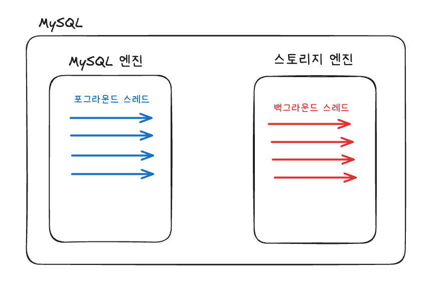

### 질문 1. 
MySQL 구조는 MySQL엔진과, 스토리지 엔진으로 구분됩니다.  
또한 MySQL의 스레드는 포그라운드 스레드, 백그라운드 스레드로 구분됩니다.

MySQL 엔진과 포그라운드 스레드가 MySQL 서버에 접속한 클라이언트를 처리한다는 점에서 비슷하고,  
스토리지 엔진과 백그라운드 스레드가 데이터를 가져온다는 점에서 비슷하다고 느꼈습니다.

> 포그라운드 스레드는 MySQL 엔진에서만 실행되고, 백그라운드 스레드는 스토리지 엔진에서만 실행되는 건지 궁금합니다.

### 질문 2.