# 4.1 MySQL 엔진 아키텍처

## 4.1.1 MySQL의 전체 구조

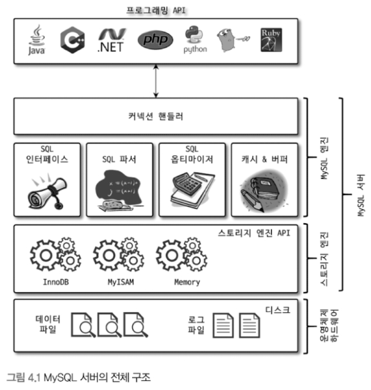

- 대부분의 프로그래밍 언어로부터 접근 방법을 모두 지원한다.

### **4.1.1.1 MySQL 엔진**: 두뇌 담당

- 커넥션 핸들러: 클라이언트로부터의 접속 및 쿼리 요청 처리
- SQL 인퍼테이스, 파서, 옵티마이저, 캐시/버퍼: SQL 문장 분석 및 최적화

### **4.1.1.2 스토리지 엔진**: 손발 담당

- InnoDB, MyISAM, Memory 등
    - 여러 개 동시에 사용 가능
- 테이블이 사용할 스토리지 엔진을 지정하면 이후 해당 테이블의 모든 읽기 및 변경 작업은 정의된 스토리지 엔진이 처리한다.
    - ex. `CREATE TABLE test_table (fd1 INT, fd2 INT) ENGINE=INNODB`
    - 각 스토리지 엔진은 성능 향상을 위해 키 캐시(MyISAM)나 InnoDB 버퍼풀(InnoDB)과 같은 기능 내장

### 4.1.1.3 핸들러 API

- 핸들러 요청: MySQL 엔진의 쿼리 실행기에서 데이터를 쓰거나 읽어야 할 때, 각 스토리지 엔진에 쓰기 또는 읽기를 요청하는 것.
    - 즉, MySQL ↔ 스토리지 엔진 데이터 주고 받기
- 핸들러 API는 이 핸들러 요청에서 사용된다.

## 4.1.2 MySQL 스레딩 구조

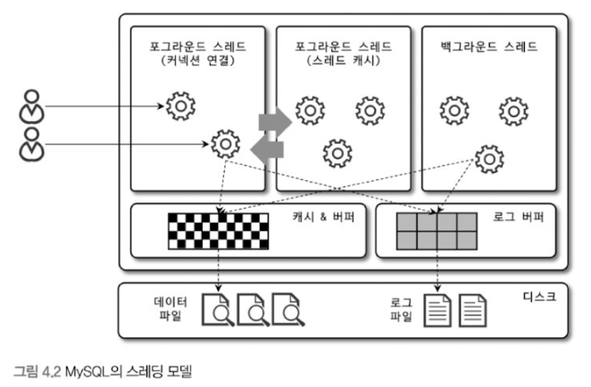

- MySQL은 프로세스 기반이 아닌 스레드 기반으로 작동한다.

### 4.1.2.1 포그라운드 스레드(클라이언트 스레드)

- 최소 MySQL 서버에 접속된 클라이언트 수만큼 존재.
- 주로 각 클라이언트 사용자가 요청하는 쿼리 문장을 처리한다.
    - 데이터를 MySQL의 데이터 버퍼나 캐시로부터 가져온다.
    - 버퍼나 캐시에 없으면 직접 디스크의 데이터나 인덱스 파일로부터 데이터를 읽어와 작업을 처리한다.
        - MyISAM: 디스크 쓰기 작업까지 포그라운드가 담당
        - InnoDB: 데이터 버퍼나 캐시까지만 포그라운드가 담당, 나머지 버퍼로부터 디스크까지 길고하는 작업은 백그라운드가 담당.
- 클라이언트 사용자가 작업을 마치고 커넥션을 종료하면 해당 커넥션을 담당하던 스레드는 다시 스레드 캐시로 되돌아간다.
    - 이때, 이미 스레드 캐시에 일정 개수 이상의 대기 중인 스레드가 있으면 스레드 캐시에 넣지 않고 스레드를 종료시킨다.
    - 스레드 캐시에 유지할 수 있는 최대 스레드 개수는 `thread_cache_size` 시스템 변수로 설정.

### 4.1.2.2 백그라운드 스레드

- InnoDB는 다음과 같이 여러 가지 작업이 백그라운드로 처리
    - 인서트 버퍼를 병합하는 스레드
    - **로그를 디스크로 기록하는 스레드**
    - **InnoDB 버퍼 풀의 데이터를 디스크에 기록하는 스레드**
    - 데이터를 버퍼로 읽어 오는 스레드
    - 잠금이나 데드락을 모니터링하는 스레드
- 쓰기 작업을 버퍼링해서 일괄 처리한다. 그래서 여러 쿼리문에 의해 데이터가 변경되는 경우 데이터가 디스크의 데이터 파일로 완전히 저장될 때까지 기다리지 않아도 된다.
    - 하지만 MyISAM은 그렇지 않고 사용자 스레드가 쓰기 작업까지 함께 처리된다. (버퍼링 기능 X)

## 4.1.3 메모리 할당 및 사용 구조

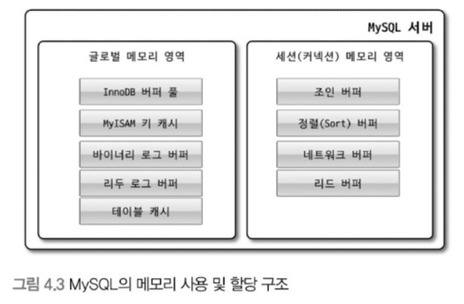

### 4.1.3.1 글로벌 메모리 영역

- MySQL 서버가 시작되면서 운영체제로부터 할당된다.
    - 운영체제의 종유레 따라 메모리 공간 다른 방식으로 할당
- 일반적으로 클라이언트 스레드의 수와 무관하게 하나의 메모리 공간말 할당된다. 단, 필요에 따라 2개 이상을 할당받을 수도 있지만 클라이언트 스레드 수와는 무관하다.
- 글로벌 메모리 영역은 모든 스레드의 의해 공유된다.
- 대표적인 글로벌 메모리 영역
    - 테이블 캐시
    - InnoDB 버퍼 풀
    - InnoDB 어댑티브 해시 인덱스
    - InnoDB 리두 로그 버퍼

### 4.1.3.2 로컬 메모리 영역(세션 메모리 영역)

- MySQL 서버상에 존재하는 **클라이언트 스레드가 쿼리를 처리하는데 사용하는 메모리 영역**이다.
- 대표적으로 **커넥션 버퍼**와 **정렬 버퍼** 등이 있다.
- 클라이언트가 MySQL 서버에 접속하면 MySQL 서버에서는 클라이언트 커넥션으로부터의 요청을 처리하기 위해 스레드를 하나씩 할당하게 되는데, **클라이언트 스레드가 사용하는 메모리 공간이라고 해서 클라이언트 메모리 영역**이라고도 한다.
- 클라이언트와 MySQL 서버와의 커넥션을 세션이라고 하기 때문에 로컬 메모리 영역을 **세션 메모리 영역**이라고도 표현한다.
- 로컬 메모리는 각 클라이언트 스레드 별로 **독립적**으로 할당되며 **절대 공유되어 사용되지 않는다**는 특징이 있다.
- 적절한 메모리 공간을 설정하는 것이 중요.
- 각 쿼리의 용도별로 필요할 때만 공간이 할당되고 필요하지 않은 경우에는 MySQL이 메모리 공간을 할당조차도 하지 않을 수 있다.
    - ex) 정렬 버퍼, 조인 버퍼
- **커넥션이 열려있는 동안 계속 할당된 상태로 남아있는 공간**도 있고(커넥션 버퍼나 결과 버퍼) 그렇지 않고 **쿼리를 실행하는 순간에만 할당했다가 다시 해제하는 공간**(정렬 버퍼나 조인 버퍼)도 있다.
- 대표적인 로컬 메모리 영역
    - 정렬 버퍼(소트 버퍼)
    - 조인 버퍼
    - 바이너리 로그 캐시
    - 네트워크 버퍼

## 4.1.4 플러그인 스토리지 엔진 모델

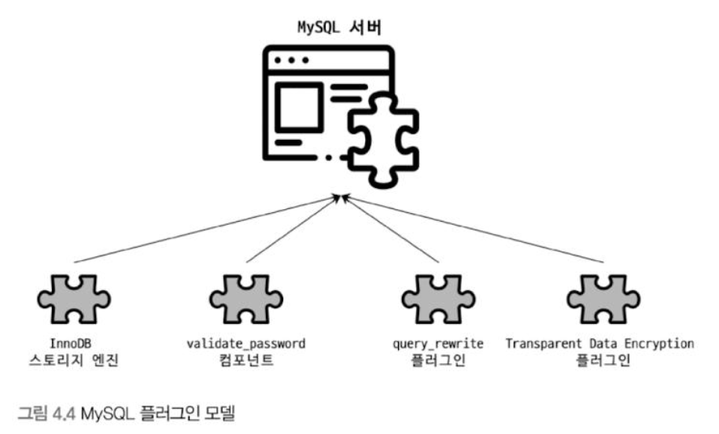

- 부가적인 스토리지 엔진을 개발하여 플러그인으로 추가할 수 있다.

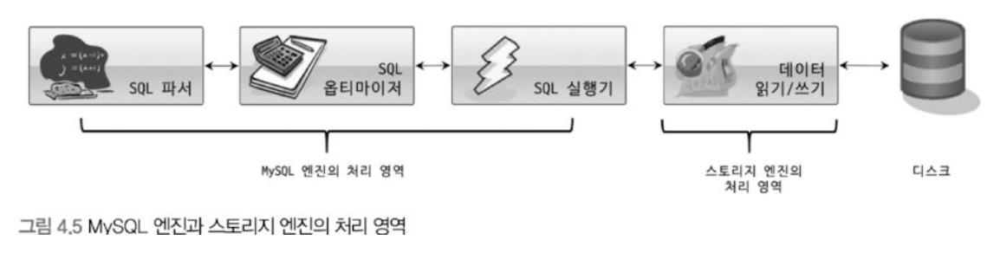

- `데이터 읽기/쓰기` 작업은 대부분 1건의 레코드 단위로 처리된다.
- MySQL 엔진이 스토리지 엔진을 조정하기 위해 핸들러를 사용한다.
- 즉, MySQL 엔진이 각 스토리지 엔진에게 데이터를 읽어오거나 저장하도록 명령하려면 반드시 핸드러를 통해야 한다.
    - 핸들러: 어떤 기능을 호출하기 위해 사용하는 운전대와 같은 역할을 하는 객체
- 하나의 쿼리 작업은 여러 하위 작업으로 나뉘는데, 각 하위 작업이 MySQL 엔진 영역에서 처리되는지 아니면 스토리지 엔진 영역에서 처리되는지 구분할 줄 알아야 한다.
    - 왜?
- MySQL 서버에 포함되지 않은 스토리지 엔진을 사용하려면 MySQL 서버를 다시 빌드해야 한다.
- 하지만, 플러그인 형태로 빌드된 스토리지 엔진 라이브러리를 다운로드에서 끼워 넣기만 해도 사용 가능하다. 플러그인 형태의 스토리지 엔진은 손쉽게 업그레이드 할 수 있다.
- 스토리지 엔진 뿐만 아니라 다양한 기능을 플러그인 형태로 지원한다.
    - 인증, 전문 검색 파서, 쿼리 재작성, 비밀번호 검증, 커넥션 제어 등
- MySQL 서버의 기능을 커스텀하게 확장할 수 있는 플러그인도 존재.

## 4.1.5 컴포넌트

- 기존의 플러그인 아키텍처를 대체하기 위해 컴포넌트 아키텍처가 지원된다.
- 플러그인의 단점
    - 오직 MySQL 서버와 인터페이스 할 수 있고, 플러그인끼리는 통신 불가능
    - MySQL 서버의 변수나 함수를 직접 호출하기 때문에 안전하기 않음(캡슐화 안 됨)
    - 플러그인은 상호 의존관계를 설정할 수 없어서 초기화가 어려움
- 컴포넌트는 플러그인의 이런 단점들을 보완해준다.

## 4.1.6 쿼리 실행 구조

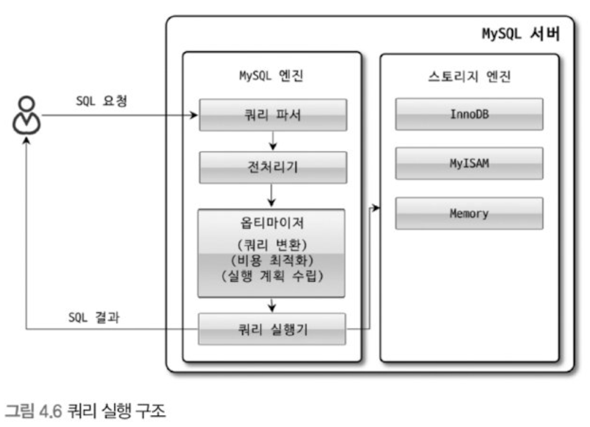

### 4.1.6.1 쿼리 파서

- 사용자 요청으로 들어온 쿼리 문장을 토큰으로 분리해 트리 형태의 구조로 만들어내는 작업
    - 토큰: MySQL이 인식할 수 있는 최소 단위의 어휘나 기호
- 쿼리 문장의 기본 문법 오류는 이 과정에서 발견되고 사용자에게 오류 메세지 전달하게 된다.

### 4.1.6.2 전처리기

- 파서 과정에서 만들어진 파서 트리를 기반으로 문장에 구조적인 문제점이 있는지 확인
- 각 토큰을 테이블 이름이나 칼럼 이름, 또는 내장 함수와 같은 개체를 매핑해 해당 객체의 존재 여부와 객체의 접근 권한 등을 확인하는 과정 수행

### 4.1.6.3 옵티마이저

- 사용자의 요청으로 들어온 쿼리 문장을 저렴한 비용으로 가장 빠르게 처리할지는 결정하는 역할 담당
- DBMS의 두뇌 역할.
- **어떻게 하면 옵티마이저가 더 나은 선택을 할 수 있게 유도하는가?** 중요.

### 4.1.6.4 실행 엔진

- 손과 발의 역할
- 실행 엔진은 만들어진 계획 대로 각 핸들러에게 요청해서 받은 결과를 또 다른 핸들러 요청의 입력으로 연결하는 역할 수행.

### 4.1.6.5 핸들러 (스토리지 엔진)

- 손과 발의 역할
- MySQL 서버의 가장 밑단에서 실행 엔진의 요청에 따라 데이터를 디스크로 저장하고 디스크로부터 읽어오는 역할 담당.
- 핸들러 = 스토리지 엔진
    - MyISAM: 핸들러가 MyISAM 스토리지 엔진
    - InnoDB: 핸들러가 InnoDN 스토리지 엔진

## 4.1.7 복제

- 매우 중요한 내용이므로 뒷 장에서 자세히 다룰 예정.

## 4.1.8 쿼리 캐시

- SQL의 실행 결과를 메모리에 캐시하고, 동일 SQL 쿼리가 실행되면 테이블을 읽지 않고 즉시 결과를 반환한다. → 빠른 성능 개선
- 테이블의 데이터가 변경되면 캐시에 저장된 결과 중 변경된 테이블과 관련된 것들은 모두 삭제해야 했음. → 동시 처리 성능 저하 유발
- 따라서 현재는 제거되었다.

## 4.1.9 스레드 풀

- 스레드 풀은 내부적으로 사용자의 요청을 처리하는 스레드 개수를 줄인다.
    - 이는 동시 처리되는 요청이 많다 하더라도 MySQL 서버의 CPU가 제한된 개수의 스레드 처리에만 집중할 수 있게 해서 서버의 자원 소모를 줄이는 것이 목적이다.
- 스케줄링 과정에서 CPU 시간을 제대로 확보하지 못하는 경우에는 쿼리 처리가 더 느려질 수도 있다.
- 물론 적절히 유도하면 CPU의 프로세서 친화도도 높이고, 운영체제 입장에서는 불필요한 컨텍스트 스위치를 줄여 오버헤드를 낮출 수 있다.
- Percona Server의 스레드 풀 기능을 살펴본다.
    - CPU 코어의 개수 만큼 스레드 그룹 생성.
        - `thread_pool_size` 시스템 변수 변경해서 스레드 그룹의 개수 조정할 수 있다.
        - 일반적으로는 CPU 코어의 개수와 맞추는 것이 CPU 프로세서 친화도를 높이는 데 좋다.
    - MySQL 서버가 처리해야 할 요청이 생기면 스레드 풀로 처리를 이관
        - 만약 이미 스레드 풀이 처리 중인 작업이 있는 경우 `thread_pool_oversubscribe` 시스템 변수에 설정된 개수만큼 추가로 더 받아들여서 처리
            - 이 값이 너무 크면 스케줄링해야 할 스레드가 많아져서 스레드 풀 비효율적으로 작동
    - 스레드 그룹의 모든 스레드가 일을 처리하고 있다면 스레드 풀은 **해당 스레드 그룹에 새로운 작업 스레드를 추가**할지, 아니면 **기존 작업 스레드가 처리를 완료할 때 까지 기다릴지 여부 판단**해야 한다.
        - 스레드 풀의 타이머 스레드: 주기적으로 스레드 그룹의 상태를 체크해서 `thread_pool_stall_limit` 시스템 변수에 정의된 밀리초만큼 작업 스레드가 지금 처리 중인 작업을 끝내지 못하면 새로운 스레드를 생성해서 스레드 그룹에 추가
            - 단, 전체 스레드 풀에 있는 스레드 개수 ≤ `thread_pool_max_threads` 시스템 변수에 설정된 개수
        - 즉, 모든 스레드 그룹의 스레드가 각자 작업을 처리하고 있는 상태에서 새로운 쿼리 요청이 들어오더라도 스레드 풀은 **`thread_pool_stall_limit` 시간 동안 기다려야만 새로 들어온 요청을 처리할 수 있다**는 뜻.
        - 따라서 응답 시간에 아주 민감한 서비스라면 `thread_pool_stall_limit` 적절히 낮춰서 설정해야 한다.
            - 하지만 0에 가까운 값으로 설정하는 것은 권장 X
    - 선순위 큐, 후순위 큐를 이용해 특정 트랜잭션이나 쿼리를 우선적으로 처리할 수 있는 기능도 제공
        - 먼저 시작된 트랜잭션 내에 속한 SQL 빨리 처리 → 잠금 빨리 해제 → 잠금 경합 낮춤 → 전체적인 처리 성능 향상
            
            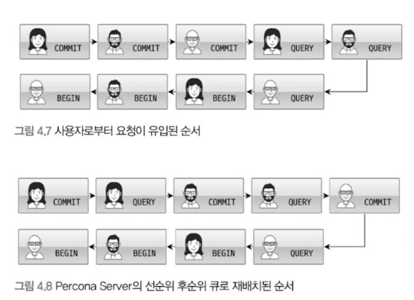
            

## 4.1.10 트랜잭션 지원 메타데이터

- 메타데이터, 데이터 딕셔너리: 테이블의 구조, 스토어드 프로그램 등의 정보
- MySQL 초반 버전에서는 테이블의 구조 및 스토어드 프로그램을 **파일 기반**으로 관리했다.
    - 파일 기반 메타데이터는 생성 및 변경 작업이 트랜잭션을 지원하지 않기 때문에 테이블의 생성 또는 변경 도중에 MySQL 서버가 비정상적으로 종료되면 일관되지 않은 상태로 남는 문제가 존재했다.
- MySQL 8.0 버전부터는 테이블의 구조 및 스토어드 프로그램 정보를 모두 트랜잭션 기반의 **InnoDB 테이블에 저장**하도록 개선됐다.
    - 시스템 테이블: MySQL 서버가 작동하는 데 기본적으로 필요한 테이블들의 묶음
        - ex. 사용자의 인증과 권한에 관련된 테이블
    - 시스템 테이블, 데이터 딕셔너리 정보 → `mysql DB` 에 저장 → `mysql DB`는 `mysal.idb` 테이블스페이스에 저장.
    - 스키마 변경 작업 중간에 MySQL 서버가 비정상적으로 종료되더라도 스키마 변경이 완전한 성공 또는 완전한 실패로 정리된다. → 진행 중인 상태 X
- InnoDB 스토리지 엔진 이외의 스토리지 엔진을 사용하는 테이블들을 위해 SDI 파일 사용
    - InnoDB 테이블 이외의 테이블들에 대해서는 SDI 포맷의 `*.sdi` 파일이 존재한다.
    - 이름 그대로 직렬화를 위한 포맷이므로 InnoDB 테이블들의 구조도 SDI 파일로 변환 가능하다.

# 4.2 InnoDB 스토리지 엔진 아키텍처

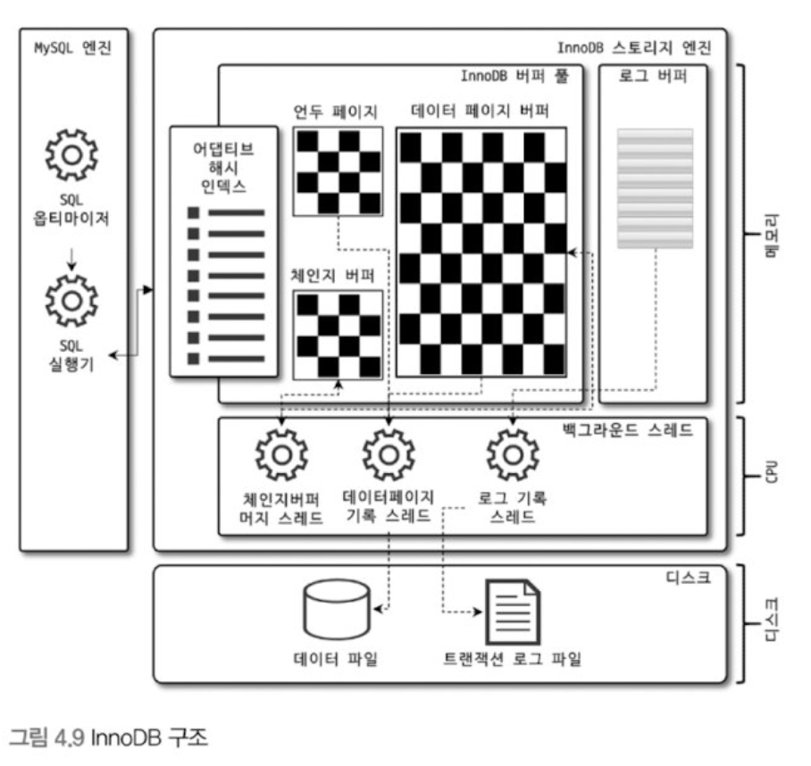

- InnoDB는 MySQL에서 사용할 수 있는 스토리지 엔진 중 거의 유일하게 레코드 기반의 잠금을 제공하며, 그 때문에 높은 동시성 처리가 가능하고 안정적이며 성능이 뛰어나다.

## 4.2.1 프라이머리 키에 의한 클러스터링

- InnoDB의 모든 테이블은 기본적으로 프라이머리 키를 기준으로 클러스터링되어 저장된다.
    - 즉, 프라이머리 키 값의 순서대로 디스크에 저장된다.
    - 모든 세컨더리 인덱스는 레코드의 주소 대신 프라이머리 키의 값을 논리적인 주소로 사용한다.
- 프라이머리 키 = 클러스터링 인덱스이므로 프라이머리 키를 이용한 레인지 스캔은 빨리 처리가 가능하다.
    - 다른 보조 인덱스에 비해 쿼리의 실행 계획에서 다른 보조 인덱스보다 프라이머리 키가 선택될 확률이 높다.
- MyISAM 스토리지 엔진에서는 클러스터링 키를 지원하지 않는다.
    - 그래서 MyISAM 테이블에서는 프라이머리 키와 세컨더리 인덱스는 구조적으로 차이가 없다.
    - 프라이머리 키는 유니크 제약을 가진 세컨더리 인덱스일 뿐이다.
    - MyISAM 테이블의 프라이머리 키를 포함한 모든 인덱스는 물리적인 레코드의 주소 값(ROWID)을 가진다.
        - MyISAM 테이블의 구조와 인덱스에 대해서는 4.3.3절 참고.

## 4.2.2 외래 키 지원

- InnoDB 스토리지 엔진 레벨에서 지원하는 기능 (MyISAM, MEMORY 테이블에서는 사용 불가능)
- 데이터베이스 서버 운영의 불편함 때문에 서비스용 DB에서는 생성하지 않는 경우도 자주 있지만 개발 환경의 DB에서는 좋은 가이드 역할.
- 부모 테이블과 자식 테이블 모두 해당 칼럼에 인덱스 생성 필요.
    - 변경 시에는 반드시 **부모 테이블이나 자식 테이블에 데이터가 있는지 체크**하는 작업 필요.
    - 락이 여러 테이블로 전파 → 데드락 자주 발생
    - 따라서, 개발할 때도 외래 키의 존재에 주의하는 것이 좋다.
- 수동으로 데이터를 적재하거나 스키마 변경 등의 관리 작업이 실패할 수 있다.
    - 부모 테이블과 자식 테이블의 관게를 명확히 파악해서 순서대로 작업한다면 문제없이 실행 가능하지만, 외래 키가 복잡하게 얽힌 경우에는 간단하지 않다.
    - 긴급하게 조치해야 될 상황에도 더 복잡 ..
    - `foreign_key_checks` 시스템 변수를 OFF로 설정하면 외래 키 관계에 대한 체크 작업을 일시적으로 멈출 수 있다.
        - 단, 부모와 자식 테이블 간의 관계가 깨진 상태로 유지해도 되는 건 아니다. 일관성을 맞춰준 후 다시 외래 키 체크 기능을 활성화해야 한다.
        - 적용 범위가 GLOBAL, SESSION 모두 설정 가능하므로, 반드시 현재 작업을 실행하는 세션에서만 이용.

## 4.2.3 MVCC(Multi Version Concurrency Control)

- 일반적으로 레코드 레벨의 트랜잭션을 지원하는 DBMS가 제공하는 기능이며, MVCC의 가장 큰 목적은 **락을 사용하지 않는 일관된 읽기를 제공**하는 데 있다.
- InnoDB는 언두 로그(Undo log)를 이용해 이 기능을 구현한다.
- 멀티 버전: 하나의 레코드에 대해 여러 개의 버전이 동시에 관리된다는 의미

- 격리 수준이 `READ_COMMITTED`인 `MySQL` 서버에서 InnoDB 스토리지 엔진을 사용하는 테이블의 데이터 변경을 어떻게 처리할까?
    
    ```sql
    CREATE TABLE member (
    	m_id INT NOT NULL,
    	m_name VARCHAR(20) NOT NULL,
    	m_area VARCHAR(100) NOT NULL,
    	PRIMARY KEY(m_id),
    	INDEX ix_area (m_area)
    );
    ```
    
    ```sql
    INSERT INTO member (m_id, m_name, m_area) VALUES (12, '홍길동', '서울');
    COMMIT;
    ```
    

- INSERT 문이 실행되면 데이터베이스의 상태는 다음과 같은 상태로 바뀐다.
    
    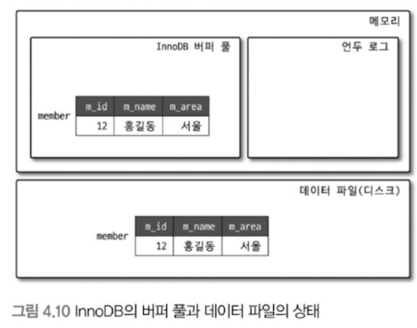
    

- 다음은 `MEMBER` 테이블에 `UPDATE` 문장이 실행될 때의 처리 절차다.
    
    ```sql
    UPDATE member SET m_area='경기' WHERE m_id=12;
    ```
    
    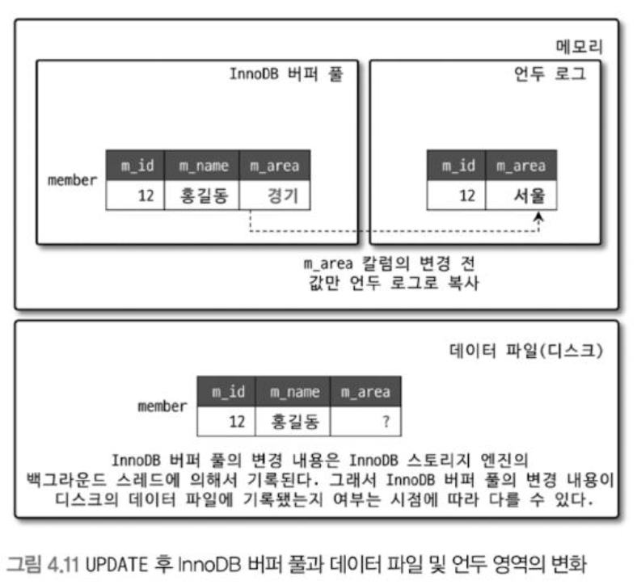
    
- `UPDATE` 문장이 실행되면 커밋 실행 여부와 관계없이 InnoDB의 버퍼 풀은 새로운 값인 ‘경기’로 업데이트
- 디스크의 데이터 파일에는 체크포인트나 InnoDB의 Write 스레드에 의해 새로운 값으로 업데이트돼 있을 수도 있고 아닐 수도 있다.
    - InnoDB가 ACID를 보장하므로 일반적으로 InnoDB 버퍼 풀과 데이터 파일은 동일한 상태라고 가정해도 무방.
- 아직 COMMIT이나 ROLLBACK이 되지 않은 상태에서 다른 사용자가 다음 같은 쿼리로 작업 중인 레코드를 조회하면 어디에 있는 데이터를 조회할까?
    
    ```sql
    SELECT * FROM member WHERE m_id=12;
    ```
    
    - MySQL 서버의 시스템 변수(`transaction_isolation`)에 설정된 격리 수준에 따라 다르다.
    - 격리 수준이 `READ_UNCOMMITTED`인 경우에는 **InnoDB 버퍼 풀이 현재 가지고 있는 변경된 데이터를 읽어서 반환**한다. 즉, 데이터가 커밋됐든 아니든 변경된 상태의 데이터를 반환한다.
    - `READ_COMMITTED`나 그 이상의 격리 수준(`REPEATABLE_READ`, `SERIALIZABLE`)인 경우에는 아직 커밋되지 않았기 때문에 InnoDB 버퍼 풀이나 데이터 파일에 있는 내용 대신 **변경되기 이전의 내용을 보관하고 있는 언두 영역의 데이터를 반환**한다.
    - 이러한 과정이 MVCC
        - 하나의 레코드에 대해 2개의 버전이 유지되고, 필요에 따라 어느 데이터가 보여지는지 여러가지 상황에 따라 달라지는 구조
    - `COMMIT` 명령을 실행하면 InnoDB는 더 이상의 변경 작업 없이 지금의 상태를 영구적인 데이터로 만들어 버린다.
    - 하지만, 롤백을 실행하면 InnoDB 언두 영역에 있는 백업된 데이터를 다시 InnoDB 버퍼 풀로 복구하고, 언두 영역의 내용을 삭제한다.
        - 커밋이 된다고 언두 영역의 백업 데이터가 항상 사라지는 것은 아니구나.
        - 그럼 언제 삭제될까? 이 언두 영역을 필요로 하는 트랜잭션이 더는 없을 때 비로소 삭제.

## 4.2.4 잠금 없는 일관된 읽기

- MVCC 기술을 이용해 잠금을 걸지 않고 읽기 작업을 수행한다.
- 격리 수준이 `SERIALIZABLE`이 아닌 `READ_UNCOMMITTED`나 `READ_COMMITTED`, `REPEATABLE_READ` 수준인 경우 `INSERT`와 연결되지 않은 순수한 읽기 작업은 다른 트랜잭션 변경 작업과 관계 없이 항상 잠금을 대기하지 않고 바로 실행된다.
    
    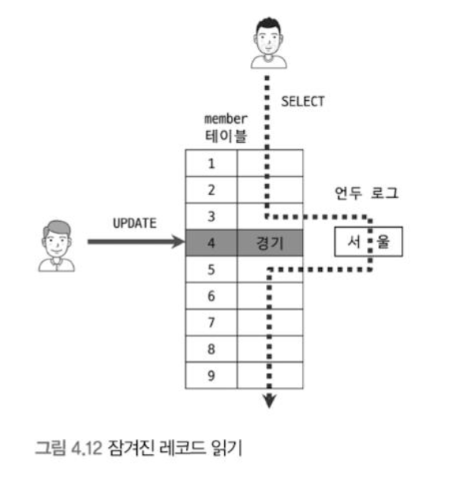
    
    - 어떤 사용자가 레코드 변경 후 아직 커밋 수행이 안되었다 하더라도 이 변경 트랜잭션이 SELECT 작업을 방해하지 않는다.
- 오랜 시간 동안 활성 상태인 트랜잭션으로 인해 MySQL 서버가 느려지거나 문제가 발생할 때가 가끔 있다.
    - 언두 로그를 삭제하지 못하고 계속 유지해야 하기 때문
    - 따라서 트랜잭션이 시작됐다면 가능한 빨리 롤백이나 커밋을 통해 트랜잭션을 완료하는 것이 좋다.

## 4.2.5 자동 데드락 감지

- InnoDB 스토리지 엔진은 내부적으로 잠금이 교착 상태에 빠지지 않았는지 체크하기 위해 잠금 대기 목록을 그래프 형태로 관리한다.
    - 데드락 감지 스레드를 가지고 있다.
    - 주기적으로 잠금 대기 그래프 검사 → 교착 상태인 트랜잭션 찾기 → 그 중 하나 강제 종료
    - 어느 트랜잭션을 먼저 강제 종료 할까? → **언두 로그 양 더 적은 트랜잭션**
        - 롤백을 해도 언두 처리를 해야 할 내용이 적다는 뜻이므로, 강제 롤백으로 인한 MySQL 서버 부하도 덜 유발하기 때문에.
- `innodb_table_locks` 시스템 변수를 활성화하면 InnoDB 스토리지 엔진 내부의 레코드 잠금 뿐만 아니라 테이블 레벨의 잠금까지 감지할 수 있다.
    - 활성화 추천
- 동시 처리 스레드가 매우 많아지거나 각 트랜잭션이 가진 잠금의 개수가 많아지면 데드락 감지 스레드가 느려진다.
    - 서비스 쿼리를 처리 중인 스레드는 더 이상 작업을 진행하지 못하고 대기하면서 서비스에 악영향.
    - `innodb_deadlock_detect`를 `OFF` 로 설정하면 데드락 감지 스레드 작동 X
        - InnoDB 스토리지 엔진 내부에서 2개 이상의 트랜잭션이 상대방이 가진 잠금을 요구하는 상황(데드락 상황)이 발생해도 누군가가 중재를 하지 않기 때문에 무한정 대기한다.
    - `innodb_lock_waite_timeout` 변수 활성화하면 이런 데드락 상황에서 일정 시간이 지나면 자동으로 요청이 실패하고 에러 메세지를 반환한다.
        - 초 단위 설정
        - `innodb_deadlock_detect`를 `OFF`하는 경우 50초 보다 훨씬 낮은 시간으로 변경해서 사용 권장.

## 4.2.6 자동화된 장애 복구

- InnoDB에는 손실이나 장애로부터 데이터를 보호하기 위한 여러 메커니즘이 탑재되어 있으므로, MySQL 서버가 시작될 때 완료되지 못한 트랜잭션이나 디스크에 일부만 기록된 데이터 페이지 등에 대한 일련의 복구 작업이 자동으로 진행된다.
- 디스크나 서버 하드웨어 이슈로 InnoDB 스토리지 엔진이 자동으로 복구를 못하는 경우, 문제가 생기면 복구가 쉽지 않다.
- 이때는 MySQL 서버의 설정 파일에 `innodb_force_recovery` 시스템 변수를 설정해서 MySQL 서버를 시작해야 한다.
    - 이 설정 값은 MySQL 서버가 시작될 때 InnoDB 스토리지 엔진이 데이터 파일이나 로그 파일의 손상 여부 검사 과정을 선별적으로 진행 할 수 있게 한다.
        - InnoDB 로그 파일이 손상됐다면 6으로 설정하고 MySQL 서버를 기동
        - InnoDB 테이블의 데이터 파일이 손상됐다면 1로 설정하고 MySQL 서버를 기동
        - 어떤 부분이 문제인지 알 수 없다면 `innodb_force_recover` 설정값을 1부터 6까지 변경하면서 MySQL 재시작 해본다.
            - 참고로 그 값이 커질수록 그만큼 심각한 상황이어서 데이터 손실 가능성이 커지고 복구 가능성은 적어진다.
- 일단 MySQL 서버가 기동되고 InnoDB 테이블이 인식된다면 `mysqldump`를 이용해 데이터를 가능한만큼 백업하고 그 데이터로 MySQL 서버의 DB와 테이블을 다시 생성하는 것이 좋다.
- `innodb_force_recover` 설정 값에 따라 복구되는 장애 상황과 해결방법
    - 0이 아닌 복구 모드에서는 SELECT 이외의 INSERT, UPDATE, DELETE 같은 쿼리는 수행 불가능
    - **`1(SRV_FORCE_IGNORE_CORRUPT)`**
        - InnoDB 테이블스페이스의 데이터나 인덱스 페이지에서 손상된 부분이 발견돼도 무시하고 MySQL 서버를 시작한다.
        - 에러 로그 파일에 `Database page courruption on disk or a failed` 메세지가 출력될 때 대부분 이 경우에 해당.
        - 이때는 `mysqldump` 프로그램이나 `SELECT INTO OUTFILE...` 명령을 이용해 덤프해서 데이터베이스를 다시 구축하는 것이 좋다.
    - **`2(SRV_FORCE_NO_BACKGROUND)`**
        - 여러 종류의 백그라운드 스레드 가운데 메인 스레드를 시작하지 않고 MySQL 서버를 시작한다.
            - 트랜잭션이 커밋되어 불필요한 언두 데이터는 InnoDB의 메인 스레드에 의해 주기적으로 삭제 된다.
        - InnoDB의 메인 스레드가 언두 데이터를 삭제하는 과정에서 장애가 발생한다면 이 복구모드 이용.
    - **`3(SRV_FORCE_NO_TRX_UNDO)`**
        - 커밋되지 않은 트랜잭션의 작업을 롤백하지 않고 그대로 놔둔다.
        - 즉, 커밋되지 않고 종료된 트랜잭션은 계속 그 상태로 남아있게 MySQL 서버를 시작하는 모드.
        - 이때도 우선 MySQL 서버가 시작되면 `mysqldump`를 이용해 데이터를 백업해서 다시 데이터베이스 구축하는 것이 좋다
    - **`4(SRV_FORCE_NO_IBUF_MERGE)`**
        - 인서트 버퍼가 손상 됐을 경우 이용
        - InnoDB 스토리지 엔진이 인서트 버퍼의 내용을 무시하고 강제로 MySQL 재시작
        - 인서트 버퍼는 실제 데이터와 관련된 부분이 아니라 인덱스에 관련된 부분이므로 테이블을 덤프한 후 다시 데이터베이스를 구축하면 데이터의 손실 없이 복구할 수 있다.
    - **`5(SRV_FORCE_NO_UNDO_LOG_SCAN)`**
        - InnoDB의 언두 로그를 사용할 수 없을 경우 이용
        - InnoDB 엔진이 언두 로그를 모두 무시하고 MySQL을 재시작
        - 하지만 이 모드로 복구되면 MySQL 서버가 종료되던 시점에 커밋되지 않았던 작업도 모두 커밋된 것처럼 처리되므로 실제로는 잘못된 데이터가 데이터베이스에 남는 것.
        - `mysqldump`를 이용해 데이터 백업하고 데이터베이스 새로 구축해야한다.
    - **`6(SRV_FORCE_NO_LOG_REDO)`**
        - InnoDB 리두 로그를 사용할 수 없을 경우 이용
        - InnoDB 엔진이 리두 로그를 모두 무시하고 MySQL을 재시작
        - 또한 커밋됐다 하더라도 리두 로그에만 기록되고 데이터 파일에 기록되지 않은 데이터 모두 무시.
            - 즉, 마지막 체크포인트 시점의 데이터만 남는다.
        - 기존 InnoDB의 리두 로그는 모두 삭제하고 MySQL 서버를 시작하는 것이 좋다.
        - `mysqldump`를 이용해 데이터 백업하고 데이터베이스 새로 구축해야한다.
- 위와 같이 진행했음에도 MySQL 서버가 시작되지 않으면 백업을 이용해 다시 구축하는 방법밖에 없다.
    - 마지막 풀 백업 시점부터 장애 시점까지의 바이너리 로그가 있다면 InnoDB의 복구를 이용하는 것보다 풀 백업과 바이너리 로그로 복구하는 편이 데이터 손실이 더 적을 수 있다.
    - 백업은 있지만 복제의 바이너리 로그가 없거나 손실됐다면 마지막 백업 시점까지만 복구할 수 있다.

## 4.2.7 InnoDB 버퍼 풀

- 디스크의 데이터 파일이나 인덱스 정보를 메모리에 캐시해 두는 공간
- 쓰기 작업을 지연시켜 일괄 작업으로 처리할 수 있게 해주는 버퍼 역할
- 변경된 데이터를 모아서 처리하기 때문에 파일 이곳저곳에 위치한 레코드 변경에 의해 발생하는 랜덤한 디스크 작업의 횟수를 줄일 수 있다.

### 4.2.7.1 버퍼 풀의 크기 설정

- 운영체제와 각 클라이언트 스레드가 사용할 메모리 고려해서 설정해야 한다.
- 커넥션이 많고 사용하는 테이블도 많을 경우 레코드 버퍼가 상당한 메모리를 사용하기도 한다.
    - 레코드 버퍼: 각 클라이언트 세션에서 테이블의 레코드를 읽고 쓸 때 버퍼로 사용하는 공간
    - 레코드 버퍼 공간은 별도로 설정할 수 없고, 전체 커넥션 개수와 각 커넥션에서 읽고 쓰는 테이블의 개수에 따라 결정되고, 동적으로 해제되기도 한다.
        - 따라서 정확히 필요한 메모리 공간의 크기를 계산할 수 없다.
- **InnoDB 버퍼 풀의 크기를 적절히 작은 값으로 설정해서 조금씩 상황을 봐 가면서 증가시키는 방법이 최적이다.**
    - 이미 회사에서 MySQL 서버를 사용하고 있다면, 그 서버의 메모리 설정을 기준으로 InnoDB 버퍼 풀의 크기를 조정하면 된다.
    - 그렇다면 처음으로 MySQL 서버를 준비한다면?
        - 운영체제의 전체 메모리 공간이 8GB 미만이라면, 50% 정도면 버퍼 풀로 설정하고 나머지 메모리 공간은 MySQL 서버와 운영체제, 다른 프로그램이 사용할 수 있는 공간으로 확보.
        - 전체 메모리 공간이 그 이상이라면, 50%에서 시작해서 조금씩 올려가면서 최적점을 찾는다.
            - 50GB 이상이라면 대략 15GB ~ 30GB를 운영체제와 다른 응용 프로그램을 위해서 남겨두고 나머지를 InnoDB 버퍼 풀로 할당 추천.
- `innodb_buffer_pool_size` 변수로 크기 설정 가능하고, 동적으로 버퍼 풀의 크기를 확장할 수 있다.
    - 가능하면 MySQL 서버가 한가한 시점을 골라서 진행하는 것이 좋다.
    - 더 크게 → 시스템 영향도가 적다. 하지만, 더 작게 → 시스템 영향도가 매우 크다.
        - 따라서 가능하면 버퍼 풀의 크기를 줄이는 작업은 하지 않도록 주의하자.
    - 버퍼 풀의 크기를 줄이거나 늘릴 때에는 128MB 단위로 처리된다.
- 전통적으로 버퍼 풀 전체를 관리하는 잠금(세마포어)로 인해 내부 잠금 경합을 많이 유발해왔다.
    - 버퍼 풀을 여러 개로 쪼개어 관리할 수 있게 개선됐다.
    - 개별 버퍼 풀 전체를 관리하는 잠금(세마포어) 자체도 경합이 분산되는 효과
    - `innodb_buffer_pool_instances` 변수를 이용해 버퍼 풀을 여러 개로 분리해서 관리할 수 있는데, 각 버퍼 풀을 버퍼 풀 인스턴스라고 표현한다.
        - 기본적으로 버퍼 풀 인스턴스 개수는 8개로 초기화
        - 전체 풀을 위한 메모리 크기가 1GB 미만이면 버퍼 풀 인스턴스는 1개만 생성
        - 버퍼 풀로 할당할 수 있는 메모리 공간이 40GB 이하 수준이면 기본값인 8 유지
        - 메모리가 크다면 버퍼 풀 인스턴스당 5GB 정도가 되게 인스턴스 개수 설정하는 것이 좋다.

### 4.2.7.2 버퍼 풀의 구조

- 버퍼 풀이라는 거대한 메모리 공간을 페이지 크기(`innodb_page_size`)의 조각으로 쪼개어 InnoDB 스토리지 엔진이 데이터를 필요로 할 때 해당 데이터 페이지를 읽어서 각 조각에 저장한다.
- 버퍼 풀의 페이지 크기 조각을 관리하기 위해 InnoDB 스토리지 엔진은 크게 LRU 리스트, 플러시 리스트, 프리 리스트라는 3개의 자료구조를 관리한다.
    - 프리 리스트: InnoDB 버퍼 풀에서 실제 사용자 데이터로 채워지지 않은 비어 있는 페이지들의 목록. 사용자의 쿼리가 새롭게 디스크의 페이지를 읽어와야 하는 경우 사용된다.
    - LRU 리스트: 엄밀하게 LRU와 MRU 리스트가 결합된 형태
        
        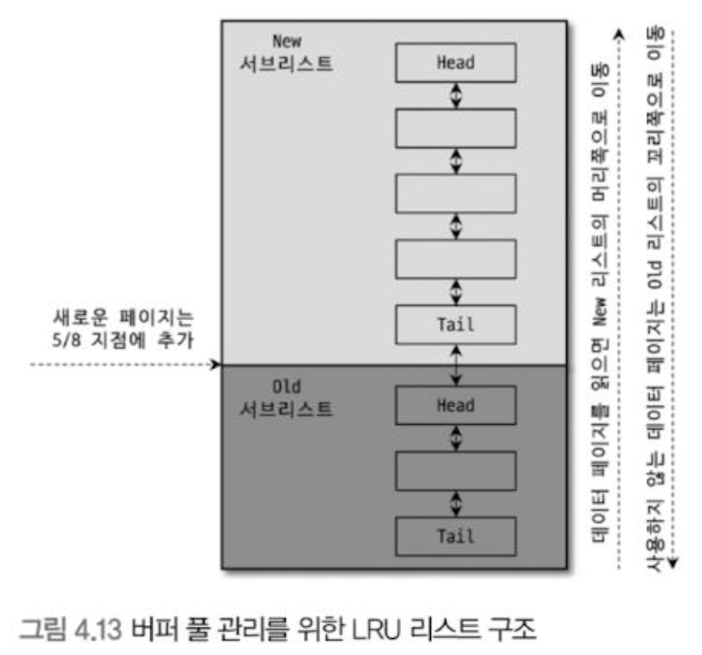
        
        - Old 서브리스트: LRU
        - New 서브리스트: MRU
        - LRU 리스트를 관리하는 목적은 디스크로부터 한 번 읽어온 페이지를 최대한 오랫동안 InnoDB 버퍼 풀의 메모리에 유지해서 디스크 읽기를 최소화하기 위해서이다.
        - InnoDB 스토리지 엔진에서 데이터를 찾는 과정
            1. 필요한 레코드가 저장된 데이터 페이지가 버퍼 풀에 있는지 검사
                
                A. InnoDB 어댑티브 해시 인덱스를 이용해 페이지를 검색
                B. 해당 테이블의 인덱스 (B-Tree)를 이용해 버퍼풀에서 페이지를 검색
                C. 버퍼풀에 이미 데이터 페이지가 있었다면 해당 페이지의 포인터를 MRU 방향으로 승급
                
            2. 디스크에서 필요한 데이터 페이지를 버퍼 풀에 적재하고, 적재된 페이지에 대한 포인터를 LRU 헤더 부분에 추가
            3. 버퍼풀의 LRU 헤더 부분에 적재된 데이터 페이지가 실제로 읽히면 MRU 헤더 부분으로 이동
                - 단, 대량 읽기의 경우 디스크의 데이터 페이지가 버퍼 풀로 적재는 되지만 실제 쿼리에서 사용되지는 않을 수도 있으며, 이런 경우는 MRU로 이동 X
            4. 버퍼 풀에 상주하는 데이터 페이지는 사용자 쿼리가 얼마나 최근에 접근했었는지에 따라 나이가 부여되며, 버퍼 풀에 상주하는 동안 쿼리에서 오랫동안 사용되지 않으면 데이터 페이지에 부여된 나이가 오래되고 해당 페이지는 버퍼풀에서 제거된다. 버퍼 풀의 데이터 페이지가 쿼리에 의해 사용되면 나이가 초기화되어 다시 젊어지고 MRU 헤더 부분으로 옮겨진다.
            5. 필요한 데이터가 자주 접근됐다면 해당 페이지의 인덱스 키를 어댑티브 해시 인덱스에 추가
        - 즉 처음 한 번 읽힌 데이터 페이지가 이후 자주 사용 된다면 그 데이터 페이지는 InnoDB 버퍼 풀의 MRU 영역에서 계속 살아남게 되고, 반대로 거의 사용되지 않는다면 새롭게 디스크에서 읽히는 데이터 페이지들에 밀려서 LRU의 끝으로 밀려나 결국은 InnoDB 버퍼풀에서 제거될 것이다.
    - 플러시 리스트: 디스크로 동기화되지 않은 데이터를 가진 데이터 페이지(더티 페이지)의 변경 시점 기준의 페이지 목록을 관리한다.
        - 디스크에서 읽은 상태 그대로 전혀 변경이 없다면 플러시 리스트에 관리 X
        - 일단 한 번 변경이 가해진 데이터 페이지는 플러시 리스트에 관리되고 특정 시점이 되면 디스크로 기록돼야 한다.

### 4.2.7.3 버퍼 풀과 리두 로그

- **버퍼 풀의 두 가지 핵심 용도**
    - InnoDB 버퍼 풀은 단순히 데이터를 메모리에 캐시하는 것 이상의 두 가지 중요한 역할을 한다.
        - 데이터 캐시 기능: 디스크의 데이터 파일이나 인덱스 정보를 메모리에 캐시하여 쿼리 성능을 빠르게 한다. 버퍼 풀 크기를 늘리는 것은 이 캐시 기능만 향상시킨다.
        - 쓰기 버퍼링 기능: 데이터 변경 작업을 지연시켜 모아서 처리함으로써, 랜덤한 디스크 쓰기 작업의 횟수를 줄여 성능을 향상시킨다.
    - 쓰기 버퍼링 기능을 향상 시키려면 버퍼 풀 크기 뿐만 아니라 리두 로그와의 관계를 이해해야 한다.
    
    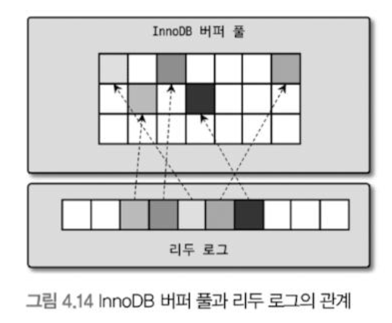
    
- **더티 페이지와 클린 페이지**
    - 버퍼 풀은 페이지 단위로 데이터를 관리하며, 두 가지 상태의 페이지가 존재한다.
        - **클린 페이지 (Clean Page)**: 디스크에서 읽은 상태 그대로, 전혀 변경되지 않은 페이지
        - **더티 페이지 (Dirty Page)**: INSERT, UPDATE, DELETE 명령으로 **변경되었지만** 아직 디스크에 기록되지 않아, 메모리(버퍼 풀)와 디스크의 데이터 상태가 다른 페이지
            - 더티 페이지는 언젠가는 디스크로 기록되어야 한다.
- **리두 로그의 역할과 구조**
    - 리두 로그는 데이터 변경을 기록하는 곳, InnoDB는 이 로그를 이용해 데이터의 안정성(ACID)을 보장한다.
        - **순환 고리 구조**: 리두 로그는 1개 이상의 **고정 크기 파일**을 연결해서 **순환 고리**처럼 사용된다. 데이터 변경이 계속 발생하면 오래된 로그 엔트리는 새로운 로그 엔트리로 덮어 쓰인다.
        - **LSN (Log Sequence Number)**: 리두 로그가 기록될 때마다 증가하는 로그 포지션 값
        - **체크포인트 (Checkpoint)**: InnoDB 스토리지 엔진이 주기적으로 발생시키는 이벤트로, 리두 로그와 버퍼 풀의 더티 페이지를 디스크로 동기화한다.
            - 체크포인트 시 가장 최근 체크포인트 지점의 LSN이 활성 리두 로그 공간의 시작점
        - **활성 리두 로그 (Active Redo Log)**: 전체 리두 로그 파일에서 **재사용 불가능한 공간**을 의미
        - **체크포인트 에이지 (Checkpoint Age)**: 가장 최근 체크포인트 LSN - 마지막 리두 로그 엔트리의 LSN, 활성 리두 로그 공간의 크기를 말한다.
- 버퍼 풀의 더티 페이지는 특정 리두 로그 엔트리와 관계를 가지며, **리두 로그 파일의 전체 크기**가 쓰기 버퍼링 효과를 제한할 수 있다.
- 버퍼풀의 크기가 100GB 이하인 MySQL 서버에서는 리두 로그 파일의 전체 크기를 대략 6GB ~ 10GB 수준으로 선택하고, 필요할 때마다 조금씩 늘려가면서 최적값을 선택하는 것이 좋다.

### 4.2.7.4 버퍼 풀 플러시

- InnoDB 스토리지 엔진의 더티 페이지의 디스크 쓰기 동기화와 관련된 시스템 설정
    - 서비스 운영할 때 성능 문제가 발생하지 않는다면 굳이 이 시스템 변수들 조정할 필요 X
    - InnoDB 스토리지 엔진은 버퍼 풀에 있는 **더티 페이지** (DML 작업으로 변경되었지만 디스크에 아직 기록되지 않은 페이지)를 성능에 악영향 없이 디스크에 동기화하기 위해 다음 두 가지 플러시 기능을 백그라운드로 실행한다.
        1. 플러시 리스트 플러시
        2. LRU 리스트 플러시
- **플러시 리스트 플러시**
    - 리두 로그 공간의 재활용이 목적이다.
    - 오래된 리두 로그 공간이 지워지려면 반드시 그와 관련된 더티 페이지가 디스크에 먼저 기록되어야 한다.
        - 플러시 리스트에서 오래전에 변경된 데이터 페이지 순서대로 디스크에 동기화하는 작업을 주기적으로 수행
        - 클리너 스레드: 더티 페이지를 디스크에 동기화하는 스레드
            - `innodb_page_cleaners` 시스템 변수로 이 스레드의 개수 조정 가능. `innodb_buffer_pool_instances`와 동일하게 설정하는 것 권장.
    - **디스크 쓰기 제어 관련 주요 시스템 변수**
        - 더티 페이지의 디스크 쓰기는 다음 변수들을 통해 사용자 쿼리에 악영향 없이 처리되도록 조정된다.
        - **`innodb_max_dirty_pages_pct`**: 버퍼 풀에서 더티 페이지가 차지할 수 있는 최대 비율 설정. 기본적으로 90%까지 허용.
            - 쓰기 버퍼링 효과를 극대화하려면 기본값을 유지하는 것이 좋다.
        - **`innodb_io_capacity` / `innodb_io_capacity_max`**: InnoDB 백그라운드 스레드가 수행할 수 있는 디스크 읽고 쓰기 작업량의 수준을 설정
            - `innodb_io_capacity`는 일반적인 상황, `innodb_io_capacity_max`는 최대 성능을 발휘할 때의 수준을 의미
        - **`innodb_max_dirty_pages_pct_lwm`**: 더티 페이지의 비율이 이 값(기본값 10%) 이상이 되면, 디스크 쓰기 폭발을 완화하기 위해 InnoDB가 조금씩 더티 페이지를 디스크로 기록하기 시작한다.
        - **`innodb_adaptive_flushing`**: 이 기능(기본값 활성화)이 켜지면, InnoDB는 버퍼 풀 비율이나 `innodb_io_capacity` 설정에만 의존하지 않고, 리두 로그의 증가 속도를 분석하여 적절한 수준의 더티 페이지를 유지하도록 디스크 쓰기를 실행한다.
        - **`innodb_flush_neighbors`**: 더티 페이지를 디스크에 기록할 때, 디스크에서 근접한 페이지 중 더티 페이지가 있다면 함께 묶어서 기록하게 해주는 기능이다.
            - HDD 사용 시 성능 개선에 도움이 되었지만, 요즘 대부분 사용하는 SSD 환경에서는 기본값인 비활성(0) 모드로 유지하는 것이 좋다.
- **LRU 리스트 플러시**
    - 새로운 페이지를 읽어올 공간을 확보하는 것이 목적이다.
    - LRU 리스트의 끝부분부터 시작해서 `innodb_lry_scan_depth` 시스템 변수에 설정된 개수만큼 페이지들을 스캔한다.
    - 스캔 중 발견된 더티 페이지는 디스크에 동기화 된다.
    - 클린 페이지는 즉시 프리 리스트로 옮겨져 재사용 가능한 공간이 된다.
    - InnoDB 버퍼 풀은 인스턴스 별로 스캔을 수행하므로 실질적인 LRU 리스트의 총 스캔 횟수는 `innodb_buffer_pool_instances` X `innodb_lru_scan_depth` 수만큼 된다.

### 4.2.7.5 버퍼 풀 상태 백업 및 복구

- InnoDB 서버의 버퍼 풀은 쿼리 성능과 매우 밀접하게 연결되어 있다.
- 쿼리 요청이 매우 빈번한 서버를 셧다운했다가 다시 시작하고 서비스를 재개하면, 쿼리 처리 성능이 평상시보다 훨씬 느려지는 경우가 대부분이다.
- 이는 버퍼 풀에 쿼리가 사용할 데이터가 준비되지 않아 디스크에서 데이터를 다시 읽어야 하기 때문이다.
- 디스크의 데이터가 버퍼 풀에 적재되어 있는 상태를 워밍업(Warming Up)이라고 표현하며, 잘 워밍업된 상태에서는 그렇지 않은 경우보다 몇십 배 빠른 쿼리 처리 속도를 보이는 것이 일반적이다.
- MySQL 5.6 버전부터는 서버 점검 등으로 재시작이 필요할 때 버퍼 풀의 상태를 백업하고 복구할 수 있는 기능이 도입되었다.
    - 수동 백업 및 복구
        - **백업(덤프)**: MySQL 서버를 셧다운하기 전에 `innodb_buffer_pool_dump_now` 시스템 변수를 이용해 현재 버퍼 풀의 상태를 백업할 수 있다.
            - `mysql> SET GLOBAL innodb_buffer_pool_dump_now=ON;`
        - **복구(적재)**: MySQL 서버를 다시 시작한 후, `innodb_buffer_pool_load_now` 시스템 변수를 이용해 백업된 상태를 다시 복구할 수 있다.
            - `mysql> SET GLOBAL innodb_buffer_pool_load_now=ON;`
- 백업 파일의 특징과 복구 시간
    - **파일 위치 및 크기**: 백업 파일은 데이터 디렉터리에 `ib_buffer_pool`이라는 이름으로 생성되며, InnoDB는 LRU 리스트에 적재된 데이터 페이지의 메타 정보만 가져와 저장하기 때문에, 파일 크기는 몇십 MB 이하로 매우 작습니다.
        - 이 덕분에 버퍼 풀의 백업은 매우 빨리 완료된다.
    - **복구 시간**: 백업된 내용을 다시 버퍼 풀로 복구하는 과정은 버퍼 풀의 크기에 따라 상당한 시간이 걸릴 수 있다. 이는 백업된 메타 정보를 바탕으로 각 테이블의 데이터 페이지를 다시 디스크에서 읽어와야 하기 때문이다.
    - **복구 진행 확인**: InnoDB는 복구 과정의 진행 상태를 `Innodb_buffer_pool_dump_status` 상태 값을 통해 확인할 수 있게 제공한다.
- 복구 중단
    - 복구 작업에 시간이 너무 오래 걸려 중간에 멈추고자 한다면 `innodb_buffer_pool_load_abort` 시스템 변수를 이용.
    - 버퍼 풀 복구가 실행 중인 상태에서 급히 서비스를 재개하는 것은 좋지 않은 선택일 수 있으므로, 복구 도중에 다음과 같이 멈출 것을 권장한다.
        - `mysql> SET GLOBAL innodb_buffer_pool_load_abort=ON;`
- 자동 백업 및 복구 설정
    - 수동 작업은 다른 작업에 집중하다가 잊어버리기 쉽다. 따라서 MySQL 서버가 셧다운 직전에 백업을 실행하고, 시작 시 자동으로 복구할 수 있는 기능을 제공한다.
    - 버퍼 풀의 백업과 복구를 자동화하려면 `innodb_buffer_pool_dump_at_shutdown`과 `innodb_buffer_pool_load_at_startup` 설정을 MySQL 서버의 설정 파일에 넣어두면 된다.

### 4.2.7.6 버퍼 풀의 적재 내용 확인

- 기존 확인 방법의 문제점
    - MySQL 5.6 버전부터는 `information_schema` 데이터베이스의 `innodb_buffer_page` 테이블을 이용해 InnoDB 버퍼 풀 메모리에 어떤 테이블의 페이지들이 적재되어 있는지 확인할 수 있었다.
    - 하지만 이 테이블을 조회하는 작업은 InnoDB 버퍼 풀이 클 경우 **상당히 큰 부하를 일으켜** 서비스 쿼리를 많이 느리게 만드는 문제가 있었다. 결과적으로 실제 서비스용 MySQL 서버에서는 버퍼 풀의 상태를 확인하는 것이 거의 불가능했다.
- MySQL 8.0에서의 개선
    - MySQL 8.0 버전에서는 이러한 문제점을 해결하기 위해 `information_schema` 데이터베이스에 **`innodb_cached_indexes`** 테이블이 새로 추가되었다.
    - 이 테이블을 사용하면 테이블의 인덱스별로 데이터 페이지가 얼마나 InnoDB 버퍼 풀에 적재되어 있는지 확인할 수 있다.
- 테이블 전체 적재 비율 확인
    - `innodb_cached_indexes` 테이블의 캐시된 페이지 수와 `information_schema.tables` 테이블의 전체 데이터 크기(데이터 길이 + 인덱스 길이)를 조합하는 쿼리를 응용하면, **테이블 전체(인덱스 포함) 페이지 중에서 대략 어느 정도 비율이 InnoDB 버퍼 풀에 적재되어 있는지** 확인할 수 있다.
- 한계점
    - 아직 MySQL 서버는 개별 인덱스별로 전체 페이지 개수가 몇 개인지는 사용자에게 알려주지 않는다.
    - 따라서 `information_schema` 테이블을 이용해서도 테이블의 인덱스별로 페이지가 InnoDB 버퍼 풀에 적재된 비율은 정확히 확인할 수 없다.