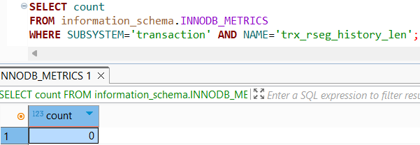
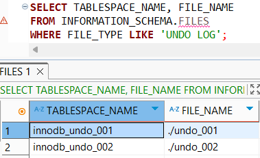
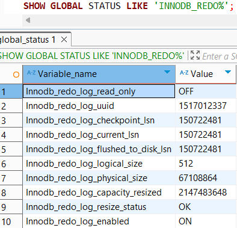
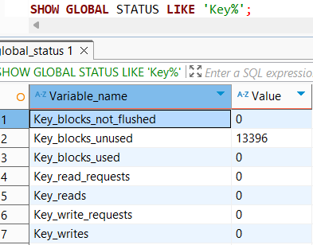

# 4.2. InnoDB 스토리지 엔진 아키텍처

## Double Write Buffer

- 리두로그는 페이지의 변경된 내용만을 기록하고, InnoDB 스토리지 엔진에서 더티 페이지를 디스크 파일로 플러시 할 때 일부만 기록되어 나머지 일부 내용이 날아가 복구 불가능한 문제가 발생할 수 있다.
    - 이런 현상을 파셜 페이지(Partial-page) 또는 톤 페이지(Torn-page) 라고 한다.
    - 하드웨어의 오작동이나 시스템 비정상 종료 등으로 발생할 수 있다.
- 이러한 문제의 해결을 위해 InnoDB 스토리지 엔진에서는 Double-Write 기법을 이용한다.
- 실제 데이터 파일 기록 전 더티페이지들을 묶어 한 번의 디스크 쓰기로 시스템 테이블스페이스의 DoubleWrite 버퍼에 기록한다.
- 이후 각 더티 페이지를 파일의 적당한 위치에 하나씩 랜덤으로 쓰기를 실행한다.
- DoubleWrite 버퍼의 내용은 실제 데이터 파일의 쓰기가 중도 실패시에만 사용되며, 재시작 시 DoubleWrite 버퍼의 내용과 데이터 파일 페이지들을 모두 비교해서 다른 내용의 페이지가 있다면 DoubleWrite 버퍼로 부터 데이터 파일 페이지로 복사를 진행한다.
- 사용 여부는 `innodb_doublewrite` 시스템 변수로 제어하며, 무결성이 중요하다면 활성화를 고려하자.
- DB 성능을 위해 InnoDB 리두로그 동기화 설정(`innodb_flush_log_at_trx_commit`) 시스템 변수를 1이 아닌 값으로 설정했다면, Double Write도 비활성화 하는 것이 좋다.

  > 무결성에 민감한 서비스라면 트랜잭션 COMMIT 시 동기화할 것 들이 많기에, 리두 로그는 동기화하지 않으면서, DoubleWrite만 활성화 하는 것은 잘못된 선택이다.\
>

## 언두로그

- InnoDB 스토리지 엔진은 트랜잭션과 격리 수준의 보장을 위해 DML(INSERT, UPDATE, DELETE)로 변경 이전 버전의 데이터를 별도로 백업한다.
- 이렇게 백업된 데이터를 언두 로그(Undo Log)라 하며, 2가지 목적으로 사용된다.
    - **트랜잭션 보장**
        - 트랜잭션 롤백 시 변경된 데이터를 변경 전 데이터로 복구하기 위해 사용
    - **격리 수준 보장**
        - 데이터 변경 도중에 조회 시 격리 수준에 맞게 레코드를 읽지 않고 언두 로그 백업 데이터를 반환
        - 5.4.3 REPEATABLE READ에 나오는 예제 추후 참조
            - 언두로그가 트랜잭션 번호에 따라 어떻게 사용되는지 예제가 있어용

### **언두로그 모니터링**

- MySQL 5.5 이전 버전의 MySQL 서버에서는 한 번 증가한 언두 로그 공간은 다시 줄어들지 않았다.
    - e.g., 1억 건의 레코드가 저장된 100GB 테이블을 하나의 트랜잭션에서 DELETE 시, 다 지워질동안 해당 값들을 저장해야하기에, 언두로그 공간도 100GB 필요하다.
    - e.g., 트랜잭션 A 이후 실행된 B, C가 완료되어도, 먼저 시작한 트랜잭션 A의 완료전까지 B, C 트랜잭션이 만들어낸 언두로그는 삭제되지 않는다. → 오랫동안 트랜잭션이 실행되도 발생하는 용량 문제
        - 이 언두로그로 인한 디스크 사용량 자체는 문제가 아닐 수 있으나..
        - 빈번하게 변경된 레코드 조회 시 필요한 만큼 언두 로그의 이력을 스캔해야만 필요 레코드를 찾을 수 있다는 문제가 존재한다. → 전반적으로 쿼리의 성능이 떨어지는 문제!
- 다행히 MySQL 5.7과 MySQL 8.0으로 업그레이드 되면서 언두 로그 공간 문제점은 해결되었다.
    - MySQL 8.0에서는 언두 로그를 돌아가면서 순차적으로 사용해 디스크 공간을 줄이는 것이 가능
    - 때로는 MySQL 서버가 필요한 시점에 사용 공간으로 자동으로 줄여주기도 함
- 하지만 여전히 서비스 중인 MySQL 서버에서 활성 상태 트랜잭션이 장기간 유지되는 것은 성능 상 좋지 않기에 언두 로그의 증가율은 모니터링 하는 것이 좋다.

    ```sql
    SELECT count
    FROM information_schema.innodb_metrics
    WHERE SUBSYSTEM='transaction' AND NAME='trx_rseg_history_len';
    ```

  


### 언두 테이블스페이스 관리

> 언두 로그가 저장되는 공간
>
- MySQL 5.6 이전 버전에서는 언두 로그가 모두 시스템 테이블스페이스에 저장
- 시스템 테이블스페이스의 언두 로그는 MySQL 서버 초기화 시 생성되기에 확장 한계 존재
- MySQL 5.6 버전에서 `innodb_undo_tablespaces` 시스템 변수 도입
    - `innodb_undo_tablespaces` 가 2보다 클 경우, InnoDB 스토리지 엔진은 언두 로그를 시스템 테이블 스페이스(`ibdata.ibd`)에 저장하지 않고 별도의 언두 로그 파일 사용
    - `innodb_undo_tablespaces` 를 0으로 설정 시 이전 버전과 동일하게 시스템 테이블 스페이스를 이용
- MySQL 8.0 이후 `innodb_undo_tablespaces` 는 사라지고 언두 로그가 항상 시스템 테이블스페이스 외부의 별도 로그 파일에 기록되도록 개선

**언두 테이블 스페이스 구성**

- 하나의 언두 테이블스페이스는 1개 이상 128개 이하의 롤백 세그먼트를 가짐
- 롤백 세그먼트는 1개 이상의 언두 슬롯을 가짐
    - InnoDB 페이지 크기를 16바이트로 나눈 값의 개수 만큼의 언두 슬롯
    - e.g., 페이지 크기가 16KB 라면? 1024개의 언두 슬롯

**언두 슬롯 사용 및 동시 트랜잭션**

- 하나의 트랜잭션이 필요로 하는 언두 슬롯의 개수는 트랜잭션이 실행하는 INSERT, UPDATE, DELETE 문장의 특성에 따라 최대 4개 까지 사용
- 일반적으로는 트랜잭션이 임시 테이블을 사용하지 않기에 하나의 트랜잭션은 대략 2개 정도의 언두 슬롯을 필요호 한다고 가정
- **최대 동시 처리 가능한 트랜잭션 개수**

  **= `{InnoDB 페이지 크기}` / `16` * `{롤백 세그먼트 개수}` * `{언두 테이블스페이스 개수}`**

- **일반적인 설정의 경우: 131072 트랜잭션 동시 처리 가능이라고 계산할 수 있다.**
    - 16KB InnoDB
    - `innodb_undo_tablespaces` = 2
    - `innodb_rollback_segments` = 128
    - $16 * 1024 / 16 * 128 * 2 / 2 = 131072$
    - 기본값도 크게 문제될 건 없다!
        - 다만 언두 로그 슬롯이 남으면 괜찮지만, 부족한 것은 문제가 된다.
        - 이 경우 적절히 필요한 언두 테이블스페이스를 추가하자
- MySQL 8.0 이후부터, `CREATE UNDO TABLESPACE` 나 `DROP_TABLESPACE` 를 통해 새로운 언두 테이블스페이스를 동적으로 추가하고 삭제할 수 있게 개선되었다.

  


**언두 테이블스페이스 반납**

- 언두 테이블스페이스 공간을 필요한 만큼만 남기고 불필요하거나 과도하게 할당된 공간을 운영체제로 반납하는 것을 `Undo tablespace truncate` 라고 한다.
- 언두 테이블스페이스의 불필요한 공간을 잘라내는 방법은 자동과 수동 두 가지 방법이 있다.
    - 두 가지 방법 모두 MySQL 8.0 부터 지원된다.
    - **자동 모드**
        - `innodb_undo_log_truncate` ON 설정 시
        - 트랜잭션이 데이터 변경 시 이전 버전 데이터를 언두 로그로 기록하는데, 트랜잭션 커밋 시 더이상 언두 로그에 복사된 이전 값은 불필요해진다.
        - InnoDB 스토리지 엔진의 퍼지 스레드(Purge Thread)는 주기적으로 깨어나서 언두 로그 공간에서 불필요해진 언두 로그를 삭제하는데, 이 작업을 언두 퍼지(Undo Purge) 라 한다.
        - 퍼지 스레드가 주기적으로 언두 로그 파일에서 사용되지 않는 공간을 잘라내고 운영체제로 반납
    - **수동 모드**
        - `innodb_undo_log_truncate` OFF 설정 또는 ON 이여도 원할 때 구동 가능
        - 언두 테이블스페이스가 최소 3개 이상은 돼야 작동
        - 언두 테이블스페이스를 비활성화 후 불필요한 공간을 잘라내고 OS로 공간 반납
        - 반납 완료 시 언두 테이블스페이스를 다시 활성화 한다.

## 체인지 버퍼

> RDBMS에서 레코드가 INSERT 되거나 UPDATE 될 때는 데이터 파일을 변경하는 작업 뿐만 아니라 해당 테이블에 포함된 **인덱스를 업데이트하는 작업**도 필요하다.
>
- 인덱스를 업데이트하는 작업은 랜덤하게 디스크를 읽는 작업이 필요하기에, 인덱스가 많다면 이 작업은 상당히 많은 자원을 소모한다.
- InnoDB는 변경해야 할 인덱스 페이지가 버퍼 풀에 있으먄 바로 업데이트를 수행하지만, 그렇지 않고 디스크로부터 읽어와서 업데이트 해야한다면 이를 즉시 실행하지 않고 임시 공간에 기억해두고 바로 사용자에게 결과를 반환하는 형태로 성능을 향상시켰다.
- 이때 사용하는 임시 메모리 공간을 **체인지 버퍼(Change Buffer)** 라고 한다.
- 사용자 결과 전달 전 반드시 중복 여부를 체크해야하는 유니크 인덱스는 체인지 버퍼를 사용 할 수 없다.
- 체인지 버퍼에 임시로 저장된 인덱스 레코드 조작은 이후 백그라운드 스레드에 의해 병합되는데, 이 스레드를 **체인지 버퍼 머지 스레드(Change Buffer Merge Thread)** 라고 한다.
- MySQL 5.5 부터 `innodb_change_buffering` 이라는 시스템 변수가 새로 도입되어 작업 종류별로 체인지 버퍼 활성화가 가능하며, 비효율 적일경우 비활성화가 가능해졌다.
    - `innodb_change_buffering` 설정 가능 값
        - all - 모든 인덱스 관련 작업 (inserts+deletes+purges)
        - none - 버퍼링 안함
        - inserts - 인덱스에 새로운 아이템 추가 시 버퍼링
        - deletes - 인덱스에서 기존 아이템 삭제(삭제됐다는 마킹 작업) 시 버퍼링
        - changes (inserts+deletes)
        - purges - 인덱스 아이템을 영구적으로 삭제하는 작업만 버퍼링
- 체인지 버퍼는 기본적으로 InnoDB 버퍼 풀로 설정된 메모리 공간의 25% 사용 가능하게 설정됨
- 필요하다면 50% 까지 설정 가능하다.
- 이는 `innodb_change_buffer_max_size` 시스템 변수에 비율 설정을 통해 가능

## 리두 로그 및 로그 버퍼

> **리두 로그는 트랜잭션 4요소 ACID 중 D(Durable)에 해당하는 영속성과 가장 밀접하게 관련되어있다.**
>
- 리두 로그는 HW/SW 등 여러 문제점으로 인해 MySQL 서버 비정상 종료 시 데이터 파일에 기록되지 못한 데이터를 잃지 않게 해주는 안전장치다.
- MySQL 서버 포함 대부분의 DB 서버는 데이터 변경 내용을 로그로 먼저 기록한다.
- 모든 DBMS에서 데이터 파일은 쓰기보다 읽기 성능을 고려한 자료구조를 가지고 있기 때문에 데이터 파일 쓰기 작업은 디스크의 랜덤 엑세스가 필요하다.
- 변경된 데이터를 데이터 파일에 기록하려면 상대적으로 큰 비용이 필요하고, 이로 인해 데이터베이스 서버는 쓰기 비용이 낮은 자료구조의 리두 로그를 가지고 있다.
- 비정상 종료 발생 시 리두 로그를 이용해 데이터 파일을 종료 직전 상태로 복구한다.
- ACID도 중요하지만 성능도 중요하기에, 데이터 파일 뿐만 아니라 리두 로그를 버퍼링 할 수 있는 InnoDB 버퍼 풀이나 리두 로그를 버퍼링할 수 있는 로그 버퍼와 같은 자료구조도 가지고 있다.

### **일관되지 않은 데이터의 2가지 종류**

1. **커밋됐지만 데이터 파일에 기록되지 않은 데이터**
2. **롤백됐지만 데이터 파일에 이미 기록된 데이터**
- 1번의 경우 리두 로그에 저장된 데이터를 데이터 파일에 복사하기만 하면 된다.
- 2번의 경우 리두 로그로는 해결 X, 변경되기 전 데이터를 가진 언두로그를 가져와 복사
    - 이 경우에도 변경의 커밋/롤백/트랜잭션 중간 상태 등의 확인을 위해 리두 로그가 필요히다.

- 리두 로그는 트랜잭션 커밋 시 즉시 디스크로 기록되도록 시스템 변수를 설정하는 것이 권장된다.
    - 이래야 서버 비정상 종료 시 직전까지의 트랜잭션 커밋 내용이 리두 로그에 기록될 수 있다.
    - 또한 그 리두 로그를 이용해 장애 직전 시점까지의 복구가 가능해진다.
- 하지만 트랜잭션 커밋 마다 리두 로그를 디스크에 기록하는 것은 부하를 유발한다.
    - InnoDB 스토리지 엔진에서 어느 주기로 리두 로그를 동기화할지 결정하는 `innodb_flush_log_at_trx_commit` 시스템 변수를 제공한다.
    - `innodb_flush_log_at_trx_commit` 설정 가능 값
        - 0 - 1초에 한 번씩 리두 로그를 디스크로 기록하고 동기화
        - 1 - 매번 트랜잭션 커밋 시 마다 디스크로 기록, 동기화
        - 2 - 매번 트랜잭션 커밋 시 디스크로 기록은 되지만, 동기화는 1초에 한 번 씩 진행한다.
            - 트랜잭션 커밋 시 변경 내용이 운영체제 메모리 버퍼로 기록되는 것은 보장된다.
            - MySQL 서버가 비정상 종료되어도 운영체제 정상 가동 시 트랜잭션 데이터는 사라지지 않음
            - MySQL 서버와 운영체제 둘 다 비정상 종료 시 최근 1초 동안의 트랜잭션 데이터는 사라진다
- `innodb_flush_log_at_trx_timeout` 변수를 통해 디스크 동기화 시간 간격을 변경할 수 있다.
- 전체 리두 로그 파일 크기 = `innodb_log_file_size` * `innodb_log_files_in_group` (파일 개수)
- 리두 로그 파일 전체 크기가 InnoDB 버퍼 풀 크기에 맞게 적절히 선택되어야 InnoDB 스토리지 엔진이 적절히 변경된 내용을 버퍼 풀에 모았다가 한 번에 모아서 디스크에 기록할 수 있다.
- 사용량(특히 변경 작업)이 매우 많은 DBMS 서버는 리두 로그 기록 작업이 큰 문제가 되는데, 이러한 부분을 보완하기 위해 최대한 ACID 속성을 보장하는 수준에서 버퍼링한다.
    - 이러한 리두 로그 버퍼링에 사용되는 공간이 **로그 버퍼**이다.

### ACID

| A | Atomic | 원자성 | 트랜잭션은 원자성 작업이여야 함 |
| --- | --- | --- | --- |
| C | Consistent | 일관성 | 트랜잭션 처리 전과 처리 후 데이터 모순이 없어야 함 |
| I | Isolated | 독립성(격리성) | 트랜잭션 수행 시 다른 트랜잭션의 연산 작업이 끼어들지 못하도록 보장함 |
| D | Durable | 지속성 | 한 번 저장된 데이터는 지속적으로 유지되어야 함 |

### 리두 로그 아카이빙

> MySQL 8.0 버전부터 InnoDB 스토리지 엔진의 리두 로그를 아카이빙 할 수 있는 기능이 추가되었다.
>
- MySQL 엔터프라이즈 백업이나 Xtrabackup 툴은 데이터 파일을 복사하는 동안 InnoDB 스토리지 엔진의 리두 로그에 쌓인 내용을 계속 추적하면서 새로 추가된 리두 로그 엔트리를 복사한다.
- 데이터 파일을 복사하는 동안 추가된 리두 로그 엔트리가 같이 백업되지 않는다면 일관된 상태를 유지하지 못하기 때문
- MySQL 서버에 유입되는 데이터 변경이 너무 많으면 리두 로그가 너무 빠르게 증가하고, 백업 툴이 아직 복사하지 못한 리두 로그가 덮어씌워져 백업이 실패할 수 있다.
- **리두 로그 아카이빙 기능은 이러한 문제를 해결하여 백업이 실패하지 않게 해준다.**

### 리두 로그 아카이빙 사용 방법

- `innodb_redo_log_archieve_dirs` 시스템 변수에 아카이빙된 리두 로그가 저장될 디렉터리를 설정
- 이 디렉터리는 운영체제의 MySQL 서버를 실행하는 유저만 접근이 가능해야한다.
- 이후 UDF(User Defined Funcation)을 실행한다.
    - `DO innodb_redo_log_archieve_start(’backup’,’20200722’);`
    - `DO innodb_redo_log_archieve_stop();` 를 통해 사용을 종료한다.
        - 아카이빙 파일을 삭제하지는 않기에 사용 완료 시 수동으로 삭제해야한다.
- `innodb_redo_log_archieve_start` 를 실행한 세션이 유지되어야 아카이빙이 계속 실행된다.
- 아카이빙된 리두 로그를 정상적으로 사용하려면 커넥션을 유지해야 하며, 작업 완료 시 반드시 `innodb_redo_log_archieve_stop` 를 호출하여 아카이빙을 정상적으로 종료해야 한다.

### 리두 로그 활성화 및 비활성화

> InnoDB 스토리지 엔진의 리두 로그는 비정상종료 시 트랜잭션 복구를 위해 항상 활성화되어있다.
>
- 트랜잭션이 커밋되어도 디스크로 즉시 동기화되지 않는 대신, 리두 로그는 항상 디스크로 기록된다.
- MySQL 8.0 이후 수동으로 리두 로그의 활성화/비활성화가 가능해졌다.
    - 이로 인해 데이터 복구나 대용량 데이터 한 번에 적재 시 리두 로그를 비활성화 하여 적재 시간을 단축시킬 수 있다.
    - `SHOW GLOBAL STATUS LIKE ‘Innodb_redo_log_enabled’`
    - `ALTER INSTANCE ENABLE INNODB REDO_LOG`
    - `ALTER INSTANCE DISABLE INNODB REDO_LOG`

  


## 어댑티브 해시 인덱스

- 일반적으로 인덱스는 테이블에 사용자가 생성해준 B-Tree 인덱스를 의미한다.
- 어댑티브 해시 인덱스는 사용자 수동 인덱스를 칭하는 것이 아닌, InnoDB 스토리지 엔진에서 사용자가 자주 요청하는 데이터에 대해 자동으로 생성하는 인덱스이다.
- `innodb_adapative_hash_index` 시스템 변수로 어댑티브 해시 인덱스 기능을 활성화/비활성화 한다.
- B+Tree 인덱스에서 특정 값을 찾는 과정은 매우 빠르게 처리된다고 통상적으로 생각하지만, 이러한 작업을 동시에 몇천 개의 스레드로 실행 시 컴퓨터의 CPU는 엄청난 프로세스 스케줄링으로 인해 자연히 쿼리의 성능이 떨어지게된다.
- 어댑티브 해시 인덱스는 이러한 B-Tree 검색 시간을 줄여주기 위해 도입된 기능으로, InnoDB 스토리지 엔진이 자주 읽히는 데이터 페이지의 키 값을 이용해 해시 인덱스를 만들고, 필요할 때 검색하여 레코드가 저장된 데이터 페이지를 즉시 찾아갈 수 있다.
- B-Tree의 루트 노드부터 리프 노드까지 찾아가는 비용이 없어지고 그만큼 CPU는 적은 일을 하지만, 쿼리의 성능은 빨라져 컴퓨터가 동시에 더 많은 쿼리를 처리할 수 있게 된다.

### 해시 인덱스의 관리

- 해시 인덱스는 `인덱스 키 값` 과 해당 인덱스 키 값이 저장된 `데이터 페이지 주소` 의 쌍으로 관리된다.
- `인덱스 키 값`은 **B-Tree 해시 인덱스의 고유번호(ID)와 B-Tree 인덱스의 실제 키 값 조합**으로 생성된다.
- 어댑티브 해시 인덱스의 키 값에 **B-Tree 해시 인덱스의 고유번호**가 포함되는 이유는 InnoDB 스토리지 엔진에서 어댑티브 해시 인덱스는 하나만 존재(파티션되는 기능은 존재)하기 때문
- 즉, 모든 B-Tree 인덱스에 대한 어댑티브 해시 인덱스가 하나의 해시 인덱스에 저장되며, 특정 키 값이 어느 인덱스에 속한 것인지도 구분한다는 것
- 그리고 `데이터 페이지 주소` 는 실제 키 값이 저장된 데이터 페이지의 메모리 주소로, 이는 InnoDB 버퍼 풀에 로딩된 페이지의 주소를 의미한다.
- 어댑티브 해시 인덱스는 버퍼 풀에 올려진 데이터 페이지에 대해서만 관리되고, 버퍼 풀에서 해당 데이터 페이지가 없어지면 어댑티브 해시 인덱스에서도 해당 페이지의 정보는 사라진다.

### 해시 인덱스 성능 효과

- 쿼리의 처리량은 2배 가까이 늘어났으나, CPU 사용률은 오히려 떨어진다.
- 또한 B-Tree의 루트 노드부터 검색이 많이 줄면서 InnoDB 내부 잠금(세마포어)의 횟수도 줄어든다.

**어댑티브 해시 인덱스의 파티션**

- 어댑티브 해시 인덱스는 하나의 메모리 객체인 이유로 경합이 심했다.
- MySQL 8.0 버전 부터 내부 잠금 경합을 줄이기 위해 어댑티브 해시 인덱스의 파티션 기능을 제공한다.
- `innodb_adaptive_hash_index_parts` 시스템 변수를 수정하는데, 기본값은 8이다.
    - 성능에 도움이 된다면 파티션 개수를 증가시키는 것도 내부 잠금 경합 해소에 도움이 될 것이다.

**도움이 되는 경우**

- 디스크의 데이터가 InnoDB 버퍼 풀 크기와 비슷한 경우 (디스크 읽기가 많지 않은 경우)
- 동등 조건 검색(동등 비교와 IN 연산자)이 많은 경우
- 쿼리가 데이터 중에서 일부 데이터에만 집중되는 경우

**도움이 되지 않는 경우**

- 디스크 읽기가 많은 경우
- 특정 패턴의 쿼리가 많은 경우(조인이나 LIKE 패턴 검색)
- 매우 큰 데이터를 가진 테이블의 레코드를 폭넓게 읽는 경우

> 확실한 것은, 어댑티브 해시 인덱스가 데이터 페이지를 메모리(버퍼 풀) 내에서 접근하는 것을 더 빠르게 만드는 기능이기에 데이터 페이지를 디스크에서 자주 읽어올 경우 도움이 되지 않을 것이다.

또한 어댑티브 해시 메모리도 결국 저장 공간인 메모리를 사용하며, 어댑티브 해시 인덱스가 활성화되면 InnoDB 스토리지 엔진은 그 키 값이 해시 인덱스에 있든 없든 검색해봐야 한다는 것이다.

즉, 서비스 패턴에 따라 도움이 되는지 불필요한지 판단하여 활성화/비활성화를 선택해야 한다.
>

**도움이 되는지 불필요한지 확인하는 방법**

- 해시 인덱스 히트율과 어댑티브 해시 인덱스가 사용 중인 메모리 공간, 서버의 CPU 사용량을 종합해서 판단 해야한다.

## InnoDB와 MyISAM, MEMORY 스토리지 엔진 비교

- MySQL 5.5 이후 InnoDB 스토리지 엔진이 기본 스토리지 엔진으로 채택됨
    - MySQL 서버의 시스템 테이블은 여전히 MyISAMM 테이블을 사용했었다.
- MySQL 8.0 이후 MySQL 서버의 모든 시스템 테이블이 InnoDB 스토리지 엔진으로 교체됨
    - 공간 좌표 검색이나 전문 검색 기능 또한 InnoDB 스토리지 엔진 지원
    - 모든 기능을 InnoDB 스토리지 엔진만으로 구현 가능하게 됨
- 현재 기준으로, MyISAM이나 MEMORY 스토리지 엔진에 성능상 장점을 바라는건 무의미하다.
    - 호환성 유지 차원에서 남아있으나, 향후 버전에서는 제거될 것으로 보인다.

# 4.3. MyISAM 스토리지 엔진 아키텍처

## 키 캐시

> InnoDB 버퍼 풀과 비슷한 역할
>
- 인덱스만을 대상으로 작동한다.
- 인덱스의 디스크 쓰기 작업에 대해서만 부분적으로 버퍼링 역할을 한다.
- **키 캐시 히트율(Hit rate) = 100 - (`Key_reads` / `Key_read_requests` * 100)**
    - `Key_reads` - 인덱스를 디스크에서 읽어 들인 횟수
    - `Key_read_requests` - 키 캐시로부터 인덱스를 읽은 횟수

  

- 메뉴얼에서는 일반적으로 키 캐시를 이용한 쿼리의 비율, 히트율을 99% 이상 유지하도록 권장한다.

**키 캐시 설정**

- `key_buffer_size` 파라미터 설정을 통해 키 캐시 공간을 설정할수 있다.

```sql
key_buffer_size = 4GB
kbuf_board.key_buffer_size = 2GB
kbuf_comment.key_buffer_size = 2GB
```

- 위와 같이 설정 시 기본 키 캐시 4GB와 커스텀 키 캐시가 각각 2GB 씩 2개 생성된다.
- 하지만 추가 설정이 없다면 커스텀 키 캐시는 메모리 할당만 하고 사용되지 않기에, MyISAM 엔진에 대상 테이블을 알려주어야 한다.

```sql
CACHE INDEX db1.board, db2.board IN kbuf_board;
CACHE INDEX db1.comment, db2.comment IN kbuf_comment;
```

## 운영체제의 캐시 및 버퍼

- MyISAM 테이블의 인덱스는 키 캐시를 이용해 디스크를 검색하지 않고도 충분히 빠르게 검색 가능하다.
- 하지만 테이블의 데이터에 대해서는 디스크로부터의 I/O 해결을 위한 어떠한 캐싱이나 버퍼링 지원 X
    - 이 이유로 MyISAM 테이블의 읽기/쓰기 작업은 항상 운영체제의 디스크 읽기 또는 쓰기 작업으로 요청될 수 밖에 없다.
    - 사실상 운영체제 자체의 캐싱, 버퍼링 기능을 지원받는 것
    - 운영체제가 데이터의 특성을 알고 전문적으로 지원하는 것은 아니지만, 없는 것 보다는 낫다!
    - 이 이유로, 운영체제에서 캐시 용도로 사용될 충분한 메모리 공간을 확보하지 못한다면, 결과적으로 MyISAM 테이블에 대한 쿼리 처리가 느려지는 결과로 이어질 수 있다.
    - MyISAM이 주로 사용되는 MySQL에서 일반적으로 키 캐시는 최대 물리 메모리의 40% 이상을 넘지 않게 설정하고, 나머지 공간은 운영체제의 자체적인 파일 시스템을 위한 캐시공간으로 남기자.

## 데이터 파일과 프라이머리 키(인덱스) 구조

- 클러스터링이 PK에 지원되는 InnoDB와 달리, MyISAM은 키에 의한 클러스터링 없이 데이터 파일이 힙 공간처럼 활용된다. 즉, PK와 무관하게 INSERT 순서대로 저장되는 것!
- MyISAM 테이블에 저장되는 레코드는 모두 ROWID라는 물리적 주소를 가지는데, PK와 세컨더리 인덱스는 모두 데이터 파일에 저장된 레코드의 ROWID 값을 포인터로 가진다.

### ROWID의 2가지 저장 방식

1. 고정 길이 ROWID
    - 자주 사용되지는 않지만 MyISAM 테이블 생성시 `MAX_ROWS` 옵션을 지정하여 사용한다.
    - 이 경우 ROWID 값으로 4바이트 정수를 사용한다.
2. 가변 길이 ROWID
    - `MAX_ROWS` 미 설정 시 MyISAM 테이블의 ROWID는 최대 `myisam_data_pointer_size` 시스템 변수에 설정된 바이트 수만큼의 공간을 사용 가능하며, 기본값은 7이다. (2바이트 ~ 7바이트 가변적 크기)
    - 첫번째 바이트는 ROWID 길이 저장 용도로 사용
    - 나머지 공간은 실제 ROWID를 저장한다.

# 4.4. MySQL 로그 파일

> 깊은 내부 지식이 없어도, 로그만 있다면 원인 해결! → 로그 파일을 자세히 확인하는 습관을 들이자
>

## 에러 로그 파일

- MySQL 실행 도중에 발생하는 에러나 경고 메세지가 출력되는 로그 파일이다.
- MySQL 설정 파일(`my.cnf`)에서 `log_error` 라는 이름의 파라미터로 정의된 경로에 생성된다.
- 설정 파일에 별도로 정의되지 않은 경우 데이터 디렉토리(`datadir` 파라미터에 설정된 디렉터리)에 `.err` 라는 확장자가 붙은 파일로 생성된다.

### 로그 파일 종류

- **MySQL 시작 과정 관련 정보성 및 에러 메세지**
- **마지막 종료 시 비정상적으로 종료된 경우 나타나는 InnoDB의 트랜잭션 복구 메시지**
- **쿼리 처리 도중에 발생하는 문제에 대한 에러 메시지**
- **비정상적으로 종료된 커넥션 메시지(Aborted connection)**
- **InnoDB의 모니터링 또는 상태 조회 명령(SHOW ENGINE INNODB STATUS 같은)의 결과 메시지**
- **MySQL의 종료 메시지**

## 제네럴 쿼리 로그 파일(제네럴 로그 파일, General log)

- MySQL 서버에서 실행되는 쿼리로 어떤 것들이 있는지 전체 목록을 뽑아서 검토해볼 때가 있는데, 이때 쿼리 로그를 활성화해서 쿼리를 쿼리 로그 파일로 기록하게 한 다음, 그 파일을 검토하면 된다.
- 슬로우 쿼리와 달리 MySQL이 쿼리 요청을 받으먄 바로 기록하기에 에러 발생해도 로그 파일에 기록된다.
- 쿼리 로그 파일의 경로는 `general_log_file` 파라미터에 설정되어 있다.

## 슬로우 쿼리 로그

> 어떤 쿼리가 문제인지를 판단하는 데 슬로우 쿼리 로그가 상당히 많은 도움이 된다.
>
- 슬로우 쿼리 로그 파일에는 `long_query_time` 시스템 변수에 설정한 시간(초 단위, 소수점으로 더 세밀하게 설정 가능)을 통해 그 이상의 시간이 소요된 쿼리가 모두 기록된다.
- 반드시 쿼리가 정상적으로 실행된 이후 슬로우 쿼리 로그에 기록될 수 있다.
- `log_output` 옵션을 이용해 슬로우 쿼리 로그를 파일로 기록할지 테이블로 기록할지 선택할 수 있다.
    - `TABLE` 또는 `FILE`

### 슬로우 쿼리 통계

- 분서 결과의 최상단에 표시되며, 모든 쿼리를 대상으로 슬로우 쿼리 로그의 실행시간(`Exec time`), 그리고 잠금 대기 시간(`Lock time`) 등에 대해 평균 및 최소/최대 값을 표시한다.

### 실행 빈도 및 누적 실행 시간순 랭킹

- 각 쿼리별로 응답 시간과 실행 횟수를 보여주는데, `pt-query-digest` 명령 실행 시 `—order-by` 옵션으로 정렬 순서를 변경할 수 있다.
- 여기서 Query ID는 실행된 쿼리 문장을 정규화해서 만들어진 해시 값을 의마한다.
- 일반적으로 같은 모양의 쿼리는 동일한 Query ID를 가진다.

### 쿼리별 실행 횟수 및 누적 실행 시간 상세 정보

- Query ID 별 쿼리를 랭킹에 표시된 순서대러 자세한 내용을 보여준다.
- 랭킹별 쿼리에서는 쿼리 종류만 표기하기에, 상세한 내용은 개별 쿼리 정보 확인을 해야한다.
- 쿼리 실행 시간, 응답 시간 등에 대한 히스토그램 같은 상세한 내용을 볼 수 있다.