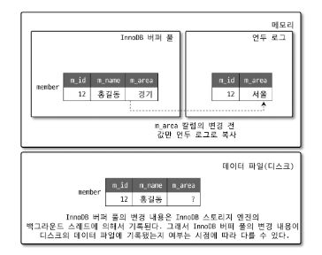
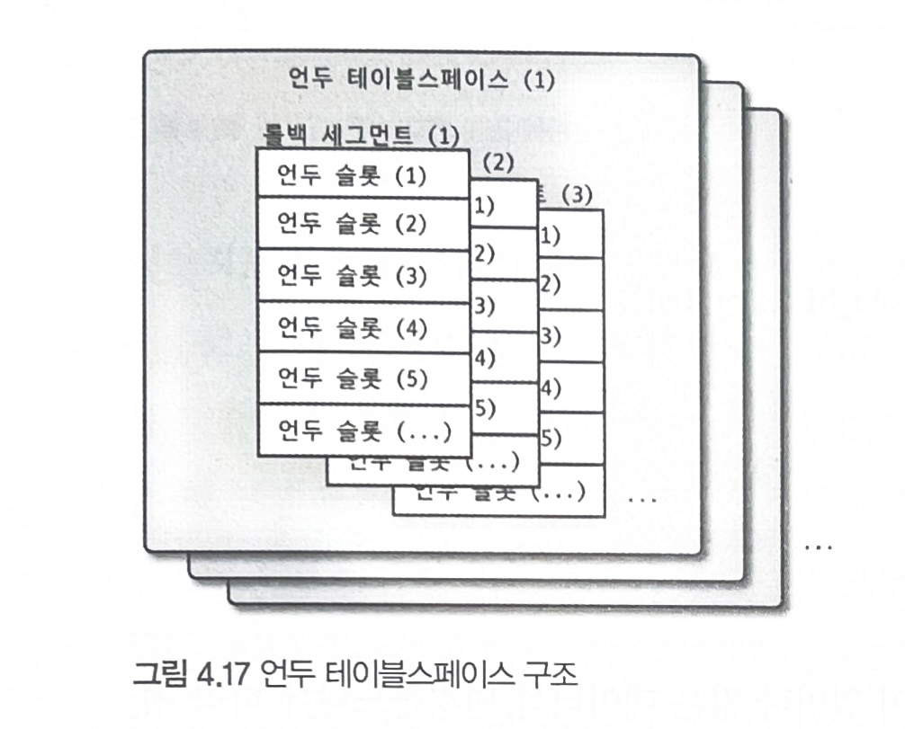
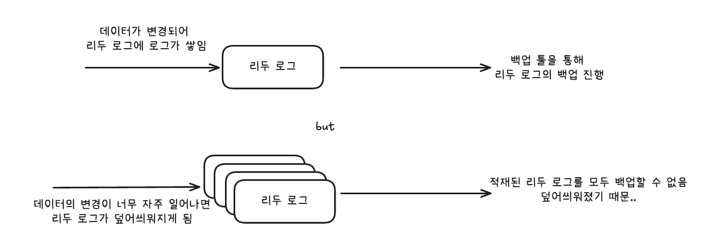
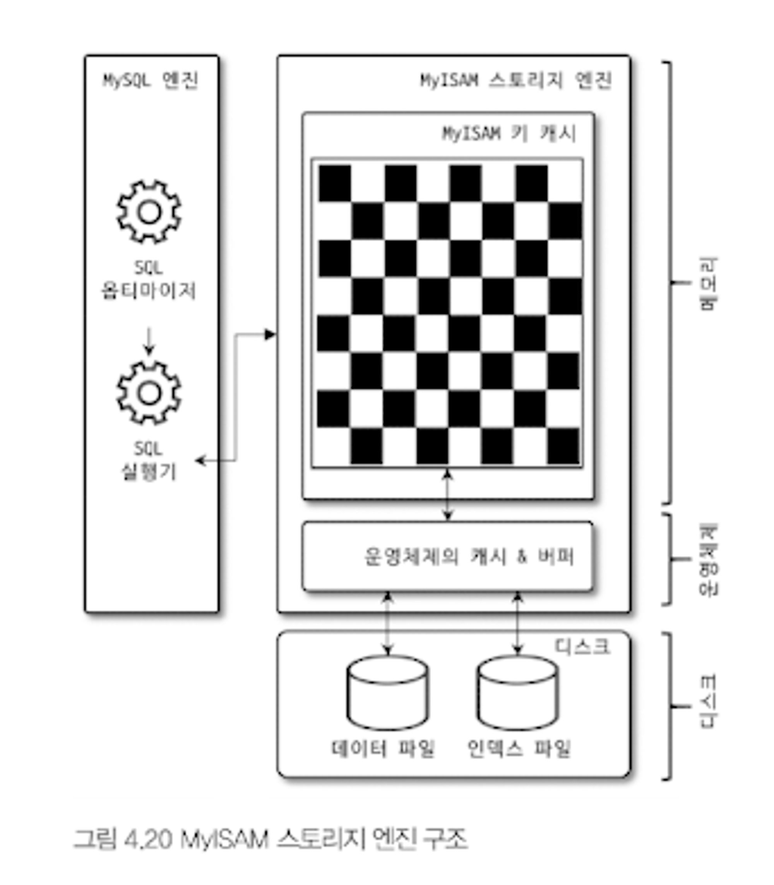

## 4.2.8 Double Write Buffer
### 문제 상황 : 파셜 페이지 or 톤 페이지
- 리두 로그는 페이지의 변경된 내용만 기록
- 이로 인해 스토리지 엔진에서 디스크 파일로 동기화할 때 일부만 기록되는 문제가 발생하면 복구할 수 없음
- 하드웨어 오작동 or 시스템의 비정상 종료에 의해 발생

### 해결방법 : Double Write Buffer
- 이러한 문제를 해결하기 위해 Double Write Buffer기법을 사용
- InnoDB 스토리지 엔진의 더티 페이지를 디스크로 플러시 할 때, 기록될 더티 페이지들을 묶어 한 번의 디스크 쓰기로 시스템 테이블스페이스의 DoubleWriter 버퍼에 기록
- 그 후, 버퍼 풀의 더티페이지와 디스크 동기화 진행
> ⭐️ 요약하자면, 동기화하기 전에 더티페이지를 모아 DoubleWriter 버퍼에 기록

- 더티 페이지가 디스크에 정상적으로 기록되면 DoubleWriter 버퍼는 쓸모없음
- 만약, 비정상종료로 인해 일부만 디스크에 반영되었을 때, DoubleWriter가 기능함
> ⭐️ ️Double Write Buffer는 일부만 디스크에 반영된 상황에서 어떻게 동작할까?
> 1. InnoDB 스토리지 엔진 재시작 시, Double Writer Buffer와 데이터 파일들의 페이지를 비교
> 2. 이때 일부만 데이터 파일에 반영이 되었다면 Double Writer Buffer와 데이터 파일은 불일치 할 것
> 3. 일치하지 않는다면, Double Writer Buffer를 데이터 파일로 복사 진행

- 위 방식으로 디스크에 일부만 반영된 것을 해결할 수 있음
- Double Write Buffer를 사용할 지는 `innodb_doublewriter` 시스템 변수로 제어 가능

> ⭐️ Double Writer Buffer에 더티 페이지를 **묶어** 기록하는 이유
> - 순차IO로 더티페이지들을 읽어올 수 있으므로 `하드디스크`를 저장소로 사용할 때 부담이 없음
> - But, `SSD`환경에서는 순차IO와 랜덤IO 비용이 비슷하기때문에 부담이 조금 있음


## 4.2.9 언두 로그
- InnoDB 스토리지 엔진에서, 트랜잭션 및 격리 수준을 보장하기 위한 로그

- 데이터 변경 시 (INSERT, UPDATE, DELETE), 변경 전의 데이터를 별도로 저장한다.

### 4.2.9.1 언두 로그 모니터링

### 언두 로그의 사용처
1. 트랜잭션 보장
- 트랜잭션이 롤백되면 이전 버전의 데이터로 돌아가야한다. 이때 언두 로그의 이전 데이터를 통해 복구가 진행된다.

2. 격리 수준 보장
- 격리 수준에 따라 변경 중인 레코드에 대해 변경된 값을 읽지 않고 언두 로그의 이전 버전의 데이터를 반환 (MVCC)
- 즉, `READ UNCOMMITED` 격리수준에서 언두 로그의 데이터를 읽어 조회를 진행

### MySQL 5.5 이전 언두 로그의 문제점
1. 한 번 증가한 언두 로그는 줄어들지 않았음
- 100GB의 테이블 데이터를 삭제했을 때, 언두 로그에 삭제되기 전의 값이 저장됨
- 즉, 언두 로그의 크기는 100GB가 되고 줄어들지 못함

2. 트랜잭션이 오랫동안 실행 중일 때 언두 로그의 크기가 커짐
- 특정 트랜잭션이 커밋되지 못하고 계속 실행 중 상태일 수 있음
- 도중에 다른 트랜잭션이 끝나더라도 해당 트랜잭션의 언두로그는 삭제되지 않음
- 즉, 닫히지 않은 트랜잭션 사이에 발생하는 트랜잭션의 언두로그는 삭제되지 않고 계속 쌓이게 됨

- MySQL 8.0 이후로 이러한 언두 로그 문제가 해결됨

- 언두 로그 확인 쿼리
```sql
SHOW ENGINE INNODB STATUS \G
```


>  ⭐️ INSERT 문장으로의 언두 로그와 UPDATE, DELETE 문장으로의 언두 로그를 별도로 관리
> - UPDATE, DELETE는 MVCC에서 사용되지만,
> - INSERT는 MVCC에서 사용되지 않고 데이터 복구에서만 사용되기 때문


### 4.2.9.2 언두 테이블스페이스 관리
- 언두 테이블스페이스 : 언두 로그가 저장된는 공간

#### MySQL 5.6 이전
- 모든 언두 로그가 시스템 테이블스페이스에 저장됨 (ibdata.ibd)
- 이 구조의 단점은 서버가 초기화될 때 생성되므로 확장이 어려움

#### MySQL 5.6
- `innodb_undo_tablespaces` 시스템 변수 도입 : 해당 값이 2보다 크면 언두 로그를 시스템 테이블스페이스에 저장하지 않음
- 해당 값을 0으로 설정하면 언두 로그가 시스템 테이블스페이스에 저장됨
- 별도의 로그 파일을 통해 저장

#### MySQL 8.0
- `innodb_undo_tablesapces`가 deprecated됨
- 이제 기본적으로 언두로그는 항상 별도 로그 파일에 기록됨



- 하나의 언두 테이블스페이스는 1 ~ 128개의 롤백 세그먼트를 가짐
- 한 개의 롤백 세그먼트는 1개 이상의 언두 슬롯을 가짐
> 언두 테이블스페이스 > 롤백 세그먼트 > 언두 슬롯

- 언두 슬롯 개수 = InnoDB 페이지 크기 / 16Bytes
- 즉, 언두 슬롯의 크기는 16Bytes이다.
- 하나의 트랜잭션에서 대략 언두 슬롯을 2개 사용
- 즉, 동시에 실행할 수 있는 트랜잭션의 개수는 전체 언두 슬롯 개수에서 2를 나눈 값
> - 하나의 롤백 세그먼트에서의 언두 슬롯 개수 : 16KB / 16Bytes = 1,000
> - 언두 테이블스페이스에서의 언두 슬롯 개수 : 1,000 * 128 = 128,000
> - 트랜잭션 개수 (56,000) = 전체 언두 슬롯 개수 (128,000) / 2
> - 책에서는 언두 테이블스페이스가 2개인 경우로 가정하여 13만 정도가 나왔으나, 위 계산에서는 언두 테이블스페이스가 1개인 것으로 가정

- 만약 어두 로그 슬롯이 부족하다면, 트랜잭션을 시작할 수 없음
- 하지만 기본값으로 만 개의 단위의 트랜잭션을 실행할 수 있으므로 크게 고려 X
- `CREATE UNDO TABLESPACE`, `DROP TABLESPACE`를 통해 언두 테이블스페이스를 동적으로 추가 및 삭제 가능

> 언두 테이블스페이스가 과도하게 공간 할당이 되었다면, 운영체제에 반납 가능
> 1. 자동모드
> - `innodb_undo_log_truncate` 시스템 변수가 1일 때만 동작됨
> - 트랜잭션이 커밋되면 더 이상 언두 로그의 데이터는 불필요해짐
> - 이때 퍼지 스레드가 주기적으로 불필요해진 언두 로그를 삭제
> - `innodb_purge_rseg_truncate_frequency` 시스템 변수 값을 조정하여 작업 주기를 조정할 수 있음
> 
> 2. 수동모드
> - `innodb_undo_log_truncate` 시스템 변수가 0일 때만 동작됨
> -  언두 테이블스페이스를 비활성화하고 퍼지 스레드로하여금 언두 테이블스페이스의 불필요한 공간을 운영체제로 반납
> - 반납 후, 언두 테이블스페이스를 다시 활성화


## 4.2.10 체인지 버퍼
#### 체인지 버퍼의 필요성
- 레코드가 추가되거나 삭제될 때, 디스크의 데이터 파일 뿐 아니라 해당 테이블에 포함된 인덱스 또한 수정해야함
- 인덱스를 수정하는 작업은 많은 자원을 소모한다. (랜덤 IO)
- 이를 보완하기 위해, 인덱스가 버퍼 풀에 있지 않고 디스크에 있어 읽어와야할 때, 임시 공간에 저장한 후 사용자에게 결과를 바로 반환하는 방식 채택
- 이때 임시 공간을 `체인지 버퍼`라고 함

#### 머지 스레드
- 이렇게 체인지 버퍼에 저장된 인덱스 페이지는 백그라운드 스레드인 머지 스레드를 통해 디스크로 병합된다.
- MySQL 5.5 이전에는 INSERT작업만 가능했지만,
- MySQL 8.0 이후부터는 INSERT, DELETE, UPDATE로 인한 인덱스 변경에 해대서도 버퍼링이 가능해짐
- `innodb_change_buffering`을 통해 작업의 종류별로 체인지 버퍼를 활성 가능
- `all`, `none`, `inserts`, `deletes`, `changes`, `purges`와 같은 작업 종류 별로 체인지 버퍼 사용 여부를 제어할 수 있음

#### 체인지 버퍼 사이즈 조절
- 체인지 버퍼는 InnoDB 버퍼 풀의 25%의 메모리 공간을 사용할 수 있음 (최대 50%)
- INSERT, UPDATE가 빈번히 발생한다면 체인지 버퍼를 늘리면 좋음
- `innodb_change_buffer_max_size` 시스템 변수를 통해 조절 가능


## 4.2.11 리두 로그 및 로그 버퍼
- 리두 로그는 ACID에서 D(영속성)과 관련있음
- MySQL서버가 비정상적으로 종료되었을 때, 데이터 파일에 기록되지 못한 데이터를 잃지 않게 해줌
- MySQL을 포함한 대부분의 데이터베이스는 데이터 변경 내용을 로그에 먼저 기록함
- 이때 변경된 데이터를 기록하는 건 큰 비용이 필요
- 이를 막기 위해 쓰기 비용이 낮은 리두 로그 사용하며, 비정상 종료가 발생하면 리두 로그를 통해 서버 종료 전의 상태로 되돌림
- 이때 성능도 고려해야하므로 해당 리두 로그를 버퍼링해주는 로그 버퍼도 존재한다.

#### MySQL가 비정상 종료 되는 경우
- MysQL 서버가 비정상 졸료되는 경우 두 가지의 데이터 불일치가 발생할 수 있다.
1. 커밋되었지만 데이터 파일에 기록되지 않은 데이터 
- 이는 리두 로그에 저장된 데이터를 디스크 파일에 반영하여 해결한다.

2. 롤백되었지만 디스크에 기록된 데이터
- 이 경우는 언두 로그의 내용을 가져와 데이터 파일에 반영하여 해결한다.
- 이때 디스크에 모든 데이터가 반영되었는지, 아니면 중간만 반영되었는지 파악하기 위해 리두 로그도 사용함

#### 리두 로그를 디스크에 반영하는 주기
- 데이터베이스의 리두 로그를 트랜잭션 커밋되는 즉시 디스크에 반영하는 것이 이상적
- 이유는 서버가 다운되었을 때, 가장 최신에 리두 로그가 반영된 시점으로 복구되기 때문
- 하지만 리두 로그를 디스크에 작성하는 작업은 많은 리소스를 소모함
- 이에 `innodb_flush_log_at_trx_commit`이라는 시스템 변수를 통해 리두 로그의 디스크 반영 주기를 설정할 수 있음

> #### `innodb_flush_log_at_trx_commit` 시스템 변수
> 1. 0 : 0.1초에 한 번씩 리두 로그를 디스크로 기록됨
> 2. 1 : 매번 트랜잭션이 커밋될 때마다 디스크로 기록됨
> 3. 2 : 매번 트랜잭션이 커밋될 때마다 디스크로 기록, but 실질적 동기화는 1초에 한 번 실행됨
> 
> > 여기서 트랜잭션이 일단 커밋되면 해당 트랜잭션에서 변경한 데이터가 사라질 수 있다....? 무슨 말인지 잘 모르겠네요ㅜ

#### 리두 로그 파일 크기
- 리두 로그 파일들의 크기는 InnoDB 버퍼 풀의 효율을 결정함
- `innodb_log_file_size`시스템 변수를 통해 리두 로그 파일의 크기를 결정함
- `innodb_log_files_in_group` 시스템 변수를 통해 리두 로그 파일의 개수를 결정
> 즉, `innodb_log_file_size` x `innodb_log_files_in_group`은 전체 리두 로그 파일의 크기

#### 로그 버퍼
- 이때 적절한 리두 로그의 크기여야 버퍼 풀에서 큰 부담을 가지지 않고 리두 파일을 디스크에 반영할 수 있음
- 하지만 사용량이 큰 경우, ACID를 해치지 않는 선에서 리두 로그에 대한 버퍼링을 진행 -> `로그 버퍼`
- 기본값은 16MB, 즉, 대략 1초에 한 번씩 16MB정도의 리두 로그가 디스크로 반영된다는 의미..?

> `ACID`는 트랜잭션의 무결성을 보장하기 위한 4가지 요소
> 1. Atomic : 트랜잭션은 원자성 작업으로 진행되어야함
> 2. Consistent : 트랜잭션 전후로 모든 제약조건을 만족해야함
> 3. `Isolation` : 여러 트랜잭션이 실행되어도 각각이 독립적으로 실행된 것 처럼 보여야함
> 4. `Durable` : 한 번 저장된 데이터는 유지되어야 함

### 4.2.11.1 리두 로그 아카이빙
- MySQL 8.0부터 리두 로그를 아키이빙 할 수 있는 기능 추가됨

#### 리두 로그 아키이빙의 필요성
- 백업 툴을 통해 InnoDB 스토리지 엔진의 리두 로그를 추적하며 새로 추가된 로그를 복사할 수 있다.
- 이때 만약 데이터 변경이 자주 일어나면, 리두 로그가 적재되는 과정에서 복사되기도 전에 덮어씌어질 수 있음

- 즉, 백업이 실패됨
- 이때 리두 로그 아카이빙을 통해 리두 로그가 덮어씌어진다해도 백업이 실패하지 않게 해줌

#### 리두 로그 아키이빙할 디렉토리 설정
1. 사용자가 직접 리두 로그를 저장할 디렉토리를 `innodb_redo_log_archive_dirs`시스템 변수에 설정해야함
```sql
SET GLOBAL innodb_redo_log_archive_dirs='backup:/var/log/mysql/mysql_redo_archive';
```
2. `innodb_redo_log_archive_start`사용자 정의 함수를 실행한다.
```sql
DO innodb_redo_log_archive_start('backup')
```
- 이때 첫 번째 파라미터에 리두 로그를 아카이빙할 디렉토리에 대한 레이블이다.
- 두 번째 파라미터는 설정한 디렉토리의 서브 디렉토리의 이름이다. (optional)

### 4.2.11.2 리두 로그 활성화 및 비활성화
- MySQL8.0 이전까지는 수동으로 리두 로그를 비활성화하는 방법이 없었음
- MySQL8.0 이후부터는 수동으로 활성화 및 비활성화가 가능해짐

```sql
ALTER INSTANCE DISABLE INNODB REDO_LOG;
ALTER INSTANCE ENABLE INNODB REDO_LOG;
```

- `Innodb_redo_log_enabled`를 통해 리두 로그의 활성화상태를 확인 가능

- 리두 로그를 비활성화하는건 대량의 데이터를 한 번에 적재하는 경우 사용된다.
- 이때 리두 로그를 비활성화할 때 해당 시점 이후의 데이터들은 복구할 수 없으므로 주의해야한다.

## 4.2.12 어댑티브 해시 인덱스
- 사용자가 수동으로 생성하는 인덱스가 아닌, InnoDB 스토리지 엔진에서 사용자가 자주 사용하는 데이터에 대해 자동으로 생성되는 인덱스이다.
- `innodb_adaptive_hash_index`를 통해 활성화 혹은 비활성화 할 수 있다.
- 디스크의 세컨더리 인덱스에서 값을 찾는 과정은 매우 빠르게 일어나지만 검색하는 시간이 존재한다.
- 인덱스를 검색하는 시간을 줄이기 위한 기능으로 어댑티브 해시 인덱스가 도입되었다.
- InnoDB 스토리지 엔진은 자주 읽히는 페이지에 대해 해시 인덱스를 만든다.
- 이후 필요할 때마다 어댑티브 해시 인덱스를 검색하여 데이터를 찾는다.
- 이를 통해 인덱스를 검색할 필요 없이 해시 인덱스를 통해 InnoDB 버퍼 풀 내의 데이터를 빠르게 반환할 수 있고, CPU의 부담 또한 줄어든다.

### 해시 인덱스의 구조
- {인덱스 키 값, 데이터 페이지 주소}로 관리됨
- 이때 인덱스 키 값은 {B-Tree 인덱스 ID, B-Tree 인덱스 실제 키 값}으로 이루어져 있다.
> #### 해시 인덱스 vs B-Tree 인덱스
> 1. 해시 인덱스
> - InnoDB에서사용하는 자주 사용되는 페이지에 대해 생성한 인덱스
> 2. B-Tree 인덱스
> - 디스크에서 데이터를 빨리 찾을 수 있도록 B-Tree의 자료구조를 가지는 인덱스
- 해시 인덱스의 키 값에 B-Tree 인덱스 ID가 들어간 이유는 하나의 어댑티브 해시 인덱스에서 여러 개의 B-Tree 인덱스를 참조하기 때문
- 이때 데이터 페이지 주소는 InnoDB 버퍼 풀에 로딩된 페이지의 주소
- 즉, 버퍼 풀에서 페이지 주소가 사라지면 어댑티브 해시 인덱스에서도 삭제됨

#### 어댑티브 해시 인덱스를 사용해도 도움이 되지 않는 경우
1. 디스크 읽기가 많은 경우
2. 조인, Like 패턴 검색이 많은 경우
3. 매우 큰 데이터를 가진 테이블의 레코드를 폭넓게 읽는 경우

#### 어댑티브 해시 인덱스를 사용하면 좋은 경우
1. 디스크의 데이터가 버퍼 풀의 크기와 비슷한 경우
2. 동등 조건 검색이 많은 경우
3. 쿼리가 일부 데이터에서만 집중되는 경우

- 즉, 데이터를 디스크에서 읽어오는 연산이 많다면 어댑티브 해시 인덱스는 도움이 되지 않을 것
- 또한, 버퍼 풀에 데이터가 삭제되 해시 인덱스에서도 값이 삭제되어야한다. 이는 많은 리소스를 소비하는 작업이다.
- MySQL에서 어댑티브 해시 인덱스는 기본으로 활성화 되어있다.


## InnoDB, MyISAM, MEMORY 스토리지 엔진 비교
- MySQL 8.0부터는 MyISAM, MEMORY 스토리지 엔진에 대한 장점이 없음
- `MEMORY` 엔진 또한 동시 처리 성능에 있어 `InnoDB`보다 떨어짐


---

# MyISAM 스토리지 엔진 아키텍처

- MyISAM 스토리지 엔진에 대한 아키텍처로 키 캐시, 운영체제 캐시 및 버퍼 등이 있다.

## 키 캐시
- InnoDB 버퍼 풀과 비슷한 역할을 하는 키 캐시다.
- 인덱스만 대상으로 캐싱을 진행 & 인덱스의 디스크 쓰기 작업에만 부분적 버퍼링을 진행함
> 키 캐시 히트율 = 100 - (key_reads / key_reads_requests * 100)

- 키 캐시를 사용할 때 키 캐시 히트율을 99%이상으로 유지하도록 권장함

## 운영체제의 캐시 및 버퍼
- MyISAM 테이블에 데이터에 대해서 디스크의 IO연산으로부터 캐시 혹은 버퍼링 기능을 제공하지 않음
- 이에 운영체제 자체의 디스크 읽기에 대한 캐싱, 버퍼링 기능에 의존함

## 데이터 파일과 프라이머리 키(인덱스) 구조
- MyISAM의 테이블은 프라이머리 키로 클러스터링되어있지 않고, INSERT되는 순서대로 데이터를 저장함.
- 저장되는 레코드는 `ROWID`라는 주소값을 가짐
- 이때 인덱스에 대해 키값으로 ROWID를 사용한다.

> #### 고정길이 ROWID
> MAX_ROWS를 통해 최대로 가질 수 있는 레코드가 한정된 테이블을 생성
> #### 가변길이 ROWID
> 2바이트부터 7바이트까지의 ROWID를 제공<br>
> 테이블 최대 크기는 256TB

---

# MySQL 로그 파일
- 로그 파일을 통해 MYSQL상태나, 부하를 일으키는 원인을 쉽게 파악 가능

## 에러 로그 파일
- 에러, 경고 메세지가 출력되는 로그 파일
- 설정파일 (my.conf)에서 `log_error`라는 파라미터의 경로에 생성됨

### MySQL이 시작하는 과정에서의 에러 메시지
- MySQL서버가 정상적으로 작동하고, 변경한 파라미터에 대한 에러·경고성 메세지가 없는 경우 정상적으로 작동된 것으로 판단
- 그렇지 않고 특정 변수가 무시된 경우 MySQL서버에서 해당 에러 메세지를 출력함

### 마지막으로 종료할 때 비정상적으로 종료된 경우
- InnoDB에 경우 비정상적으로 종료된 경우 트랜잭션을 정리하고 재처리하는 작업을 진행함
- 해당 작업에 대한 간단한 메세지 출력됨
- 만약 복구되지 못한 경우 다른 에러 메세지가 출력

### 쿼리 처리 도중 발생하는 에러 메시지
- 쿼리 도중 발생하는 에러는 사전 예방이 어려움
- 주기적으로 에러로그를 확인해야함

### 비정상적으로 종료된 커넥션 메시지
- 클라이언트에서의 요청이 정상적으로 종료되지 못하는 경우
- 보통 `max_connect_errors`값이 낮게 설정된 것이 원인

### InnoDB 모니터링 또는 상태 조회 명령 메시지
- InnoDB의 정보를 조회하는 명령은 많은 양의 데이터를 에러 로그 파일에 기록함
- 모니터링 활성화를 사용 완료한 후, 비활성화하는걸 추천

### MySQL의 종료 메시지
- MySQL이 자동으로 꺼지거나, 재시작하는 경우가 존재
- 반드시 에러 메세지를 확인해야함

## 제너럴 쿼리 로그 파일
- MySQL에서 실행 중인 쿼리에 대한 목록을 확인할 수 있음
- 이때 쿼리 로그를 활성화 한 후, 로그파일로 기록할 수 있음

## 슬로우 쿼리 로그
- `long_query_time` 시스템 변수 이상의 시간이 소요된 쿼리에 대해 슬로우 쿼리 로그라고 부름
- 에러가 아닌, 정상적으로 실행되었지만 오래 걸린 쿼리
- 슬로우 쿼리만 모인 슬로우 로크 쿼리 로그 파일은 스토리지 엔진마다 달라 혼란스러울 수 있음
- 이에 `Percona`에서 개발한 `Percona Toolkit`의 `pt-query-digest` 스크립트를 통해 처리 성능 별로 쿼리를 정렬해서 확인 가능
> ### Percona Toolkit - pt-query-digest
> [pt-query-digest - MySQL slowquery 사용법](https://jhdatabase.tistory.com/entry/pt-query-digest-Mysql-slowquery-%EB%B6%84%EC%84%9D)
> ```
> brew install percona-toolkit
> ```
> 이에 슬로우 쿼리 로그 파일에 대해 분석하고 싶었으나 `slow_query_log`가 OFF 되어있었음...
> ```sql
> SHOW VARIABLES LIKE 'slow_query_log';
> ```
> 를 통해 슬로우 쿼리 로그 기록 여부 확인 가능 <br>
> 꺼져잇다면..
> ```sql
> SET GLOBAL slow_query_log = ON;
> ```
> 로 ON 가능

