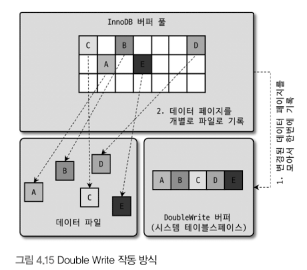
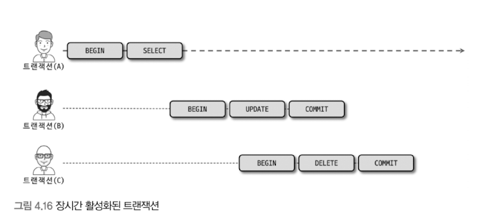
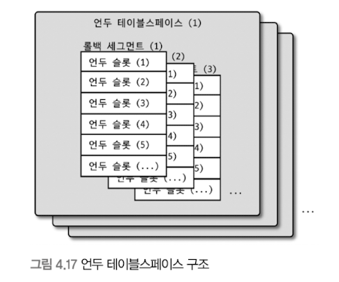
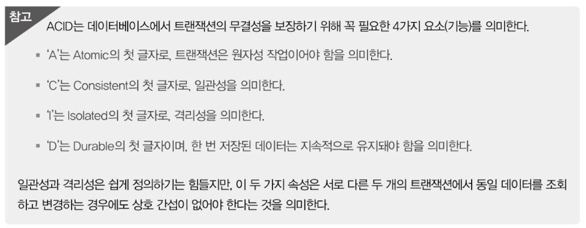
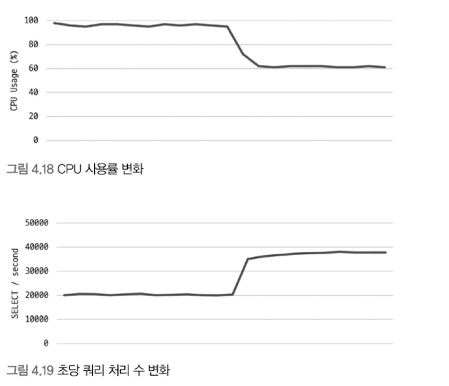
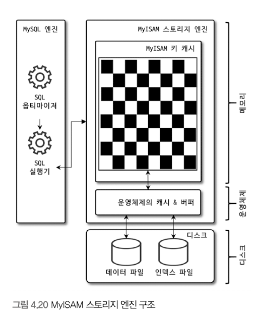

## 4.2.8 Double Write Buffer

- InnoDB 스토리지 엔진의 리두 로그는 리두 로그 공간의 낭비를 막기 위해 페이지의 변경된 내용만 기록한다.
    - 이로 인해 InnoDB의 스토리지 엔진에서 더티 페이지를 디스크 파일로 플러시할 때 일부만 기록되는 문제가 발생하면 그 페이지의 내용은 복구할 수 없을 수도 있다.
    - 이렇게 페이지가 일부만 기록되는 현상을 파셜 페이지 또는 톤 페이지라고 하는데, 이런 현상을 하드웨어의 오작동이나 시스템의 비정상 종료 등으로 발생할 수 있다.
- InnoDB는 Double-Write 기법을 활용해 파셜 페이지, 톤 페이지 현상을 방지한다.
    
    
    
    - InnoDB에서 ‘A’~’E’까지의 더티 페이지를 디스크로 플러시한다고 가정하자.
    - InnoDB 스토리지 엔진은 실제 데이터 파일에 변경 내용을 기록하기 **전**에 ‘A’~’E’까지의 더티 페이지를 우선 묶어서 한 번의 디스크 쓰기로 시스템 테이블스페이스의 DoubleWrite 버퍼에 기록한다.
    - 그리고 InnoDB 스토리지 엔진은 각 더티 페이지를 파일의 적당한 위치에 하나씩 랜덤으로 쓰기를 실행한다.
    - DoubleWrite 버퍼 공간에 기록된 변경 내용은 이제 더 이상 필요가 없어진다. 따라서 이 내용은 실제 데이터 파일의 쓰기가 중간에 실패할 때만 원래의 목적으로 사용된다.
    - ‘A’, ‘B’ 페이지는 정상 기록 됐지만 ‘C’ 페이지가 기록되는 도중에 운영체제가 비정상적으로 종료됐다고 가정해보자.
    - 그러면 InnoDB 스토리지 엔진은 재시작될 때 항상 DoubleWrite 버퍼의 내용과 데이터 파일의 페이지들을 모두 비교해서 다른 내용을 담고 있는 페이지가 있으면 DoubleWrite 버퍼의 내용을 데이터 파일의 페이지로 복사한다.
    - DoubleWrite 기능을 사용할 지 여부는 `innodb_doublewrite` 시스템 변수로 제어할 수 있따.
- DoubleWrite 버퍼는 데이터의 안정성을 위해 자주 사용된다.
- Platter이 회전하는 저장 시스템에서는 별로 부담이 안되지만(예. HDD), 랜덤 IO나 순차 IO의 비용이 비슷한 저장 시스템에서는 상당히 부담스럽다.(예. SSD)
- 데이터의 무결성이 매우 중요한 시스템에서는 DoubleWrite의 활성화를 고려하는 것이 좋다.
- 하지만 만약 데이터베이스 서버의 성능을 위해 InnoDB 리두 로그 동기화 설정을 1이 아닌 값으로 설정했다면 DoubleWrite도 비활성화 하는 것이 좋다.

## 4.2.9 언두 로그

- InnoDB 스토리지 엔진은 트랜잭션과 격리 수준을 보장하기 위해 DML로 변경되기 이전 버전의 데이터를 별도로 백업한다. 이렇게 백업된 데이터를 언두 로그라고 한다.
- 언두 로그가 어떻게 사용될까?
    - **트랜잭션 보장**
        - 트랜잭션이 롤백되면 트랜잭션 도중 변경된 데이터를 변경 전 데이터로 복구해야 하는데, 이때 언두 로그에 백업해둔 이전 버전의 데이터를 이용해 복구한다.
    - **격리 주순 보장**
        - 특정 커넥션에서 데이터를 변경하는 도중에 다른 커넥션에서 데이터를 조회하면 트랜잭션 격리 수준에 맞게 변경 중인 레코드를 읽지 않고 언두 로그에 백업해둔 데이터를 읽어서 반환하기도 한다.

### 4.2.9.1 언두 로그 레코드 모니터링

- 언두 영역은 DML로 변경했을 때 변경되기 전의 데이터(이전 데이터)를 보관하는 곳이다.
    - `UPDATE member SET name='홍길동' WHERE member_id=1;`
    - 트랜잭션 커밋하지 않아도 실제 데이터 파일 내용은 ‘홍길동’으로 변경된다.
    - 그리고 변경되기 전의 값이 ‘벽계수’였다면, 언두 영역에는 ‘벽계수’라는 값이 백업된다.
    - 이 상태에서 사용자가 커밋하면 현재 상태가 그래도 유지, 롤백하면 언두 영역의 백업된 데이터를 다시 데이터 파일로 복구한다.
- 언두 로그의 데이터 용도
    - 트랜잭션의 롤백 대비용
    - 트랜잭션의 격리 수준을 유지하면 높은 동시성 제공
        - 트랜잭션 격리 수준?
            - 동시에 여러 트랜잭션이 데이터를 변경하거나 조회할 때 한 트랜잭션의 작업 내용이 다른 트랜잭션에 어떻게 보일지를 결정하는 기준.
- MySQL 5.5 이전 버전에서는 한 번 증가한 언두 로그 공간은 다시 줄어들지 않았다.
    - 대용량 데이터를 처리하는 트랜잭션과 트랜잭션이 오랫동안 실행될 때 모두 문제가 되었다.
        - 아래 그림은 트랜잭션 B, C는 완료되었어도 먼저 시작한 트랜잭션 A가 아직 활성상태라 B, C의 언두 로그도 삭제되지 못하고 있는 상태이다.
    - 사용자의 실수로 트랜잭션을 완료하지 않고 하루동안 방치할 때 등도 문제가 된다.
    - MySQL 서버를 새로 구축하지 않는 한 언두 로그를 줄일 수 없다.
    
    
    
- MySQL 5.7, MySQL 8.0으로 업그레이드 되면서 언두 로그를 돌아가면서 순차적으로 사용해 디스크 공간을 줄이는 것도 가능하고, 때로는 MySQL 서버가 필요한 시점에 사용 공간을 자동으로 줄여주게 되었다.
    - 하지만 여전히 서비스 중인 MySQL 서버에서 활성 상태의 트랜잭션이 장시간 유지되는 것은 성능상 좋지 않다. 따라서 항상 모니터링 하는 것이 좋다.
    - `SHOW ENGINE INNODB STATUS \G` 를 통해 언두 로그 레코드 건수를 확인할 수 있다.

### 4.2.9.2 언두 테이블스페이스 관리

- 언두 로그가 저장되는 공간을 언두 테이블스페이스라고 한다.
- MySQL 5.6 이전 버전에서는 언두 로그가 모두 시스템 테이블스페이스에 저장됐다.
    - 시스템 테이블스페이스의 언두 로그는 MySQL 서버가 초기화될 때 생성되기 때문에 확장의 한계가 존재했다.
- MySQL 5.6 버전에서는 `innodb_undo_tablespaces` 시스템 변수가 도입됐고, 이 변수를 2보다 큰 값을 설정하면 InnoDB 스토리지 엔진은 더이상 언두 로그를 시스템 테이블스페이스에 저장하지 않고 별도의 언두 로그 파일을 사용한다.
- MySQL 5.6 이후 버전에서 `innodb_undo_tablespaces`를 0으로 설정하면 여전히 언두 로그가 시스템 테이블스페이스에 저장됐다.
- MySQL 8.0으로 업그레이드 되면서 `innodb_undo_tablespaces`는 사라졌다. 언두 로그는 항상 **시스템 테이블스페이스 외부의 별도 로그 파일에 기록되도록 개선됐다.**

- 하나의 언두 테이블스페이스는 1개 이상 128개 이하의 롤백 세그먼트를 가진다.
- 롤백 세그먼트는 1개 이상의 언두 슬롯을 가진다.
- 하나의 롤백 세그먼트는 InnoDB의 페이지 크기를 16바이트로 나눈 값의 개수만큼의 언두 슬롯을 가진다.
- 하나의 트랜잭션이 필요로 하는 언두 슬롯의 개수는 트랜잭션이 실행하는 DML 문장의 특성에 따라 최대 4개까지 언두 스롯을 사용하게 된다.
- 일반적으로는 트랜잭션이 임시 테이블을 사용하지 않으므로 하나의 트랜잭션은 대략 2개 정도의 언두 슬롯을 필요로 한다고 가정하면 된다.
    - `최대 동시 처리 가능한 트랜잭션의 개수 = (InnoDB 페이지 크기) / 16 * (롤백 세그먼트 개수) * (언두 테이블스페이스 개수)`
- 가장 일반적인 설정인 16KB InnoDB에서 기본 설정을 사용하먄 대략 131072개 정도의 트랜잭션이 동시에 처리 가능해진다. 가능한 기본값을 유지하자.
    - 언두 로그 공간이 남는 것은 크게 문제되지 않지만 언두 로그 슬롯이 부족한 경우에는 트랜잭션을 시작할 수 없는 심각한 문제가 발생한다.
    - 언두 로그 관련 시스템 변수를 변경해야 한다면 적절히 필요한 동시 트랜잭션 개수에 맞게 언두 테이블스페이스와 롤백 세그먼트의 개수를 설정해야 한다.
    - MySQL 8.0 버전부터 `CREATE UNDO TABLESPACE`나 `DROP TABLESPACE` 같은 명령으로 새로운 언두 테이블스페이스를 동적으로 추가하고 삭제할 수 있다.
- 언두 테이블스페이스 공간을 필요한 만큼만 남기고 불필요하거나 과도하게 할당된 공간을 운영체제로 반납하는 것을 `Undo tablespace truncate`라고 한다.
    - 자동 모드: 트랜잭션이 데이터를 변경하면 이전 버전의 데이터를 언두 로그로 기록하는데, 트랜잭션이 커밋되면 더 이상 언두 로그에 복사된 이전 값은 불필요해진다. InnoDB 스토리지 엔진의 퍼지 스레드는 주기적으로 깨어나서 언두 로그 공간에서 불필요해진 언두 로그를 삭제하는 작업을 실행하는데, 이 작업을 언두 퍼지라고 한다. MySQL 서버의 `innodb_undo_log_truncate`가 ON으로 설정되면 퍼지 스레드는 주기적으로 언두 로그 파일에서 사용되지 않는 공간을 잘라내고 운영체제로 반납한다. 빈도 수는 `innodb_purge_rseg_truncate_frequency` 값을 조정하면 된다.
    - 수동 모드: `innodb_undo_log_truncate`가 OFF인 경우 언두 테이블스페이스를 비활서오하해서 언두 테이블스페이스가 더이상 사용되지 않도록 하면 퍼지 스레드는 비활성 상태의 언두 테이블스페이스를 찾아서 불필요한 공간을 잘라내고 운영체제로 해당 공간을 반납하게 된다. 반납이 완료되면 언두 테이블스페이스를 다시 활성화한다. 그리고 수동 모드는 언두 테이블스페이스가 최소 3개 이상은 돼야 작동한다.
        - 언두 테이블스페이스 비활성화: `ALTER UNDO TABLESPACE tablespace_name SET INACTIVE;`
        - 퍼지 스레드에 의해 언두 테이블스페이스 공간이 반납되면 다시 활성화: `ALTER UNDO TABLESPACE tablespace_name SET ACTIVE;`

## 4.2.10 체인지 버퍼

- RDBMS에서 INSERT 또는 UPDATE 작업 시 데이터 파일뿐만 아니라 인덱스도 업데이트해야 하는데, 이 인덱스 업데이트 작업을 즉시 디스크로 실행하지 않고 임시 공간에 저장해두고 나중에 반영하여 성능을 향상시키는 데 사용하는 임시 메모리 공간을 체인지 버퍼라고 한다.
- 인덱스 업데이트는 디스크 I/O가 많이 필요하며, 테이블이 크다면 상당한 자원을 소모한다. 체인지 버퍼를 사용하면 인덱스 페이지를 버퍼 풀에 올리지 않고 바로 쓰기 작업을 수행할 수 있다.
- 체인지 버퍼에 임시로 저장된 인덱스 레코드는 백그라운드 스레드인 체인지 버퍼 머지 스레드에 의해 병합된다.
- MySQL 8.0 이후 버전부터 DML로 인해 키를 추가하거나 삭제하는 작업에 대해서 버퍼링이 될수 있도록 개선됐다.
- `innodb_change_buffering` 변수를 통해 작업의 종류 별로 체인지 버퍼를 활성화 할 수 있으며, 사용하지 않을 수도 있게 개선됐다.
    - all: 모든 인덱스 관련 작업(`inserts` + `deletes` + `purges`)을 버퍼링
    - none: 버퍼링 안 함
    - inserts: 인덱스에 새로운 아이템을 추가하는 작업만 버퍼링
    - deletes: 인덱스에서 기존 아이템을 삭제하는 작업(삭제했다는 마크 작업)만 버퍼링
    - changes: 인덱스에 추가하고 삭제하는 작업만 버퍼링(`inserts` + `deletes`)
    - purges: 인덱스 아이템을 영구적으로 삭제하는 작업만 버퍼링(백그라운드 작업)
- 체인지 버퍼는 기본적으로 InnoDB 버퍼 풀로 설정된 메모리 공간의 25%를 사용한다.
    - 필요하다면 버퍼 풀의 50%까지 사용하도록 설정할 수 있다.
    - 체인지 버퍼가 너무 많은 버퍼 풀 공간을 사용하지 못하도록 하거나, 더 많은 버퍼 풀을 사용하게 하고 싶다면 `innodb_change_buffer_max_size` 시스템 변수로 비율을 설정한다.

## 4.2.11 리두 로그 및 로그 버퍼

- 리두 로그는 Durable에 해당하는 영속성과 가장 밀접하게 연관돼 있다.
- 리두 로그는 하드웨어나 소프트웨어 등 여러 가지 문제점으로 인해 MySQL 서버가 비정상적으로 종료됐을 때 데이터 파일에 기록되지 못한 데이터를 잃지 않게 해주는 안전장치다.
- 대부분 DB 서버는 데이터 변경 내용을 로그로 먼저 기록한다.
    - 쓰기 작업을 할 때 디스크 랜덤 액세스가 필요한데, 이는 상대적으로 큰 비용이 필요하다.
    - 이로 인한 성능 저하를 막기 위해 DB 서버는 쓰기 비용이 낮은 자료 구조를 가진 리두 로그를 가지고 있다.
- DB는 ACID도 중요하지만 성능도 중요하기 때문에 데이터 파일뿐만 아니라 리두 로그를 버퍼링할 수 있는 InnoDB 버퍼 풀이나 리두 로그를 버퍼링할 수 있는 로그 버퍼와 같은 자료구조도 가지고 있다.
- MySQL 서버가 비정상 종료되는 경우 InnoDB 스토리지 엔진의 데이터 파일은 다음과 같은 두 가지 종류의 일관되지 않은 데이터를 가질 수 있다.
    - 커밋됐지만 데이터 파일에 기록되지 않은 데이터
    - 롤백됐지만 데이터 파일에 이미 기록된 데이터
- 1번의 경우 리두 로그에 저장된 데이터를 데이터 파일에 다시 복사하기만 하면 된다.
- 2번의 경우 리두 로그로는 해결 불가능하다.
    - 이때는 변경되기 전 데이터를 가진 언두 로그의 내용을 가져와 데이터 파일에 복사하면 된다. 리두 로그는 그 변경이 커밋됐는지, 롤백됐는지, 아니면 트랜잭션의 실행 중간 상태였는 지를 확인한다.
- DB에서 리두 로그는 트랜잭션이 커밋되면 즉시 디스크로 기록되도록 시스템 변수를 설정하는 것을 권장한다.
    - 그래야만 리두 로그를 이용해 장애 직전 시점까지의 복구가 가능해진다.
    - 하지만 이는 많은 부하를 유발한다.
- 그래서 InnoDB 스토리지 엔진에서 리두 로그를 어느 주기로 디스크에 동기화할지를 결정하는 `innodb_flush_log_at_trx_commit` 을 제공한다.
    - `0`: 매 1초마다 리두 로그를 디스크로 쓰고 동기화(sync)를 실행. 커밋 시 디스크 기록은 하지 않음. 최대 성능, 최악의 지속성 (1초간 트랜잭션 데이터 손실 가능)
    - `1 (기본값)`: 매 트랜잭션이 커밋될 때마다 디스크로 기록되고 동기화까지 수행됨. 최대 지속성, 낮은 성능 (데이터 손실 없음)
    - `2`: 매 트랜잭션이 커밋될 때마다 디스크로 기록(write)되지만, 1초에 한 번만 디스크 동기화(sync)가 실행됨. 데이터는 운영체제 메모리에 기록됨. 중간 성능, 중간 지속성 (MySQL/OS 동시 비정상 종료 시 최근 1초 데이터 손실 가능)
    - 0이나 2로 설정된 경우, 비정상 종료 시 최근 1초간의 트랜잭션 데이터가 손실될 수 있다. 데이터의 중요도가 낮아 일부 손실을 감수할 수 있을 때만 1 이외의 값을 고려한다.
- 리두 로그 파일 크기 설정
    - 리두 로그 파일의 전체 크기는 InnoDB 버퍼 풀의 효율성과 관련이 있으므로 신중하게 결정해야 한다.
    - 전체 크기는 `innodb_log_file_size` (로그 파일 1개 크기)와 `innodb_log_files_in_group` (로그 파일 개수) 시스템 변수로 결정된다.
    - `BLOB`이나 `TEXT`와 같이 큰 데이터를 자주 변경하는 경우에는 로그 버퍼 크기(`innodb_log_buffer_size`)를 크게 설정하는 것이 좋다. 기본값은 16MB.

### 4.2.11.1 리두 로그 아카이빙

- 대용량 데이터 백업(MySQL Enterprise Backup, Xtrabackup 등) 시 InnoDB 스토리지 엔진의 리두 로그 내용을 계속 복사하여 백업이 실패하지 않도록 돕는 기능이다.
- 기존에는 백업 중 리두 로그가 덮어쓰여 백업이 실패할 위험이 있었다.
- 사용 방법
    1. 아카이빙된 리두 로그가 저장될 디렉터리를 `innodb_redo_log_archive_dirs` 시스템 변수에 설정한다.
    2. `DO innodb_redo_log_archive_start()` UDF를 실행하여 아카이빙을 시작한다. 이때 디렉터리와 서브 디렉터리 레이블을 인자로 전달할 수 있다.
    3. 아카이빙이 시작된 후에는 연결(세션)을 유지해야 하며, 완료 후에는 `DO innodb_redo_log_archive_stop()` UDF를 호출하여 아카이빙을 정상적으로 종료해야 한다. 아카이빙 파일은 수동으로 삭제해야 한다.

### 4.2.11.2 리두 로그 활성화 및 비활성화

- 데이터 복구를 위해 리두 로그는 항상 활성화되어 있다.
- 데이터 복구가 필요 없거나 대용량 데이터를 한 번에 적재할 때(예: `LOAD DATA` 명령)는 리두 로그를 일시적으로 비활성화하여 적재 시간을 단축할 수 있다.
    - 비활성화: `ALTER INSTANCE DISABLE INNODB REDO_LOG;`
    - 활성화: `ALTER INSTANCE ENABLE INNODB REDO_LOG;`
- **주의 사항**
    - 리두 로그가 비활성화된 상태에서 MySQL 서버가 비정상 종료되면 데이터를 복구할 수 없어 데이터가 손실된다.
    - 데이터 적재 작업 후에는 반드시 리두 로그를 다시 활성화해야 한다.
    - MySQL 서버가 비정상 종료된 채로 리두 로그가 비활성화되면, 서버 재시작 시 복구가 불가능해지므로 `innodb_force_recovery` 시스템 변수를 6으로 설정해야 하는 심각한 상황이 발생할 수 있다.
- 따라서 데이터가 중요하지 않다 하더라도 서비스 도중에는 리두 로그를 활성화 하는 것을 권장한다.

## 4.2.12 어댑티브 해시 인덱스

- 일반적으로 ‘인덱스’라고 하면 이는 테이블에 사용자가 생성해둔 B-Tree 인덱스를 의미한다.
- 하지만 ‘**어댑티브 해시 인덱스’**는 사용자가 수동으로 생성하는 인덱스가 아니라 InnoDB 스토리지 엔진에서 사용자가 자주 요청하는 데이터에 대해 자동으로 생성하는 인덱스다.
    - `innodb_adaptive_hash_index`를 이용해서 어댑티브 해시 인덱스 기능을 활성화 및 비활성화할 수 있다.
- B-Tree 인덱스에서 특정 값을 찾기 위해서는 B-Tree의 루트 노드를 거쳐 브랜치 노드, 그리고 최종적으로 리프 노드까지 찾아가야 원하는 레코드를 읽을 수 있다.
    - 스레드가 많아질 수록 CPU는 엄청난 프로세스 스케줄링을 하게 되고 쿼리의 성능은 저하된다.
- 어댑티브 해시 인덱스는 이러한 B-Tree 검색 시간을 줄여주기 위해 도입된 기능이다. InnoDB 스토리지 엔진은 자주 읽히는 데이터 페이지의 키 값을 이용해 해시 인덱스를 만들고, 필요할 때마다 어댑티브 해시 인덱스를 검색해서 레코드가 저장된 데이터 페이지를 즉시 찾아갈 수 있다. B-Tree를 루트 노드부터 리프 노드까지 찾아가는 비용이 없어지고 그만큼 CPU는 적은 일을 하지만 쿼리의 성능은 빨라진다. 그리고 동시에 더 많은 쿼리를 처리할 수 있게 된다.
- 해시 인덱스는 ‘인덱스 키 값’과 해당 인덱스 키 값이 저장된 ‘데이터 페이지 주소’의 쌍으로 관리된다.
    - 인덱스 키 값: B-Tree 인덱스의 고유번호(ID)와 B-Tree 인덱스의 실제 키 값 조합으로 생성
        - B-Tree 인덱스의 고유번호(ID)가 포함되는 이유는 InnoDB 스토리지 엔진에서 어댑티브 해시 인덱스는 하나만 존재하기 때문이다.
        - 즉, 모든 B-Tree 인덱스에 대한 어댑티브 해시 인덱스가 하나의 해시 인덱스에 저장되며, 특정 키 값이 어느 인덱스에 속한 것인지도 구분해야 하기 때문이다.
    - 데이터 페이지 주소: 실제 키 값이 저장된 데이터 페이지의 메모리 주소, InnoDB 버퍼 풀에 로딩된 페이지 주소를 의미한다.
        - 그래서 어댑티브 해시 인덱스는 버퍼 풀에 올려진 데이터 페이지에 대해서만 관리된다.
- 어댑티브 해시 인덱스가 보여줄 수 있는 성능 효과
    
    
    
    - 처리량은 2배 가까이 늘어났는데 CPU 사용률은 오히려 떨어졌다!
    - InnoDB 내부 잠금 (세마포어)의 횟수도 줄어든다.
- 어댑티브 해시 인덱스의 파티션 기능
    - 내부 잠금(세마포어) 경합을 줄이기 이해 등장.
    - `innodb_adaptive_hash_index_parts` 변수를 이용해 파티션 개수를 변경할 수 있다.
        - 기본값 8개.
- 어댑티브 해시 인덱스가 성능 향상에 크게 도움이 되지 않는 경우
    - 디스크 읽기가 많지 않은 경우
    - 특정 패턴의 쿼리가 많은 경우(조인이나 LIKE 패턴 검색)
    - 매우 큰 데이터를 가진 테이블의 레코드를 폭넓게 읽는 겨웅
- 어댑티브 해시 인덱스가 성능 향상에 크게 도움이 되는 경우
    - 디스크의 데이터가 InnoDB 버퍼 풀 크기와 비슷한 경우(디스크 읽기가 많지 않은 경우)
    - 동등 조건 검색(동등 비교와 IN 연산자)이 많은 경우
    - 쿼리가 데이터 중에서 일부 데이터에만 집중되는 경우
- 어댑티브 해시 인덱스가 우리 서비스 패턴에 맞게 도움이 되는지 아니면 불필요한 오버헤드만 만들고 있는지 판단하는 방법
    - MySQL 서버의 상태 값들을 살펴보는 것
        - 해시 인덱스 히트율과 어댑티브 해시 인덱스가 사용 중인 메모리 공간, 그리고 서버의 CPU 사용량을 종합해서 판단해야 한다.
        - `performance_schema`를 이용해서 어댑티브 해시 인덱스의 메모리 사용량을 확인할 수 있다.

## 4.2.13 InnoDB와 MyISAM, MEMORY 스토리지 엔진 비교

- 과거에는 MyISAM이 기본 스토리지 엔진이었으나, MySQL 5.5 버전부터 InnoDB가 기본 스토리지 엔진으로 채택되었다.
- MySQL 8.0으로 업그레이드되면서 MySQL 서버의 모든 기능이 InnoDB 스토리지 엔진 기반으로 재편되었다.
    - 이전 버전까지 MyISAM을 사용하던 시스템 테이블(예: 사용자 인증 정보, 복제 관련 정보 등)이 모두 InnoDB로 교체되었다.
    - MyISAM 테이블에서만 지원했던 전문 검색(Full-Text Search)이나 공간 좌표 검색(Spatial Search) 기능도 모두 InnoDB를 지원하도록 개선되었다.
- MyISAM 엔진의 기능은 도태되는 상황이며, MySQL 8.0부터는 더 이상 의미 있는 비교 대상이 아니며, 이후 버전에서는 제거될 것으로 예상된다. 즉, 현재 MySQL 서버의 모든 기능을 InnoDB 스토리지 엔진만으로 구현할 수 있게 되었다.
- MEMORY 스토리지 엔진의 한계
    - MEMORY 스토리지 엔진은 이름 때문에 모든 처리를 메모리에서만 수행할 것으로 기대받는 경우가 있지만, 실제로는 동시 처리 성능 면에서 InnoDB 스토리지 엔진을 따라갈 수 없다.
- **성능 저하 요인**
    - **동시성 문제:** MEMORY 엔진은 테이블 수준의 잠금(Table-level locking)을 사용하기 때문에, 동시에 여러 클라이언트가 쿼리를 요청하면 제대로 된 성능을 내지 못한다.
    - **단일 스레드 비교:** 단일 스레드에서 데이터를 읽고 쓴다면 InnoDB보다 빠를 수 있지만, 일반적인 온라인 트랜잭션 처리(OLTP) 환경에서는 동시성 성능이 중요하므로 InnoDB가 더 적합하다.
- **내부 임시 테이블 용도에서의 변화**
    - MySQL 5.7까지는 내부 임시 테이블의 용도로 MEMORY 엔진이 사용되었다.
    - 하지만 MEMORY 엔진은 긴 가변 길이 칼럼을 지원하지 않는 문제가 있어, MySQL 8.0부터는 TempTable 엔진이 내부 임시 테이블의 기본값으로 채택되었다.
    - `internal_tmp_mem_storage_engine` 시스템 변수를 이용해 MEMORY 엔진을 선택할 수는 있지만, 굳이 MEMORY 엔진을 선택해 얻을 수 있는 장점이 사라졌으며, MEMORY 엔진 역시 이후 버전에서는 제거될 것으로 보인다.

# 4.3 MyISAM 스토리지 엔진 아키텍처

## 4.3.1 키 캐시

- InnoDB의 버퍼 풀과 비슷한 역할을 하는게 MyISAM의 키 캐시다.
    - 키 캐시는 인덱스만을 대상으로 작동하며, 인덱스의 디스크 쓰기 작업에 대해서만 부분적으로 버퍼링 역할을 한다.
    - 키 캐시 히트율 = 100 - (Key_reads / Key_read_requests * 100)
        - 위 수식을 통해 키 캐시의 효율성을 확인할 수 있다.
- `Key_reads` : 인덱스를 디스크에서 읽어 들인 횟수를 저장하는 상태 변수
- `Key_read_requests` : 키 캐시로부터 인덱스를 읽은 횟수를 저장하는 상태 변수
- `SHOW GLOBAL STATUS`를 통해 해당 상태 값을 알아볼 수 있다.
- 일반적으로 키 캐시를 이용한 쿼리의 비율을 99% 이상으로 유지하는 것을 권장한다.
    - 히트율이 99% 미만이라면 키 캐시를 조금 더 크게 설정하는 것이 좋다.
    - 운영체제마다 제한된 크기의 메모리가 있는데, 제한 값 이상의 키 캐시를 할당하고 싶다면 키 캐시 이외에 별도의 명명된 키 캐시 공간을 설정해야 한다.
        - `key_buffer_size`를 이용한다.
    - 기본이 아닌 명명된 추가 키 캐시는 어떤 인덱스를 캐시할지 MySQL에 알려줘야 한다.

## 4.3.2 운영체제의 캐시 및 버퍼

- MyISAM 테이블의 데이터에 대해서 디스크로부터의 I/O를 해결해 줄 만한 어떠한 캐시나 버퍼링 기능도 가지고 있지 않다.
- 그래서 MyISAM 테이블의 데이터 읽기나 쓰기 작업은 항상 운영체제의 디스크 읽기 또는 쓰기 작업으로 요청될 수밖에 없다.
    - 물론 대부분의 운영체제에는 디스크로부터 읽고 쓰는 파일에 대한 캐시나 버퍼링 메커니즘을 탑재하고 있기 때문에 MySQL 서버가 요청하는 디스크 읽기 작업을 위해 매번 디스크의 파일을 읽지는 않는다.
- 운영체제의 캐시 공간은 남는 메모리를 사용하는 것이 기본 원칙이다.
    - 따라서 남는 공간이 없으면 캐시 용도로 사용할 수 있는 메모리 공간이 없어진다.
    - 이런 경우에는 MyISAM 테이블의 데이터를 캐시하지 못하며, 결론적으로 MyISAM 테이블에 대한 쿼리 처리가 느려진다.
    - 따라서 MyISAM이 주로 사용되는 MySQL에서는 일반적으로 키 캐시는 최대 물리 메모리의 40% 이상을 넘지 않게 설정하고, 나머지 메모리 공간은 운영체제가 자체적인 파일 시스템을 위한 캐시 공간을 마련할 수 있게 해주는 것이 좋다.

## 4.3.3 데이터 파일과 프라이머리 키(인덱스) 구조

- **InnoDB vs MyISAM 데이터 저장 방식**
    - **InnoDB**
        - 프라이머리 키 기반 클러스터링 인덱스를 사용한다.
        - 프라이머리 키 순서대로 실제 데이터가 저장된다.
    - **MyISAM**
        - 프라이머리 키와 무관하게 Heap 공간처럼 INSERT 순서대로 데이터 파일에 저장한다.
        - 모든 레코드는 고유한 ROWID(물리적 주소) 를 가진다.
        - 프라이머리 키 및 세컨더리 인덱스는 ROWID를 포인터로 사용해 실제 레코드를 찾는다.
- MyISAM 테이블은 레코드 주소를 나타내는 ROWID를 두 가지 방식으로 저장 가능하다.
    - **고정 길이 ROWID (Fixed-length ROWID)**
        - 잘 사용되진 않지만 `MAX_ROWS` 옵션을 설정한 경우 사용한다.
        - 테이블이 가질 수 있는 최대 레코드 수가 고정되므로, ROWID를 4바이트 정수로 관리 가능하다.
        - INSERT 순서 번호가 그대로 ROWID로 사용된다.
        - 사용 조건: MAX_ROWS를 명시하여 레코드 수의 최대값이 확정된 경우
    - **가변 길이 ROWID (Variable-length ROWID)**
        - 일반적으로 MyISAM의 기본 방식.
        - `MAX_ROWS` 옵션이 없다면 ROWID는 시스템 변수 `myisam_data_pointer_size` 로 결정되는 바이트 수 만큼 사용한다.
        - 기본: `myisam_data_pointer_size = 7바이트`
            - 실제 가능한 ROWID는 2바이트 ~ 7바이트 사이에서 결정된다.
            - 첫 번째 바이트는 ROWID 길이 저장용, 나머지는 실제 offset 저장용.
        - 데이터 파일 최대 크기: `myisam_data_pointer_size = 7` → 최대 파일 크기: 256TB
        - 더 큰 테이블 필요 시: `myisam_data_pointer_size = 8` 로 설정 가능 → 최대 64PB 까지 지원.

# 4.4 MySQL 로그 파일

## 4.4.1 에러 로그 파일

- **에러 로그 파일의 위치**
    - MySQL이 실행되는 동안 발생하는 에러나 경고 메시지가 출력되는 파일
    - 위치는 MySQL 설정 파일(`my.cnf`)에서 `log_error` 파라미터로 정의된 경로다.
    - 따로 정의되지 않은 경우, 데이터 디렉터리(`datadir` 파라미터로 설정된 경로)에 `.err` 확장자를 가진 파일로 생성된다.
- **에러 로그의 주요 메시지 유형**
    - **MySQL 시작 과정 및 변수 관련 메시지**
        - MySQL 서버가 비정상적으로 종료된 후 다시 시작되는 경우, 서버는 반드시 에러 로그 파일을 통해 설정 변수의 이름이나 값이 명확하게 적용되었는지 확인해야한다.
        - 정상적으로 시작될 때는 `[mysqlid: ready for connections]` 메시지가 출력된다.
        - 특정 변수가 무시(ignore)되거나, 변수를 인식하지 못하거나, 설정된 파라미터 값 인식이 실패했을 경우 에러 메시지가 출력되며 서버가 시작되지 못하고 종료될 수 있다.
    - **InnoDB 트랜잭션 복구 메시지**
        - InnoDB는 서버가 강제적으로 종료되었을 때 미완료된 트랜잭션을 정리하고 디스크에 기록되지 못한 데이터를 다시 기록하는 복구 작업을 수행한다.
        - 이 과정에 대한 메시지가 출력되며, 간혹 문제가 있어 복구하지 못하면 에러 메시지를 출력하고 MySQL이 다시 종료될 수 있다.
        - 복구 문제 해결이 어려울 경우, `innodb_force_recovery` 파라미터를 0보다 큰 값으로 설정하고 재시작해야 할 수도 있다.
    - **쿼리 처리 도중 발생하는 문제에 대한 에러 메시지**
        - 쿼리 실행 도중 발생하는 문제점은 미리 예측하기 어렵지만, 에러 로그 파일에는 문제가 될 만한 쿼리에 대한 경고 메시지나 에러가 기록된다. 주기적인 에러 로그 검토는 데이터베이스의 숨겨진 문제를 해결하는 데 도움이 된다.
    - **비정상적으로 종료된 커넥션 메시지 (Aborted connection)**
        - 일부 데이터베이스 서버는 로그 파일을 보면 접속이 많이 누적되어 있는 경우가 있는데, 이는 클라이언트 애플리케이션이 접속을 허용하지 않고 강제 종료되었을 때 발생한다.
        - 이런 메시지가 많이 기록되면 클라이언트 프로그램이 MySQL 서버에 접속할 때 발생하는 `Host 'host_name' is blocked`라는 에러를 만나게 될 수 있다.
        - 이 에러는 클라이언트가 접속을 거부당하거나 강제 종료되는 횟수가 `max_connect_errors` 시스템 변수의 값을 넘어서면 발생한다. 이 경우 `max_connect_errors` 값을 증가시켜야 할 수도 있다.
    - **모니터링 또는 상태 조회 명령의 결과 메시지 (`SHOW ENGINE INNODB STATUS` 등)**
        - InnoDB의 테이블 모니터링이나 엔진 상태를 조회하는 명령의 메시지(출력)는 ****에러 로그 파일에 기록된다.
        - InnoDB 모니터링을 활성화 상태로 두고 그대로 두면 에러 로그 파일이 매우 커져 파일 시스템의 공간을 다 써버릴 수도 있으므로, 모니터링 사용 후에는 반드시 비활성화해야 파일이 커지는 것을 막을 수 있다.
    - **MySQL의 종료 메시지**
        - MySQL 서버가 종료되거나 재시작되는 경우, 에러 로그 파일에 마지막으로 출력된 메시지를 확인하여 서버가 종료된 원인을 파악할 수 있다.
        - 만약 `Received SHUTDOWN from user ...` 메시지가 없다면, 서버가 비정상적으로 종료된 것(`Segmentation fault` 등)으로 판단할 수 있다.
        - 세그멘테이션 폴트 등으로 종료된 경우에는 에러 로그 파일에 스택 트레이스 등의 내용이 출력되는데, 이는 MySQL 버그와 연관이 있을 수 있으므로 버전 업그레이드나 회피책(Workaround)을 찾는 것이 최적의 방법이다.

## 4.4.2 제너럴 쿼리 로그 파일(제너럴 로그 파일, General log)

- MySQL 서버에서 실행되는 쿼리로 어떤 것들이 있는 전체 목록을 뽑아서 검토해 볼 떄가 있는데, 이때는 쿼리 로그를 활성화해서 쿼리를 쿼리 로그 파일로 기록하게 한 다음 그 파일을 검토하면 된다.
- 쿼리 로그 파일에는 시간 단위로 실행됐던 쿼리의 내용이 모두 기록된다.
- 슬로우 쿼리 로그와는 조금 다르게 제너럴 쿼리 로그는 실행되기 전에 MySQL이 쿼리 요청을 받으면 바로 기록하기 때문에 쿼리 실행 중에 에러가 발생해도 일단 로그 파일에 기록된다.
- 쿼리 로그 파일의 경로는 `general_log_file` 파라미터에 설정돼 있다.
- `log_output` 파라미터를 통해 쿼리 로그를 파일이 아닌 테이블에 저장하도록 설정할 수도 있다.
    - 이 경우엔 파일이 아닌 테이블을 SQL로 조회해서 검토해야 한다.

## 4.4.3 슬로우 쿼리 로그

- **MySQL 서버의 쿼리 튜닝**
    - 서비스가 적용되기 전에 전체적으로 튜닝하는 경우
        - 모두 튜닝하면 된다.
    - 서비스 운영 중에 MySQL 서버의 전체적인 성능 저하를 검사하거나 정기적인 점검을 위한 튜닝
        - 어떤 쿼리가 문제의 쿼리인지 판단하기가 어렵다.
        - 서비스에서 사용되는 쿼리 중 어떤 쿼리가 문제인지를 판단하는 데 슬로우 쿼리 로그가 도움이 된다.
- 슬로우 쿼리 로그 파일에는 `long_query_time`에 설정한 시간 이상의 시간이 소요된 쿼리가 모두 기록된다.
    - 쿼리가 정상적으로 실행이 완료돼야 슬로우 쿼리 로그에 기록된다.
- `log_output` 옵션을 이용해 슬로우 쿼리 로그를 파일로 기록할지 테이블로 기록할지 선택할 수 있다.
    - **TABLE로 설정**: 제너럴 로그나 슬로우 쿼리 로그를 mysql DB의 테이블에 저장
        - show_log, general_log 테이블은 CSV 스토리지 엔진을 사용하기 떄문에 결국 CSV 파일로 저장하는 것과 동일하게 작동한다.
    - **FILE로 설정**: 로그의 내용을 디스크의 파일로 저장
- **MySQL의 잠금 처리**
    - MySQL 엔진 레벨, 스토리지 엔진 레벨 두 가지 레이어로 처리
        - MyISAM, MEMORY: 별도의 스토리지 엔진 레벨의 잠금을 가지지 않는다.
        - InnoDB: MySQL 엔진 레벨 잠금과 스토리지 엔진 자체 잠금을 가지고 있다.
- 일반적으로 슬로우 쿼리 또는 제너럴 로그 파일의 내용이 상당히 많아서 직접 쿼리를 하나씩 검토하기에는 시간이 너무 많이 걸리거나 어느 쿼리를 집중적으로 튜닝해야 할 지 식별하기가 어려울 수 있다.
    - Percona에서 개발한 Percona Toolkit의 `pt-query-digest` 스크립트를 이용하면 쉽게 빈도나 처리 성능별로 쿼리를 정렬해서 살펴볼 수 있다.
- 로그 파일의 분석이 완료되면 그 결과는 다음과 같이 3개의 그룹으로 나뉘어 저장된다.
    - **슬로우 쿼리 통계**
        - 분석 결과의 최상단에 표시되며, 모든 쿼리를 대상으로 슬로우 쿼리 로그의 실행 시간, 그리고 잠금 대기 시간 등에 대해 평균 및 최소/최대 값을 표시한다.
    - **실행 빈도 및 누적 실행 시간순 랭킹**
        - 각 쿼리별로 응답 시간과 실행 횟수를 보여주는데, `pt-query-digest` 실행 시 `--order-by` 옵션으로 정렬 순서를 변경할 수 있다.
        - `Query ID`는 실행된 쿼리 문장을 정규화해서 만들어진 해시 값을 의미하는데, 일반적으로 같은 모양의 쿼리라면 동일한 `Query ID`를 가지게 된다.
    - **쿼리별 실행 횟수 및 누적 실행 시간 상세 정보**
        - `Query ID`별 쿼리를 쿼리 랭킹에 표시된 순서대로 자세한 내용을 보여준다.
        - 랭킹별 쿼리에서는 대상 테이블에 대해 어떤 쿼리인지만을 표시하는데, 실제 상세한 쿼리 내용은 개별 쿼리의 정보를 확인해보면 된다. 여기서는 쿼리가 얼마나 실행됐는지, 쿼리의 응답 시간에 대한 히스토그램 같은 상세한 내용을 보여준다.