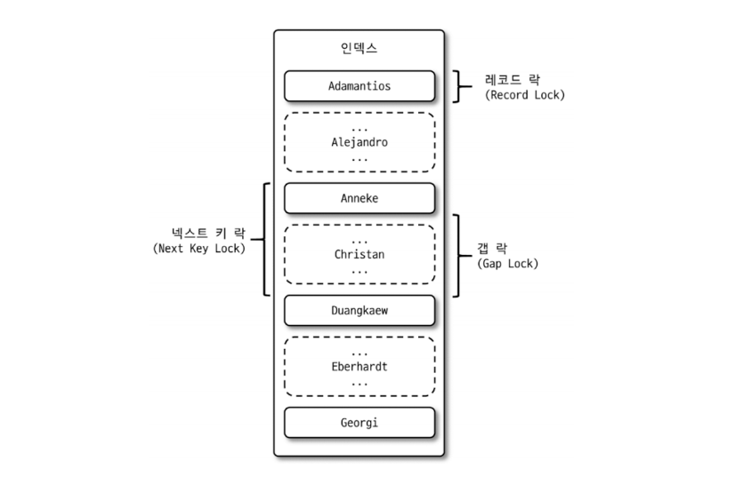
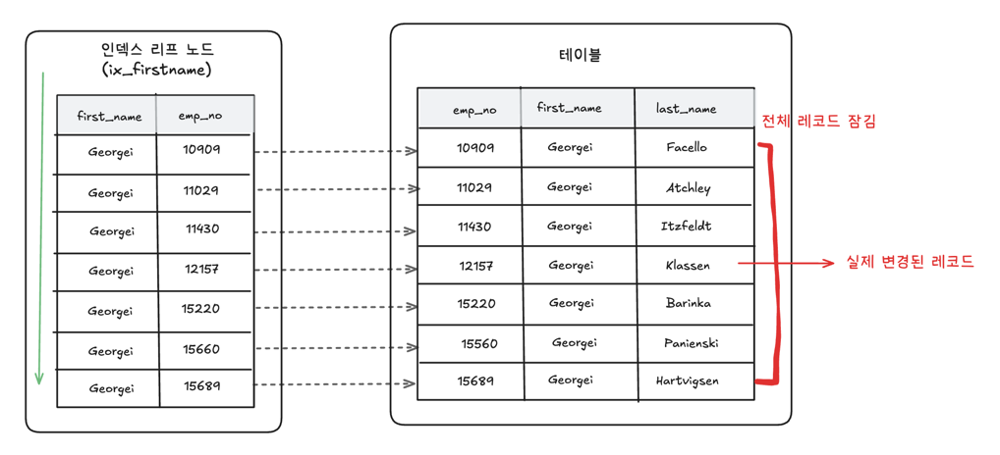
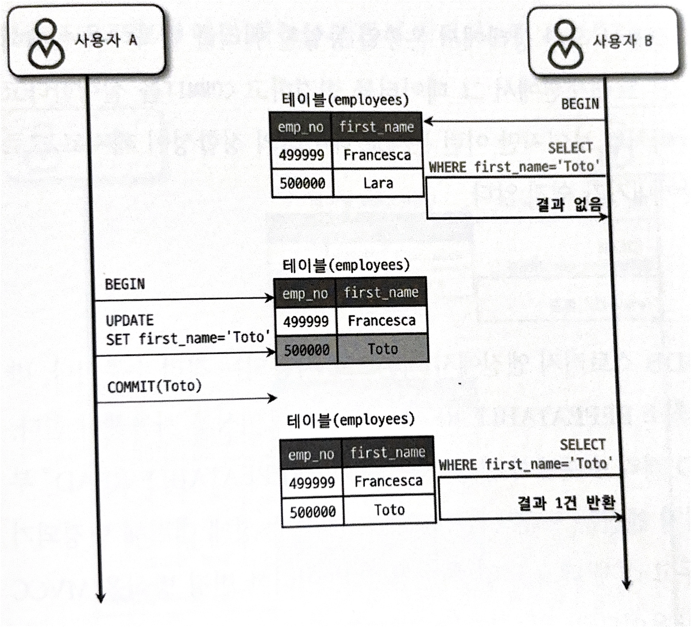
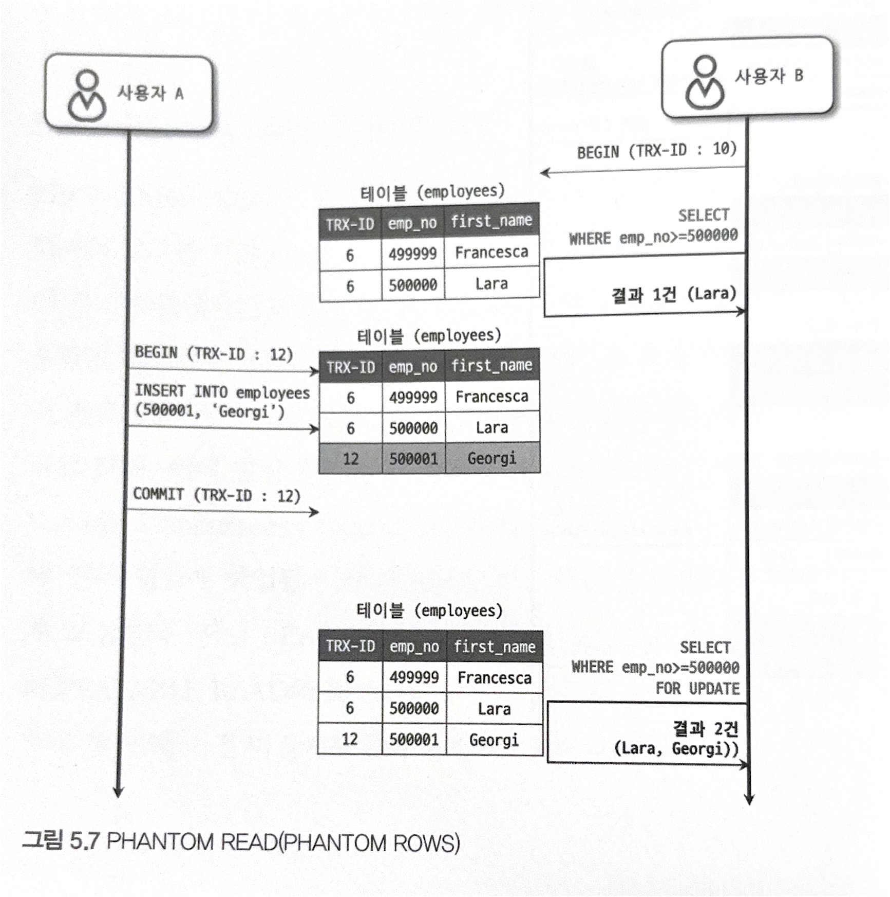

## 5.1 트랜잭션
- 작업의 완전성을 보장해 주는 단위 -> 논리적인 작업 셋을 모두 완벽하게 처리하거나, 처리하지 못할 경우 원 상태로 복구
- 원자성(0 or 1) -> 일부만 적용되는 현상이 발생하지 않도록 함


### 5.1.1 MySQL에서의 트랜잭션
> #### InnoDB vs MyBatis 에서 트랜잭션 차이
> - 테이블 생성 및 테이터 (3) 저장
> ```sql
> mysql> CREATE TABLE tab_myisam (fdpk INT NOT NULL, PRIMARY KEY (fdpk)) ENGINE=MyISAM;
> mysql> CREATE TABLE tab_innodb (fdpk INT NOT NULL, PRIMARY KEY (fdpk)) ENGINE=INNODB;
> 
> mysql> INSERT INTO tab_myisam (fdpk) VALUES (3);
> mysql> INSERT INTO tab_innodb (fdpk) VALUES (3);
> ```
> 
> - 이후 auto-commit을 활성화 한 후 다음 데이터를 저장
> - auto-commit : 트랜잭션을 매번 commit할지 여부 (트랜잭션이 끝나면 무조건 commit됨)
> ```sql
> mysql> SET autocommit=ON;
> 
> mysql> INSERT INTO tab_myisam (fdpk) VALUES (1), (2), (3);
> mysql> INSERT INTO tab_innodb (fdpk) VALUES (1), (2), (3);
> ```
> 
> - 결과
> - 이미 '3'에 대한 데이터가 존재하므로 에러 발생
> ```sql
> mysql> INSERT INTO tab_myisam (fdpk) VALUES (1), (2), (3);
> ERROR 1062 (23000): Duplicate entry '3' for key 'PRIMARY'
> 
> mysql> INSERT INTO tab_innodb (fdpk) VALUES (1), (2), (3);
> ERROR 1062 (23000): Duplicate entry '3' for key 'PRIMARY'
> 
> mysql> SELECT * FROM tab_myisam;
> -> 1, 2, 3
> 
> mysql> SELECT * FROM tab_innodb;
> -> 3
> ```
> 
> - myisam에서는 1, 2, 3이 조회되고,
> - innodb에서는 3만 조회된다.
> #### MyISAM의 경우
> - 1, 2, 3을 순서대로 저장할 때, 1, 2를 저장한 후 3을 저장 시에 에러 발생
> - 이때 INSERT한 1, 2는 그대로 두고 종료됨
> - 이러한 현상 : 부분 업데이트
> - 데이터의 정합성을 맞추는데 걸림돌이 됨
> 
> #### InnoDB의 경우
> - 1, 2, 3을 순서대로 저장할 때도 동일하게 3에서 에러 발생
> - 이때 INSERT한 1, 2까지 롤백됨
> - 즉, 일부가 에러나면 전체를 롤백함
> 
> -> MyISAM 스토리지 엔진에서는 트랜잭션이 적용되지 않음

#### 트랜잭션의 필요성
- 트랜잭션이 없다면 이를 재처리하는 로직이 복잡함
- 어떤 부분이 업데이트되었냐에 따라 분기가 나눠지므로 재처리 작업을 일일히 구현하기 어려움


### 5.1.2 (트랜잭션 적용 시) 주의사항
- 트랜잭션의 범위를 최소한으로 설정하는게 좋음

#### 로직 예시
```text
1) 처리 시작
 -> 데이터베이스 커넥션 생성
 -> 트랜잭션 시작 1️⃣
2) 사용자의 로그인 여부 확인
3) 사용자의 글쓰기 내용의 오류 여부 확인
4) 첨부로 업로드된 파일 확인 및 저장
5) 사용자의 입력 내용을 DBMS에 저장
6) 첨부파일 정보를 DBMS에 저장 3️⃣
7) 저장된 내용 또는 기타 정보를 DBMS에서 조회
8) 게시물 등록에 대한 알림 메일 발송 2️⃣
9) 저장된 내용 또는 기타 정보를 DBMS에 저장
  <- 트랜잭션 종료
  <- 데이터베이스 커텍션 종료
10) 처리 완료
```

- 1️⃣ : 실제로 데이터를 저장하는 작업은 5번부터인데 1번에서 트랜잭션을 시작함
    - 2, 3, 4번을 트랜잭션으로 포함시키에는 불필요함
- 2️⃣ : 네트워크를 통해 원격 서버와 통신하는 과정은 시간이 오래 걸리므로 트랜잭션 내에서 제거햐아함
    - 최악의 경우, 원격 서버가 응답하지 않는 경우, 트랜잭션이 끝나지 않을 수 있음
- 3️⃣ : 5번과 6번은 반드시 원자성으로 수행되어야함 (트랜잭션으로 묶기), 7번은 단순 조회이므로 트랜잭션으로 묶지 않아도 됨

#### 예시 보완
```text
1) 처리 시작
2) 사용자의 로그인 여부 확인
3) 사용자의 글쓰기 내용의 오류 여부 확인
4) 첨부로 업로드된 파일 확인 및 저장
 -> 데이터베이스 커넥션 생성
 -> 트랜잭션 시작
5) 사용자의 입력 내용을 DBMS에 저장
6) 첨부파일 정보를 DBMS에 저장
 <- 트랜잭션 종료 (commit)
7) 저장된 내용 또는 기타 정보를 DBMS에서 조회
8) 게시물 등록에 대한 알림 메일 발송
 -> 트랜잭션 시작
9) 저장된 내용 또는 기타 정보를 DBMS에 저장
 <- 트랜잭션 종료 (commit)
 <- 데이터베이스 커넥션 종료
10) 처리 완료
```

---

## 5.2 MySQL 엔진의 잠금 (= 락)
- MySQL의 잠금은 스토리지 엔진 레벨과 MySQL 엔진 레벨로 나뉨
- **MySQL 엔진** : 스토리지 엔진을 제외한 나머지 부분
  - 모든 스토리지 엔진에 영향을 미침
  1. 테이블 락 : 테이블 데이터 동기화 목적
  2. 메타데이터 락 : 테이블의 구조를 잠금
  3. 네임드 락 : 사용자 정의 락
- **스토리지 엔진** : 스토리지 엔진 간 영향을 주지 않음

### 5.2.1 글로벌 락
```sql
FLUSH TABLES WITH READ LOCK
```
- 위 명령으로 획득 가능
- MySQL에서 제공하는 락 범위 중 가장 큼
- 일단 글로벌 락을 획득하면, 다른 세션에서 SELECT을 제외한 모든 문장이 대기 상태가 됨
- MySQL 서버 전체에 영향을 미침 (데이터베이스가 다르더라도)

> - `FLUSH TABLES WITH READ LOCK`명령은 MySQL서버에 모든 테이블을 잠금
> - 만약 해당 명령어 전에 실행된 SQL에 대해 모든 SQL이 종료될 때까지 기다리고, 모두 종료되면 잠금을 건다.
> - 즉, 모든 트랜잭션이 마칠 때까지 기다려야함 -> 비용이 큼

- MySQL 8.0 이후 InnoDB엔진이 기본 엔진으로 채택되어 모든 데이터 변경 SQL을 멈출 필요가 없음
- 이에 글로벌 락보다 가벼운 락의 필요성 대두
- 백업 락 도입 -> Xtrabackup, Enterprise Backup과 같은 백업 툴 사용

> #### 백업 락
> ```sql
> mysql> LOCK INSTANCE FOR BACKUP;
> 
> mysql> UNLOCK INSTANCE;
> ```
> 
> - 특정 세션에서 백업 락을 획득하면 모든 세션에서 테이블 스키마와 사용자 정보를 변경할 수 없음 (데이터 변경은 가능)

### 5.2.2 테이블 락
- 테이블 단위로 설정되는 락(잠금)
- 명시적·묵시적으로 획득 가능

#### 명시적 락 획득
- `LOCKA TABLES table_name [READ | WRITE]` 명령으로 락 획득가능
- `UNLOCK TABLES`명령어로 해제 가능
- 특별한 상황이 아니라면 애플리케이션에서 사용할 필요가 없음 (작업에 상당한 영향을 끼침)

#### 묵시적 락 획득
- `MyISAM`, `MEMORY`테이블에 데이터를 변경할 때 획득함 (반대로 `InnoDB`테이블에 대해서는 레코드 락이 걸림)
- `InnoDB`테이블에서는 DDL에 대해 묵시적 락을 획득함

### 5.2.3 네임드 락
- 네임드(name)에 대한 락이 아닌, 사용자가 직접 이름을 설정할 수 있는 락
- 다른 리소스 간의 동기화를 유지할 때 사용
- 외부 리소스 간의 동기화에서 사용 (웹 서버 여러 대와, 데이터베이스 서버 1대 간의 정보를 동기화할 때 쓰임)
```sql
-- // "mylock"이라는 문자열에 대해 잠금 획득
mysql> SELECT GET_LOCK('mylock', 2);

-- // "mylock"에 대해 잠금이 설정되었는지 확인
mysql> SELECT IS_FREE_LOCK('mylock'); 

-- // "mylock" 잠금에 대해 해제
mysql> SELECT RELEASE_LOCK('mylock');
```

### 5.2.4 메타데이터 락
- 데이터베이스 객체(테이블, 뷰 등)의 이름 혹은 구조를 변경할 때 획득하는 락
- 테이블의 이름을 변경하는 경우 자동으로 회득 (명시적 획득 방법 없음)
- `RENAME TABLE`을 통해 원본 이름과 변경될 이름 두 개 모두 한꺼번에 잠금을 검

> #### 예시
> - `rank`을 `rank_backup`으로, `rank_new`를 `rank`으로 대체할 때, 
> ```sql
> mysql> RENAME TABLE rank TO rank_backup, rank_new TO rank;
> ```
> - 위와 같은 명령어를 통해 가능
> 
> ```sql
> mysql> RENAME TABLE rank TO rank_backup;
> mysql> RENAME TABLE rank_new TO rank;
> ```
> - 반면, 위와 같은 명령어로는 `Table not fount 'rank'`에러 발생
> - 2개로 나눠서 실행하면 짧은 찰나에 `rank`라는 테이블이 존재하지 않기 때문

#### 메타데이터 잠금과 InnoDB 트랜잭션을 동시에 사용해야 하는 경우
- INSERT만 실행되는 로그테이블이 존재한다 가정
- 이때, 해당 테이블의 구조를 변경해야 할 때, 시간이 너무 오래 걸림
- 이유는 메타데이터 락을 얻어야 하지만 수많은 트랜잭션이 INSERT문을 실행 중이기 때문
- 이에 별도의 테이블을 만든 후, 타깃 테이블의 데이터를 분할로 복사
```sql
mysql> SET autocommit=0;

-- // 작엄 대상 테이블 2개에 대해 테이블 쓰기 락 획득
mysql> LOCK TABLES access_log WRITE, access_log_new WRITE;

-- // 남은 데이터 복사
mysql> SELECT MAX(id) as @MAX_ID FROM access_log_new;
mysql> INSERT INTO access_log_new SELECT * FROM access_log WHERE pk > @MAX_ID;
mysql> COMMIT;

-- // 새로운 테이블로 복사되면 RENAME명령으로 새로운 테이블을 access_log로 변경
mysql> RENAME TABLE access_log TO access_log_old, access_log_new TO access_log;
mysql> UNLOCK TABLES;

-- // 불필요한 테이블 삭제
mysql> DROP TABLE access_log_old;
```

---

## 5.3 InnoDB 스토리지 엔진 잠금
- InnoDB 스토리지 엔진은 스토리지 엔진 내부에서 레코드 기반의 잠금방식 탑재
- 레코드 기반의 락으로 `MyISAM`보다 동시성 처리를 제공

#### InnoDB 트랜잭션, 잠금 조회 방법
- `information_schema` 데이터베이스에 존재하는 `INNODB_TRX`, `INNODB_LOCK_WAITS` 테이블을 조인해서 어떤 트랜잭션이 잠금대기중인지, 해당 잠금을 어떤 트랜잭션이 사용중인지 확인 가능
- 내부 잠금에 대한 모니터링도 가능


### 5.3.1 InnoDB 스토리지 엔진의 잠금
- 일반 DBMS와 다르게, InnoDB 스토리지 엔진에서는 레코드 락 뿐만 아니라 레코드와 레코드 사이의 간격을 잠그는 `갭락`이 존재

- (점선의 레코드는 실제 존재하지 않는 레코드)

#### 5.3.1.1 레코드 락
- 레코드를 잠그는 락
- InnoDB의 스토리지 엔진은 레코드 자체가 아닌, 인덱스의 레코드를 잠금
- 인덱스가 하나도 없더라도 자동 생성된 클러스터 인덱스를 통해 잠금 설정
- 레코드 자체를 잠그느냐, 인덱스의 레코드를 잠그느냐의 차이는 큼

#### 5.3.1.2 갭 락
- 레코드와 레코드 사이의 공간을 잠금
- 이를 통해 레코드와 레코드 사이에 새로운 레코드가 생성되는 것을 제어
- 갭 락 자체만 사용되지 않고 넥스트 키 락에서 레코드 락과 함께 사용됨

#### 5.3.1.3 넥스트 키 락
- 레코드 락과 갭 락을 합친 형태의 락
> #### `REPEATABLE READ`의 `Phantom Read`
> - `REPEATABLE READ`에서는 트랜잭션 동안 같은 조건의 SELECT 결과가 변하면 안 됨.
> - 그런데 다른 트랜잭션이 중간에 새로운 행을 INSERT하면 결과가 달라짐 → 이게 팬텀 리드.
- 즉, `REPEATABLE READ` 격리수준에서 `Phantom Read` 를 막기 위한 락
- 해당 레코드와 앞의 구간(레코드 락과 갭 락)까지 락을 걸어 같은 범위에 새로운 행이 INSERT되지 못하도록 함
- 넥스트 키 락 = 레코드 락 + 갭 락
- 넥스트 키 락으로 인해 INSERT를 막아, 데드락 발생 가능

#### 5.3.1.4 자동 증가 락
- 자동 증가하는 숫자를 추출하기 위한 `AUTO_INCREMENT`속성 제공
- 여러 INSERT문이 동시에 테이블로 데이터를 삽입할 때, 동일한 속성을 가지지 않게 함
- `AUTO_INCREMENT`락을 통해 테이블 수준의 잠금을 제공
- `INSERT`, `REPLACE`문에서만 `AUTO_INCREMENT`값을 가져오는 순간에만 락 획득하고 바로 해제함
- 명시적으로 이를 획득하는 방법 X

> MySQL 버전에 따른 자동 증가 락
> 1. `innodb_autoinc_lock_mode` = 0 
> - MySQL 5.0의 기본 설정
> - 위와 동일한 잠금방식 제공
> 
> 2. `innodb_autoinc_lock_mode` = 1
> - `INSERT`되는 레코드의 개수를 정확히 판단할 수 있을 때는 자동 증가 락 사용 X
> - 래치(뮤텍스)를 통해 처리 -> 성능 높임
> - 하지만 삽입되는 레코드의 수를 정확히 알 수 없을 때는 MySQL 5.0의 방식 사용
> - 만약 대량의 `INSERT`문이 대기 중이면, 자동 증가 락을 하나씩 증가시키지 않고, 데이터 개수를 커버할 수 있는 만큼의 값을 증가시킴
> - > 예) 10개의 레코드를 하나의 INSERT로 저장할 때, 자동 증가 락을 10번 씩 획득하려하면 오래걸림 <br> 이에 10개보다 여유있는값을 한 번에 자동 증가 락을 증가시킴 (12~13개정도)<br> 이렇게 되면 누락된 값이 생길 수 있음 
> 
> 3. `innodb_autoinc_lock_mode` = 2
> - innodb 스토리지 엔진은 절대 자동 증가 락을 사용하지 않고 래치(뮤텍스)만 사용
> - 락을 사용하지 않으므로 성능상에서는 좋음
> - 연속된 자동 증가 값을 보장하지는 않음
> - 하지만 유니크한 값이 생성됨은 보장함

- 자동 증가 락은 한 번 증가하면 절대 줄어들지 않음 -> 잠금의 범위를 최소화 하기 위함
- MySQL 8.0부터는 `innodb_autoinc_lock_mode` = 2를 사용함

### 5.3.2 인덱스와 잠금
- innodb 스토리지 엔진의 레코드 락은 레코드 자체를 잠그는 것이 아니라, 인덱스를 잠근다.
- 검색한 인덱스의 레코드를 모두 락을 검 -> 얼마나 적은 레코드에 락이 걸리냐가 성능에 차이를 보일 것

> #### 예시 
> 
> - 위와 같이 모든 `first_name`이 `Georgi`인 레코드가 있다고 가정하자
> - 이때, `last_name`이 `Klassen`인 레코드는 단 하나이다.
> 
> ```sql
> UPDATE employees SET hire_date=NOW() WHERE first_name='Georgi' and last_name='Klassen';
> ```
> 
> - 다음 쿼리를 실행할 때, 하나의 레코드만 수정이 일어난다.
> - Innodb 스토리지 엔진에서는 검색된 인덱스 모두에 락을 걸기 때문에,
> - `first_name`이 `Georgi`인 인덱스에 대해 레코드 락이 걸린다.
> 
> #### 만약 인덱스가 하나도 없다면?
> - 인덱스가 없는 경우엔, 테이블을 전체 스캔하여 UPDATE가 이뤄진다.
> - 즉, 모든 레코드에 락이 걸리는, 테이블 락과 동일해진다.
> 
> #### 쿼리 성능을 위해 인덱스 설계가 매우 중요.

### 5.3.3 레코드 수준의 잠금 확인 및 해제
- MySQL 5.1부터 레코드 잠금과 잠금 대기에 대한 조회 가능
- 레코드 잠금과, 잠금을 획득하기 위해 대기하는 클라이언트의 정보를 확인할 수 있음
- 강제로 잠금을 해제하기 위해선, 해당 프로세스에 kill 명령을 내리면 된다.

> | 커넥션 1                                                              | 커넥션 2                                                            | 커넥션 3                                                                               |
> |--------------------------------------------------------------------|------------------------------------------------------------------|-------------------------------------------------------------------------------------|
> | BEGIN;                                                             |                                                                  |                                                                                     |
> | UPDATE employees<br/>SET birth_date=NOW()<br/>WHERE emp_no=100001; |                                                                  |                                                                                     |
> |                                                                    | UPDATE employees<br/>SET hire_date=NOW()<br/>WHERE emp_no=100001 |                                                                                     |
> |                                                                    |                                                                  | UPDATE employees<br/>SET hire_date=NOW(), birth_date=NOW()<br/>WHERE emp_no=100001; |
> - 위와 같은 시나리오를 가정하자
> - `SHOW PROCESSLIST`를 통해 프로세스 목록을 확인할 수 있다.
> 
> | Id | Time | State    | Info                                                      |
> |----|------|----------|-----------------------------------------------------------|
> | 17 | 607  |          | NULL                                                      |
> | 18 | 22   | updating | UPDATE employees SET birth_date=NOW() WHERE emp_no=100001 |
> | 19 | 21   | updating | UPDATE employees SET birth_date=NOW() WHERE emp_no=100001 |
> 
> - 18, 19번의 프로세스가 대기 중인 것을 볼 수 있다.
> - 17번의 쿼리에서 emp_no=100001인 레코드에 대한 잠금을 반납(커밋)하지 않았기 때문이다.
> - 이렇게 스레드가 잠금을 가지고 오래 멈춰 있으면 해당 스레드만 강제종료하여 락을 반환 가능하다.
> - `KILL 17`
---

## 5.4 MySQL의 격리 수준
- 트랜잭션의 격리수준 : 여러 트랜잭션이 동시에 처리될 때 특정 트랜잭션이 다른 트랜잭셔에서 변경하거나 조회하는 데이터를 볼 수 있게 허용할지 말지를 결정하는 것
- 격리수준에 따라 동시성의 수준이 달라짐
- 총 네 가지가 존재 (`READ UNCOMMITTED`, `READ COMMITTED`, `REPETABLE READ`, `SERIALIZABLE`)

|                  | DIRTY READ | NON-REPEATABLE READ | PHANTOM READ  |
|------------------|------------|---------------------|---------------|
| READ UNCOMMITTED | O          | O                   | O             |
| READ COMMITTED   | X          | O                   | O             |
| REPEATABLE READ  | X          | X                   | O(InnoDB는 없음) |
| SERIALIZABLE     | X          | X                   | X             |

- 위 표에서, 아래로 내려갈 수록 격리 정도가 높아지며, 동시에 동시성이 낮아진다.
- `SERIALIZABLE`만 아니면, 격리 수준이 높아지더라도 MySQL에서는 의미있는 차이는 없음

> ## 부정합 문제
> - 격리수준마다 발생하는 부정합 문제가 있다.
> - 격리수준이 엄격할 수록, 부정합 문제는 발생하지 않고 격리수준이 느슨할 수록, 많은 부정합이 발생한다.
>
> ### 1. DIRTY READ
> - 한 트랜잭션이 아직 커밋되지 않은 다른 트랜잭션의 데이터를 읽는 현상
> - `READ UNCOMMITTED` 격리수준에서 발생
> 
> ### 2. NON-REPEATABLE READ
> - 한 트랜잭션에서 같은 데이터를 두 번 읽었는데 값이 다르게 나오는 현상
> - 이는 트랜잭션 도중 다른 트랜잭션이 값을 변경하게 되어 다시 조회하게 되면 다른 값이 반환됨
> - `READ UNCOMMITTED`, `READ COMMITTED` 격리수준에서 발생 가능
> 
> ### 3. PHANTOM READ
> - 한 트랜잭션에서 같은 조건으로 두 번 조회했는데 조회된 결과의 행 개수가 달라지는 현상
> - 한 트랜잭션에서 10개의 행을 조회했는데, 다른 트랜잭션에서 데이터 변경이 완료되고, 다시 조회 시 11개의 행이 반환됨
> - `NON-REPEATABLE READ`와 차이점은, 새로운 데이터가 생겨서 결과가 달라지는 현상 (새로운 데이터는 언두 영역에 저장되지 않음)
> - `READ UNCOMMITTED`, `READ COMMITTED`, `REPEATABLE READ` 격리수준에서 발생 가능 


### 5.4.1 READ UNCOMMITTED
- 각 트랜잭션의 변경 내용이 commit 여부에 상관 없이 다른 트랜잭션에 영향을 중ㅁ
- 즉, 가장 동시성이 높으나, 데이터의 정합성은 낮은 격리수준
- 정합성에 문제가 많아 표준으로 인정하지 않음
- 최소 `READ COMMITTED`이상의 격리수준을 사용해야함


### 5.4.2 READ COMMITTED
- DBMS에서 기본으로 사용하는 격리수준 (온라인 서비스에서 가장 많이 사용)
- Dirty Read와 같은 부정합 문제가 발생하지 않음
- 어떤 데이터를 조회할 때, 커밋된 데이터만 조회할 수 있음
- 하지만 `NON-REPEATABLE READ` 부정합 문제 발생

> #### READ COMMITTED에서의 부정합 : NON-REPEATABLE READ
> 
> 1. 처음에 사용자 B는 `Toto`를 검색했지만, 결과가 없음
> 2. 이후 사용자 A가 `emp_no`가 500000인 레코드를 `Toto`로 변경하고 커밋을 진행
> 3. 사용자B가 다시 똑같은 쿼리로 검색했을 때, `Toto`라는 결과가 1건 생김
> - 즉, 한 트랜잭션에서 같은 쿼리에 대해 결과가 달라지는 현상 발생

### 5.4.3 REPEATABLE READ
- MySQL의 InnoDB 스토리지 엔진에서 기본으로 사용하는 격리 수준
- `READ COMMITTED`격리수준에서 발생하는 부정합 문제인 `NON-REPEATABLE READ`가 발생하지 않음
- `MVCC`를 통해 데이터 변경이 커밋되더라도 언두 영역의 이전 데이터를 통해 데이터 정합성을 지킴

> #### REPEATABLE READ에서의 부정합 : PHANTOM READ
> 
> 1. `REPEATABLE READ`처럼 두 번의 SELECT쿼리에서 결과가 똑같아야한다.
> 2. 하지만 새로운 데이터가 INSERT되었을 때, 해당 데이터에 대한 스냅샷이 존재하지 않아 언두 영역에 기록되지 않음
> 3. 이에 두 번째 SELECT때 해당 데이터까지 결과로 포함하게 되어 SELECT 쿼리마다 결과가 달라진다.

### 5.4.4 SERIALIZABLE
- 가장 간단하면서도, 가장 엄격한 격리 수준
- 동시성 처리 성능이 가장 낮음
- 읽기 작업(SELECT)에 대해서도 읽기 잠금을 획득해야함
- 한 트랜잭션에서 사용하는 레코드를 다른 트랜잭션에서 사용 못함
- 이에 모든 부정합 문제가 발생하지 않아 데이터 정합성이 보장된다.