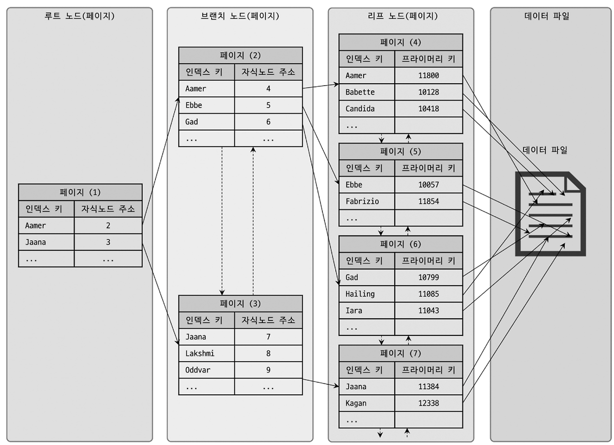
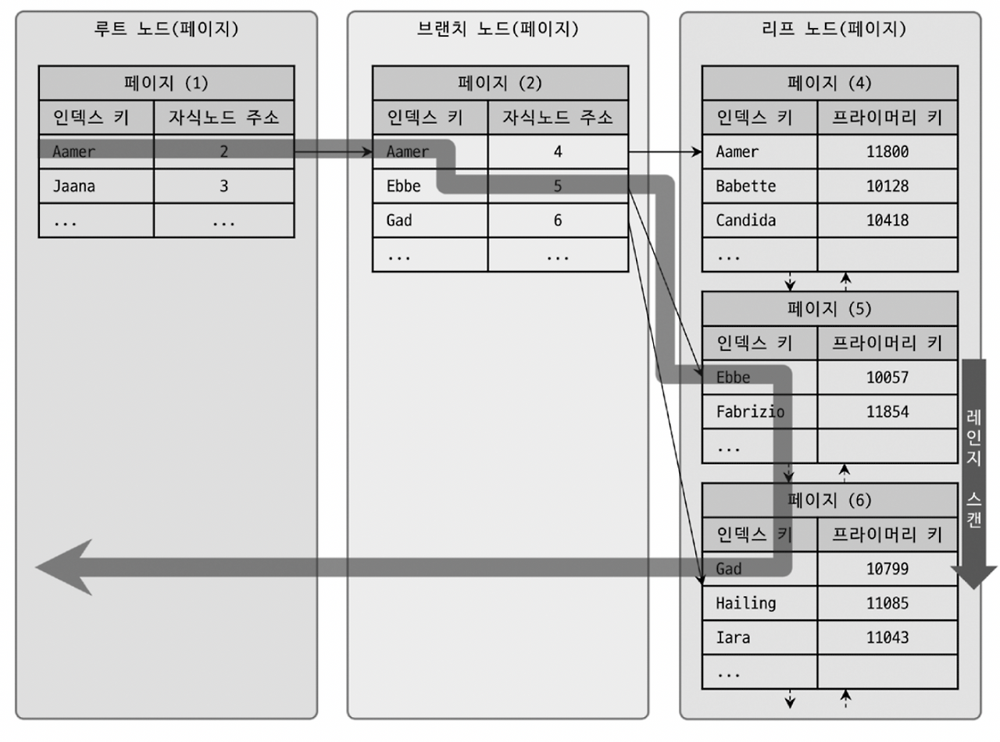
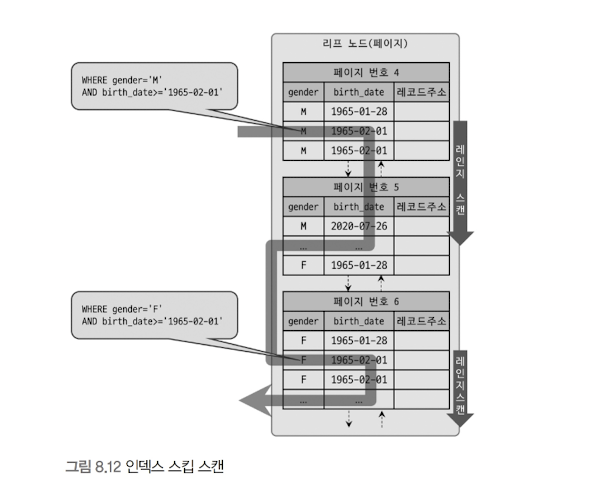

> 인덱스는 DB 쿼리 성능에서 빼놓을 수 없는 부분이자 기본
MySQL에서 사용 가능한 인덱스 종류 및 특성을 간단히 살펴보자
>

# 8.1. 디스크 읽기 방식

> CPU나 메모리 처럼 전기적 특성을 띤 장치의 성능은 빠른 속도로 발전했으나
디스크 같은 기계식 장치의 성능은 제한적으로 발전했다.
하드 디스크보다 SSD 드라이브가 많이 활용되고 있지만 여전히 데이터 저장 매체는 컴퓨터에서 느리다.
데이터베이스의 성능 튜닝은 어떻게 디스크 I/O를 줄이느냐가 관건일 때가 많다.
>

## 8.1.1 하드 디스크 드라이브(HDD)와 솔리드 스테이트 드라이브(SSD)

CPU나 메모리는 전자식 장치지만, HDD는 기계식 장치이다. DB에선 항상 디스크 장치가 병목이 된다.

기계식 HDD 대체를 위해, 전자식 저장 매체인 SSD가 많이 출시되고 있다.

SDD는 기존 HDD에서 데이터 저장용 플래터(원판)를 제거하고 그 대신 플래시 메모리를 장착했다.

- 이로인해 디스크 원판을 기계적으로 회전시킬 필요가 없어 빠르게 데이터를 쓰고 읽을 수 있다.

플래시 메모리는 전원이 공급되지 않아도 데이터가 삭제되지 않으며, 메모리보단 느리지만 HDD보다 빠르다.

- **초당 처리 횟수**
    - **CPU** 10^9 Op/Sec
    - **DRAM** 10^8 Op/Sec
    - **SSD** 10^5 Op/Sec
    - **HDD** 2*10^2 Op/Sec

## 8.1.2 랜덤 I/O와 순차 I/O

**랜덤 I/O와 순차 I/O의 작업과정**

HDD의 플래터(원판)를 돌려서 읽어야할 데이터가 저장된 위치로 디스크 헤더를 이동시켜 데이터를 읽는다.

그렇다면 둘은 어떤 차이가 있을까?

3개의 페이지(3*16KB)를 디스크에 기록하기 위해
순차 I/O는 1번 시스템 콜을 랜덤 I/O는 3번의 시스템 콜을 요청한다.

즉, 디스크 기록 위치를 찾기위해 디스크 헤더를 순차 I/O는 1번, 랜덤 I/O는 3번 움직인다. (3배의 속도 차이)

**디스크 I/O와 쿼리 튜닝의 연관관계**

사실 쿼리를 튜닝해서 랜덤 I/O를 순차 I/O로 바꿔서 실행하는 법은 많지 않고, 일반적으로 쿼리 튜닝은 랜덤 I/O 자체를 줄이는 것이 목적이다. → 쿼리를 처리하는데 꼭 필요한 데이터만 읽도록 쿼리를 개선하는 것

- 인덱스 레인지 스캔은 데이터를 읽기 위해 주로 랜덤 I/O를 사용, 풀 테이블 스캔은 순차 I/O를 사용
- 큰 테이블의 레코드 대부분을 읽는 작업에선 인덱스를 사용하지 않고 풀 테이블 스캔을 유도하기도 한다.
    - 이런 형태는 OLTP 성격의 웹서비스 보다는 데이터 웨어하우스나 통계 작업에서 자주 사용된다.

# 8.2 인덱스란?

> 책의 색인처럼, 칼럼(또는 칼럼들)의 값과 해당 레코드가 저장된 주소를 Key-Value 쌍으로 저장한 것
>
- 인덱스는 칼럼의 값을 주어진 순서로 미리 정렬해서 보관한다.
- 데이터의 저장(INSERT, UPDATE, DELETE) 성능을 희생하고, 대신 데이터 읽기 속도를 높이는 기능이다.
    - WHERE 조건절에 사용되는 칼럼이라고 전부 인덱스를 생성하면 데이터 저장 성능이 떨어지고, 인덱스의 크기가 비대해져 오히려 역효과만 불러올 수 있다.

### 인덱스의 구분

- 인덱스를 역할별로 구분한다면 프라이머리 키와 보조 키(세컨더리 인덱스)로 구분할 수 있다.
- 인덱스를 데이터 저장 방식(알고리즘)으로 구분 시 B-Tree 인덱스와 해시 인덱스 등으로 구분할 수 있다.
- 인덱스를 데이터의 중복 허용 여부로 분류허면 유니크 인덱스와 유니크 하지 않은 인덱스로 구분한다.
    - 단순히 같은 값이 1개 이상 존재할 수 있는지를 의미하여 단순해보일 수 있다.
    - 실제 DBMS의 쿼리를 실행해야하는 옵티마이저에게는 상당히 중요한 문제가 된다.
        - 유니크 인덱스에 대해 동등 조건(=)으로 검색하는 것은 항상 1건의 레코드를 반환할 것 이다.
        - 1개만 찾으면 더 찾지 않아도 된다는 것을 옵티마이저에게 알려주는 효과

# 8.3 B-Tree 인덱스

> 가장 일반적으로 사용되고, 가장 먼저 도입된 알고리즘이자, 아직도 범용적인 목적으로 사용된다.
>

## 8.3.1 구조 및 특성

> **리프 노드가 항상 실제 데이터 레코드를 찾아가기 위한 주솟값을 가지고 있다.**
>



대부분 RDMS의 데이터 파일에서 레코드는 특정 기준으로 정렬되지 않고 임의의 순서로 저장된다.

InnoDB 테이블에서 레코드는 기본적으로 클러스터링 되어 PK 순서로 정렬되어 저장된다

다른 DB는 클러스터링 기능(Oracle의 IOT: Index Organized Table / MS-SQL의 클러스터 테이블)이 선택 사항이지만, InnoDB에서는 디폴트 설정이다.

### InnoDB 인덱스에서의 데이터 읽기

InnoDB 테이블에서 인덱스를 통해 레코드를 읽을 때는 데이터 파일을 바로 찾아가는 것이 아니라, 인덱스에 저장되어 있는 PK 값을 이용해 PK 인덱스를 한번 더 검색 후, PK 인덱스의 리프 노트에 저장된 값을 읽는다.

즉, InnoDB 스토리지 엔진에서는 모든 세컨더리 인덱스 검색에서 데이터 레코드를 읽기 위해서는, PK를 저장하고 있는 B-Tree를 다시 한 번 검색하는 것이다.

## 8.3.2 B-Tree 인덱스 키 추가 및 삭제

> InnoDB에서는 추가, 삭제, 변경의 인덱스 키 추가 작업을 지연시켜 나중에 처리할 수 있다. (체인지 버퍼)
>

### 8.3.2.1 인덱스 키 추가

새로운 키 값 저장 시, 저장될 키 값을 이용해 B-Tree상의 적절한 위치를 검색하고, 위치가 결정되면 레코드의 키 값과 대상 레코드의 주소 정보를 B-Tree의 리프 노드에 저장한다.

리프 노드가 꽉 차서 더이상 저장할 수 없을때는 리프 노드가 분리(split)되어야 하는데, 이는 상위 브랜치 노드까지 처리의 범위가 넓어진다. → 이 특성으로 B-Tree는 쓰기작업에 비용이 많이 든다.

일반적으로 인덱스에 의한 오버헤드를 계산 시, 인덱스가 없었을 때를 1로 기준 잡았을때 1.5 정도로 예측한다.

**테이블의 모든 인덱스가 B-Tree라는 가정하에, 테이블에 인덱스가 없다면 1, 인덱스가 3개 라면 5.5 (1.5*3+1)**

### 8.3.2.2 인덱스 키 삭제

B-Tree 에서의 삭제는, 해당 키 값이 저장된 B-Tree의 리프 노드를 찾아 삭제 마크만 하면 작업이 완료된다.

이렇게 삭제된 공간은 방치되거나 재활용된다.

### 8.3.2.3 인덱스 키 변경

인덱스의 키 값은 그 값에 따라 저장될 리프 노드의 위치가 변경되기에, 단순한 키 값 변경은 불가능하다.

먼저 키 값을 삭제한 후, 다시 새로운 키 값을 추가하는 형태로 처리된다.

### 8.3.2.4 인덱스 키 검색

INSERT, DELETE, UPDATE의 추가 비용을 감당한 이유는 빠른 검색을 위해서 이다.

다만 B-Tree 인덱스를 이용한 검색은 100% 일치 또는 앞 부분만 일치하는 경우에 사용할 수 있다.

인덱스를 구성하는 키 값의 뒷부분만 검색하는 용도로는 인덱스를 사용할 수 없다는 것.

또한 이미 변형된 값은 B-Tree 인덱스에 존재하는 값이 아니기에, 함수나 연산 수행 결과로 정렬/검색하는 작업은 B-Tree의 장점을 이용할 수 없다.

InnoDB 스토리지 엔진에서 레코드 잠금이나 넥스트 키락(갭락) 또한 인덱스를 잠그는 방식으로 구현되기에, 인덱스의 설계가 그만큼 중요하고 많은 부분에 영향을 미친다.

## 8.3.3 B-Tree 인덱스 사용에 영향을 미치는 요소

### 8.3.3.1 인덱스 키 값의 크기

디스크에 데이터를 저장하는 가장 기본 단위인 페이지 또는 블록

InnoDB에선 이러한 페이지를 디스크의 모든 읽기 및 쓰기 작업의 최소 작업 단위로 사용한다.

또한 InnoDB 스토리지 엔진의 버퍼 풀에서 데이터를 버퍼링하는 기본 단위이기도 하다.

이러한 페이지 사이즈는 기본값이 16KB 이지만, `innodb_page_size`를 통해 4KB ~ 64KB로 설정 가능하다.

인덱스 키가 16 byte라 가정하면 하나의 인덱스 페이지에 16*1024/(16+12) = 585개의 키 값 저장이 가능하다.

- 인덱스 키 값이 16 byte, 대응되는 주소 값의 크기가 12 byte 이기에 1줄이 28 byte로 계산된 것
- 즉, 인덱스 키 값이 커지면 디스크로부터 읽어야하는 횟수가 늘어나고, 그만큼 느려진다는 것
- 또한 인덱스 키 값의 길이가 길어지면 전체적인 인덱스의 크기가 커져 메모리 캐싱 인덱스 수가 줄어든다.
- 이 이유로 자연히 메모리 효율 저하가 발생할 수 있다.

### 8.3.3.2 B-Tree 깊이

B-Tree 인덱스의 깊이(Depth)는 상당히 중요하지만 직접 제어할 방법은 없다.

**상단의 인덱스 키 값의 크기가 커지면 하나의 인덱스 페이지가 담을 수 있는 인덱스 키 값의 개수가 줄어들고, 결국 B-Tree Depth가 증가하여 디스크 읽기가 더 많이 필요하게 되는 연쇄적인 영향이 발생한다.**

### 8.3.3.3 선택도(기수성)

인덱스에서 선택도(Selectivity)와 기수성(Cardinality)은 거의 같은 의미로 사용된다.

모든 인덱스 키 값 가운데 유니크한 값의 수를 의미한다.

- 전체 인덱스 키 값이 100개, 유니크한 수는 10개라면 기수성은 10이다.
- 인덱스 키 값 가운데 중복된 값이 많아질 수록 선택도와 기수성은 낮아진다.
- 인덱스는 **선택도가 높을 수록 검색 대상이 줄어들기 때문에 그만큼 빠르게 처리**가 가능해진다.

### 8.3.3.4 읽어야하는 레코드 건수

인덱스를 이용한 읽기의 손익 분깆머이 얼마인지 판단할 필요가 있다.

일반적인 DBMS의 옵티마이저에서는 인덱스를 통해 레코드 1건을 읽는 것이 테이블에서 직접 레코드 1건을 읽는 것 보다 4~5배 정도 비용이 발생하는 작업인 것으로 예측한다.

즉, 인덱스를 통해 읽어야하는 레코드 건수가 전체 테이블 레코드의 20~25퍼를 넘어서면 풀스캔이 효율적

## 8.3.4 B-Tree 인덱스를 통한 데이터 읽기

> 어떤 경우에 인덱스를 사용하게 할지 유도하려면, 스토리지 엔진이 어떻게 인덱스를 경유하여 실제 레코드를 읽어 내는지 알아야 한다. 대표적인 방법 3가지를 알아보자
>

### 8.3.4.1 인덱스 레인지 스캔

> 인덱스 접근 방법 가운데 가장 대표적인 접근 방식으로, 뒤 2가지 접근 방식보다 빠른 방법이다.
>



인덱스 레인지 스캔은 검색해야할 인덱스의 범위가 결정되었을 때 사용하는 방식이다.

시작해야할 위치를 찾으면 그때부터 리프노드의 레코드만 순서대로 읽다가,(스캔) 멈춰야 할 위치에 다다르면 지금까지 읽은 레코드를 사용자에게 반환하고 쿼리를 끝낸다.

이후 리프 노드에 저장된 레코드 주소로 데이터 파일의 레코드를 읽어오는데, 이 작업은 랜덤 I/O 읽기이다.

그래서 인덱스를 통해 데이터 레코드를 읽는 작업은 비용이 많이 드는 작업으로 분류된다.

**인덱스 레인지 스캔 단계 재정립**

> 쿼리가 필요로하는 데이터에 따라 3번 과정이 필요하지 않을 수 있다.
**커버링 인덱스**: 쿼리를 충족시키는 데 필요한 모든 데이터를 갖고 있는 인덱스
>
1. 인덱스에서 조건 만족 값이 저장된 위치를 찾는다. (인덱스 탐색, Index seek)
2. 1번에서 탐색된 위치부터 필요한 만큼 인덱스를 차례대로 읽는다. (인덱스 스캔, Index scan)
3. 2번에서 읽어 들인 인덱스 키와 레코드 주소를 이용해 레코드가 저장된 페이지를 가져오고, 최종 레코드를 읽는다.

### 8.3.4.2 인덱스 풀 스캔

> 인덱스 레인지 스캔과 마찬가지로 인덱스를 사용하지만, 처음부터 끝까지 모두 읽는 방식이다.
보통은 효율적으로 사용하지 못하는 경우의 스캔 방식이다.
>

대표적으로 쿼리의 조건절에 사용된 칼럼이 인덱스의 첫번째 칼럼이 아닌 경우 사용되는 방식이다.

예를 들어, 인덱스는 (A, B, C) 칼럼의 순서로 생성되었지만, 쿼리 조건절은 B칼럼이나 C칼럼을 사용하는 경우

일반적으로 인덱스의 크기는 테이블의 크기보다 작으므로 직접 테이블을 처음부터 끝까지 읽는 것 보다는 인덱스만 읽는 것이 효율적이다. → 쿼리가 인덱스에 명시된 칼럼만으로 조건 처리 가능한 경우 이 방식 이용

### 8.3.4.3 루스 인덱스 스캔

> 앞 2가지는 Tight하게 읽는다고 표현한다. 루스 인덱스 스캔은 말 그대로 느슨하게, 듬성듬성 읽는 방식
>

인덱스 레인지 스캔과 비슷하게 작동하지만, 중간에 필요치 않은 인덱스 키 값은 무시(Skip)하고 다음으로 넘어가는 형태의 처리 방식으로, `GROUP BY`나 `MAX()`, `MIN()` 함수에 대해 최적화로 사용된다.

```sql
SELECT dept_no, MIN(emp_no)
FROM dept_emp
WHERE dept_no BETWEEN 'd002' AND 'd004'
GROUP BY dept_no;
```

위 경우 dept_no에 이어 emp_no로 정렬되어, dept_no 그룹별로 첫 레코드의 emp_no만 읽으면 된다.

이렇게 루스 인덱스 스캔의 사용을 위해서는 여러 조건을 만족해야하는데, 10장 실행 계획에서 이어서 보자.

### 8.3.4.4 인덱스 스킵 스캔

> DB 서버에서 인덱스의 핵심은 값이 정렬되어 있는 것. 칼럼의 순서가 매우 중요하다.
인덱스 스킵 스캔에서는 불필요한 부분을 스킵하여 range 스캔이 가능하도록 지원해준다.
>

```sql
ALTER TABLE employees 
ADD INDEX ix_gender_birthdate (gender, birth_date);
```

이 인덱스 사용 시 `WHERE` 조건절에 `gender` 칼럼에 대한 비교 조건이 필수이다.

```sql
-- // 인덱스를 사용하지 못하는 쿼리
SELECT * FROM employees WHERE birth_date>='1965-02-01';

-- // 인덱스를 사용할 수 있는 쿼리
SELECT * FROM employees WHERE gender='M' AND birth_date>='1965-02-01';
```

기존에는 첫 쿼리는 `birth_date` 에 대한 인덱스를 별도 사용해야 인덱스 사용이 가능했다.

MySQL 8.0 부터는 옵티마이저가 `gender` 칼럼을 건너뛰어서 `birth_date` 칼럼만으로도 인덱스 검색이 가능하게 해주는 **인덱스 스킵 스캔** 최적화 기능이 도입되었다.

> **EXPLAIN의 TYPE 칼럼**
`EXPLAIN` 시에 `type`에 `INDEX` 라고 표시된 것은, 풀 인덱스 스캔을 하고 있다는 것. (비효율)
`RANGE` 라고 표시되어야 꼭 필요한 부분만 읽었다는 것을 의미한다. → 인덱스 레인지 스캔
`ALL` 은? 풀 테이블 스캔 했다는 것

그 외에도
`REF` : 인덱스를 사용하여 하나 또는 그 이상의 행에 접근하는 방식
`EQ_REF` : 다른 테이블과 조인 시, 조인 조건에서 사용된 모든 키가 Primary Key 또는 Unique 인덱스
`CONST` : Primary Key 또는 Unique 인덱스를 사용하여 하나의 행만을 조회하는 경우
`NULL` : 아무런 행에도 접근할 필요가 없는 경우
등이 존재한다.
>

**인덱스 상위 조건별로 구분하여 레인지 스캔을 하도록 최적화를 내부적으로 진행해준다.**



```sql
SELECT gender, birth_date FROM employees WHERE birth_date>='1965-02-01';

-- // 위 쿼리를 gender 별로 나누어, 아래처럼 최적화를 진행하면 range 스캔이 가능해진다!

SELECT gender, birth_date FROM employees WHERE gender='M' AND birth_date>='1965-02-01';
SELECT gender, birth_date FROM employees WHERE gender='F' AND birth_date>='1965-02-01';
```

**하지만 새로이 도입된 기능이기에, 다음과 같은 단점이 존재한다.**

1. WHERE 조건절에 조건이 없는 인덱스의 선행 칼럼의 유니크한 값의 개수가 적어야 함
2. 쿼리가 인덱스에 존재하는 칼럼만으로 처리 가능해야 함(커버링 인덱스)

## 8.3.5 다중 칼럼(Multi-column) 인덱스

> 지금까지는 1개의 칼럼만 포함된 인덱스를 살펴보았으나, 실제 서비스에서는 2개 이상 칼럼을 포함한다.
>

2개 이상의 칼럼으로 구성된 인덱스를 다중 칼럼 인덱스(또는 복합 칼럼 인덱스)라고 하며, 2개 이상의 칼럼이 연결되었다고 하여 Concatenated Index 라고도 한다.

**인덱스의 후순위 칼럼은 전방 칼럼에 의존해서 정렬되기에, 인덱스 내에서 각 칼럼의 순서가 매우 중요하다.**

## 8.3.6 B-Tree 인덱스의 정렬 및 스캔 방향

인덱스 생성 시 설정한 정렬 규칙에 따라 인덱스 키 값은 항상 오름차순이거나 내림차순으로 저장된다.

하지만 **인덱스를 읽는 방향 자체는 쿼리에 따라 옵티마이저가 실시간으로 만들어내는 실행 계획에 기반**한다.

### 8.3.6.1 인덱스의 정렬

> 5.7 까지는 정렬 순서를 혼합하여 인덱스를 생성할 수 없었으나, 8.0 부턴 아래 같은 설정이 가능해졌다.
>

```sql
CREATE INDEX ix_teamname_userscore ON employees (team_name ASC, user_score DESC);
```

### 인덱스 스캔 방향(오름차순, 내림차순)

> 일반적으로 페이지 내에서 인덱스 레코드는 단방향으로 연결되어, 역순 스캔이 불리하다.
ORDER BY . . . DESC 쿼리가 소량이라면 내림차순 인덱스를 굳이 고려할 필요는 없다.
다만 앞쪽, 뒤쪽에 집중적 읽기 작업이 진행되는 작업 비중이 높다면, 그에 맞게 스캔 방향을 설정하자.
>

## 8.3.7 B-Tree 인덱스의 가용성과 효율성

> 쿼리의 `WHERE` 조건이나 `GROUP BY`, `ORDER BY` 절이 어떤 경우에 인덱스를 효율적 사용하는지 알자.
그래야만 쿼리의 조건을 최적화하거나, 역으로 쿼리에 맞는 인덱스를 생성할 수 있다.
>

### 8.3.7.1 비교 조건의 종류와 효율성

공식적인 명칭은 아니지만, 인덱스 탐색의 작업의 범위를 결정하는 조건을 `작업 범위 결정 조건`이라 하며, 단순히 필터링 목적의 조건으로 사용되는 조건은 `필터링 조건`, `체크 조건`이라고 표현한다.

**결국 작업 범위 결정 조건이 많을 수록 작업 범위 자체가 좁아져 쿼리 처리 성능이 증가한다.**

### 8.3.7.2 인덱스의 가용성

**가용성과 효율성의 판단**

> 기본적으로 B-Tree 인덱스의 특성상 다음 조건에서는 사용할 수 없다.
작업 범위 결정 조건으로 사용할 수 없다는 것인데, 경우에 따라 체크 조건으로 사용될 수는 있다.
>
- **NOT-EQUAL 로 비교된 경우(`<>`, `NOT IN`, `NOT BETWEEN`, `IS NOT NULL`)**
- **`LIKE ‘%??’` (앞부분이 아닌 뒷부분 일치) 형태로 문자열 패턴이 비교된 경우**
- **스토어드 함수나 다른 연산자로 인덱스 칼럼이 변형된 후 비교된 경우**
    - `WHERE SUBSTRING(column, 1, 1) = ‘X’`
    - `WHERE DAYOFMONTH(column) = 1`
- **NOT-DETERMINISTIC 속성의 스토어드 함수가 비교 조건에 사용된 경우**
    - `WHERE column = deterministic_function()`
- **데이터 타입이 서로 다른 비교(인덱스 칼럼의 타입을 변환해야 비교가 가능한 경우)**
    - `WHERE char_column = 10`
- **문자열 데이터 타입의 콜레이션이 다른 경우**
    - `WHERE utf8_bin_char_column = euckr_bin_char_column`

**대표적인, 효율적 쿼리 작성을 위한 예시를 보자**

> 쿼리 패턴은 이 외에도 많이 존재하지만, 대표적인 것을 기억해두면 좀 더 효율적 쿼리 작성이 가능하다.
>

```sql
INDEX ix_test (col_1, col_2, col_3, ... , col_n)
```

- **작업 범위 결정 조건으로 인덱스를 사용하지 못하는 경우**
    - `col_1` 칼럼에 대한 조건이 없는 경우
    - `col_1` 칼럼의 비교 조건이 위의 인덱스 사용 불가 조건 중 하나인 경우
- **작업 범위 결정 조건으로 인덱스를 사용하는 경우(i는 2보다 크고 n보다 작은 임의의 값을 의미)**
    - `col_1` ~ `col_(i-1)` 칼럼까지 동등 비교 형태(`=` 또는 `IN`)로 비교하는 경우
    - col_i 칼럼에 대해 다음 연산자 중 하나로 비교하는 경우
        - 동등 비교(`=` 또는 `IN`)
        - 크다 작다 형태(`>` 또는 `<`)
        - LIKE로 좌측 일치 패턴(`LIKE ‘홍길%’`)