# 8 인덱스
## 8.1 디스크 읽기 방식
- 인덱스도 결국 데이터 파일에서 값을 가져오는 방식이므로, 디스크의 읽기 방식이에 따라 인덱스 성능에 영향을 줌
- 적절한 읽기 방식으로 유도하여, 디스크IO를 줄일 수 있음


### 8.1.1 하드 디스크 드라이브(HDD)와 솔리드 스테이트 드라이브(SSD)
#### 하드 디스크 드라이브 (HDD)
- 전통적인 데이터 저장 기계식 장치다.
- 플래터(원판)을 사용해 데이터를 읽기 때문에 초당 처리 횟수가 매우 낮다.

#### 솔리드 스테이트 드라이브 (SSD)
- HDD의 낮은 초당 처리 횟수를 낮추기 위한 전자식 저장 매체다.
- 하드디스크 드라이브와 동일한 인터페이스를 지원하기에 쉽게 교체가 가능하다.
- 플래터 대신 플레시 메모리를 사용한다.
- 하드 디스크 드라이브보다 랜덤IO가 월등히 빠르다는 장점이 있다.
- 하지만 순차IO는 성능이 비슷하다.

> ### HDD vs SSD 성능 차이
> - SSD : 초당 436개의 트랜잭션 처리
> - HDD : 초당 60개 트랜잭션 처리

### 8.1.2 랜덤 I/O와 순차 I/O
#### HDD의 랜덤 I/O 와 순차 I/O

- 순차IO : 3개의 페이지를 디스크에 기록하기 위해 1번의 시스템 콜 호출
  - 순서대로 데이터 공간을 순회하기 때문에 위치를 한 번만 찾고 한꺼번에 넣기 때문
- 랜덤IO : 3개의 페이지를 디스크에 기록하기 위해 3번의 시스템 콜 호출
  - 각 데이터가 저장될 위치가 다르므로 디스크 헤드를 3번 움직여야 함

- 이때 디스크 헤더를 움직이는 시간이, 실질적으로 디스크의 성능이 됨
- 즉, 랜덤IO의 성능이 순차IO보다 훨씬 느림

#### SSD의 랜덤 I/O 와 순차 I/O
- SSD는 디스크 원판이 없으므로 랜덤IO와 순차IO간의 성능 차이가 없을 것이라 생각되지만,
- 실제로는 랜덤IO의 성능이 현저하게 낮음

#### 결론
- 결국 쿼리를 튜닝하는 건 랜덤IO를 줄이는 것
- 랜덤IO를 순차IO로 변경하지는 못함 (그냥 랜덤IO의 개수를 줄여야함)
> - 인덱스 레인지 스캔 : 랜덤IO 사용
> - 풀 테이블 스캔 : 순차IO 사용 <br>
> (-> 이는 추후 설명)


## 8.2 인덱스란?
- 인덱스는 대표적으로, 책에서의 찾아보기로 비유됨.
> #### 예시)
> - `Real MySQL 8.0`책에서 "어댑티브 해시 인덱스"를 찾는다고 가정하자.
> - 이때 첫 페이지부터 마지막 페이지까지 "어댑티브 해시 인덱스"라는 문구를 찾기에는 시간이 오래 걸림
> - 이에 책 맨 뒤에 "찾아보기"를 통해, 몇 페이지에 "어댑티브 해시 인덱스"가 위치하는지 알 수 있으며,
> - 해당 페이지로 이동하여 빠르게 찾을 수 있음
> - 이때, "찾아보기"와 DBMS의 인덱스는 특정 값에 대해 **정렬**되어있음
> - 이를 통해 인덱스 내에서도 찾고자 하는 값을 빠르게 찾을 수 있음

> #### ArrayList vs SortedList
> - 흔하게 사용되는 자료구조로, `ArrayList`와 `SortedList`가 있다.
> - `ArrayList`는 데이터가 저장되는 순서대로 순서를 유지한다.
>   - 저장과 수정 연산은 빠르게 수행되지만,
>   - 원하는 값을 가져올 때는 모든 요소를 순회해야한다.
> - 반대로, `SortedList`는 특정 칼럼에 대해 정렬된 순서를 유지한다.
>   - 즉, 삽입 및 수정하는 과정이 오래 걸린다.
>   - 하지만, 원하는 데이터를 가져오는 연산은 빠르게 수행할 수 있다.
> - 여기서 데이터 파일을 `ArrayList`로, 인덱스를 `SortedList`로 비유할 수 있다.
> - 즉, 인덱스도 `SortedList`처럼, INSERT, UPDATE, DELETE 연산이 느리지만, SELECT연산을 매우 빠르게 처리한다.

> ### 인덱스의 역할로 분류
> - 책에서는 키와 인덱스를 같은 의미로 간주
> #### 1. 프라이머리 키 (프라이머리 인덱스)
> 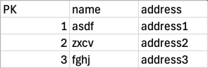
> - 프라이머리 키를 기준으로 정렬된 인덱스
>
> 
> #### 2. 세컨더리 키 (세컨더리 인덱스)
> 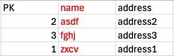
> - 프라이머리 키가 아닌, 임의의 칼럼을 기준으로 정렬된 인덱스 


> ### 데이터의 저장 방식으로 분류
> #### 1. B-Tree 인덱스 
> - 가장 일반적으로 사용되는 인덱스 구조
> 
> #### 2. Hash 인덱스 
> - 해시값을 계산하여 인덱싱하는 구조
> - 매우 빠른 조회 성능을 보임
> - 범위 검색에서는 Hash 인덱스 사용 불가능
> - 주로 메모리 기반 데이터베이스에서 사용됨

> ### 데이터 중복 허용 여부로 구분
> - 의미로는 같은 값이 한개 존재하는지 아닌지만 구분하면 되지만,
> - 쿼리상으로는 중요한 문제 (유니크하면 조회가 빠르지만, 유니크하지 않다면 조회가 오래걸림)


## 8.3 B-Tree 인덱스
- Balanced Tree의 약자로, 가장 일반적으로 사용되는 인덱스 자료구조이다.
- B-Tree, B+-Tree, B*-Tree 등 변형된 알고리즘이 존재

### 8.3.1 구조 및 특성
- 루트 노드 : 트리 구조의 가장 최상위의 노드
- 리프 노드 : 가장 하위에 있는 노드
  - 인덱스에서 실제 값이 없으므로, 실제 데이터 레코드를 찾아가기 위한 주소값을 가지고 있음
- 브랜치 노드 : 루트 노드와, 리프 노드 사이의 노드

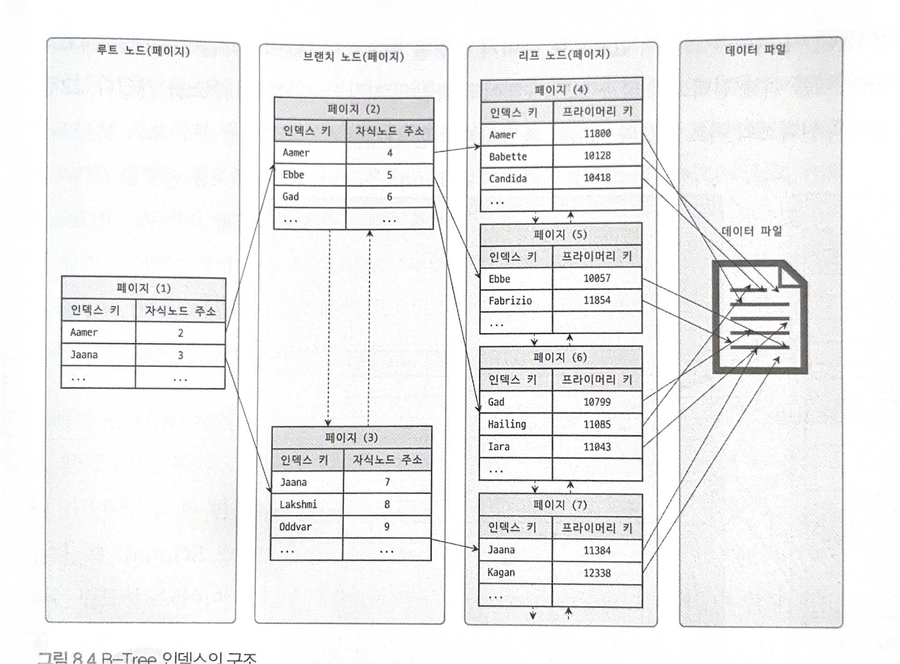
- 위 구조는 인덱스에 구조보다는, B-Tree자체의 구조로 보면 된다.
- 인덱스의 구조는, 추후 서술함
- 그림과 같이, 루트 노드·브랜치 노드는 자식노드의 주소를 통해 노드를 찾아간다.
- 리포 노드에서는 실제 데이터를 찾기 위한 프라이머리 키를 가지고 있다.
- 이를 통해, 무작위로 저장되어잇는 데이터 파일에서 빠른 조회를 수행할 수 있다.
- 인덱스에서는 나머지 칼럼이 존재하지 않으므로, 전체 레코드를 조회하기 위해서는 데이터 파일에 접근해야함

### MyISAM에서의 인덱스 구조
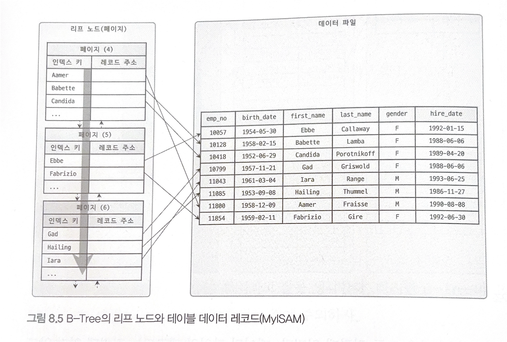
- 리프노드에서 레코드 주소를 가짐
- 데이터 파일에서 해당하는 레코드를 읽을 수 있어야 함
- 레코드 주소는 INSERT된 순서
- 세컨더리 인덱스를 통해 레코드를 찾을 때, 세컨더리 인덱스는 물리적인 데이터의 주소값을 가진다.

### InnoDB에서의 인덱스 구조

- 데이터 파일 자체가 프라이머리 키 인덱스
- 즉, 레코드를 조회하려면 무조건 인덱스를 거치게 됨 (프라이머리 키 사용)
  - 인덱스를 한 번 더 거치기 때문에 성능이 떨어질 것 같지만, 장점이 있음 (추후 설명)
- 세컨더리 인덱스를 통해 레코드를 조회할 때, 세컨더리 인덱스는 프라이머리 키값을 가짐
  - 물리적인 데이터 주소값을 알 필요 없음 (데이터 파일 자체가 인덱스이므로 해당 키를 통해 조회 가능)

### 8.3.2 B-Tree 인덱스 키 추가 및 삭제
- 테이블의 레코드를 변경할 때, 인덱스도 업데이트를 해줘야함
- 이때 인덱스의 키 추가·삭제·변경·검색이 어떻게 처리되는지 알면 쿼리의 성능을 쉽게 예측 가능

#### 8.3.2.1 인덱스 키 추가
- 새로운 키 값이 인덱스에 추가될 때, 스토리지 엔진에 따라 바로 반영될 수도 있고 아닐 수도 있다.
- 키 값을 추가할 때, <키 값, 레코드 주소 정보>를 리프노드에 저장하는데, 상황에 따라 리프노드가 꽉 찰수도 있다.
  - 이 때는 상위 브랜치까지 노드가 영향이 간다.
  - 이에 인덱스의 쓰기 작업은 비용이 크다.
- 대략 테이블에 레코드를 추가하는 작업을 1이라 설정하면, 인덱스에 키를 추가하는 작업은 1.5정도로 예측할 수 있다.
> #### 예시)
> - 1건의 데이터를 추가한다고 가정하자
> - 한 테이블에 인덱스가 없을 때는, 1이라는 작업 비용이 들고,
> - 한 테이블에 인덱스가 3개가 있을 때는, 1 + 1.5 * 3 = 5.5라는 작업 비용이 든다.

> #### InnoDB의 인덱스 키 추가
> - 인덱스 키 추가 작업을 지연시켜 나중에 처리 가능
> - but, 프라이머리 키 인덱스나 유니크 인덱스의 경우 중복 체크가 필요하므로 즉시 반영해야함
> 
> #### MyISAM, MEMORY의 인덱스 키 추가
> - 작업을 지연시키지 않고, 그 즉시 인덱스에 반영

#### 8.3.2.2 인덱스 키 삭제
- 키값이 저장된 리프 노드를 찾아 삭제
- 삭제처리 또한 디스크 쓰기가 발생 (디스크IO)
- 스토리지 엔진 : 인덱스 키 삭제 작업 지연 처리 가능
- MyISAM & MEMORY : 버퍼 기능 X -> 인덱스 키 삭제 후 쿼리 완료

#### 8.3.2.3 인덱스 키 변경
- 인덱스 키 값이 변경되는 경우는 해당 값을 삭제한 후, 새로운 키를 추가하는 방식을 사용
- 삭제 연산과 같이 InnoDB에서는 지연 처리 가능

#### 8.3.2.4 인덱스 키 검색
- 빠른 검색 가능
- B-Tree 인덱스에선 100% 일치 또는 앞부분 일치로만 사용 가능
- 부등호(<, >) 또한 사용할 수 있지만, 뒷부분을 검색하는 건 불가능
- 추가로, 인덱스에 변경이 일어난 후, 검색은 사용할 수 없음
- 즉, 연산 후에 검색하는 작업은 불가능
- 검색 후 연산을 진행하는 방식으로 수정을 해야함


### 8.3.3 B-Tree 인덱스 사용에 영향을 미치는 요소
- 칼럼의 크기, 레코드의 개수, 유니크한 인덱스 키 값의 개수 등이 성능에 영향을 줌

#### 8.3.3.1 인덱스 키 값의 크기
- InnoDB 엔진에서, 데이터를 저장·조회하는 가장 기본 단위를 **페이지**라고 함
- 즉, InnoDB 스토리지 엔진의 버퍼 풀에서 버펄이하는 최소 단위
- 페이지는 B-Tree 인덱스의 루트, 브랜치 노드를 구분한 기준
- 페이지의 크기에 따라 B-Tree의 자식 노드 개수가 결정됨
- 페이지의 크기를 (4 ~ 64KB)로 설정할 수 있지만, 기본 크기는 16KB
> #### 예)
> - 인덱스 키가 16바이트, 자식 노드 주소가 12바이트라고 가정하자
> - 즉, 한 개의 페이지(16KB)에 $16 * 1024 / (16 + 12) = 585$개의 자식 노드를 가질 수 있음
> <br>
> - 만약 인덱스 키가 32바이트라면, $16 * 1024 / (32 + 12) = 372$개의 자식 노드를 가진다.

- 위 예시로 알 수 있는 점은, 서비스 쿼리에서 최대 몇 개의 레코드를 조회하는지에 따라, 읽어야하는 인덱스 페이지의 개수가 달라질 수도 있음
- 인덱스의 키가 길어지면, 
  - 한 페이지에 담을 수 있는 레코드 개수가 줄어들고, 결국 많은 페이지를 읽기 위해 디스크 읽기가 많아져 성능이 느려진다.
  - 메모리에 캐시할 수 있는 레코드 수도 줄어듦 -> 메모리 효율 떨어짐


#### 8.3.3.2 B-Tree 깊이
- 깊이를 사용자가 제어할 수는 없음
- 하지만 인덱스 키의 크기에 따라, 몇 개의 키 값을 담을 수 있는지 유추 가능
> #### 예)
> - 키 길이가 16바이트고, 깊이가 최대 3인 경우,
>   - 한 페이지에 575개의 노드를 담을 수 있으므로, $575^3 = 2$억개의 키 값을 담을 수 있음
> - 키 길이가 32바이트면,
>   - 한 페이지에 372개의 노드를 담을 수 있으므로, 2천만개의 키 값을 담을 수 있음

- 키 길이가 작을 수록 많은 키 값을 담을 수 있지만, 아무리 큰 데이터베이스여도 깊이가 5를 넘지 않는다.


#### 8.3.3.3 선택도(기수성)
- 모든 인덱스 키 값 가운데, 유니크한 값의 수를 의미
- 쉽게 말해서, 인덱스의 모든 키를 Set 자료구조에 넣었을 때, Set의 크기 (중복된 값은 무시되기 때문)
- 인덱스에 중복된 값이 많을수록 기수성 낮아짐
- 기수성이 높을수록, 중복된 값이 많지 않아 성능이 빨라진다.

> #### 예)
> - `country`, `city`라는 칼럼이 포함된 db_test 테이블이 있다고 가정하자, 레코드의 개수는 1만개이다.
> - `country`에 대한 인덱스만 존재할 때, 2가지 케이스를 고려할 수 있다.
> 1. `country`칼럼의 유니크한 값의 개수가 10개
> 2. `country`칼럼의 유니크한 값의 개수가 1000개
> - 이에 아래와 같은 쿼리를 실행한다.
> ```sql
> SELECT * FROM tb_test WHERE country='korea' and city='seoul';
> ```
> - 1번 케이스에서는 평균 1,000개의 레코드가 반환된다.
>   - 즉, 1건의 레코드를 위해 1,000개의 레코드를 읽어야하며,
> - 2번 케이스에서는 평균 10개의 레코드가 반환된다.
>   - 이는 1건의 레코드를 위해 10개의 레코드를 읽는다.
> 
> - 정리하면, 기수성(선택도)이 높을 수록, 읽게되는 쓸모없는 레코드의 개수가 줄어든다.

#### 8.3.3.4 읽어야 하는 레코드의 개수
- 인덱스를 통해 테이블의 레코드를 읽는 것이, 인덱스를 거치지 않고 테이블의 레코드를 읽는 것보다 4배의 비용차이가 있다.
> 인덱스를 통한 데이터 읽기 > 인덱스를 거치지 않는 데이터 읽기

- 이때, 100만 건의 레코드 중, 50만 개의 레코드를 조회해야한다고 가정하자, 
  - 전체 테이블을 모두 읽어서 50만 개의 레코드를 조회하는 방식과
  - 인덱스를 통해 필요한 50만 개의 레코드를 읽는 방식을 비교해야함
  - 이때, 읽어야할 레코드의 개수가 전체 레코드 개수의 20~25%를 넘어서면 인덱스를 사용하지 않는 것이 효율적인다.


### 8.3.4 B-Tree 인덱스를 통한 데이터 읽기
- B-Tree 인덱스에서 레코드를 읽는 방식에는 대표적으로 4가지가 있다.

#### 8.3.4.1 인덱스 레인지 스캔
- 인덱스 레인지 스캔은 가장 대표적인 접근 방식으로, 가장 빠른 방법이다.
- `인덱스 레인지 스캔`은 일단 레코드를 한 건만 읽는 경우와 레코드를 여러 건 읽는 경우를 합쳐 지칭한다. (자세한 건 10장에서)
- 검색하고자 하는 인덱스의 범위가 결정되었을 때 사용하는 스캔 방식이다.

> 예시)
> - 아래 쿼리를 예시로 들자
> ```sql
> mysql> SELECT * FROM employees WHERE first_name BETWEEN 'Ebbe' AND 'Gad';
> ```
> 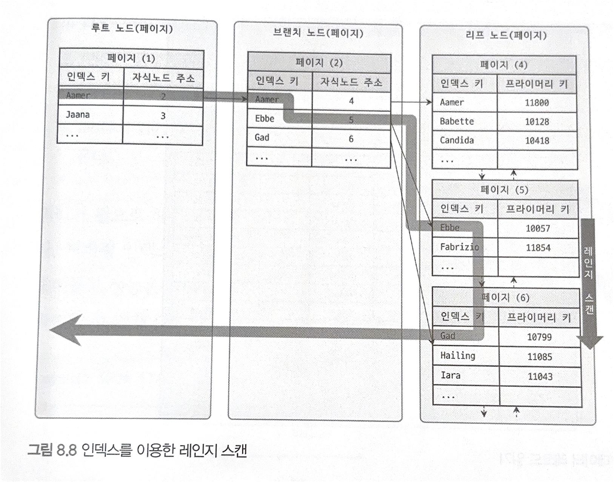
> - 일단 시작하는 키 값에 대해 리프 노드로 들어간다.
> - 한 번 리프노드로 들어가면, 다시 상위 노드로 갈 필요 없이, 바로 아래로 쭉 읽는다. (범위 조회이기 때문)
> - 스캔을 멈춰야할 위치까지 가면 지금까지 읽은 레코드를 반환한다.
> - 위 그림은 인덱스의 리프 노드까지 들어간 예시지만, 실제 데이터 파일의 레코드를 읽어야 하는 경우도 존재
> <br>
> 
> 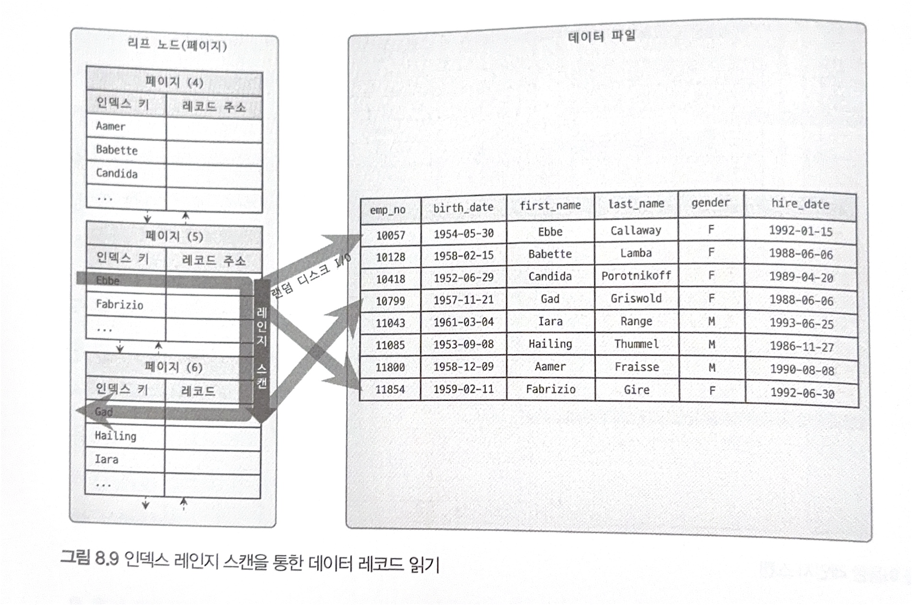
> - 위 그림과 같이, 리프 노드에 저장된 레코드 주소를 통해 데이터 파일에서 레코드를 읽어들임
> - 이때 레코드 한 건 단위로 랜덤IO가 발생
>   - 인덱스를 통해 읽어야 할 데이터가 20~25%을 넘으면 인덱스를 사용 안하는 게 더 효율적임  
> - 즉, 인덱스를 사용하여 데이터를 조회하는 과정은 비용이 많이듬
>   - 테이블 풀 스캔은 비용이 적게 드는 순차IO지만, 엄청 많이 순회해야함
>   - 반면 인덱스는 비용이 큰 랜덤IO지만, 탐색을 적게 함
>   - 값싼 연산을 1000000번 하냐,,, 비싼 연산을 10번 하냐,,의 차이?

| 방식       | IO 비용      | IO 횟수 | 전체 비용 |
|----------|------------|-------|-------|
| 테이블 풀 스캔 | 싸다 (순차IO)  | 엄청 많음 | 비쌈    |
| 인덱스 스캔   | 비싸다 (랜덤IO) | 적음    | 쌈     |

> ### 인덱스 레인지 스캔 단계 정리
> 1. 인덱스에서 조건을 만족하는 값이 저장된 위치 찾음 (리프 노드)
>    - 이를 `인덱스 탐색`이라고 함
> 2. 1번에서 탐색된 위치부터 아래로 순차 탐색 진행
>   - 이를 `인덱스 스캔`이라고 함
> 3. 2번에서 읽은 {인덱스 키, 레코드 주소}를 통해 레코드가 저장된 페이지를 가져옴. 그 후, 최종 레코드를 읽음

> ### 커버링 인덱스
> - 위 3단계가 필용 없을 수도 있음
> - 커버링 인덱스로 처리되는 쿼리는 디스크에서 데이터를 가져오지 않아도 되므로 랜덤IO가 줄어든다.

```sql
mysql> SHOW STATUS LIKE 'Handler_%';
```
- MySQL에서는 1번단계, 2번단계가 얼마나 수행됐는지를 확인할 수 있는 상태값을 제공
  - `Handler_read_key` : 1번 단계가 실행된 횟수
  - `Handler_read_next`, `Handler_read_prev`: 2번 단계로 읽은 레코드 건수 (인덱스 정순, 역순)
  - `Handler_read_first`, `Handler_read_last` : 레코드의 첫번째와 마지막 레코드를 읽은 횟수


#### 8.3.4.2 인덱스 풀 스캔
- 인덱스 풀 스캔 또한 인덱스를 사용
- 하지만 인덱스의 처음부터 끝까지 모두 읽는 방식
- 일반적으로, 테이블보다 인덱스의 크기가 더 작으므로 인덱스를 전체 순회하는게 더 성능상으로 효율적ㅇ임
  - 쿼리가 인덱스에 명시된 칼럼만으로 조건 처리가 가능한 경우
  - 데이터 레코드까지 모두 읽어야한다면 비추천

> #### 예시)
> 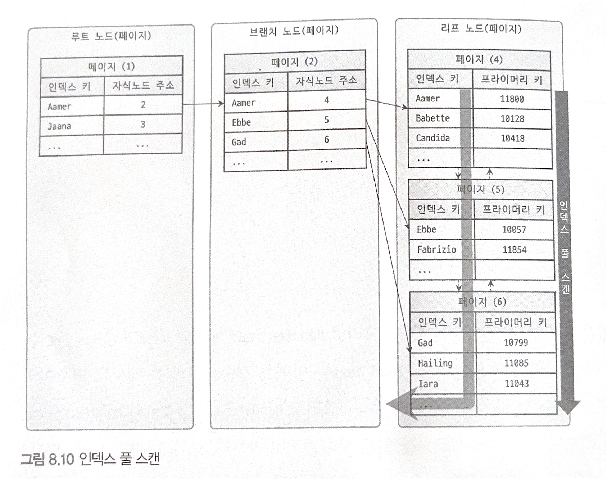
> - 인덱스 풀 스캔의 예시이다.
> - 리프 노드의 맨 처음 혹은 끝으로 간후, 링크드 리스트를 활용해 풀 스캔을 진행한다.
> - 인덱스 레인지 스캔보다는 빠르지 않지만, 테이블 풀 스캔보다는 효율적임

#### 8.3.4.3 루스 인덱스 스캔
- 오라클의 DBMS의 인덱스 스킵 스캔이라는 기능과 유사
- 루스 인덱스 스캔은 느슨하게 인덱스를 읽는다는 의미
- 레인지 스캔과 비슷하게 동작하지만, 중간에 필요없는 키값은 무시됨
- 그룹 함수에 대해 최적화하는데 사용

> #### 예)
> 
> ```sql
> mysql> SELECT dept_no, MIN(emp_no)
>       FROM dept_emp
>       WHERE dep_no BETWEEN 'd002' AND 'd004'
>       GROUP BY dept_no;
> ```
> - 위와 같은 쿼리를 실행한다 가정하자.
> - (dept_no, emp_no) 조합으로 오름차순 인덱스가 생성되었다.
> - 즉, 각 `dept_no`그룹마다 첫 번째 레코드를 읽으면 해당 레코드의 첫 번째 `emp_no`는 가장 최솟값이 됨을 알 수 있다.
> - 즉, `dept_no`그룹의 첫 번째 레코드를 제외한 나머지 레코드는 제외된다.

> #### 한계
> - `GROUP BY`작업을 처리할 때만 적용 가능

#### 8.3.4.4 인덱스 스킵 스캔
- 루스 인덱스 스캔과 비슷한 스캔 방식
- 인덱스 스킨 스캡은 WHERE 조건절 검색에서도 사용 가능

> #### 예)
> ```sql
> mysql> ALTER TABLE employees
>        ADD INDEX ix_gender_birthdate (gender, birth_date);
> ```
> - 다음과 같은 다중 칼럼 인덱스가 있다고 가정하자.
> - 해당 인덱스를 사용하기 위해서는 gender 칼럼에 대한 비교가 필수이다.
> ```sql
> -- // 인덱스 사용 X
> mysql> SELECT * FROM employees WHERE birth_date >= '1965-02-01';
> 
> -- // 인덱스 사용 O
> mysql> SELECT * FROM employees WHERE gender='M' AND birth_date >= '1965-02-01';
> ```

- 인덱스 스킵 스캔은, `gender`칼럼이 아닌, `birth_date`만으로도 인덱스 검색을 가능하게 해준다.

> #### 인덱스 스킵 스캔을 사용하지 않았을 때
> 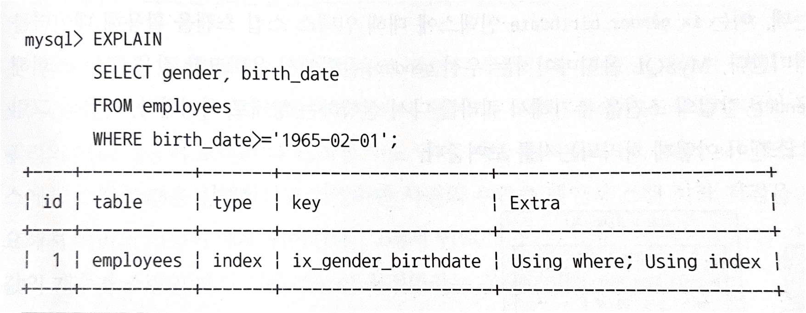
> 
> - `type`칼럼이 `index`이므로, 인덱스를 처음부터 끝까지 읽었다는 의미가 됨
> - 즉, 인덱스 풀 스캔이 이루어짐
> - 인덱스를 효율적으로 사용하지 못함

> #### 인덱스 스킵 스캔을 사용할 때
> 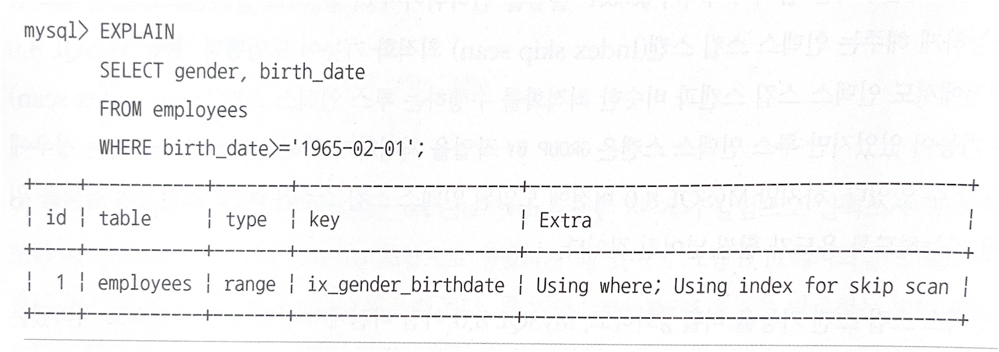
> 
> - `type`칼럼이 `range`인 것은, 인덱스에서 필요한 부분만 읽었다는 의미
> - `Using index for skip scan`은, 인덱스 스킵 스캔을 통해 데이터를 조회함
> - 이 과정에서, `gender`칼럼에 대한 조건문을 넣어서 인덱스를 사용하도록 한다.
> 
> 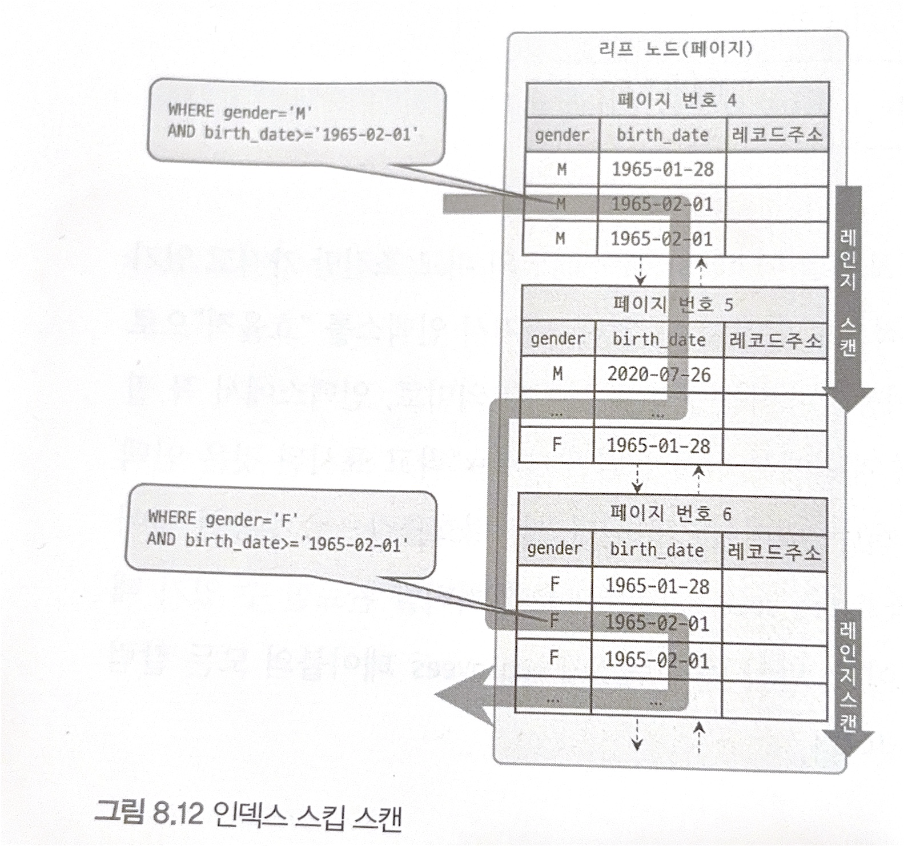
> - `gender`의 유니크 값이 `M`, `F` 두 개이다.
> - MySQL의 옵티마이저는 아래 두 쿼리처럼 `gender`칼럼에서 비교하는 쿼리로 변경하여 최적화를 진행한다.
> ```sql
> mysql> SELECT gender, birth_date FROM employees WHERE gender='M' AND birth_date >= '1965-02-01';
> mysql> SELECT gender, birth_date FROM employees WHERE gender='F' AND birth_date >= '1965-02-01';
> ```
> 
> #### 단점
> - 인덱스 스킵 스캔은 루스 인덱스 스캔의 단점을 보완했지만, 아래와 같은 단점이 있다.
> 1. WHERE 조건절에 조건이 없는 인덱스의 선행 칼럼의 유니크한 값의 개수가 적어야 함
>    - 간단히 말해서, 위의 `gender`처럼 유니크한 값이 2개 (`M`, `F`)가 아닌, 개수가 매우 많을 때
>    - 옵티마이저는 유니크한 값을 구하기 위해 스캔지점을 검색하는 작업이 많아짐
>    - 즉, 조건을 걸지 않은 선행 칼럼은 유니크한 값의 개수가 적어야 함
> 2. 쿼리가 인덱스에 존재하는 칼럼만으로 처리 가능해야함 (커버링 인덱스)
>   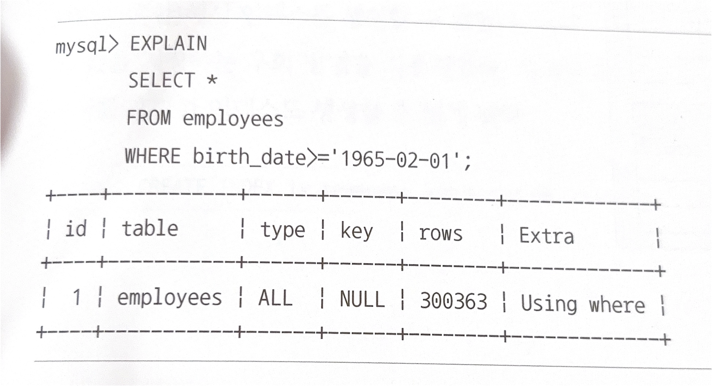
>   - 위 예시에서, `employees`의 모든 칼럼을 SELECT하므로, 인덱스에 있는 데이터로는 조회할 수가 없다.
>   - 즉, 인덱스 스킵 스캔을 사용하지 못하고, 풀 테이블 스캔으로 실행계획을 수립하였다. (`type` : `ALL`)


### 8.3.5 다중 칼럼 인덱스
- 두 개 이상의 칼럼으로 구성된 인덱스를 다중 칼럼 인덱스라고 함
- 인덱스를 생성할 때의 칼럼 순서가 중요
- 두 번째 칼럼부터는, 이전의 칼럼의 정렬에 의존
- 즉, 칼럼의 값이 작더라도, 이전 칼럼의 값에 의해 맨 마지막에 위치할 수도 있음

### 8.3.6 B-Tree 인덱스의 정렬 및 스캔 방향
- 인덱스 생성 시, 각 칼럼에 대해 오름차순·내림차순 설정을 적용할 수 있음
- 한 쪽의 정렬을 사용했다 해도, 그 순서로만 읽을 수 있는 건 아님
  - 인덱스를 거꾸로 읽으면, 정렬한 반대로도 가능

#### 8.3.6.1 인덱스 정렬
```sql
mysql> CREATE INDEX ix_teamname_userscore ON employees (team_name ASC, user_score DESC);
```
- 위 쿼리와 같이 정렬 순서 혼합도 가능


##### 8.3.6.1.1 인덱스 스캔 방향
```sql
mysql> SELECT *
       FROM employees
       ORDER BY first_name DESC
       LIMIT 1;
```
- `first_name`칼럼으로 인덱스를 가진 `employees`테이블에 대해 다음과 같은 쿼리를 실행한다.
- 만약 인덱스를 오름차순으로 스캔한다면, 모든 레코드 다 읽고 마지막 레코드 하나만 가져올 것이다.
- 하지만 인덱스를 역순(내림차순)으로 스캔한다면, 바로 첫 번째 레코드만 읽을 수 있다.
- 이를 활용하여, 옵티마이저는 ORDER BY, MIN(), MAX()같은 함수의 최적화도 읽기 방향을 설정해서 실행 계획을 만들어낸다.


##### 8.3.6.1.2 내림차순 인덱스
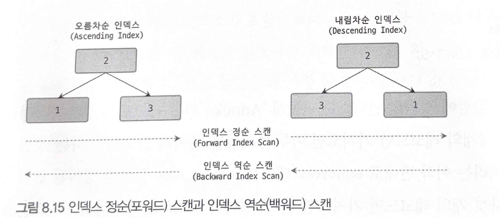
- 오름차순 인덱스 : 작은 값의 키가 B-Tree의 왼쪽으로 정렬된 인덱스
- 내림차순 인덱스 : 큰 값의 키가 B-Tree의 왼쪽으로 정렬된 인덱스
- 인덱스 정순 스캔 : 리프노드의 왼쪽부터 오른쪽으로 스캔
- 인덱스 역순 스캔 : 리프노드의 오른쪽부터 왼쪽으로 스캔

> - 이때, 정순 스캔보다 역순 스캔이 더 빠름
> - 역순 스캔을 사용하기 보다, 내림차순 인덱스를 생성하여 인덱스 정순 스캔을 하는 것이 더 효율적임
> 
> ##### 역순 스캔이 더 느린 이유
> 1. 페이지 잠금이 인덱스 정순 스캔에 적합함
> 2. 페이지 내에서 인덱스 레코드가 단방향으로 연결되어 있음
> 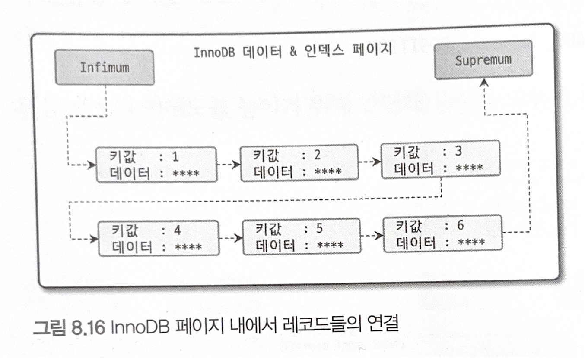 

- 즉, 자주 사용되는 정렬 순서대로 인덱스를 생성하는 것이 효율적임