## B-Tree 인덱스의 가용성 & 효율성
- 경우에 따라 인덱스 사용 여부와 효율성이 달라짐
  - 이러한 경우를 숙지해야 쿼리를 최적화하거나 쿼리에 맞는 인덱스를 생성할 수 있음

### 비교 조건의 종류와 효율성
- 동등비교("="), 크다(">"), 작다("<") 범위 조건에 따라 인덱스 활용 형태가 달라짐
- 또한, 비교하고자 하는 인덱스 칼럼의 순서에 따라 효율이 달라짐
```sql
SELECT * FROM dept_emp
WHERE dept_no='d002' AND emp_no >= 10114;
```
- 위 쿼리는 dept_no가 'd002'이고, emp_no가 10114와 크거나 같은 레코드를 조회한다.
- 아래 두 개의 칼럼 순서가 다른 인덱스가 있다.
```sql
CASE A : INDEX(dept_no, emp_no)
CASE B : INDEX(emp_no, dept_no)
```
- 케이스 A : dept_no 칼럼에 대한 조건을 먼저 필터링 후, emp_no에 대해 스캔을 진행
  - 위 쿼리를 적용하면, dept_no = 'd002'이면서 emp_no >= 10114인 첫 번째 레코드를 읽고, dept_no가 `d003`이 아닐 때까지 순차적으로 인덱스를 읽으면 된다.
  - 정리하자면, 읽은 레코드로부터 다음 레코드를 읽으면 무조건 조건에 맞는 레코드 (마지막 레코드를 읽지 않는 한)
- 케이스 B : emp_no 칼럼에 대해 조건을 먼저 필터링 후, dept_no에 대해 스캔을 진행
  - 위 쿼리를 적용하면, 우선 emp_no >= 10114 이면서 dept_no = 'd002'인 레코드를 먼저 찾고, 그 이후 모든 레코드에 대해 dept_no가 'd002'인 레코드를 찾아야 한다.
  - 케이스 B는 케이스 A에 비해 많은 레코드를 비교 검색을 진행한다.
  - 다음 레코드를 읽으면 조건에 맞지 않을 확률 큼

    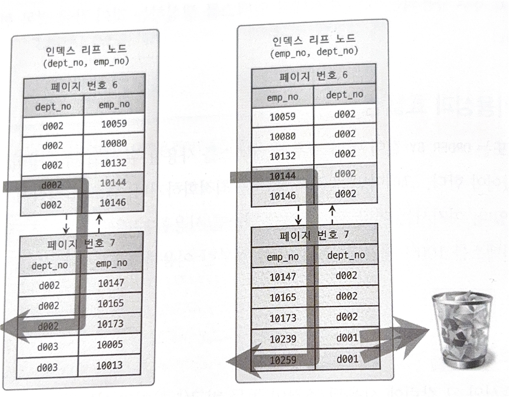


#### 필터링
- 인덱스를 통해 읽은 레코드가 나머지 조건에 맞는지 비교하면서 선택하는 작업
- 위 예시를 기준으로, emp_no는 필터링이 제대로 기능하지 못함을 알 수 있다.

#### 작업 범위 결정 조건
- 비교 작업의 범위를 결정하는 조건

#### 필터링 조건
- 비교 작업의 범위를 줄이지 못하는 단순한 필터링 조건

> 케이스 A : `dept_no`, `emp_no` 모두 비교 작업의 범위를 줄여주는 작업 범위 결정 조건 <br>
> 케이스 B : `emp_no`는 작업 범위 결정 조건, 반면 `dept_no`는 필터링 조건으로 사용 (작업의 범위를 줄이지 못하고 풀 스캔을 때림)

---
### 인덱스의 가용성
- B-Tree 인덱스의 특징 : 왼쪽 값을 기준으로 정렬이 진행됨
- 이러한 특징으로 인덱스를 통한 빠른 검색을 진행하고자 해도, 값의 왼쪽 부분이 없으면 레인지 스캔 방식을 사용할 수 없음
> ### 예)
> `INDEX(name)` <br>
> `SELECT * FROM employees WHERE name LIKE '%mer;`
> - 위 쿼리는 `mer`로 끝나는 name을 찾는 쿼리이다.
> - 하지만 인덱스는 왼쪽부터 a ~ z 순서대로 값이 정렬되어 있으므로, 모든 인덱스 레코드를 탐색해야 `mer`로 끝나는 레코드를 찾을 수 있다.
> - 반면, `abc`로 시작하는 name의 레코드를 찾는다고 가정하자.
> - 그러면 모든 레코드를 순회하지 않아도 `abc`로 시작하는 name을 가진 레코드를 레인지 스캔으로 빠르게 검색할 수 있음

- 또 다른 특징으로, 칼럼 순서에 따라 인덱스 스캔 방식이 달라진다.
> ### 예)
> `INDEX(dept_no, emp_no)` <br>
> `SELECT * FROM dept_emp WHERE emp_no >= 10144;`
> - 위 쿼리는 `emp_no`가 10144 이상인 레코드를 조회하는 쿼리이다.
> - 하지만 인덱스는 `emp_no`로 정렬되어있지 않고, `dep_no`으로 정렬되어있다.
> - `dep_no`에 대한 조건 없이, `emp_no`값으로만 검색하면 레인지 스캔 방식을 사용하지 못하고 풀 스캔 방식으로 인덱스를 스캔해야한다.


### 인덱스를 사용할 수 없는 조건 (가용성과 효율성 판단)

#### 1. NOT-EQUAL로 비교된 경우
- `<>` -> `WHERE column <> 'N'`
- `NOT IN` -> `WHERE column NOT IN (10, 11, 12)`
- `IS NOT NULL` -> `WHERE column IS NOT NULL`
- `NOT BETWEEN`

#### 2. LIKE '%??' 형태로 문자열 패턴이 비교된 경우
- `WHERE column LIKE '%승환'`
- `WHERE column LIKE '_승환'`
- `WHERE column LIKE '%승%'`

#### 3. 스토어드 함수나 연산자로 인덱스 칼럼이 변형된 후 비교된 경우
- `WHERE SUBSTRING(column, 1, 1) = 'X'`
- `WHERE DAYOFMONTH(column) = 1`

#### 4. NOT-DETERMINISTIC 속성의 스토어드 함수가 비교 조건에 사용된 경우
- `not-dterministic`속성이란, 그때그때 값이 바뀌는 함수.
- 예를 들어, get_now()같은 실시간으로 바뀌는 시간 같은 속성에 관련한 함수,
- RAND()와 같은 랜덤 함수

#### 5. 데이터 타입이 서로 다른 비교 (한쪽에서 데이터 타입을 변경해야 함)
- `WHERE char_column = 10` // 데이터 불일치

#### 6. 문자열 데이터 타입의 콜레이션이 다른 경우
- 콜레이션이란? : 문자열을 비교하고 정렬하는 기준 (인코딩, 대소문자 구분 등...)
- `WHERE utf8_bin_char_column = euckr_bin_char_column`

> ### MySQL에서의 Null
> - 일반적인 DBMS에서는 NULL 값이 인덱스에 저장되지 않지만,
> - MySQL에서는 NULL값이 인덱스에 저장됨
> - `WHERE column IS NULL`과 같이 범위 결정 조건으로 인덱스 사용 가능

### 다중 칼럼 인덱스의 사용 조건
```sql
INDEX ix_test(col_1, col_2, col_3, ... , col_n)
```
#### 작업 범위 결정 조건으로 인덱스를 사용하지 못하는 경우
- col_1에 대한 조건이 없는 경우
- col_1의 비교 조건이 인덱스 사용 불가 조건인 경우

#### 작업 범위 결정 조건으로 인덱스를 사용하는 경우
- col_1 ~ col_(i-1)까지 동등 비교 형태로 비교
- col_i 칼럼에 대해 동등 비교, 범위 비교, LIKE 좌측 일치 비교일 때


## R-Tree 인덱스

- 공간 인덱스 : R-Tree 인덱스 알고리즘을 활용하여 2차원 데이터를 인덱싱하고 검색하는 목적의 인덱스
- `B-Tree` : 1차원 인덱스
- `R-Tree` : 2차원 인덱스

<br>

- MySQL의 공간확장
1. 공간 데이터를 저장할 수 있는 데이터 타입 -> `POINT`,`LINE`, `POLYGON`, `GEOMETRY`
2. 공간 데이터의 검색을 위한 공간 인덱스 -> `R-Tree`
3. 공간 데이터의 연산 함수

### 구조 및 특성
- 공간 정보를 담기 위해 `POINT`,`LINE`, `POLYGON`, `GEOMETRY` 네 가지의 타입을 지원
- **MBR (Minimum Bounding Rectangle)** : 해당 도형을 감싸는 최소 크기의 사각형
  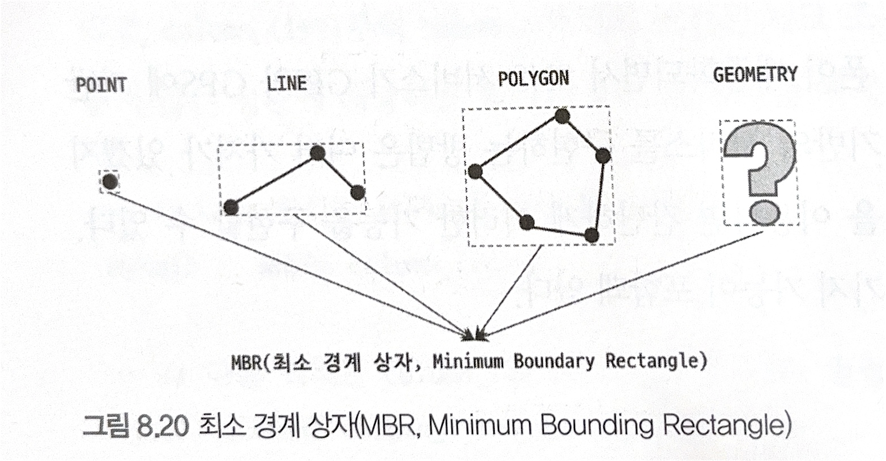
- R-Tree : 이러한 MBR의 포함 관계를 B-Tree 형태로 구현한 인덱스

<br><br>

- 아래 그림과 같이 일련의 공간 데이터를 MBR를 활용하여 포함관계를 나타낼 수 있다.
  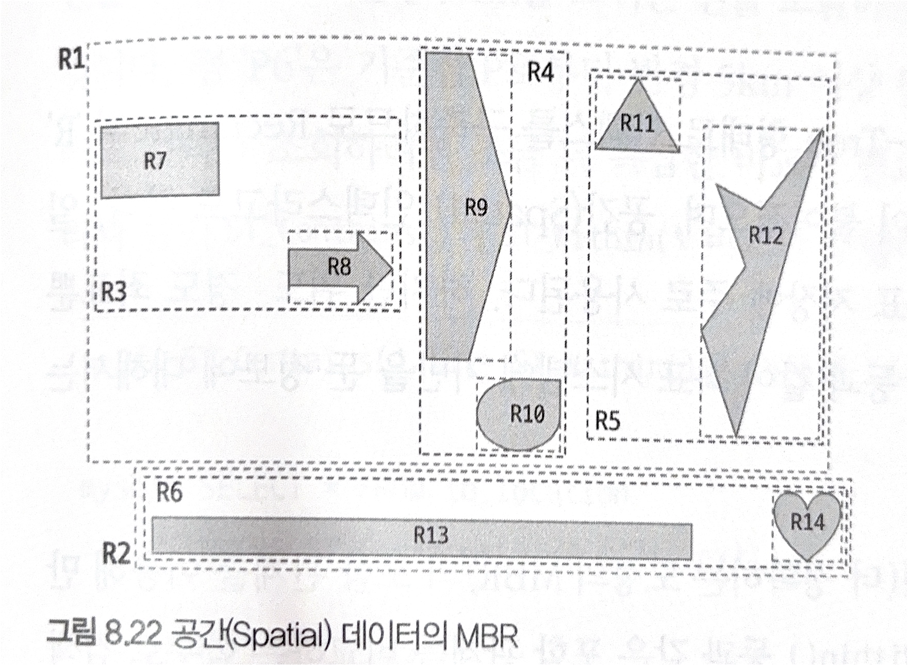

- 최상위 레벨 : R1, R2
- 차상위 레벨 : R3, R4, R5, R6
- 최하위 레벨 : R7 ~ R14

    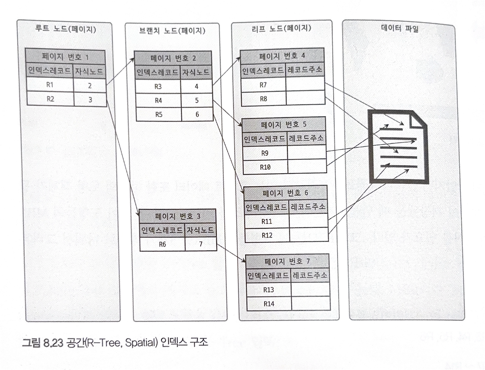

- 위와 같이 인덱스로 표현할 수 있음

### R-Tree 인덱스의 용도
- `ST_Contains()`, `ST_Within()`과 같은 포함 관계를 비교하는 함수를 통해 인덱스 검색을 진행할 수 있음
<img5>

- 점P를 기준으로 반경5km를 최소 사각형으로 포함 관계 비교를 수행한다.
- 이때 점P6은 반경 5km이상은 떨어져있지만 최소 사각형 내에는 포함되어 있다.
- P6을 제외하려면 좀 더 정교한 연산이 필요하지만, 최소 사각형으로 먼저 빠르게 연산을 수행할 수 있다는 장점이 있다.
- P6을 제외해야한다면, `ST_Contains()`결과에 `ST_Distance_Sphere()`함수를 통해 다시 한번 필터링해야한다.


## 전문 검색 인덱스
- 지금까지의 인덱스는 실제 모든 컬럼 값을 활용하지 않고 3072바이트(InnoDB)까지만 잘라서 인덱스 키로 사용한다.
- 즉, 전문(Full Text)를 검색하는 것에는 한계가 존재한다.
- 이때 전문 검색을 위한 인덱스가 존재한다. (InnoDB 중심으로)

### 인덱스 알고리즘
- 전문 검색에서는, 본문 내용에서 사용자가 검색하게 될 키워드를 분석하여 인덱스를 구축한다.
- 이때 키워드 분석 및 인덱스 구축에는 다양한 방식이 존재한다.
- 키워드 인덱싱 기법에 따라 크게 어근 분석과 n-gram 분석 알고리즘으로 구분할 수 있음

#### 어근 분석 알고리즘
- 어근 분석 알고리즘은 불용어 처리와 어근 분석을 통해 인덱싱 작업을 수행함
  - 불용어 처리
    - 검색에서 가치가 없는 단어를 필터링하여 제거하는 작업
    - 개수가 많지 않기 때문에 상수로 정의해서 사용하기도 함
    - 사용자가 추가하거나 삭제할 수 있게 구현하기도 함
  - 어근 분석
    - 검색어로 선정된 단어의 뿌리인 원형을 찾는 작업
    - MySQL에서는 오픈소스 라이브러리 MeCab을 사용할 수 있음
    - 이를 한글에 맞게 완성도를 갖추는 작업은 노력이 많이 필요함


#### n-gram 알고리즘
- 어근 분석 알고리즘을 보완 n-gram 알고리즘이 존재
- 본문을 몇 글자씩 잘라서 인덱싱하는 방법
- 특징
  - 알고리즘이 단순
  - 국가별 언어에 대한 이해 및 준비 작업이 필요없음
  - n-gram에서 n은 키워드를 쪼갤 글자수를 의미 (보통 2글자씩 쪼개기에 2-gram 알고리즘이라고도 함)

> ##### n-gram 알고리즘 예시
> ```text
> To be or not to be. That is the question.
> ```
> - 위 문장을 2-gram 알고리즘으로 분리하면, 아래와 같이 분리된다.
> 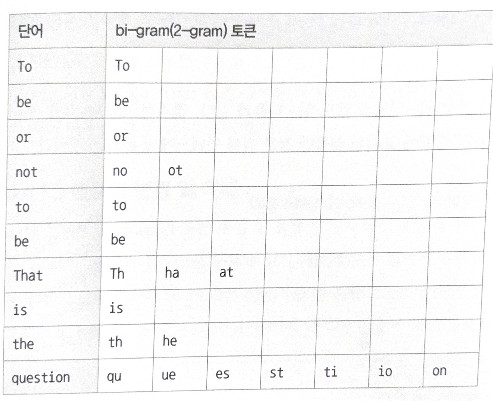
>
> - 분리된 토큰들에 대해, MySQL서버는 불용어를 걸러낸다.
> - 이때 불용어는 테이블에 저장되어있으며, 아래 명령어를 통해 어떤 불용어가 내장되어 있는지 확인할 수 있다.
> ```sql
> SELECT * FROM information_schema.INNODB_FT_DEFAULT_STOPWORD;
> ```
>
> <br>
>
> - 이후 분리된 토큰에 대해 불용어를 제외한다.
>
> 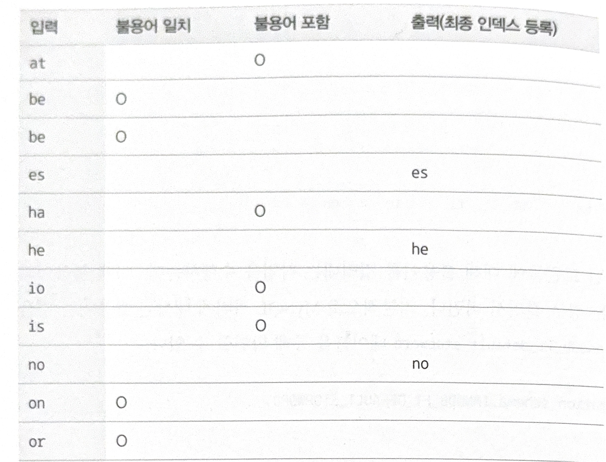
>
> - 위 표를 기반으로, `To be or not to be. That is the question.`문장에 대해 인덱스에 최종으로 등록되는 것들은 `es`, `he`, `no`가 된다. 
> - 이때 불용어로 `a`, `i` 철자가 등록되어있어, 이 문자들이 포함된 단어들은 모두 불용어로 걸러지게 된다.
> - 이러한 문제로 인해, MySQL서버에 내장된 불용어 목록을 비활성화 하거나, 새로 등록하고 삭제하는 방법이 있다.


#### 불용어 변경 및 삭제

##### 1. MySQL 시스템 변수 활용
- MySQL 설정 파일(`my.cnf`)에 `ft_stopword_file`라는 시스템 변수가 존재한다.
- 해당 변수에 빈 문자열을 넣으면 내장된 기본 불용어가 비활성화된다.
```text
ft_stopword_file=''
```
- 사용자가 직접 정의한 불용어 목록을 저장한 파일의 경로를 변수에 넣어 불용어 목록을 변경할수도 있다.

##### 2. InnoDB 스토리지 엔진에서의 불용어 처리
- MySQL 설정 파일의 `innodb_ft_enable_stopword` 시스템 변수를 OFF로 설정하여 불용어를 비활성화 할 수 있다.
```sql
SET GLOBAL innodb_ft_enable_stopword=OFF;
```
- 해당 변수는 동적 시스템 변수이므로 서버를 재시작할 필요가 없다.
- 불용어 목록을 변경하는 방식은 아래와 같다.
```sql
CREATE TABLE my_stopword(value VARCHAR(30)) ENGINE = INNODB;
INSERT INTO my_stopword(value) VALUES ('MySQL');

SET GLOBAL innodb_ft_server_stopword_table='mydb/my_stopword';
ALTER TABLE tb_bi_gram ADD FULLTEXT INDEX fx_title_body(title, body) WITH PARSER ngram;
```
- `innodb_ft_server_stopword_table` 글로벌 변수에 불용어 목록 테이블 이름을 설정한다.
- 불용어 테이블 설정 이후 전문(Full Text) 검색 인덱스를 생성해야 변경된 불용어가 적용된다.


### 전문 검색 인덱스의 가용성
- 전문(full text) 검색 인덱스를 사용하기 위한 두 가지 조건이 있다.
1. 쿼리 문장이 전문 검색을 위한 문법을 사용 (MATCH .. AGAINST ..)
2. 테이블이 전문 검색 대상 칼럼에 대해 전문 인덱스를 보유

- 전문 검색 인덱스 생성은 아래와 같이 할 수 있다.
```sql
CREATE TABLE tb_test (
    doc_id INT,
    doc_body TEXT,
    PRIMARY KEY (doc_id),
    FULLTEXT KEY fx_docbody (doc_body) WITH PARSER ngram
) ENGINE=InnoDB;
```
- 이러한 전문 검색 인덱스에 대해 일반 검색 쿼리로도 검색이 가능하지만,
```sql
SELECT * FROM tb_test WHERE do_body LIKE '%애플%';
```
- 이는 인덱스의 장점을 활용하지 못하는 풀 테이블 스캔을 사용한 결과를 내놓는다.

```sql
SELECT * FROM tb_test WHERE MATCH(doc_body) AGAINST('애플' IN BOOLEAN MODE);
```
- 위와 같은 구문을 통해 검색 쿼리르 작성해야 전문 검색 인덱스로 쿼리 결과를 얻을 수 있다. (`BOOLEAN MODE`는 키워드 매칭)
- 이때 전문 검색 인덱스를 구성하는 칼럼들은 MATCH절의 괄호에 모두 명시되어야 한다.


## 함수 기반 인덱스
- 함수 기반 인덱스를 통해 칼럼에 미리 변형을 주어 인덱스를 생성할 수 있다.
- 가상 칼럼, 함수 두 가지를 통해 함수 기반 인덱스를 만들 수 있다. 두 가지 방식 모두 방식의 차이일 뿐 내부적 구조는 동일하다.

### 가상 칼럼을 이용한 인덱스
```sql
CREATE TABLE user (
    user_id BIGINT,
    first_name VARCHAR(10),
    last_name VARCAHR(10),
    PRIMARY KEY (user_id)
);
```
- 위와 같은 테이블이 있다고 가정하자.
- 이때 first_name과 last_name을 합쳐서 검색을 진행해야 한다면,
- full_name이라는 가상 칼럼ㅇ르 추가하여 인덱스를 생성할 수 있다.
```sql
ALTER TABLE user
ADD full_name VARCHAR(30) AS (CONCAT(first_name, ' ', last_name)) VIRTUAL,
ADD INDEX ix_fullname (full_name);
```
- 이름만 가상칼럼이지, 실제로 테이블에 새로운 칼럼이 추가된다.

### 함수를 이용한 인덱스
- 가상 칼럼과 다르게, 테이블 구조를 변경하지 않고 함수를 직접 사용하는 인덱스를 생성할 수 있다.
```sql
CREATE TABLE user (
    user_id    BIGINT,
    first_name VARCHAR(10),
    last_name  VARCHAR(10),
    PRIMARY KEY (user_id),
    INDEX      ix_fullname ((CONCAT(first_name, ' ', last_name)))
);
```
- 이때 주의해야할 점은, 해당 인덱스를 사용하기 위해서는 인덱스를 생성할 때 사용한 표현식을 그대로 가져와 쿼리에 사용해야한다는 점이다.
```sql
SELECT * FROM user WHERE CONCAT(first_name, ' ', last_name) = 'Matt Lee';
```


## 멀티 밸류 인덱스
- 멀티 밸류 인덱스는 **하나의 레코드**에 **여러 개의 키값**을 가지는 인덱스이다.
- JSON 타입 지원을 위한 것

```sql
CREATE TABLE user (
    user_id BIGINT AUTO_INCREMENT PRIMARY KEY,
    first_name VARCHAR(10),
    last_name VARCHAR(10),
    credit_info JSON,
    INDEX my_creditscores ( (CAST(credit_info->'$.credit_scores' AS UNSIGNED ARRAY)) )
);
```
- 위 DDL과 같이, JSON타입으로 INDEX를 생성 가능

```sql
SELECT * FROM user WHERE 360 MEMBER OF (credit_info->'$.credit_scores');
```
- `credit_info`이라는 JSON형식의 칼럼에서 `credit_scores`라는 속성에 360이라는 값이 있는지 `MEMBER OF` 함수를 통해 쿼리를 생성할 수 있다.
- `MEMBER OF ()` 이외에도 `JSON_CONTAINS ()`, `JSON_OVERLAPS ()` 함수를 통해 멀티 밸류 인덱스에서 값을 찾아올 수 있다.


## 클러스터링 인덱스
- MySQL에서 클러스터링이란, 테이블의 레코드를 비슷한 것끼리 묶어 저장하는 것 (예 : 프라이머리 키 기준으로 정렬)
- 이는 주로 비슷한 값들을 동시에 조회하는 경우가 많다는 점에서 장점이 됨
- InnoDB에서는 데이터가 프라이머리 키로 정렬되어 인덱스 형식으로 저장되므로 프라이머리 인덱스이다. (= 클러스터링 인덱스)
- 프라이머리 키가 변경된다면, 해당 레코드의 물리적 위치 또한 변경되어야 하므로, 한 번 정한 프라이머리 키는 변경되지 않아야 한다.

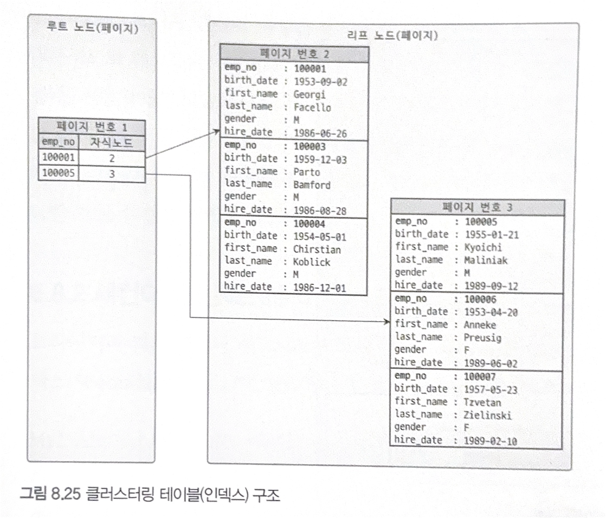

- InnoDB 스토리지 엔진 특성 상, 리프 노드의 값이 물리적인 주소가 아니라 실제 레코드의 값이 들어가 있다.


### 세컨더리 인덱스에 미치는 영향
- 세컨더리 인덱스 : 프라이머리 키가 아닌 칼럼으로 정렬된 인덱스
- MyISAM이나, MEMORY 테이블 같은, 클러스터링 인덱스가 아닌 테이블은 실제 데이터가 삽입 순서대로 디스크에 저장된다.
- 이는 프라이머리 키로 클러스터링 된 인덱스를 사용하여도 결국 데이터를 디스크에서 찾아야 한다는 의미이다.
- 즉, 디스크에 프라이머리 키로 정렬되어 있지 않기 때문에 프라이머리 인덱스와 세컨더리 인덱스는 동일한 기능을 수행하는 인덱스이다.
  - 프라이머리 인덱스를 사용하더라도 디스크에 프라이머리 키로 정렬되어 있지 않기 때문에 결국 ROWID(레코드 주소)를 받아서 해당 위치의 레코드를 읽음
  - 프라이머리 키가 아닌 다른 칼럼으로 정렬된 세컨더리 인덱스를 사용하더라도 ROWID를 받아 데이터를 읽음
  - 프라이머리 인덱스 == 세컨더리 인덱스
  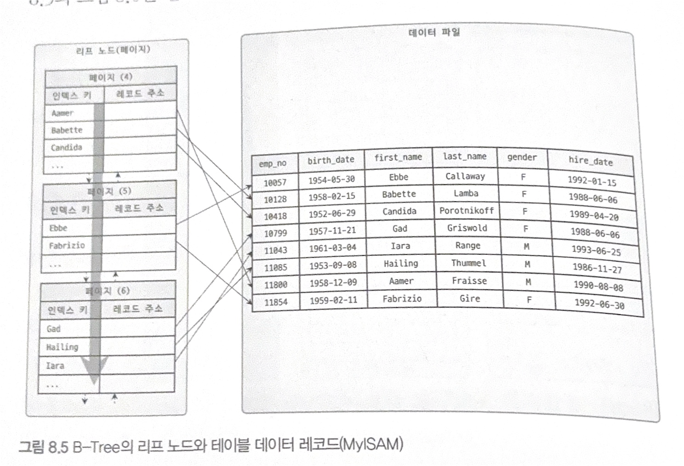
> #### MyISAM에서의 세컨더리 인덱스
> - 세컨더리 인덱스를 검색해서 레코드의 주소를 확인
> - 레코드의 주소를 통해 최종 레코드를 가져옴

- 이와 다르게, InnoDB 스토리지 엔진의 세컨더리 인덱스는, 프라이머리 키 값을 저장한다.
- 이를 통해, 세컨더리 인덱스를 통해 데이터를 조회하면 무조건 프라이머리 인덱스를 한 번 더 거쳐야한다.
  
> #### InnoDB에서의 세컨더리 인덱스
> - 세컨더리 인덱스를 검색해 프라이머리 키 값을 확인
> - 이후 프라이머리 키를 통해 프라이머리 인덱스에서 레코드를 자겨옴

### 클러스터링 인덱스의 장점
1. 프라이머리 키로 검색할 때 성능이 매우 빠름
2. 세컨더리 인덱스가 모두 프라이머리 키를 가지고 있기에 세컨더리 인덱스만으로 처리할 수 있는 경우가 많음 (커버링 인덱스)

### 클러스터링 인덱스의 단점
1. 모든 세컨더리 인덱스가 프라이머리 키를 가지고 있기 때문에 프라이머리 키의 값이 큰 경우 용량을 많이 먹음
2. 세컨더리 인덱스로 검색할 때 프라이머리 인덱스로 다시 한 번 검색해야하기에 성능이 느림
3. INSERT시 삽입 순서가 아닌, 프라이머리 키 순서로 저장되므로 성능이 느림
4. 프라이머리 키를 변경할 때, 인덱스를 갱신해야하는 문제 발생

### 클러스터링 테이블 사용 시 주의사항
#### 1. 클러스터링 인덱스 키의 크기
- 세컨더리 인덱스가 테이블 당 4~5개 정도 생성된다고 할 때, 프라이머리 키의 크기에 따라 인덱스 크기가 급격히 증가할 수 있음
> ##### 예)
> - 프라이머리 키가 10바이트 일 때
>   - 100만 건 레코드 저장 시 인덱스 크기 : 47MB
> - 프라이머리 키가 20바이트 일 때
>   - 100만 건 레코드 저장 시 인덱스 크기 : 238MB

- Spring JPA에서 `Long`타입으로 Id 설정 시, DB에서는 BIGINT로 타입캐스팅되어 8바이트로 크기가 설정됨

#### 2. 프라이머리 키는 AUTO-INCREMENT보다 업무적인 칼럼 사용
- 프라이머리 키 값에 의해 레코드의 위치가 결정되므로 서비스적으로 특정 프라이머리 키가 해당 레코드를 대표할 수 있도록 하는 것이 좋음
> #### 예)
> - 주문 테이블에서 프라이머리 키를 AUTO-INCREMENT로 설정하기 보다,
> - order_id = `ORDER-20250205-000123` 이런 식으로 ORDER-{날짜}-{AUTO-INCREMENT}로 설정하면 프라이머리 키 값만 보고도 주문 데이터에 언제 생성된 데이터인지 한 눈에 알 수 있음


#### 3. 프라이머리 키는 반드시 명시
- 프라이머리 키를 명시하지 않으면 InnoDB는 임의의 칼럼을 추가함
- 이렇게 스토리지 엔진이 추가한 칼럼은 사용자가 접근할 수 없으므로 직접 프라이머리 키를 명시하는 것을 추천


#### 4. AUTO-INCREMENT 칼럼을 인조 식별자로 사용할 경우
- 여러 개의 칼럼이 합쳐져 프라이머리 키가 만들어질 때, 크기가 과도하게 크다면 AUTO-INCREMENT 옵션을 쓰는 것도 좋은 방법
- INSERT 위주의 테이블은 AUTO-INCREMENT를 프라이머리 키로 설정하는 것이 좋음

## 유니크 인덱스
- 칼럼에 같은 값이 2개 이상 저장될수 없다는 제약조건
- 인덱스 없이 유니크 제약을 설정할 수 없음 -> 즉 유니크 제약을 걸면 인덱스가 생김
- but NULL은 특정 값이 아니기 때문에 유니크 인덱스에서도 2개 이상 저장될 수 있음

### 유니크 인덱스와 세컨더리 인덱스의 비교
- 구조적으로 유니크 인덱스와 세컨더리 인덱스의 구조적인 차이는 없음
- 하지만 중복을 허용하냐에 따라 읽기 / 쓰기 관점에서 차이가 발생


#### 인덱스 읽기
- 1개의 레코드를 읽냐(유니크 인덱스), 여러 개의 레코드(세컨더리 인덱스)를 읽냐의 차이가 존재
- 레코드 건수가 같다면, 유니크 인덱스와 세컨더리 인덱스의 성능 차이는 없음
- 하지만 실행 계획이 달라짐

#### 인덱스 쓰기
- 새로운 레코드가 INSERT되거나 변경되는 경우, 유니크 인덱스에서는 추가되는 값이 중복된 값인지 체크하는 과정이 필수
- 유니크 인덱스에서는 중복 값 체크 과정에서 읽기 잠금, 쓰기 잠금, 및 작업을 버퍼링하지 못해 발생하는 성능 문제가 발생  
- 즉, 레코드를 추가하는 작업에서는 세컨더리 인덱스가 유니크 인덱스보다 성능이 더 좋다. (중복 값 체크의 차이)

### 유니크 인덱스 사용 시 주의사항
- 위와 같은 이유로, 성능 측면에서 유니크 인덱스를 생성하기 보다는, 필요에 의해 만드는 것이 권장됨
  - 특정 칼럼에 대해 유니크 인덱스와 세컨더리 인덱스 두 개를 중복으로 만들 필요 없음
  - 유일성이 필요하지 않다면 세컨더리 인덱스를 만드는 것을 추천

## 외래키
- MySQL의 외래키는 InnoDB 스토리지 엔진에서만 사용되는 기능
- 외래키가 설정되면, 연관되는 테이블의 칼럼에 인덱스가 생성됨 (외래키는 중복이 허용되므로 유니크 인덱스는 아님)
- 이때 두 가지의 특징이 있다.
  1. 테이블의 변경이 발생할 때만 잠금 경합(잠금 대기)이 발생
  2. 외래키와 연관되지 않은 칼럼의 변경은 최대한 잠금 경합(잠금 대기)을 발생하지 않는 방향으로 진행

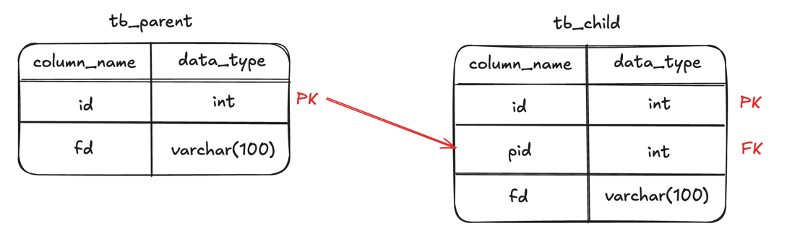


### 자식 테이블의 변경이 대기하는 경우
| 작업 번호 | 커넥션 - 1                                                | 커넥션 - 2                                      |
|-------|--------------------------------------------------------|----------------------------------------------|
| 1     | BEGIN;                                                 |                                              |
| 2     | UPDATE tb_parent <br> SET fd='changed-2' WHERE id = 2; |                                              |
| 3     |                                                        | BEGIN;                                       |
| 4     |                                                        | UPDATE tb_child <br> SET pid=2 WHERE id=100; |
| 5     | ROLLBACK;                                              |                                              |
| 6     |                                                        | Query OK, 1 row affected                     |

- 2번 작업 : 부모 테이블의 id = 2인 레코드의 fd 칼럼을 UPDATE
  - 이때 커넥션1은 부모 테이블의 id = 2인 레코드의 쓰기 잠금 획득 (레코드 락)
- 4번 작업 : 자식 테이블의 id = 100인 레코드의 pid FK를 UPDATE
  - 외래 키(FK)를 변경하는 것은 부모 테이블의 해당 레코드의 쓰기 잠금을 가지고 있어야 함
  - 하지만 2번 작업이 id = 2인 레코드의 쓰기 잠금을 가지고 있음
  - 이때 4번 작업의 쿼리는 2번 작업이 완료될 때까지 대기하게 됨 (쓰기 잠금을 획득하기 위해)
  - 5번 작업에서 커넥션1의 작업이 완료되었을 때 (ROLLBACK, COMMIT), 커넥션2은 부모 테이블의 id = 2인 레코드에 대해 쓰기 잠금을 획득하고 쿼리를 실행함
- 즉, 부모의 작업이 완료될 때까지, 자식 테이블의 변경은 대기하게 됨

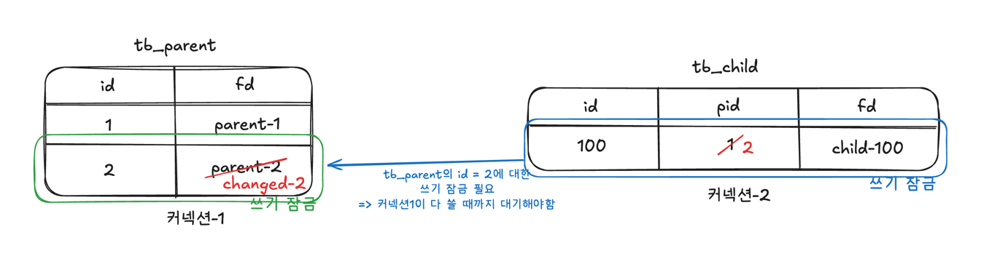


### 부모 테이블의 변경 작업이 대기하는 경우
| 작업 번호 | 커넥션 - 1                                                   | 커넥션 - 2                                 |
|-------|-----------------------------------------------------------|-----------------------------------------|
| 1     | BEGIN;                                                    |                                         |
| 2     | UPDATE tb_child <br> SET fd='changed-100' WHERE id = 100; |                                         |
| 3     |                                                           | BEGIN;                                  |
| 4     |                                                           | DELETE FROM tb_parent<br/>WHERE id = 1; |
| 5     | ROLLBACK;                                                 |                                         |
| 6     |                                                           | Query OK, 1 row affected                |

- 2번 작업 : 자식 테이블의 id = 100인 레코드의 fd 칼럼을 UPDATE
  - 이때 커넥션1은 자식 테이블의 id = 100인 레코드의 쓰기 잠금을 획득 
- 4번 작업 : 부모 테이블의 id = 1인 레코드를 DELETE
  - 이때 부모 테이블의 레코드를 삭제하므로, DDL에서 설정한 외래키의 특성 (ON DELETE CASCADE)에 의해 부모 레코드가 삭제되면 연관된 자식 레코드도 삭제되어야 함
  - 즉, id = 1를 외래 키로 가지는 자식 테이블의 레코드의 쓰기 잠금을 추가로 가져야 함 
  - 하지만 커넥션1이 해당 레코드의 쓰기 잠금을 가지고 있음 -> 쿼리 실행 불가
  - 커넥션1이 해당 잠금을 반환할 때까지 대기(ROLLBACK or COMMIT)

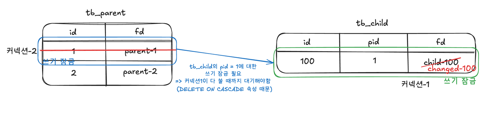
