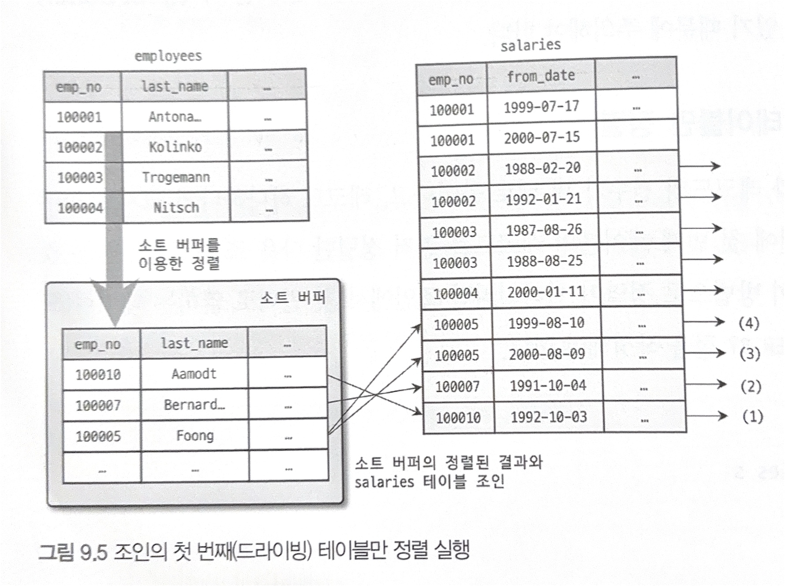
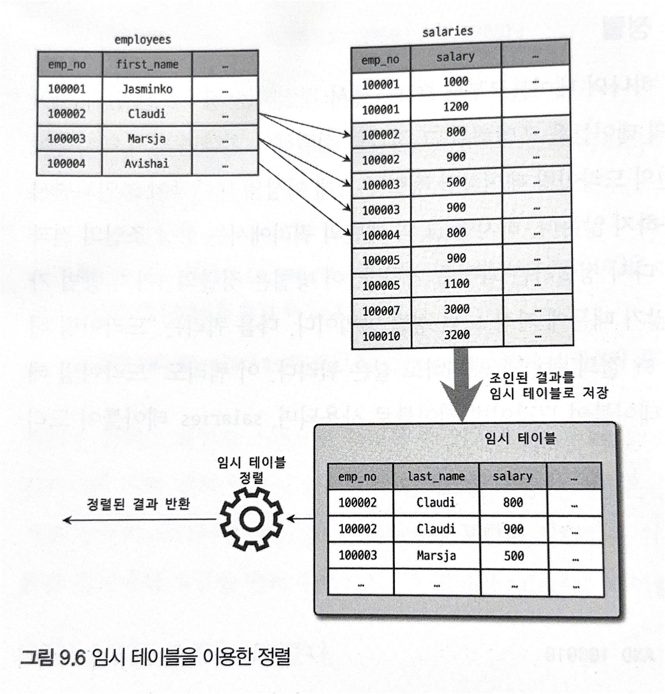

# 9️⃣옵티마이저와 힌트
- 쿼리의 결과가 같을지라도 그 결과를 만들어내는 과정은 매우 다양하다.
- MySQL 서버에서 어떤 방법이 최적이고 최소의 비용이 드는지 실행 계획을 수립하는 작업을 수행한다.
- 이를 통해 데이터를 가공하는 기본 절차와 빠른 성능을 보장한다.
- MySQL에서는 `EXPLAIN`이라는 명령으로 특정 쿼리의 실행 계획을 확인할 수 있다.

### 9.1.1 쿼리 실행 절차
- 쿼리 실행 절차는 크게 3단계로 구분됨
1. 사용자로부터 요청된 SQL문장을 쪼개 MySQL서버가 읽을 수 있는 파스 트리를 생성한다.
   - 파싱은 SQL파서 모듈에서 처리
   - 문법적으로 잘못되었을 때 해당 단계에서 걸러짐
2. 파스 트리를 확인하며 어떤 테이블을 읽고 어떤 인덱스를 사용할 지 선택한다.
   - 해당 작업은 옵티마이저에서 수행 & 아래와 같은 작업 진행 
   - 불필요한 조건 제거
   - 테이블 읽기 순서 결정
   - 각 테이블 조건과 인덱스 통계 정보를 통해 사용할 인덱스 결정
   - 가져온 레코드들을 다시 한번 더 가공해야 하는지 결정
3. 전 단계에서 선택된 테이블·인덱스를 사용해 스토리지 엔진으로부터 데이터를 가져온다.
   - 스토리지 엔진에 레코드를 읽어오도록 수행
   - MySQL 엔진에서는 받은 레코드를 조인 or 정렬 진행


### 9.1.2 옵티마이저 종류
- 규칙 기반 최적화 방법과 비용 기반 최적화 방법으로 나뉜다.
#### 1. 규칙 기반 최적화
- 현재 대부분의 DBMS가 선택하고 있는 방법
- 대상 테이블의 레코드 건수, 선택도를 고려하지 않고 옵티마이저에 내장된 우선순위에 따라 실행 계획 수립
- 같은 쿼리에 대해 항상 같은 실행 방법을 만들어냄

#### 2. 비용 기반 최적화
- 쿼리를 처리하기 위한 여러 방법을 만들고, 각 단위의 작업 비용정보와 대상 테이블의 통계 정보를 이용해 실행 계획별 비용을 산출한다.
- 이때 최소로 소요되는 처리 방식을 선택해 쿼리를 실행한다.
- 현재 대부분의 RDBMS가 활용하는 옵티마이저 방식이다.

## 9.2 기본 데이터 처리

### 9.2.1 풀 테이블 스캔과 풀 인덱스 스캔
- 옵티마이저는 다음과 같은 조건일 때 **풀 테이블 스캔**을 진행한다.
  1. 레코드 건수가 너무 작아 인덱스를 사용하는 의미가 없을 때 (테이블이 한 개의 페이지로 구성된 경우)
  2. `WHERE`절이나 `ON`절에 인덱스를 이용할 수 있는 조건이 없는 경우
  3. 인덱스 레인지 스캔을 사용할 수 있는 쿼리더라도 조건 일치 레코드가 너무 많은 경우

- InnoDB 스토리지 엔진에서는 풀 테이블 스캔 시 여러 개의 페이지를 미리 읽어들인다.
  - 리드 어헤드를 통해 백그라운드 스데르에서 요청이 오기 전 미리 InnoDB 버퍼 풀에 가져다놓음
  - `innodb_read_ahead_threshold` 시스템 변수를 통해 엔지 리드 어헤드를 시작할지 임계값을 설정할 수 있음
  - 해당 옵션을 낮게 설정하여 빨리 리드 어헤드가 시작되게 유도할 수 있다.

```sql
mysql> SELECT COUNT(*) FROM emoloyees;
```
- 해당 쿼리는 풀 테이블 스캔을 할 것처럼 보이지만, 실제 실행 계획은 풀 인덱스 스캔을 진행한다.
- 이유는 레코드의 개수만 필요로 하는 쿼리라면 용량이 작은 인덱스를 선택한느 것이 디스크 읽기 횟수를 줄일 수 있기 때문
- 일반적으로 인덱스는 2~3개의 칼럼만 가지고 있으므로 용량이 작음

```sql
mysql> SELECT * FROM employees;
```
- 하지만 위 쿼리같이 레코드에 잇는 칼럼을 조회할 때는 풀 테이블 스캔을 활용한다.

### 9.2.2 병렬 처리
- MySQL 8.0 이후부터, 제한적으로 쿼리의 병렬 처리가 가능해짐 (하나의 쿼리를 여러 스레드가 나눠 처리함 (여러 쿼리가 동시에 실행되는 것 의미 X))
- 단순히 테이블의 전체 건수를 가져오는 쿼리만 병렬로 처리됨
- 병렬 처리 스레드 개수를 늘리더라도 CPU의 코어가 딸리면 오히려 성능이 떨어질 수도 있음

### 9.2.3 ORDER BY 처리 (using filesort)
- 정렬을 처리하는 방법은 인덱스를 이용하는 방법과 Filesort라는 별도의 처리 방법을 사용한다.

|             | 장점                                                      | 단점                                                                                                    |
|-------------|---------------------------------------------------------|-------------------------------------------------------------------------------------------------------|
| 인덱스 이용      | INSERT, UPDATE, DELETE 쿼리가 실행될 때 이미 인덱스가 정렬되어 있어 빠름     | INSERT, UPDATE, DELETE 작업 시 부가적인 인덱스 추가/삭제 작업이 필요하여 느림<br/>인덱스로 인해 공간이 많이 필요함<br/>버퍼풀을 위한 메모리가 많이 필요함 |
| Filesort 이용 | 인덱스를 생성하지 않아도 됨<br/>레코드가 많지 않으면 메모리에서 Filesort가 처리하여 빠름 | 정렬 작업이 쿼리 실행 시 처리되어 레코드 건수가 많아질수록 응답 속도 느림                                                            |
 
- 모든 정렬을 인덱스를 사용하도록 튜닝하는 것은 불가능

#### 9.2.3.1 소트 버퍼
- 정렬을 수행하기 위해 별도의 할당받는 메모리 공간을 소트 버퍼라고 함
- 필요한 경우에만 할당되며, 쿼리의 실행이 완료되면 즉시 반환됨
- 만약 정렬해야할 레코드가 많아 할당된 소트 버퍼보다 크다면, 레코드를 여러 조각으로 나눠서 처리한다.
- 정렬의 결과는 임시 디스크에 기록한다. 각 레코드를 가져와 정렬을 진행하고 디스크에 임시저장한다.
- 일련의 작업들은 디스크 쓰기/읽기를 사용함
- 소트 버퍼를 크게 잡으면 디스크를 사용하지 않기에 더 빠를 것이라 예상하지만, 실제 결과는 별 차이가 없음을 보임
- 소트 버퍼를 10MB이상 설정하면 대량의 레코드를 정렬하는 쿼리가 여러 커넥션에서 동시에 실행되면 운영체제는 메모리 부족 현상이 발생할 수 있음


#### 9.2.3.2 정렬 알고리즘
- 레코드 정렬 시 싱글패스 / 투패스 방식으로 나뉜다.

##### 1. 싱글 패스 정렬 방식
- SELECT 대상이 되는 칼럼 전부를 담아 정렬을 수행
- 정렬이 필요하지 않은 칼럼까지 전부 소트 버퍼에 담아 진행
- 정렬이 완료 시 버퍼의 내용을 그대로 클라이언트로 넘겨줌
- 최신 버전에서는 해당 방식을 사용
- 많은 소트 버퍼 공간이 필요

##### 2. 투 패스 정렬 방식
- 정렬 대상 칼럼과 프라이머리 키 값만 소트 버퍼에 담아 정렬을 진행하고, 정렬된 순서대로 프라이머리 키를 읽어 SELECT하는 정렬 방식
- 테이블을 두 번 읽어야 한다는 단점이 있음
- 정렬 대상 레코드의 크기나 건수가 많은 경우 효율적임
- 다음 경우에 싱글 패스를 사용하지 못하고 투 패스만 사용할 수 있다.
  - 레코드의 크기가 `max_length_for_sort_data` 시스템 변수에 설정된 값보다 작을 때
  - `BLOB`이나 `TEXT`타입의 칼럼이 SELECT 대상에 포함될 때


#### 9.2.3.3 정렬 처리 방법
- 쿼리에 `ORDER BY`가 사용되엇을 때, 아래 3가지 방법 중 하나로 처리된다.
- 밑에 있는 방법일 수록 처리속도는 떨어진다.

| 정렬 처리 방버                    | 실행 계획의 Extra 칼럼 내용                         |
|-----------------------------|--------------------------------------------|
| 인덱스를 활용한 정렬                 | 별도 표기 X                                    |
| 조인에서 드라이빙 테이블만 정렬           | "Using filesort" 메시지가 표시됨                  |
| 조인에서 조인 결과를 임시 테이블로 저장 후 정렬 | "Using temporary; Using filesort" 메시지 표시됨  |

- 먼저, 옵티마이저는 인덱스를 사용해 정렬을 할 수 있는지 체크
- 인덱스를 이용할 수 있다면, Filesort과정 없이 인덱스를 순서대로 읽어 결과 반환
- 인덱스를 이용할 수 없다면, 조건에 맞는 레코드를 검색해 소트 버퍼에 저장하면서 정렬을 처리함
- 이때 정렬 대상 레코드를 최소화하기 위해 2가지 방법 중 하나를 도입 가능
  1. 조인에서 드라이빙 테이블만 정렬 후 다음 조인 수행
  2. 조인이 끝나고 일치하는 레코드를 모두 가져온 후 정렬을 수행
  - 이때 조인 시 레코드의 건수가 배수로 늘어나기 때문에 드라이빙  테이블만 정렬 후 조인을 수행하는 것이 훨씬 효율적

> ### 드라이빙 테이블
> - 조인 실행 시 먼저 읽히는 기준 테이블.


##### 1. 인덱스를 이용한 정렬
- 인덱스를 통해 정렬을 진행한다면, `ORDER BY`의 칼럼이 제일 먼저 읽는 테이블에 속하고, ORDER BY의 순서대로 생성된 인덱스가 있어야 함
- B-Tree계열의 인덱스가 아닌 해시 인덱스나 전문 검색 인덱스에서는 인덱스를 이용한 정렬을 사용할 수 없음
- 이렇게 인덱스를 이용해 정렬이 처리되면, 인덱스 순서대로 읽기만 하면 됨

```sql
SELECT *
FROM emoloyees e, salaries s 
WHERE s.emp_no = e.emp_no
    AND e.emp_no BETWEEN 100002 AND 100020
ORDER BY e.emp_no;
```
- 위 쿼리가 실행되었을 때, emp_no에 대한 정렬이 필요하다
- 하지만 emp_no칼럼으로 인덱스가 생성되었다면, emp_no로 정렬이 이미 진행되었기에 추가적인 정렬 작업이 필요 없다. 

##### 2. 조인의 드라이빙 테이블만 정렬
- 일반적으로, 조인을 수행하면 결과 레코드가 카디널리티 곱으로 늘어난다.
- 즉, 드라이빙 테이블에서 먼저 정렬을 진행한 후, 조인을 실행하면 어느정도 레코드의 개수를 줄일 수 있다.

```sql
SELECT *
FROM employees e, salaries s 
WHERE s.emp_no = e.emp_no
    AND e.emp_no BETWEEN 100002 AND 100010
ORDER BY e.last_name;
```


- 위 쿼리에서, employees와 salaries간의 조인을 먼저 진행하지 않는다.
- employees라는 드라이빙 테이블에서 먼저 emp_no에 대해 정렬을 진행한 후, WHERE 조건에 맞는 레코드를 먼저 찾고, salaries 테이블과 조인을 진행한다.
- 이를 통해 조인해야할 레코드의 개수를 줄일 수 있다.


##### 3. 임시 테이블을 이용한 정렬
- 위의 조인의 드라이빙 테이블만 정렬의 경우 임시 테이블을 사용하지 않는다.
- 하지만 이외의 패턴에서는 항상 조인의 결과를 임시 테이블에 저장하고, 이를 정렬하는 과정을 거친다.
- 이는 정렬해야할 레코드가 많으므로 3가지 정렬 중 가장 느린 정렬이다.

```sql
SELECT *
FROM employees e, salaries s 
WHERE s.emp_no = e.emp_no
    AND e.emp_no BETWEEN 100002 AND 100010
ORDER BY s.salary;
```
- 위 쿼리에서는 s.salary를 기준으로 정렬이 진행된다.
- 즉, 드라이빙 테이블만으로 정렬이 진행될 수 없고, salaries테이블을 읽어야 하므로 조인을 먼저 진행하고 임시 테이블이 생성된다.
- 해당 쿼리의 실행 계획은 "Using temporary; Using filesort"로 표시된다.
- 즉, 임시 테이블을 저장하고, 그 결과를 다시 정렬 처리를 진행했다는 의미이다.



##### 9.2.3.3.4 정렬 처리 방법의 성능 비교
- ORDER BY와 함께 LIMIT이 필수로 사용되곤 한다.
- LIMIT 조회 결과의 일부만 가져오기 때문에 작업량을 줄이는 역할을 맡는다.
- 하지만 ORDER BY, GROUP BY같은 작업은 결과 레코드를 LIMIT만큼만 가져와선 안되고, 조건을 만족하는 모든 레코드를 가져와 정렬 후, LIMIT작업을 진행해야 한다.

###### 1. 스트리밍 방식
- 서버쪽에서 처리할 데이터가 몇개인지 고려하지 않고 조건에 일치하는 레코드가 검색될 때마다 클라이언트로 전송
- 스트리밍처럼 쿼리가 처리됨
- 해당 방식은 쿼리 요청에서부터 첫 번째 레코드를 전달받기까지 응답 시간이 짧다는 장점이 있다.
- 해당 방식에서 LIMIT이 사용될 때, 전체적으로 가져오는 레코드 건수가 줄어 마지막 레코드를 가져오기까지 시간을 줄일 수 있다.
- 하지만 ORDER BY, GROUP BY같은 처리가 LIMIT과 붙게되면, 스트리밍 방식은 사용하지 못한다.

###### 2. 버퍼링 방식
- ORDER BY, GROUP BY같은 연산을 처리하지 못하는 스트리밍 방식을 보완하는 방식이다.
- MySQL 서버에서는 모든 레코드를 검색하고 정렬 작업을 하는 동안 클라이언트는 대기해야한다.
- 버퍼링 방식으로 처리되는 쿼리는 모든 결과를 스토리지엔진으로부터 가져올 때까지 기다려야 한다.
- 네트워크로 전송되는 레코드의 개수를 줄일 수 있지만, MySQL 서버가 해야하는 작업량은 그대로이다.
- 만약 인덱스를 활용한 정렬 방식을 사용한다면, LIMIT을 사용하더라도 바로바로 클라이언트로 결과를 전송할 수 있다.


### 정렬 방법마다의 정렬 수행해야하는 레코드 건수

#### tb_test1이 드라이빙 되는 경우
| 정렬 방법            | 읽어야 할 건수                           | 조인 횟수                                 | 정렬해야 할 대상 건수                           |
|------------------|------------------------------------|---------------------------------------|----------------------------------------|
| 인덱스 사용           | tb_test1 : 1건<br/>tb_test2: 10건    | 1번                                    | 0건                                     |
| 조인의 드라이빙 테이블만 정렬 | tb_test1 : 100건<br/>tb_test2: 10건  | 1번                                    | 100건<br/>tb_test1 테이블의 레코드 건수 만큼 정렬 필요 |
| 임시 테이블 생성 후 정렬   | tb_test1: 100건<br/>tb_test2: 1000건 | 100번<br/>tb_test1 테이블의 레코드 건수만큼 조인 발생 | 1,000건<br/>조인된 결과 레코드 건수를 전부 정렬해야 함    |

#### tb_test2이 드라이빙 되는 경우
| 정렬 방법            | 읽어야 할 건수                            | 조인 횟수                                   | 정렬해야 할 대상 건수                             |
|------------------|-------------------------------------|-----------------------------------------|------------------------------------------|
| 인덱스 사용           | tb_test2 : 10건<br/>tb_test1: 10건    | 10번                                     | 0건                                       |
| 조인의 드라이빙 테이블만 정렬 | tb_test2 : 1,000건<br/>tb_test1: 10건 | 10번                                     | 1,000건<br/>tb_test2 테이블의 레코드 건수 만큼 정렬 필요 |
| 임시 테이블 생성 후 정렬   | tb_test2: 1,000건<br/>tb_test1: 100건 | 1,000번<br/>tb_test2 테이블의 레코드 건수만큼 조인 발생 | 1,000건<br/>조인된 결과 레코드 건수를 전부 정렬해야 함      |

- 이를 통해 어떤 테이블이 드라이빙되는지도 중요한 지표지만 어떤 정렬방식으로 처리되는지도 중요함
- 가능하면, 인덱스를 사용하는 정렬을 사용하되, 그렇지 못하다면 드라이빙 테이블 정렬을 고려하는 것도 좋은 방법이다.


#### 9.2.3.4 정렬 관련 상태 변수
- MySQL에서 처리되는 작업에 대해 실행 횟수를 변수로 저장함
- 몇 번의 레코드나 정렬 처리를 수행했는지, 소트 버퍼 간의 병합 작업은 몇 번 발생했는지 등을 확인할 수 있음


### 9.2.4 GROUP BY 처리
- GROUP BY도, ORDER BY와 마찬가지로 스트리밍을 처리하지 못하게 한다.
- GROUP BY는, HAVING 절을 통해 필터링을 수행한다.
- GROUP BY에 사용된 조건은 인덱스를 사용해서 처리될 수 없다.

#### 1. 인덱스 스캔을 이용하는 GROUP BY (타이트 인덱스 스캔)
- GROUP BY 칼럼으로 인덱스가 존재한다면, 해당 인덱스를 차례대로 읽으면서 결과로 조인을 처리한다.
- 이미 정렬된 인덱스를 읽는 것이므로 추가적인 정렬작업은 필요하지 않다.

#### 2. 루스 인덱스 스캔을 이용하는 GROUP BY
- 루스 인덱스 스캔 방식은 인덱스의 레코드를 건너뛰면서 필요한 부분만 읽어오는 방식이다.
- 옵티마이저가 루스 인덱스 스캔을 사용할 때, 실행 계획 `Extra`칼럼에 `Using index for group-by`코멘트가 표시된다.

```sql
SELECT emp_no
FROM salaries
WHERE from_date='1985-03-01'
GROUP BY emp_no;
```
- salaries 테이블의 인덱스가 (emp_no, from_date)로 생성되었다면, 위 WHERE 조건은 인덱스 레인지 스캔을 활용할 수 없다.
- 하지만, 루스 인덱스 스캔을 사용해 해당 쿼리를 실행할 수 있다.

1. 인덱스를 스캔하며, emp_no의 유일한 값 "10001"을 찾음
2. 인덱스에서 emp_no = "10001"인 것 중 from_date가 '1985-03-01'인 레코드만 가져온다. <br>
    이는 emp_no = "10001" AND from_date="1985-03-01"조건으로 인덱스를 검색하는 것과 똑같다.
3. 인덱스에서 emp_no의 다음 유니크한 값을 가져온다.
4. 3번 단계에서 더 이상 값이 없으면 종료하고, 2번 과정으로 돌아가 반복수행한다.

- 이러한 과정으로, 칼럼의 유니크한 값이 적을 수록 성능이 향상된다.


#### 3. 임시 테이블을 사용하는 GROUP BY
- GROUP BY의 기준 칼럼이 인덱스를 사용하지 못할 때 해당 방식으로 처리된다.
```sql
SELECT e.last_name, AVG(s.salary)
FROM employees e, salaries s 
WHERE s.emp_no = e.emp_no
GROUP BY e.last_name;
```
- 위 쿼리의 실행 계호기은 임시 테이블을 사용하는 `Using temporary`이다.
- GROUP BY가 필요한 경우 내부적으로 GROUP BY절의 칼럼으로 구성된 유니크 인덱스를 가진 임시 테이블을 만든다.
- 이때 중복 제거와 집합 함수 연산을 수행한다.
- 만약 GROUP BY와 ORDER BY가 동시에 사용된다면 실행 계획으로 `Using temporary`와 `Using filesort`가 동시에 사용된다


### 9.2.5 DISTINCT 처리
- 유니크한 값만 조회하는 DISTINCT에선 집합함수의 사용 유무로 처리 방식이 달라진다.
  - 집함함수가 사용되는 쿼리에서는 항상 임시 테이블이 사용된다.

#### 1. SELECT DISTINCT
- 유니크한 값만 가져오는 DISTINCT는 GROUP BY와 동일한 방식으로 처리된다.
```sql
SELECT DISTINCT emp_no FROM salaries;
SELECT emp_no FROM salaries GROUP BY emp_no;
```
- 해당 두 쿼리는 내부적으로 같은 실행계획을 갖는다.
- DISTINCT 키워드는 모든 칼럼에 영향을 미치므로, 특정 칼럼만 유니크하게 조회하는 것이 아닌, 레코드를 유일하게 SELECT하는 키워드이다.

#### 2. 집합 함수와 함께 사용된 DISTINCT
- 집합함수와 같이 사용되는 DISTINCT는, 위의 SELECT DISTINCT와 다른 형태로 실행된다.
- 집합함수의 인자로 전달된 칼럼값이 유니크한 것들을 가져온다

```sql
SELECT COUNT(DISTINCT s.salary)
FROM employees e, salaries s 
WHERE e.emp_no = s.emp_no
    AND e.emp_no BETWEEN 100001 AND 100100;
```
- 이러한 쿼리는 `DISTINCT s.salary`를 처리하기 위해 임시테이블을 사용하게 된다.


### 9.2.6 내부 임시 테이블 활용
- 일반적으로 MySQL의 임시 테이블은 처음엔 메모리에 생성된 후, 테이블의 크기가 커지면 디스크로 옮겨짐
- MySQL 엔진이 내부적인 가공을 위해 사용되는 임시 테이블은 다른 쿼리에서는 볼 수 없으며 사용할 수도 없음
- 사용자가 생성한 임시 테이블과는 달리 내부적인 임시 테이블은 쿼리 처리가 완료되면 삭제됨

#### 메모리 임시 테이블과 디스크 임시 테이블
- MySQL 8.0 이후부터는, `internal_tmp_mem_storage_engine`변수를 활용해 메모리용 임시 테이블을 선택할 수 있다.
- 이때 임시 테이블의 크기가 설정한 값보다 커진다면 디스크로 기록하는데, 2가지 방식이 존재한다.
  - MMAP 파일로 디스크에 기록
  - InnoDB 테이블로 기록
- InnoDB 테이블보다 MMAP에 저장하는 것이 오버헤드가 적음

#### 임시 테이블이 필요한 쿼리
- 아래 예시들은 임시 내부적으로 임시 테이블을 생성하는 케이스이다.
  1. ORDER BY, GROUP BY에 명시된 칼럼이 다른 쿼리
  2. ORDER BY나 GROUP BY에 명시된 칼럼이 조인의 순서상 첫 번째 테입르이 아닌 쿼리
  3. DISTINCT, ORDER BY가 동시에 존재하는 경우 & DISTINCT가 인덱스로 처리되지 못하는 경우
- 등..이 있다.
- 특정 쿼리 실행계획에 `Using temporary`라는 메시지가 표시되면 해당 쿼리는 임시 테이블을 활용함을 알 수 있다.

