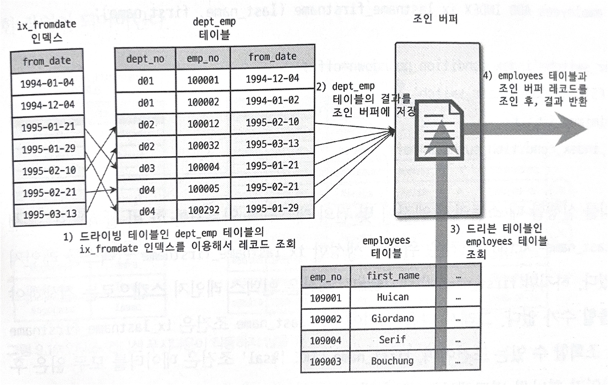
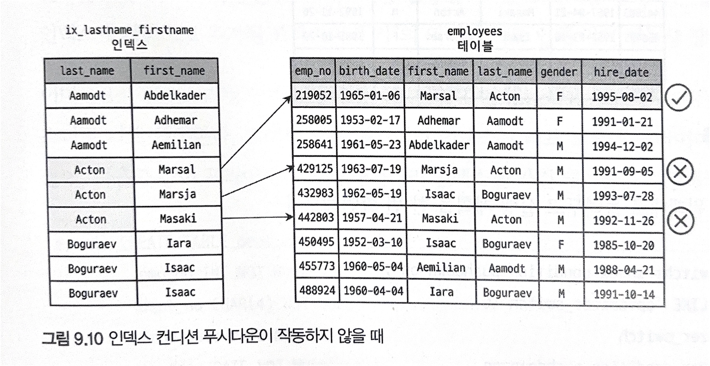
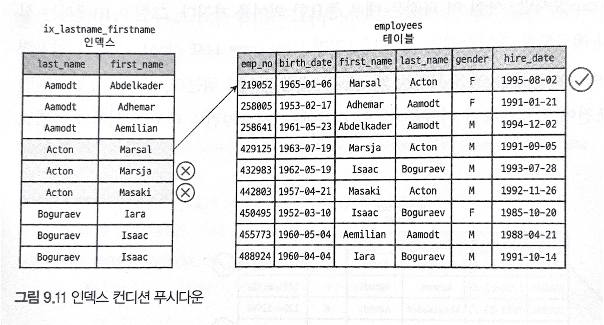
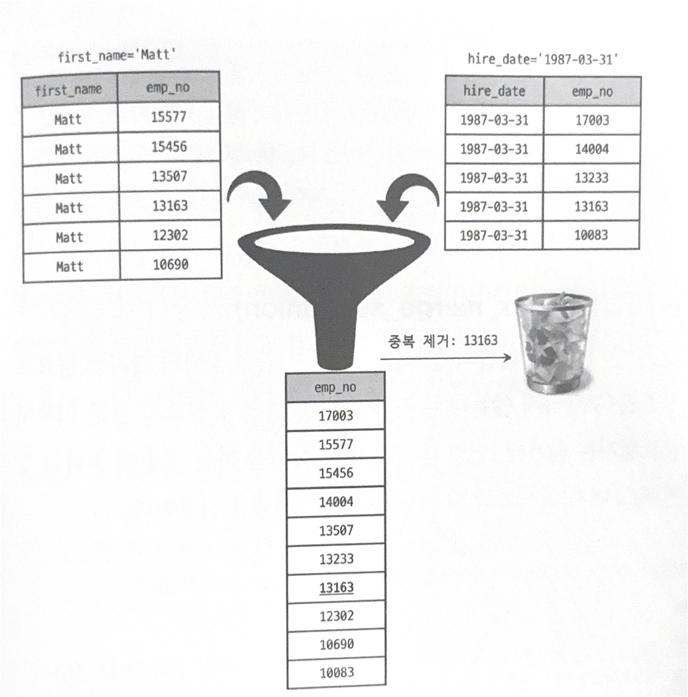
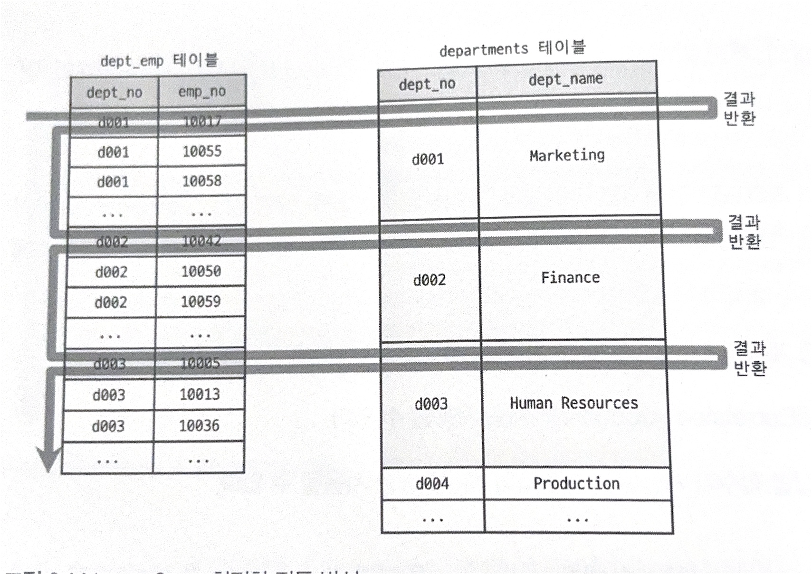
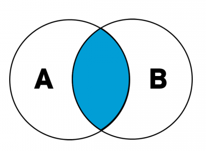
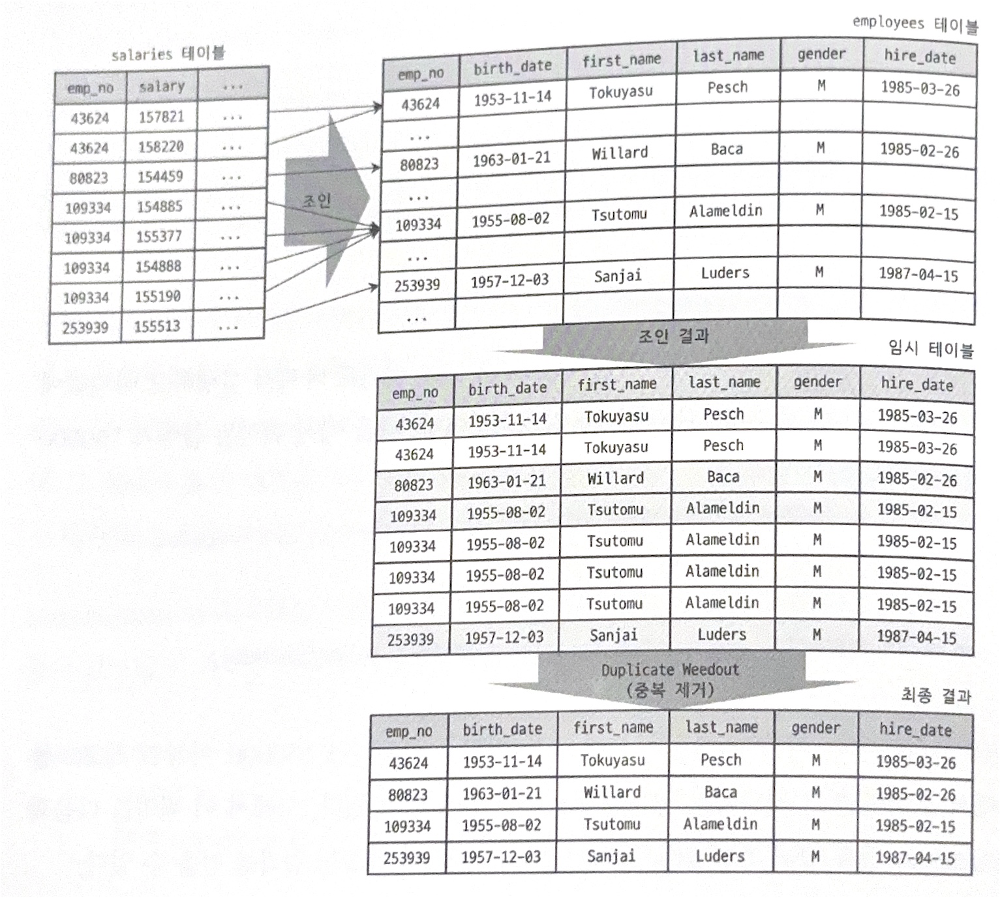

## EXPLAIN Extra 정리
| Extra                                        | 의미                                                                           | 성능        |
|----------------------------------------------|------------------------------------------------------------------------------|-----------|
| Using where                                  | WHERE 조건으로 필터링 진행 <br/>인덱스를 사용할 수도 있고, 아닐 수도 있음                              | 보통 ✅      |
| Using index                                  | 인덱스 사용 (테이블 접근 X)                                                            | 매우 좋음 ✅   |
| Using temporary                              | 쿼리 실행을 위해 임시 테이블이 만들어져야함                                                     | 위험 ❗      |
| Using filesort                               | ORDER BY를 인덱스로 처리 못함 (별도 정렬)<br/>쿼리 결과가 인덱스 순서와 일치하지 않아 추가적인 정렬작업 필요         | 주의        |
| Using where; Using filesort                  | 필터링 + 별도 정렬                                                                  | 주의        |
| Using where; Using temporary; Using filesort | 필터링 + 임시테이블 + 정렬<br/>(조건에 맞는 레코드를 필터링 + 필터링 결과를 임시 테이블에 저장 + 임시 테이블 데이터를 정렬) | 매우 위험❗❗ ️ |
| Using join buffer                            | 조인 인덱스 없이 조인 버퍼 사용                                                           | 주의        |


## 옵티마이저 - 고급 최적화
- 옵티마이저 옵션은 **조인과 관련된 옵티마이저 옵션**과 **옵티마이저 스위치**로 구분됨
- **조인과 관련된 옵티마이저 옵션** : 조인이 많이 사용되는 서비스에서 알아야 하는 부분
- **옵티마이저 스위치** : `optimizer_switch` 시스템 변수를 통해 제어
  - 최적화 옵션은 책의 표를 참고
  - 글로벌 or 세션별로 모두 설정 가능

### 1. MRR과 배치 키 액세스 (mrr & batched_key_access)
> ### 기존의 조인 방식
> 1. 드라이빙 테이블 (조인에서 제일 먼저 읽는 테이블)의 레코드를 한 건 읽음
> 2. 드리븐 테이블 (조인되는 테이블에서 드라이빙 테이블이 아닌 테이블)에서 일치하는 레코드를 찾아 조인을 수행
> - 조인 처리 : MySQL 엔진이 담당
> - 실제 레코드를 검색 & 읽기 : 스토리지 엔진이 담당
> - 단점 : 스토리지 엔진에서는 최적화가 불가능

- 기존의 조인 방식을 보완하여, MySQL서버는 드라이빙 테이블에서 레코드를 읽어 드리븐 테이블과의 조인을 바로 처리하지 않고 조인 버퍼에 버퍼링
- 조인 버퍼에 레코드가 가득 차면 버퍼링된 레코드를 한 번에 스토리지 엔진으로 요청

### 2. 블록 네스티드 루프 조인 (block_nested_ploop)
> ### 기존의 조인 방식
> - 네스티드 루프 조인 사용
> - 레코드를 읽어 다른 버퍼 공간에 저장하지 않고 즉시 드리븐 테이블의 레코드를 찾아 반환함
> - 즉, 레코드 마다 드리븐 테이블에 대한 IO 발생

| id   | select_type   | table | type | possible_keys | key     | rows | Extra       |
|------|---------------|-------|------|---------------|---------|------|-------------|
| 1    | SIMPLE        | e     | ref  | ix_firstname  | NULL    | 1    | NULL        |
| 1    | SIMPLE        | s     | ref  | PRIMARY       | PRIMARY | 10   | Using where |
- 기존의 네스티드 루프 조인은 조인 시 인덱스에 포함된 칼럼을 사용하지만, 인덱스를 사용하여 쿼리를 최적화 하지 못함


- 블록 네스티드 루프 조인은, 기존의 네스티드 루프 조인에서 조회하는 레코드로 바로 드리븐 테이블에서 하지 않음
- 대신 조인 버퍼를 사용하여 드라이빙 테이블에서 읽은 레코드를 조인 버퍼에 캐시
- 이후 한 번에 조인 버퍼의 레코드와 드리븐 테이블과의 조인을 진행
- 이를 통해 레코드마다 드리븐 테이블에 대한 IO가 발생하지 않고 버퍼 크기 배수 만큼의 IO가 줄어듦 (한 번에 처리하는 배치 느낌..?)

| id   | select_type   | table | type  | possible_keys | Extra                                 |
|------|---------------|-------|-------|---------------|---------------------------------------|
| 1    | SIMPLE        | de    | range | ix_fromdate   | Using index condition                 |
| 1    | SIMPLE        | e     | range | PRIMARY       | Using join buffer (block nested loop) |
- 위 실행 계획과 같이 `Using join buffer`처럼 조인 버퍼를 사용하여 최적화를 진행함



- 3번 과정에서, 조인 버퍼에 모은 레코드를 사용해 한꺼번에 드리븐 테이블 조회
- 이때 조인 버퍼를 사용하면, 결과의 정렬 순서가 섞일 수도 있음 (조인의 순서가 바뀌지는 않음)

### 3. 인덱스 컨디션 푸시다운 (index_condition_pushdown)
> ### 예시
> ```sql
> mysql> ALTER TABLE employees ADD INDEX ix_lastname_firstname (last_name, first_name);
> ```
> - 위 인덱스에서, `last_name = 'Acton'`조건은 레인지 스캔 사용 가능
> - `first_name LIKE '%sal'` 조건은 후행검색이므로 인덱스 레인지 스캔 불가능
> 
> ```sql
> mysql> SELECT * FROM employees WHERE last_name = 'Acton' AND first_name LIKE '%sal';
> ```
> ```text
> | id   | select_type   | table        | type  | key_len | Extra       |
> |------|---------------|--------------|-------|---- ----|-------------|
> | 1    | SIMPLE        | employees    | ref   | 66      | Using where |
> ```
> 
> - 위 쿼리로 다음과 같은 실행 계획이 나옴
> -  Extra가 `Using where`이므로 스토리지 엔진이 읽은 레코드가 인덱스를 사용할 수 없는 조건에 일치하는지 검사
> 
> 
> 
> - 위 표는 드라이빙 테이블에서 3건의 레코드를 찾고, 드리븐 테이블에서 조건에 맞는 레코드를 찾는다.
> - 이때 1건만 `$sal`이라는 조건에 일치했다.
> - 하지만, 만약 `last_name = 'Acton'`조건에 일치하는 레코드가 10만건이고, 1건만 `$sal` 조건에 만족한다면, 불필요한 자원이 소모됨
> - 이때, 인덱스의 `first_name`을 사용했다면 조회되는 레코드가 급격히 줄어들 수 있음
> - MySQL 5.6 이상부터는 인덱스의 칼럼 조건까지 모두 모아 스토리지 엔진으로 전달하도록 수정됨
> - 해당 기능이 푸시다운 기능이다.
> 
> 
> 
> - 푸시다운의 실행계획은 다음과 같다.
> ```text
> | id   | select_type   | table        | type  | key                   | key_len | Extra                 |
> |------|---------------|--------------|-------|-----------------------|---------|-----------------------|
> | 1    | SIMPLE        | employees    | ref   | ix_lastname_firstname | 66      | Using index condition |
> ```

- 푸시다운을 통해 쿼리 성능이 몇 배 ~ 몇십 배로 향상 가능함

### 4. 인덱스 확장 (use_index_extensions)
```sql
KEY ix_fromdate (from_date)
```
- ix_fromdate 인덱스는 (from_data, primary key) 조합으로 이루어진다.
- 즉, 세컨더리 인덱스 마지막에 프라이머리 키가 존재함을 고려하여 쿼리실행계획이 생성된다.
- 또한, 정렬 작업에 대한 향상도 이루어진다.
  - MySQL 서버는 별도의 작업 없이 인덱스 순서대로 레코드를 읽어 from_data로 정렬하는 `ORDER BY`를 임시 테이블 없이 정렬 가능하다.

### 5. 인덱스 머지 (index_merge)
- 일반적인 쿼리의 경우, 테이블 별 하나의 인덱스만을 사용하도록 실행 계획을 만든다.
- 인덱스 머지 실행 계획을 사용하여, 하나의 테이블에 대해 여러 개의 인덱스를 통해 쿼리를 처리할 수 있다.
- 특히 쿼리에 사용된 조건이 서로 다른 인덱스를 사용하며, 결과 레코드가 많을 때 인덱스 머지 실행 계획을 고려한다.
- 인덱스 머지는 아래와 같이 3가지 세부 계획으로 나뉜다.
  - `index_merge_intersection`
  - `index_merge_sort_union`
  - `index_merge_union`

#### 5.1 인덱스 머지 - 교집합 (index_merge_intersection)
```sql
mysql> SELECT *
        FROM employees
        WHERE first_name = 'Georgi' AND emp_no BETWEEN 10000 AND 20000;

mysql> SELECT COUNT(*)
        FROM employees
        WHERE first_name='Georgi';

<!-- Result : 253-->

mysql> SELECT COUNT(*)
       FROM employees
       WHERE emp_no BETWEEN 10000 AND 20000;

<!-- Result : 10000-->
```
- WHERE에 어떤 조건이라도 칼럼 모두 인덱스를 가질 때 사용된다.
- 옵티마이저는 실행 계획으로 `Extra`칼럼에 Using interest로 표시한다. 이는 해당 쿼리가 여러 인덱스를 검색하여 각각의 결과를 UNION연산 했음을 의미한다.
- 이때 옵티마이저는 여러 실행 계획 중 가장 예상 비용이 적은 경로를 선택한다.
```sql
mysql> SELECT COUNT(*) FROM employees WHERE first_name='Georgi';
=> count(*) = 253

mysql> SELECT COUNT(*) FROM employees WHERE emp_no BETWEEN 10000 AND 20000;
 => count(*) 10000
```
- 위 예시를 통해,
  - `first_name`에 대해서만 인덱스를 사용했을 때, 일치하는 레코드 253개를 조회하고, emp_no칼럼 조건에 맞는 레코드만 반환한다.
  - `emp_no BETWEEN 10000 AND 20000`에 대해서만 인덱스를 조회했을 때, 프라이머리 키를 통해 10000개 (10000 ~ 200000개 사이 개수)를 조회하고, first_name 조건에 맞는 레코드를 반환한다.
- 하지만 두 조건을 모두 만족시키는 레코드의 개수는 14개밖에 되지 않는다.
- 즉, 두 방법 모두 비효울적인 조회이므로, 각 인덱스를 검색해 두 결과의 교집합을 계산하는 방식으로 비효율을 극복한다.


#### 5.2 인덱스 머지 - 합집합 (index_merge_union)
- 해당 최적화는 위의 최적화 방식과 비슷하게, WHERE 절에서 2개 이상의 조건이 각 인덱스를 사용하고 OR 연산자로 이루어진 경우에 사용된다.
```sql
mysql> SELECT *
FROM employees
WHERE first_name = ' Matt' OR hire_date = '1987-03-31';
```
- 해당 쿼리의 실행 계획은 `Extra`필드가 `Using union`가 되는 최적화를 사용한다.
- 즉, first_name에 대한 인덱스와 hire_date에 대한 인덱스의 검색 결과를 union 연산을 통해 병합했음을 의미한다.



- 병합 과정에서, 각 인덱스를 사용해 조회한 레코드가 중복되는 상황이 발생할 수 있다.
- 이때 각 조회한 레코드들은 프라이머리 키로 정렬되어 있는 점에서 착안해, 두 집합에서 하나씩 비교하며 프라이머리 키 칼럼의 중복된 레코드들을 정렬 없이 걸러낼 수 있다.

#### 5.3 인덱스 머지 - 정렬 후 합집합 (index_merge_sort_union)
- 위의 중복된 레코드를 제거할 때 정렬을 따로 진행하지 않은 이유가 프라이머리 키에 의함을 살펴보았다.
- 하지만 특정 경우에는 별도의 정렬이 필요하다.
- 해당 방식을 인덱스 머지 최적화의 Sort union 알고리즘을 사용한다.
```sql
mysql> SELECT * FROM employees WHERE first_name = 'Matt';
mysql> SELECT * FROM employees WHERE hire_date BETWEEN '1987-03-01' AND '1987-03-31';
```
- 위 예시에서, 첫 번째 쿼리는 emp_no에 대해 정렬되지만, 두 번째 쿼리는 정렬이 이루어지지 않는다.
- 이에 쿼리 결과에 대해 다시 한 번 정렬을 수행하는 방식으로, 실행계획 `Extra`필드에 `Using sort_union`값이 표시된다.

### 6. 세미 조인 (semijoin)
- 타 테이블에 주어진 조건을 만족하는 레코드가 있는지 확인하는 형태의 쿼리를 세미 조인이라고 한다.
```sql
SELECT *
FROM employees e 
WHERE e.emp_no IN (SELECT ~~~)
```
- 최적화 방법에 대해 두 가지 방식으로 나뉜다.
1. 세미 조인 형태 (Semi-join)
   - `=` 형태와 `IN` 형태의 쿼리
   - 세미 조인 최적화
   - IN-to-EXISTS 최적화
   - MATERIALIZATION 최적화
2. 안티 세미 조인 형태 (Anti Semi-join)
   - `<>` 형태와 `NOT IN` 형태의 쿼리
   - IN-to_EXISTS 최적화
   - MATERIALIZATION 최적화

- 세미 조인 최적화에서는 아래와 같은 최적화 기법이 존재
1. Table Pull-out
2. Duplicate Weed-out
3. First Match
4. Loose Scan
5. Materialization

### 6.1 테이블 풀-아웃 (Table Pull-out)
- 세미 조인의 형태의 쿼리를 일반 조인을 사용하는 쿼리로 변환하여 실행하는 최적화
```sql
SELECT * FROM employees e 
WHERE e.emp_no IN (SELECT de.emp_no FROM dept_emp de WHERE de.dept_no='d009');
```
- 위와 같은 쿼리를 아래와 같은 조인 쿼리로 내부적으로 재생성하여 실행함
```sql
SELECT employees.e.emp_no AS emp_no,
       employees.e.birth_date AS birth_date,
       employees.e.first_name AS first_name,
       employees.e.last_name AS last_name,
       employees.e.gender AS gender,
       employees.e.hire_date AS hire_date
FROM employees.dept_demp de
JOIN employees.employees e 
WHERE ((employees.e.emp_no = employees.de.emp_no) AND (employees.de.dept_no = 'd009'));
```

`- 해당 최적화는 세미 조인에서만 사용 가능
- 서브 쿼리 부분이 하나일 때만 사용 가능
- Table pullout을 사용해도 기존에 사용한 최적화를 동일하게 사용할 수 있음
- 만약 서브쿼리의 모든 테이블이 아우터 쿼리로 나올 수 있다면 서브쿼리 자체가 사라짐 (옵티마이저 내부적으로)


### 6.2 퍼스트 매치 (first match)
- `IN` 형태의 세미조인을 `EXISTS`형태로 튜닝한 것과 비슷한 방법
```sql
SELECT *
FROM employees e 
WHERE e.first_name = 'Matt' AND e.emp_no IN (
    SELECT t.emp_no FROM titles t 
    WHERE t.from_date BETWEEN '1995-01-01' AND '1995-01-30'
);
```
- 해당 쿼리의 실행계획의 `Extra`칼럼은 `FirstMatch`라는 값이 포함된다.
- 해당 최적화는 title 테이블에 일치하는 레코드 하나만 찾으면 추가로 title 테이블을 검색하지 않는다.
- 이는 특정 레코드가 존재하는지 아닌지를 판별하는 `EXISTS`와 유사한 기능
- `IN-to-EXISTS`와 비교했을 때 장점이 존재
  - `First match`최적화를 통해 아우터 쿼리에 WHERE 문에 조건이 많이 붙음 -> 더 나은 실행 계획 수립 가능
  - `IN-to-EXISTS`최적화는 변환이 가능하면, 무조건 최적화를 수행하지만, `First match`에서는 실행계획을 수립하고 더 나은 방식을 선택

#### 퍼스트 매치의 제한사항
- 서브쿼리가 참조하는 모든 아우터 테이블을 조회한 후 실행됨
- `Extra`칼럼에 대해 `FirstMatch`가 사용됨
- `GROUP BY`나, 집합 함수에서는 사용 불가
  - First match는 특정 조건에 맞는 서브 쿼리를 찾으면 종료됨
  - 집합 함수 특성 상, 범위 내에 있는 모든 레코드를 스캔해야함

### 6.3 루스 스캔 (loose scan)
- 루스 인덱스 스캔과 비슷한 읽기 방식을 사용
```sql
SELECT * FROM departments d
WHERE d.dept_no IN (SELECT de.dept_no FROM dept_emp de);
```
- 위 쿼리는 dept_emp 의 부서 번호에 대해 부서 정보를 읽어오는 쿼리이다.
- 이때 dept_emp 테이블에는 33만 개의 레코드가 들어있으며, (dept_no, emp_no) 조합으로 인덱스가 생성되어 있다.
- 또한 dept_no의 선택도는 9이다. 즉, 유니크한 값의 개수가 9개


- 위 그림처럼 루스 인덱스 스캔처럼 유니크한 dept_no만 읽으면 33만개의 모든 레코드를 읽지 않아도 효율적인 서브쿼리 실행이 가능
- 실행계획 `Extra`필드에 `LooseScan`이라고 표시됨

#### 루스 스캔의 특성
- 루스 인덱스 스캔으로 서브 쿼리를 읽음
  - 이에 서브 쿼리가 루스 인덱스 스캔을 사용할 수 있는 조건이어야 함


### 6.4 구체화 (Materialization)
- 서브 쿼리를 구체화(내부 임시 테이블)하여 쿼리를 최적화하는 의미

```sql
SELECT *
FROM employees e 
WHERE e.emp_no IN (SELECT de.emp_no FROM dept_emp de WHERE de.from_date = '1995-01-01');
```
- 위 쿼리는 first match 최적화를 진행할 수 있지만, 테이블을 풀 스캔하기 때문에 유의미한 성능 향상 X
- 이에 서브쿼리 구체화로 최적화를 진행
- 실행계획에서의 `select_type`필드가 `MATERIALIZED`값으로 초기화되면 구체화 최적화가 진행됨을 확인할 수 있음
- 서브쿼리를 임시 테이블로 구체화하고, 임시 테이블을 아우터 테이블과 조인하여 결과 반환

#### 구체화의 특성
- 구체화 시 임시 테이블이 생성됨
- `GROUP BY`절이 있어도 최적화 가능 -> 임시 테이블을 만들기 때문에 문제 없음

### 6.5 중복 제거 (Duplicated Weed-out)
- 세미 조인 서브 쿼리를 `INNER JOIN`으로 변환하여 실행하고, 마지막에 중복된 레코드를 삭제


- 두 조건을 동시에 만족하는 레코드만 가져옴으로써, 조인 결과를 수행
- 조인을 진행하고, 중복된 결과에 대해 `GROUP BY`절 수행



- 실행계획에서 `Extra`필드가 `Start temporary`, `End temporary`가 표시됨
- 이때 조인 수행 작업과, 임시 테이블 저장 작업같이 여러 작업으로 나뉘므로 2개의 실행 계획이 생성됨

#### 중복 제거 장단점
- 서브 쿼리가 상관 서브쿼리여도 사용 가능
  - 상관 서브 쿼리 : 서브쿼리가 바깥 쿼리의 값에 의존해서, 바깥 쿼리의 각 행마다 다시 실행되는 서브 쿼리
  - ```sql
     SELECT *
     FROM orders o
     WHERE o.amount >
     (SELECT AVG(amount)
     FROM orders
     WHERE customer_id = o.customer_id);
     ```
- 서브 쿼리에 `GROUP BY`, 집합함수를 사용한 경우엔 사용할 수 없음
- 중복 제거 이외에도 다른 선택지가 많음

### 12. 컨디션 팬아웃 (condition_fanout_filter)
- 조인 실행 시 테이블의 순서는 성능에 영향을 줌
- 이때 드라이빙 테이블로 레코드의 개수가 적은 테이블을 선택해야함 (레코드 건수가 적은 순서대로 조인 진행)
- 드라이빙 테이블의 개수 만큼 드리븐 테이블을 읽기 때문
- 이때 컨디션 팬아웃 최적화를 통해, 드리븐 테이블에서 조건을 만족할 레코드의 개수를 예측
- WHERE에서 다음 칼럼 조건에 대해 얼마나 조건을 충족할지 고려하여 빠른 실행 계획 수립 가능
- 팬아웃 최적화를 사용하지 않는다면, 조인 순서와 결과 건수를 정확히 예측하지 못해 불필요한 조인, 읽기 증가가 발생할 수 있음

#### 컨디션 팬아웃 사용 조건
- WHERE 조건절에 활용된 칼럼에 대해 인덱스가 있는 경우
- WHERE 조걸저에 활용된 칼럼에 대해 히스토그램이 있는 경우
  - 히스토그램 : 칼럼 값의 분포를 미리 통계로 저장한 것


### 13. 파생 테이블 머지 (derived_merge)
- 파생 테이블 머지는 FROM 절에 사용된 서브쿼리에서의 최적화 방식

> #### 최적화 전
> - 일반적인 방식으로는, FROM에서 사용된 서브쿼리는 결과를 임시 테이블로 만들어 사용
> - 이때 서브쿼리를 파생 테이블이라 부름
> - 임시 테이블을 만들고 데이터를 쓰고 읽으며, 임시 테이블에 데이터가 많으면 디스크로 옮겨야 하기 때문에 성능상 문제가 발생

- MySQL 5.7부터, 파생 테이블을 사용하는 쿼리에 대해, 외부 쿼리와 병합하여 서브 쿼리를 제거하는 최적화를 진행 -> 파생 테이블 머지
- 예전에는 서브쿼리로 작성된 쿼리를 외부 쿼리로 병합하는 과정을 DBA가 진행
- 이제는 옵티마이저가 수행, 하지만 아래와 같은 경우엔 옵티마이저가 병합을 못함 -> 서브 쿼리를 외부 쿼리로 수동으로 병합해서 작성하는 것이 좋음

1. 집계 함수, 윈도우 함수가 사용된 서브 쿼리
2. DISTINCT가 사용된 서브쿼리
3. GROUP BY나 HAVING이 사용된 서브쿼리
4. LIMIT이 사용된 서브쿼리
5. UNION, UNION ALL을 포함하는 서브쿼리
6. SELECT 절에 사용된 서브쿼리
7. 값이 변경되는 사용자 변수가 사용된 서브쿼리

### 14. 인비저블 인덱스 (user_invisible_indexes)
- 인덱스의 가용 상태를 제어할 수 있는 기능 존재
```sql
mysql> ALTER TABLE employees ALTER INDEX ix_hiredate INVISIBLE;

mysql> ALTER TABLE employees ALTER INDEX ix_hiredate VISIBLE;
```

### 15. 스킵 스캔 (skip_scan)
- 인덱스를 구성하는 칼럼에 순서에 따라 인덱스의 사용 여부가 달라짐 (인덱스 챕터 참고 236p)
- 이때 인덱스를 사용하고자 하는 칼럼에 대해, 그 전 칼럼에 대한 조건이 없다면 인덱스를 사용할 수 없음
- 이런 경우엔 사용하고자 하는 칼럼을 선두로 하는 인덱스를 생성해야 했음
- MySQL 8.0에서는 인덱스 스킵 스캔을 통해, 선행 칼럼의 조건절에 없더라도 후행 칼럼으로 인덱스를 사용 가능함
- 선행 칼럼의 유니크한 값들을 가져와, 각 값들을 비교하는 방식으로 최적화를 진행
- 이때 선행 칼럼이 다양하지 않은 값을 가질 때 효율적으로 쿼리가 최적화됨
