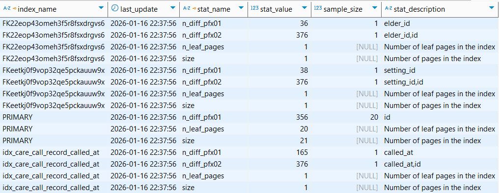
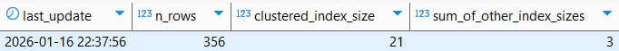

**항상 옵티마이저가 좋은 실행 계획을 만들어낼 수 있는 것은 아니기에, 이러한 문제점을 관리자나 사용자가
보완할 수 있도록 EXPLAIN 명령으로 옵티마이저가 수립한 실행 계획을 확인할 수 있게 해준다.**

**이제부터는 MySQL 서버의 실행 계획에 가장 큰 영향을 미치는 통계 정보에 대해 간략히 살펴보고,
MySQL 서버가 보여주는 실행 계획을 읽는 순서와 실행 계획에 출력되는 키워드, 알고리즘에 대해 살펴보자.**

# 통계 정보

MySQL 5.7 버전까지는 테이블이나 인덱스에 대한 개괄적인 정보를 가지고 실행 계획을 수립했다.

실제 분포에 대한 정보가 없어 정확도가 떨어지는 경우가 많았고, 이에 MySQL 8.0 버전부터 **인덱스되지 않은 칼럼들에 대해서도 데이터 분포도를 수집해서 저장하는 히스토그램(Histogram) 정보가 도입**됐다.

## 테이블 및 인덱스 통계 정보

MySQL 5.5 버전까지는 각 테이블의 통계 정보가 메모리에만 관리되고, SHOW INDEX 명령으로만 테이블의 인덱스 칼럼의 분포도를 볼 수 있었다. → 서버 재시작 시 통계 정보가 날아감

MySQL 5.6 버전 부터 각 테이블의 통계 정보를 `innodb_index_stats` 테이블과 `innodb_table_stats` 테이블로 관리할 수 있게 개선되었다.

```sql
SELECT *
FROM mysql.innodb_index_stats
WHERE database_name = 'medicare_call'
  AND table_name = 'CareCallRecord';
```



```sql
SELECT *
FROM mysql.innodb_table_stats
WHERE database_name = 'medicare_call'
  AND table_name = 'CareCallRecord';
```



### 통계 정보 각 칼럼의 의미

- `innodb_index_stats.stat_name=’n_diff_pfx%’` : 인덱스가 가진 유니크 값의 개수
- `innodb_index_stats.stat_name=’n_leaf_pages’` : 인덱스의 리프 노드 페이지 개수
- `innodb_index_stats.stat_name=’size’` : 인덱스 트리의 전체 페이지 개수
- `innodb_table_stats.n_rows` : 테이블의 전체 레코드 건수
- `innodb_table_stats.clusterd_index_size` : PK의 크기(InnoDB 페이지 개수)
- `innodb_table_stats.sum_of_other_index_sizes` : PK를 제외한 인덱스 크기(InnoDB 페이지 개수)

더 정확한 통계 수집을 원한다면 `innodb_stats_persistent_simple_pages` 시스템 변수에 높은 값을 설정

하지만 이 값을 너무 높이면 통계 정보 수집 시간이 길어지므로 주의해야 한다.

## 히스토그램

MySQL 5.7 버전까지의 통계 정보는 단순히 인덱스된 칼럼의 유니크한 값의 개수 정도만 가졌다.

이는 최적의 실행 계획을 수립하기에는 부족한 정보이기에, 부족함을 메우기 위해
**실행 계획 수립 시 실제 인덱스의 일부 페이지를 랜덤으로 가져와 참조하는 방식을 사용했다.**

8.0 버전으로 업그레이드 되면서 칼럼의 데이터 분포도를 참조할 수 있는 **히스토그램** 정보를 활용 가능해졌다.

**히스토그램 정보가 없으면 옵티마이저는 데이터가 균등하게 분포돼 있을 것으로 예측한다.
하지만 히스토그램이 있으면 특정 범위의 데이터가 많고 적음을 식별할 수 있다.**

MySQL 8.0에서 히스토그램은 **칼럼 단위로 관리**되는데, **자동 수집이 아닌** 아래처럼 **수동 수집 및 관리**된다.

```sql
-- // 히스토그램 생성
ANALYZE TABLE Elder
  UPDATE HISTOGRAM ON name;

-- // 히스토그램 조회
SELECT *
FROM information_schema.COLUMN_STATISTICS
WHERE schema_name = 'medicare_call'
  AND table_name = 'Elder';
//AND column_name = 'status'; 처럼 특정 컬럼만 확인할 수도 있다.

-- // 히스토그램 삭제
ANALYZE TABLE Elder
  DROP HISTOGRAM ON name;
```

## 코스트 모델

**MySQL 서버가 쿼리를 처리하려면 다음과 같은 다양한 작업을 필요로 한다.**

- 디스크로부터 데이터 페이지 읽기
- 메모리(InnoDB 버퍼 풀)로부터 데이터 페이지 읽기
- 인덱스 키 비교
- 레코드 평가
- 메모리 임시 테이블 작업
- 디스크 임시 테이블 작업

이렇게 전체 쿼리의 비용을 계산하는데 필요한 **단위 작업들의 비용을 코스트 모델(Cost Model)**이라고 한다.

코스트 모델은 `mysql.server_cost` 테이블과 `mysql.engine_cost` 테이블에 저장된 설정 값을 사용한다.

MySQL 8.0 버전의 코스트 모델에서 지원하는 단위 작업은 다음과 같이 8개다.

| mysql.table_name | cost_name | default_value | 설명 |
| --- | --- | --- | --- |
| **engine_cost** | **`io_block_read_cost`** | 1.00 | 디스크 데이터 페이지 읽기 |
| **engine_cost** | **`memory_block_read_cost`** | 0.25 | 메모리 데이터 페이지 읽기 |
| **server_cost** | **`disk_temptable_create_cost`** | 20.00 | 디스크 임시 테이블 생성 |
| **server_cost** | **`disk_temptable_row_cost`** | 0.50 | 디스크 임시 테이블의 레코드 읽기 |
| **server_cost** | **`key_compare_cost`** | 0.05 | 인덱스 키 비교 (키 값 비교 작업) |
| **server_cost** | **`memory_temptable_create_cost`** | 1.00 | 메모리 임시 테이블 생성 |
| **server_cost** | **`memory_temptable_row_cost`** | 0.10 | 메모리 임시 테이블의 레코드 읽기 |
| **server_cost** | **`row_evaluate_cost`** | 0.10 | 레코드 비교 (스토리지 엔진이 반환한 레코드가 쿼리 조건에 일치하는지 평가) |

> `row_evaluate_cost` 값이 증가할수록 풀 테이블 스캔과 같이 많은 레코드를 처리하는 쿼리의 비용이 높아지고 반대로 레인지 스캔과 같이 상대적으로 적은 수의 레코드를 처리하는 쿼리의 비용이 낮아진다.
>

> `key_compare_cost` 값이 증가할수록 레코드 정렬과 같이 키 값 비교 처리가 많은 쿼리 비용이 높아진다.
>

**이러한 코스트 모델의 작업 value에 따라 가중치가 변동되어, 옵티마이저 실행 계획의 선택 방향이 변경된다.**

# 실행 계획 확인

MySQL 서버의 실행 계획은 DESC 또는 EXPLAIN 명령으로 확인할 수 있다.

MySQL 8.0 부터는 EXPLAIN 명령에 사용할 수 있는 새로운 옵션이 추가됐는데,
실행 계획의 출력 포맷과 실제 쿼리의 실행 결과까지 확인할 수 있는 기능을 구분해서 살펴보자.

## 실행 계획 출력 포맷

> 이전 버전까진 `EXPLAIN EXTENDED` 와 `EXPLAIN  PARTITIONS` 명령이 구분되어 있었지만 통합되었다.
>

MySQL 8.0 버전부터는 `FORMAT` 옵션을 사용해 실행 계획의 표시 방법을 JSON이나 TREE, 단순 테이블 형태로 선택할 수 있다.

```sql
EXPLAIN -- // 테이블 형태 표기가 Default. FORMAT=TREE or FORMAT=JSON 설정 가능
SELECT *
FROM employees e
	INNER JOIN salaries s ON s.emp_no=e.emp_no
WHERE first_name='ABC';
```

## 쿼리의 실행 시간 확인

MySQL 8.0.18 버전부터 쿼리의 실행 계획과 단계별 소요된 시간 정보를 확인할 수 있는 EXPLAIN ANALYZE 기능이 추가되었다.

EXPLAIN ANALYZE 명령은 항상 결과를 TREE 포맷으로 보여주기에 FORMAT 옵션 사용이 불가능하다.

> time에서 2가지 값이 표기되는데,
첫 번째 숫자 값은 첫 번째 레코드를 가져오는데 걸린 평균시간 (밀리초)이고,
두 번째 숫자 값은 마지막 레코드를 가져오는데 걸린 평균시간 (밀리초)를 의미한다.
>

```sql
-> Nested loop inner join  (cost=180 rows=356) (actual time=0.0405..2.78 rows=376 loops=1)
    -> Table scan on c  (cost=55.8 rows=356) (actual time=0.0278..0.464 rows=376 loops=1)
    -> Single-row index lookup on e using PRIMARY (id=c.elder_id)  (cost=0.25 rows=1) (actual time=0.00599..0.00601 rows=1 loops=376)
```