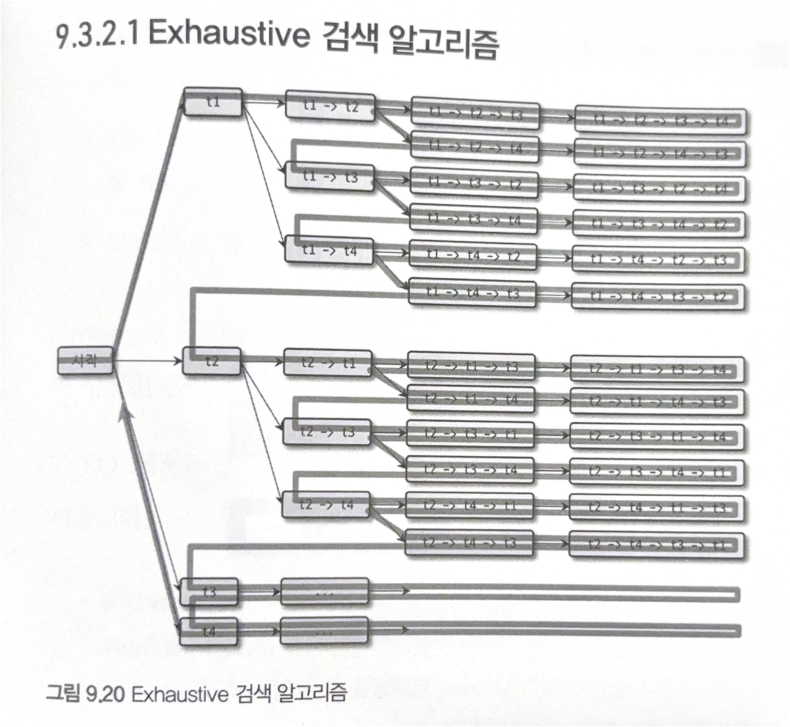
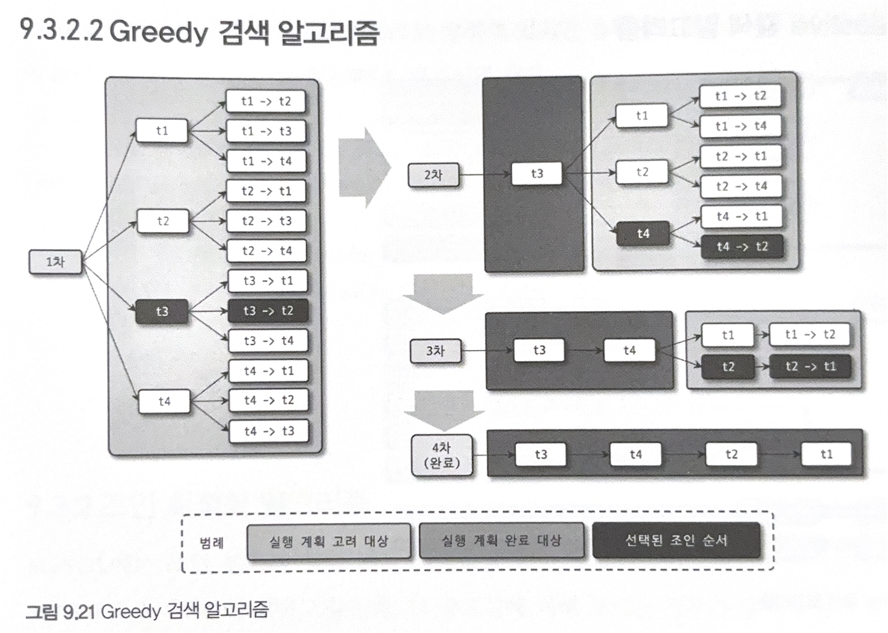

## 고급 최적화

### 해시 조인
- MySQL 8.0에서 추가된 조인 관련 최적화
- 기존에 존재하는 네스티드 루프 조인 최적화와 비교하여 장단점이 존재


- 동시에 조인 시작 시, 해시 조인 최적화가 네스티드 루프 조인보다 먼저 끝남
- 하지만 첫 번째로 레코드를 찾아낸 시점은 네스티드 루프 조인이 더 빠름
- 정리하자면,
  - 해시 조인은 첫 번째 레코드를 찾는 시간이 오래 걸리지만 최종 레코드를 찾는데까지 오래 걸리지 않음 `최고 Throughput 전략에 적합`
  - 네스티드 루프 조인은 첫 번째 레코드를 찾는 시간이 빠르지만 최종 레코드까지 읽는데 오래 걸림 `최고 응답 속도 전략에 적합`

#### 해시 조인이 사용되는 조건
- 조인 조건의 칼럼에 대한 인덱스가 없거나,
- 조인 대상 테이블의 레코드 건수가 적은 경우

> 해시 조인은 네스티드 루프 조인이 적합하지 않을 때를 위한 차선책 

- 실행 계획에서 `Extra`필드가 "hash join"일 때 해시 조인을 사용함을 알 수 있음

#### 해시 조인 과정
- 해시 조인은 `빌드 단계`, `프로브 단계`로 나뉨
> #### 빌드 단계
> - 조인 대상 테이블 중 레코드 건수가 적은, 해시 테이블로 만들기 쉬운 테이블을 선택하여 해시 테이블을 생성
> - 해시 테이블을 메모리에 저장할 때, `join_buffer_size` 시스템 변수로 크기를 제어
> - 이때 레코드가 많아 메모리가 부족한 경우가 존재 각 테이블을 청크로 분리하여, 청크 별로 해시 조인을 처리

> #### 프로브 단계
> - 나머지 테이블의 레코드를 읽어 해시 테이블과 조건이 일치하는 레코드를 찾음


- 테이블로 해시 테이블을 생성할 때, 해당 테이블이 설정된 메모리값보다 큰지 알 수 없음
- 이에 해시 테이블을 만들다가, 일정 값을 넘어서면 나머지 레코드를 디스크에 저장하여 청크로 나누는 과정을 거침


### 인덱스 정렬 선호
- 키워드를 통해 특정 인덱스를 사용하게 하지 못하는 최적화
- 인덱스를 통해 `ORDER BY`, `GROUP BY`를 사용 가능할 때, 해당 인덱스의 가중치를 높이 설정하여 실행함
```sql
mysql> SELECT * 
       FROM employees 
       WHERE hire_date BETWEEN '1985-01-01' AND '1985-02-01'
       ORDER BY emp_no;
```
- 위 쿼리에 대해, 2가지 실행 계획을 고려할 수 있다.
1. hire_date에 대한 인덱스를 순회하여 조건에 맞는 레코드를 찾고, 결과를 emp_no에 대해 정렬
   - hire_date 조건을 만족하는 레코드가 많이 않을 때 효율적임
2. employees 테이블이 emp_no에 대해 이미 정렬되어있으므로, 테이블을 순회하며 hire_date에 대한 조건을 비교
   - 해당 계획은 모든 테이블을 풀스캔

- 위의 실행 계획 중 2번째 실행계획을 옵티마이저가 선택할 수 있다.
- 이러한 실수를 방지하기 위해, 특정 인덱스를 사용하지 못하도록 `IGNORE INDEX` 키워드를 쿼리에 사용 가능
- 또한, `prefer_ordering_index` 옵션을 통해 너무 많은 가중치를 부여하지 않도록 최적화 가능


## 조인 최적화 알고리즘
- 조인되는 테이블이 많을수록 최적화된 실행계획을 찾는 것이 어려워지고, 또한 실행계획을 찾더라도 오랜 시간이 걸림
- 현재 2가지의 조인 최적화 알고리즘이 존재

### Exhaustive 검색 알고리즘
- MySQL 5.0 이전에서 사용되던 조인 최적화
- FROM에 저힌 모든 테이블에 대해 조합을 생성하고, 각 조합마다의 비용을 계산해 최적의 조합을 선택
- 조인되는 테이블이 20개라면, 찾아야하는 모든 실행 계획에 개수는 $20! = 3,628,800$개이다.
- 즉, 조인되는 테이블이 증가할수록, 테이블 전체 개수만큼 시간복잡도가 증가한다.



### Greedy 알고리즘
- `Exhaustive`의 단점을 해결하기 위해 도입된 조인 최적화 기법
- Greedy 알고리즘을 사용하여, 해당 시점에서 가장 최적의 방법을 선택한다.



> #### `optimizer_search_depth` 시스템 변수
> - `optimizer_search_dpeth`변수는 어떤 알고리즘을 사용할 지 결정하는 시스템 변수이다.
> - `optimizer_search_depth`가 0이면, Greedy 검색을 위한 최적 테이블 개수를 옵티마이저가 자동으로 결정
> - `optimizer_search_depth`가 1~62이면, Greedy 검색 대상을 지정된 개수로 한정하여 최적 실행계획을 산출
> - 이를 종합했을 때, 
>   - 쿼리에서 조인 테이블의 개수가 `optimizer_search_depth`보다 크다면, 나머지 테이블은 Greedy 알고리즘을 사용
>   - 조인 테이블의 개수가 더 작다면, Exhaustive알고리즘만 사용

> ####  `optimizer_prune_level` 시스템 변수
> - Heuristic 검색 동작 여부 결정하는 변수
> - Heuristic 검색은 조인 경로를 비교 시, 이미 계산했던 최적의 비용보다 크다면, 중간에 멈출 수 있는 알고리즘
> - 이에 `opimizer_prune_level`이 0이면, Heuristic 최적화 적용 X
> - 1이면, Heuristic 최적화 적용

- 현재 `optimizer_prune_level` 변수의 기본값이 1이므로, `optimizer_search_depth`에 대한 변수 조정은 필요 없음


# 쿼리 힌트
- 옵티마이저가 다양한 쿼리를 실행하며, 100% 최적화된 실행계획을 세우지 못할 수도 있다.
- 이에 개발자가 직접 힌트를 제공하여 옵티마이저로 하여금 특정 실행계획을 사용하도록 가중치를 더 설정할 수 있다.
- 사용 가능한 힌트의 종류는 어떤 인덱스를 사용할 지에 대한 `인덱스 힌트`, 어떤 실행계획을 수립할지에 대한 `옵티마이저 힌트`가 있다.


## 인덱스 힌트
- 인덱스 힌트는 SELECT UPDATE에서만 활용 가능
- 쿼리에서 힌트를 설정할 때, SQL 표준 문법을 준수하게 되지 못한다는 단점이 존재
- 이에 힌트를 주석으로 처리하여, 다른 RDBMS에서는 힌트를 주석으로 처리할 수 있도록 하고 MySQL에서만 해당 주석을 힌트로 인식할 수 있도록 따로 처리


### STRAIGHT_JOIN
- 여러 테이블이 조인되는 경우 조인 순서를 고정하는 인덱스 힌트
- 기존의 쿼리는 어떤 테이블이 드라이빙, 드리븐 테이블이 될지 알 수 없다. (인덱스의 여부로 결정)

```sql
SELECT STRAIGHT_JOIN
    e.first_name, e.last_name, d.dept_name
FROM employees e, dept_emp de, departments d 
WHERE e.emp_no = de.emp_no AND d.dep_no = de.dept_no;
```

```sql
SELECT /*! STRAIGHT_JOIN */
    e.first_name, e.last_name, d.dept_name
FROM employees e, dept_emp de, departments d 
WHERE e.emp_no = de.emp_no AND d.dep_no = de.dept_no;
```

- 위 두 쿼리는 같은 쿼리
- `STRAIGHT JOIN`이 FROM 절의 테이블 순서대로 조인되도록 유도 (employees -> dept_emp -> departments)

> #### 다음과 같은 기준에 맞게 조인 순서가 결정되지 않을 때 사용하는 것이 좋음
> - 임시 테이블과 일반 테이블의 조인 : 임시 테이블을 드라이빙 테이블로 결정함
> - 임시 테이블끼리의 조인 : 임시 테이블은 항상 인데긋가 없음 -> 크기가 작은 테이블을 드라이빙으로 선택

- 레코드 건수 : 테이블 전체의 레코드 개수가 아닌 WHERE 조건을 만족하는 레코드 건수
  - 이에 테이블의 건수가 훨씬 많아도 조건을 만족하는 레코드는 적을 수 있음을 알아야 함


### USE INDEX / FORCE INDEX / IGNORE INDEX
- 사용하고자 하는 인덱스에 대한 가중치를 높게 제공하는 인덱스 힌트이다.
- 테이블 뒤에 힌트를 명시해야 함
- 3~4개 이상의 칼럼을 가지는 인덱스가 여러 개 존재하는 경우 옵티마이저가 실수하는 경우 존재 -> 이때 특정 인덱스를 강제하기 위해 사용

> #### USE INDEX
> - 옵티마이저로 하여금 해당 인덱스를 사용하도록 권장하는 힌트
> - 항상 해당 인덱스를 채택하지는 않음

> #### FORCE INDEX
> - `USE INDEX`보다 더 영향이 큰 힌트
> - 거의 사용할 일 없음

> #### IGNORE INDEX
> - 옵티마이저에게 해당 인덱스는 사용하지 못하도록 하는 힌트
> - 풀 테이블 스캔을 유도할 때 사용됨

- 해당 인덱스 힌트 모두 용도를 지정 가능
  - `JOIN`, `ORDER BY`, `GROUP BY` 용도로 지정 가능

### SQL_CALC_FOUND_ROWS
- 일반적으로, LIMIT에 명시된 수보다 조건을 만족하는 레코드가 많을 때, LIMIT만큼 읽으면 검색을 멈춤
- 하지만 `SQL_CALC_FOUND_ROWS`를 통해, LIMIT만큼 찾더라도 끝까지 쿼리를 수행함 -> 이후 `FOUND_ROWS()`를 통해 전체 몇 건이 있는지 확인 가능
  - 페이징 시 유리

> #### SQL_CALC_FOUND_ROWS와 COUNT(*) 비교
> ```sql
> SELECT SQL_CALC_FOUND_ROWS * FROM employees WHERE first_name='Georgi' LIMIT 0, 20;
> SELECT FOUND_ROWS() AS total_record_count;
> ```
> - 위 쿼리는 20개만 읽어오지만, `SQL_CALC_FOUND_ROWS`에 의해 조건을 만족하는 모든 레코드를 읽어와야함
> - 이때 first_name에 대한 인덱스를 통해 모든 레코드를 읽게 되므로 조건을 만족하는 레코드 개수 만큼 랜덤 IO 발생함
> 
> ```sql
> SELECT COUNT(*) FROM employees WHERE first_name='Georgi';
> SELECT * FROM employees WHERE first_name='Georgi' LIMIT 0, 20;
> ```
> - 위 쿼리는 인덱스 힌트가 없으므로 20개만 가져오면 됨
> - 이때 랜덤 IO 발생 X (20개만 읽으면 바로 탐색을 종료하는 커버링 인덱스)

- 이러한 이유로 `SQL_CALC_FOUND_ROWS`를 사용하는 힌트는 작업 속도가 현저히 느림
- 사용하면 안됨

## 옵티마이저 힌트
- 다양한 영역에 대해 많은 힌트가 존재

### MAX_EXECUTION_TIME
- 쿼리 실행 계획에 영향을 주지 않음
- 쿼리의 최대 실행 시간을 설정
- 만약 지정된 시간을 초과하면 쿼리는 실패

### SET_VAR
- 시스템 변수를 쿼리에서 변경하는 힌트
- 정렬용 버퍼이 크기를 일시적으로 증가시켜 대용량 처리의 쿼리 성능을 높이는데 사용될 수 있음

### SEMIJOIN & NO_SEMIJOIN
- 세미 조인 최적화에 대한 힌트
- 세미 조인 5가지 최적화에 대해 힌트는 다음와 같다

| 최적화 전략             | 힌트                    |
|--------------------|-----------------------|
| Duplicate Weed-out | SEMIJOIN(DUPSWEEDOUT) |
| First Match        | SEMIJOIN(FIRSTMATCH)  |
| Loose Scan         | SEMIJOIN(LOOSESCAN)   |
| Table Pull-out     | 없음                    |

- pull out에 대한 힌트는 없음
- 세미 조인 최적화 힌트는 외부 쿼리가 아닌, 서브쿼리에 명시해야함

```sql
SELECT *
FROM department d 
WHERE d.dept_no IN 
    (SELECT /*+ SELMIJOIN(MATERUALIZATION) */ de.dept_no 
     FROM dept_emp de);
```

- 아니면, 서브 쿼리에 블록 이름을 정의하고 실제 세미 조인 힌트는 외부 쿼리 블록에 작성하는 방법도 존재
```sql
SELECT /*+ SEMOJOIN(@subq1 MATERIALIZATION */ *
FROM department d 
WHERE d.dept_no IN 
    (SELECT /** QB_NAME(subq1) */ de.dept_no 
     FROM dept_emp de);
```

- `NO_SEMIJOIN` 힌트를 통해 특정 최적화 기법을 사용하지 않게 유도할 수도 있음
```sql
SELECT *
FROM department d 
WHERE d.dept_no IN 
    (SELECT /*+ NO_SELMIJOIN(DUPSWEEDOUT, FIRSTMATCH) */ de.dept_no 
     FROM dept_emp de);
```

### SUBQUERY
- 서브쿼리 최적화는 세미 조인 최적화가 불가능할 때 사용하는 최적화 방법

| 최적화 전략          | 힌트                        |
|-----------------|---------------------------|
| IN-to-EXISTS    | SUBQUERY(INTOEXISTS)      |
| Materialization | SUBQUERY(MATERIALIZATION) |

- 세미 조인 최적화 힌트와 비슷하게 서브쿼리에 힌트를 지정하거나,
- 서브쿼리 블록 이름을 지정하고 외부쿼리에서 지정하는 방법이 있다.


### BNL & NO_BNL & HASHJOIN & NO_HASHJOIN
- 블록 네스티드 루프 조인(BNL) 알고리즘을 해시 조인 알고리즘이 대체하며 블록 네스티드 루프 조인은 더이상 사용되지 않는다.
- 이에 BNL, NO_BNL 힌트를 사용하게 되면, 자동으로 해시 조인 알고리즘을 사용하도록 유도된다.

```sql
SELECT /*+ BNL(d, de) */ *
FROM employees e 
INNER JOIN dept_emp de ON de.emp_no = e.emp_no;
```

### JOIN_FIXED_ORDER & JOIN_ORDER & JOIN_PREFIX & JOIN_SUFFIX
- 위에서 설명한 `STRAIGHT_JOIN`을 사용하여 조인의 순서를 결정하면, FROM절의 테이블 순서를 변경해야 했음
- `JOIN_FIXED_ORDER`, `JOIN_ORDER`, `JOIN_PREFIX & JOIN_SUFFIX` 힌트를 통해 이러한 단점을 보완

```sql
-- // FROM 절에 나열된 테이블 순서대로 조인 실행 
SELECT /*+ JOIN_FIXED_ORDER() */ *
FROM employees e 
    INNER JOIN dept_emp de ON de.emp_no = e.emp_no
    INNER JOIN departments d ON d.dept_no = de.dept_no;

-- // 일부 테이블에 대해서만 조인 순서 지정 
SELECT /*+ JOIN_ORDER(d, de) */ *
FROM employees e
         INNER JOIN dept_emp de ON de.emp_no = e.emp_no
         INNER JOIN departments d ON d.dept_no = de.dept_no;

-- // 조인의 드라이빙 테이블에 대해서만 조인 순서 지정
SELECT /*+ JOIN_PREFIX(e, de) */ *
FROM employees e
         INNER JOIN dept_emp de ON de.emp_no = e.emp_no
         INNER JOIN departments d ON d.dept_no = de.dept_no;

-- // 조인의 드리븐 테이블에 대해서만 조인 순서 지정
SELECT /*+ JOIN_SUFFIX(de, e) */ *
FROM employees e
         INNER JOIN dept_emp de ON de.emp_no = e.emp_no
         INNER JOIN departments d ON d.dept_no = de.dept_no;
```

### MERGE & NO MERGE
- 서브쿼리에 대해 임시 테이블을 생성하는데, 이때 서브쿼리와 외부 쿼리와 병합화는 최적화를 진행 (MERGE)
- 이때 병합의 진행 여부를 옵티마이저 힌트로 제공

```sql
-- // 병합 진행
SELECT /*+ MERGE(sub) */ *
FROM (SELECT * 
        FROM employees
        WHERE first_name='Matt') sub LIMIT 10;

-- // 병합 진행 X
SELECT /*+ NO_MERGE(sub) */ *
FROM (SELECT *
      FROM employees
      WHERE first_name='Matt') sub LIMIT 10;
```

### INDEX_MERGE & NO_INDEX_MERGE
- 하나의 쿼리에 대해 여러 인덱스를 사용하는 것 -> `INDEX MERGE`
- 인덱스 머지 실행 계획의 사용 여부 제어 가능 (옵티마이저 힌트)

### NO_ICP
- 인덱스 컨디션 푸시다운(ICP)는 항상 성능ㅇ 향상에 도움이 되므로 최대한 사용하는 방향을 사용
- 하지만 옵티마이저 힌트로 ICP를 지원하지 않음
- ICP로 인해 실행계획 계산이 잘못될 수 있음
- 이에 NO_ICP라는 힌트를 통해 ICP의 가중치를 줄이는 방식을 사용

### SKIP_SCAN & NO_SKIP_SCAN
- 인덱스 스킵 스캔은 선행되는 WHERE 조건절이 없어도 해당 인덱스를 사용할 수 있게 함
- 하지만 선행 칼럼의 유니크한 값이 많을수록 스킵 스캔의 성능은 떨어짐

```sql
SELECT /*+ NO_SKIP_SCAN(employees ix_gender_birthdate */ gender, birth_date 
FROM employees
WHERE birth_date >= '1965-02-01';
```

### INDEX & NO_INDEX
- 예전 MySQL 서버에서 사용되던 인덱스 힌트를 대체하는 용도

| 인덱스 힌트                 | 옵티마이저 힌트       |
|------------------------|----------------|
| USE INDEX              | INDEX          |
| USE INDEX FOR GROUP BY | GROUP_INDEX    |
| USE INDEX FOR ORDER BY | ORDER_INDEX    |
| IGNORE INDEX           | NO_INDEX       |
| IGNORE FOR GROUP BY    | NO_GROUP_INDEX |
| IGNORE FOR ORDER BY    | NO_ORDER_INDEX |

```sql
SELECT /*+ INDEX(employees, ix_firstname) */ *
FROM employees 
WHERE first_name='Matt';
```
- 테이블 뒤에 작성하는 인덱스 힌트와 달리,
- 인덱스 관련 옵티마이저 힌트는 테이블명과 인덱스 이름을 지정해야한다.