### 해시 조인

많은 사용자가 해시 조인 기능을 기대하는 이유가 기존의 네스티드 루프 조인보다 해시 조인이 빠르다고 생각하기 때문이다.

하지만 그것은 항상 옳은 얘기는 아니다.

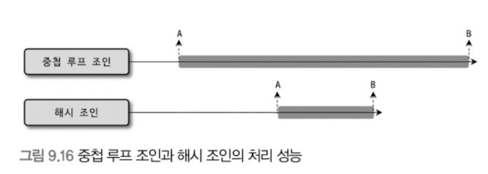

- 네스티드 루프 조인과 해시 조인의 성능을 비교한 것이다.
- 화살표의 길이는 전체 쿼리의 실행 시간을 의미한다.

예상대로 네스티드 루프 조인과 해시 조인은 똑같은 시점에서 시작했지만 해시 조인이 먼저 끝난 것을 확인할 수 있다.

그림 9.16에서 A 지점은 쿼리가 실행되면서 MySQL 서버가 첫 번째 레코드를 찾아낸 시점이며, B 지점은 MySQL 서버가 마지막 레코드를 찾아낸 시점을 의미한다.

물론 조인 조건에 일치하는 마지막 레코드를 찾았다고 해서 항상 쿼리가 완료되는 것은 아니지만, 그림 9.16에서는 마지막 레코드를 찾아낸 시점에 쿼리가 완료된 것으로 표현했다.

이제 해시 조인과 네스티드 루프 조인을 보기 쉽게 표로 정리해보겠다.

|  | 첫번째 레코드를 찾을 때까지 시간 | 최종 레코드를 찾을 때까지 시간 | 시작 시점 | 쿼리 완료 시점  |
| --- | --- | --- | --- | --- |
| 네스티드 루프 조인 | ⬇️ | ⬆️ | = | ⬆️ |
| 해시 조인 | ⬆️ | ⬇️ | = | ⬇️ |
- 해시 조인은 최고 스루풋 전략에 적합하다.
- 네스티드 루프 조인은 최고 응답 속도 전략에 적합하다.

**일반적인 웹 서비스**는 온라인 트랜잭션 서비스이기 때문에 스루풋도 중요하지만 응답속도가 더 중요하다. (`네스티드 루프 조인`)

그리고 **분석과 같은 서비스**는 사용자의 응답 시간 보다는 전체적으로 처리 소요 시간이 중요하기 때문에 응답 시간보단 전체 스루풋이 더 중요하다. (`해시 조인`)

> **왜 해시 조인이 첫번째 레코드를 찾을 때까지 시간이 더 오래 걸려?
→** 해시 조인은 결과를 내기 전에 ‘전체 해시 테이블을 먼저 만들어야 하기 때문’이다.
> 

MySQL 서버는 범용 RDBMS이며, 여기서 범용이라 함은 온라인 트랜잭션 처리를 위한 데이터베이스 서버를 지칭한다.

대용량 데이터 분석을 위해서 MySQL 서버를 사용하지는 않을 것이다. 이 관점으로 본다면 MySQL 서버가 응답 속도와 스루풋 중 어디에 집중해서 최적화할 것인지 명확해진다.

이런 이유로 MySQL 서버는 주로 **조인 조건의 칼럼이 인덱스가 없다거나 조인 대상 테이블 중 일부의 레코드 건수가 매우 적은 경우** 등에 대해서만 해시 조인 알고리즘을 사용하도록 설계돼 있다.

즉, MySQL 서버의 해시 조인 최적화는 **네스티드 루프 조인이 사용되기에 적합하지 않은 경우를 위한 차선책** 같은 기능으로 생각하는 것이 좋다.

> 해시 조인은 해시 테이블이 만들어지는 시간 때문에 첫 응답 시간이 지연되고, 메모리 사용량과 실행 시간이 데이터 분포에 따라 크게 달라져 성능 편차가 크고 예측할 수 없으므로 MySQL의 설계 목적(OLTP)에 더 적합한 네스티드 루프 조인을 우선적으로 사용한다. 네스티드 루프 조인이 명확하게 더 성능이 안 좋은 경우에만 차선책으로 해시 조인을 이용한다.
> 

MySQL 8.0.17 버전까지는 해시 조인 기능이 없었기 때문에 조인 조건이 좋지 않은 경우 **블록 네스티드 루프 조인이라는 조인 알고리**즘을 사용했다. 블록 네스티드 루프 조인 또한 쿼리의 조인 조건이 인덱스를 제대로 활용할 수 없는 경우에만 사용되는 최적화 방법 수준으로 사용됐다.

그래서 인덱스가 잘 설계된 데이터베이스에서는 블록 네스티드 루프 조인 실행 계획은 거의 볼 수 없었다. 블록 기반의 네스티드 루프 조인에서 “블록”은 `join_buffer_size` 라는 시스템 변수로 크기를 조정할 수 있는 메모리 공간을 의미한다. 하지만 이 조인 버퍼를 무한정 크게 설정할 수는 없고, 조인 대상 테이블의 레코드 크기가 조인 버퍼보다 큰 경우에는 **드라이빙 테이블**을 여러 번 반복해서 스캔해야 하는 문제점이 있다.

> **왜 블록 기반의 네스티드 루프 조인이 인덱스가 없을 경우 차선책이 된거야? 버퍼가 인덱스 역할을 한 셈인가?**
→ 블록 네스티드 루프 조인(BNL Join)은 인덱스가 없을 때, 메모리를 ‘가짜 인덱스처럼’ 사용하기 위한 차선책이다. 단, 완전한 인덱스는 아니고 “접근 횟수를 줄이기 위한 완충 장치”에 가깝다.
> 

MySQL 8.0.18과 8.0.19 버전에서는 동등 조인을 위해서는 해시 조인이 사용됐지만 안티 조인이나 세미 조인을 위해서는 블록 네스티드 루프 조인이 사용됐다. 하지만 MySQL 8.0.20 버전부터는 블록 네스티드 루프 조인은 더 이상 사용되지 않고, 네스티드 루프 조인을 사용할 수 없는 경우에는 **항상 해시 조인이 사용되도록** 바뀌었다. 그리고 8.0.20 버전부터는 `block_nested_loop` 같은 `optimizer_switch` 또는 BNL과 NO_BNL과 같은 힌트들도 블록 네스티드 루프가 아닌 해시 조인을 유도하는 목적으로 사용된다.

다음 쿼리 처리를 살펴보면서 해시 조인의 최적화 방식을 자세히 살펴보자. 쿼리의 실행 계획을 살펴보면 `salaries` 테이블의 접근 방식에서 Extra 칼럼에 “hash join”이라는 키워드를 확인할 수 있는데, 이는 MySQL 옵티마이저가 해시 조인으로 이 쿼리를 처리했다는 것을 의미한다.

이 예제에서 `IGNORE INDEX` 힌트는 네스티드 루프 조인이 사용되지 못하게 하기 위해 사용됐으며, 결과적으로 옵티마이저는 적절한 인덱스가 없어서 해시 조인을 사용했다.

```sql
EXPLAIN
SELECT * FROM employees e IGNORE INDEX(PRIMARY, ix_hiredate) -- 인덱스 무시
INNER JOIN dept_emp de IGNORE INDEX(ix_empno_fromdate, ix_fromdate) -- 인덱스 무시
ON de.emp_no=e.emp_no AND de.from_date=e.hire_date;
```

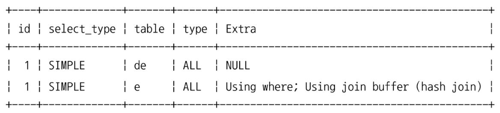

- `type = ALL` : Full Table Scan을 의미

일반적으로 해시 조인은 빌드 단계와 프로브 단계로 나뉘어 처리된다.

**빌드 단계**에서는 조인 대상 테이블 중에서 **레코드 건수가 적어서 해시 테이블로 만들기에 용이한 테이블을 골라서 메모리에 해시 테이블을 생성(빌드)하는 작업을 수행**한다. 빌드 단계에서 해시 테이블을 만들 때 사용되는 원본 테이블을 빌드 테이블이라고도 한다.

그리고 **프로브 단계**는 **나머지 테이블의 레코드를 읽어서 해시 테이블의 일치 레코드를 찾는 과정을 의미**한다. 이때 읽는 나머지 테이블을 프로브 테이블이라고도 한다. 하지만 위의 실행 계획에서는 어느 테이블이 빌드 테이블이고 어느 테이블이 프로브 테이블인지 식별하기 어렵다.(**표 형태 EXPLAIN은 해시 테이블 생성 대상을 명확히 보여주지 않는다**) 이러한 경우에는 `EXPLAN FORMAT=TREE` 명령 또는 `EXPLAIN ANALYZE` 명령을 사용하면 조금 더 쉽게 구분할 수 있다.


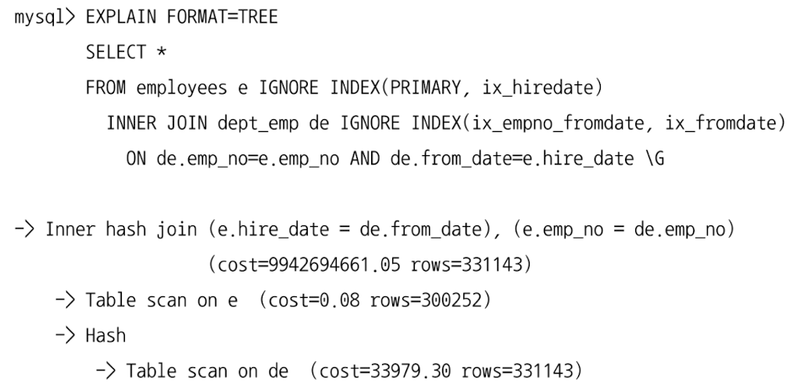

Tree 포맷의 실행 계획에서 보는 바와 같이 실행 계획의 최하단 제일 안쪽(들여쓰기가 가장 많이 된)의 `dept_emp` 테이블이 빌드 테이블로 선정된 것이다. MySQL 옵티마이저는 해시 조인을 위해 빌드 테이블인 `dept_emp` 테이블의 레코드를 읽어서 메모리에 해시 테이블을 생성했다. 그리고 프로브 테이블로 선택된 `employees` 테이블을 스캔하면서 메모리에 생성된 해시 테이블에서 레코드를 찾아서 결과를 사용자에게 반환한 것이다. 그림 9.17은 이 해시 조인의 과정을 그림으로 표현한 것이다.

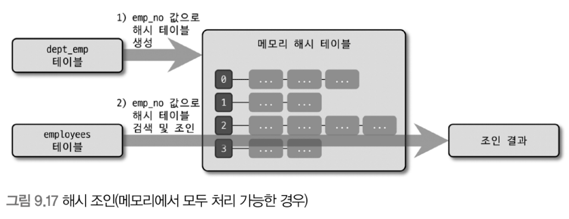

> dept_emp 테이블 FULL SCAN → 해시 테이블(조인 버퍼) 생성 → employees 테이블 기준으로 해시 테이블 탐색 → 조건에 맞는 결과 반환
> 

해시 테이블을 메모리에 저장할 때 MySQL 서버는 `join_buffer_size` 시스템 변수로 크기를 제어할 수 있는 조인 버퍼를 사용한다. 

조인 버퍼의 기본 크기는 256KB인데, 해시 테이블의 레코드 건수가 많아서 조인 버퍼의 공간이 부족할 수도 있다. 이렇나 경우 MySQL 서버는 빌드 테이블과 프로브 테이블을 적당한 크기(하나의 청크가 조인 버퍼보다 작도록)의 청크로 분리한 다음, 청크 별로 그림 9.17 ‘해시 조인(메모리에서 모두 처리 가능한 경우)’과 동일 방식으로 해시 조인을 처리한다.

그림 9.18 ‘해시 조인 1차 처리(메모리가 부족한 경우)’는 조인 버퍼보다 해시 테이블이 큰 경우 해시 조인이 실행되는 방법을 보여준다.

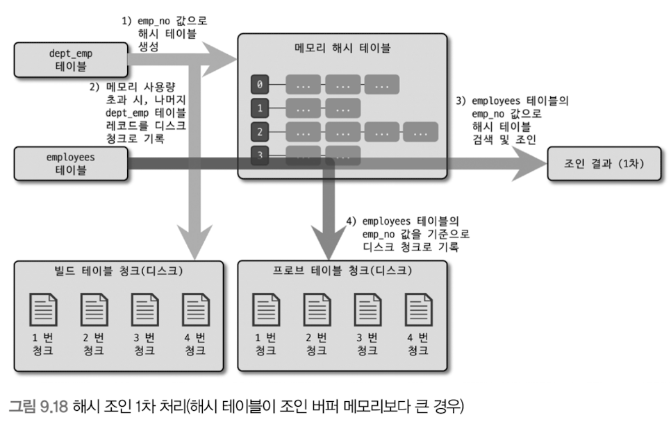

그림 9.18에서는 해시 조인의 처리 방법이 조금 복잡해졌는데, 그 이유는 만들어질 해시 테이블이 설정된 메모리 크기(`join_buffer_size`)보다 큰지를 알 수 없기 때문이다.

MySQL 서버는 `dept_emp` 테이블을 읽으면서 메모리의 해시 테이블을 준비하다가 지정된 메모리 크기(`join_buffer_size`)를 넘어서면 `dept_emp` 테이블의 나머지 레코드를 디스크에 청크로 구분해서 저장한다.

그리고 MySQL 서버는 `employees` 테이블의 `emp_no` 값을 이용해 메모리의 해시 테이블을 검색해서 1차 조인 결과를 생성한다.

그리고 동시에 `employees` 테이블에서 읽은 레코드를 디스크에 청크로 구분해서 저장한다. 그래서 그림 9.18에서 디스크에 2개의 그룹으로 구분된 청크 목록이 표현된 것이며, “빌드 테이블 청크”는 `dept_emp` 테이블의 레코드들을 저장해둔 공간이고, “프로브 테이블 청크”는 employees 테이블의 레코드를 저장해둔 공간이다.

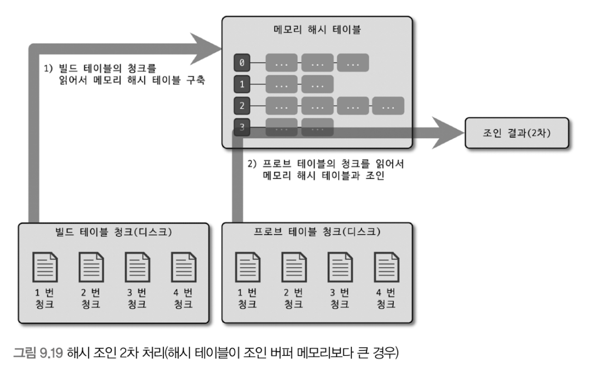

그림 9.18과 같이 1차 조인이 완료되면 그림 9.19의 1번 화살표와 같이 MySQL 서버는 디스크에 저장된 “빌드 테이블 청크”에서 첫 번째 청크를 읽어서 다시 “메모리 해시 테이블”을 구축한다.

그리고 2번 화살표와 같이 “프로브 테이블 청크”에서 첫 번째 청크를 읽으면서 새로 구축된 “메모리 해시 테이블”과 조인을 수행해 2차 결과를 가져온다.

디스크에 저장된 청크 개수만큼 이 과정을 반복 처리해서 완성된 조인 결과를 만들어낸다.

이렇게 청크 단위로 조인을 수행하기 위해 MySQL 서버는 2차 해시 함수를 이용해 “빌드 테이블”과 “프로브 테이블”을 **동일 개수의 청크**로 쪼개어 디스크로 저장한다.

MySQL 옵티마이저는 빌드 테이블의 크기에 따라 그림 9.17 해시 조인(메모리에서 모두 처리 가능한 경우)의 경우에 **클래식 해시 조인** **알고리즘**을 사용하고, 그림 9.18 해시조인 1차 처리(해시 테이블이 조인 버퍼 메모리보다 큰 경우)의 경우에 **그레이스 해시 조인 알고리즘**을 하이브리드하게 활용하도록 구현돼 있다.

해시 조인에서 해시 키를 만들 떄 xxHash64 해시 함수를 사용하는데, 이 해시 함수는 매우 빠르고 해시된 값의 분포도도 훌륭한 해시 알고리즘이다.

해시 조인 알고리즘의 의사 코드는 다음과 같다.

```python
# -----------------------------
# Build Phase (h_tab을 기준으로 해시 테이블/버퍼 구성)
# -----------------------------
result = []
join_buffer = []
partitions = 0
on_disk = false

## h_tab :: Build table (해시 테이블을 만들 대상)
## p_tab :: Probe table (해시 테이블을 탐색하며 매칭할 대상)

for (h_tab_row in h_tab) {
    hash = xxHash64(h_tab_row.join_column)

    if (not on_disk) {
        # 메모리에 올릴 수 있는 동안은 join_buffer(해시 조인 버퍼)에 쌓는다.
        join_buffer.append(hash)

        if (is_full(join_buffer)) {
            # join_buffer가 꽉 차면, 더 이상 메모리만으로 해시 조인을 못 함 → 디스크 스필(spill)로 전환
            on_disk = true

            # 지금까지 모아둔 join_buffer(빌드 측 해시들)를 디스크에 파티션 단위로 저장
            # partitions는 “몇 개 파티션으로 나뉘었는지” 같은 정보를 돌려준다고 보면 됨
            partitions = write_buffer_to_disk(join_buffer)

            # 메모리 버퍼는 비움
            join_buffer = []
        }
    } else {
        # 이미 스필 모드(on_disk=true)라면,
        # 빌드 테이블(h_tab)의 해시를 디스크 파티션에 계속 기록(추가)하는 쪽으로 간다.
        write_hash_to_disk(hash)
    }
}

# -----------------------------
# Probe Phase (p_tab을 읽으면서 매칭 수행)
# -----------------------------
if (not on_disk) {
    # (1) 디스크 스필이 없었던 경우: join_buffer에 해시 테이블이 전부 메모리에 있음
    for (p_tab_row in p_tab) {
        hash = xxHash64(p_tab_row.join_column)

        # probe 테이블의 해시가 join_buffer(빌드 해시 테이블)에 있으면 조인 성립
        if (hash in join_buffer) {
            # 실제 DB에선 같은 해시가 여러 row일 수 있고(충돌/중복키),
            # 해시 버킷에서 후보들을 꺼내 조인 컬럼을 최종 비교하는 과정이 추가됨(여긴 단순화)
            h_tab_row = get_row_from_build(hash)   # 빌드 테이블에서 매칭 row(들) 가져오기
            p_tab_row = get_row_from_probe(hash)   # 현재 probe row 또는 매칭 row 참조

            # 조인 결과 생성
            result.append(join_rows(h_tab_row, p_tab_row))
        }
    }

} else {
    # (2) 디스크 스필이 발생한 경우: 파티션 단위로 “작게 쪼개서” 반복 조인
    # 먼저 probe 테이블(p_tab)도 같은 방식으로 해싱해서 디스크에 써둔다 (파티션 일치시키려고)
    for (p_tab_row in p_tab) {
        hash = xxHash64(p_tab_row.join_column)

        # p_tab 쪽 해시도 디스크(동일 파티션 규칙)에 기록
        write_hash_to_disk(hash)
    }

    # 이제 파티션별로:
    # 1) 빌드 파티션을 메모리로 로드해서 join_buffer 구성
    # 2) 같은 파티션의 probe 데이터만 읽어와 매칭 수행
    for (part in partitions) {
        # part 파티션의 빌드(h_tab) 데이터를 메모리에 올려 해시 테이블(조인 버퍼)로 만든다
        join_buffer = load_build_from_disk(part)

        # 같은 part 파티션에 속한 probe(p_tab) 해시들을 하나씩 읽으면서 조인
        for (hash in load_hash_from_disk(part)) {
            if (hash in join_buffer) {
                h_tab_row = get_row_from_build(hash)
                p_tab_row = get_row_from_probe(hash)
                result.append(join_rows(h_tab_row, p_tab_row))
            }
        }

        # 다음 파티션 처리를 위해 메모리 join_buffer 비움
        join_buffer = []
    }
}

```

- **메모리 충분** → `join_buffer`(해시 테이블)를 메모리에 만들고 `p_tab`을 스캔하면서 바로 매칭
- **메모리 부족(스필)** → `h_tab`과 `p_tab`을 **같은 규칙으로 파티셔닝해서 디스크에 저장** 후, **파티션 하나씩 메모리에 올려서 반복 조인**

### 인덱스 정렬 신호

MySQL 옵티마이저는 `ORDER BY` 또는 `GROUP BY`를 인덱스를 사용해 처리 가능한 경우 쿼리의 실행 계획에서 이 인덱스의 가중치를 높이 설정해서 실행된다.

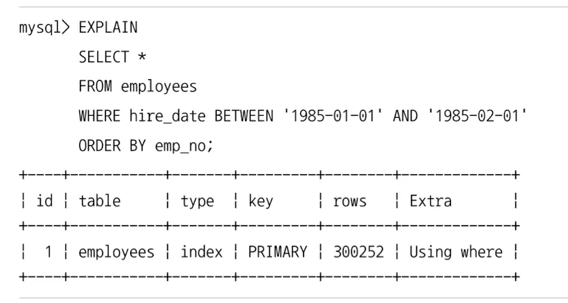

이 쿼리는 대표적으로 다음 2가지 실행 계획을 선택할 수 있다.

1. `ix_hiredate` 인덱스를 이용해 `hire_date BETWEEN ‘1985-01-01’ AND ‘1985-02-01’` 조건에 일치하는 레코드를 찾은 다음 `emp_no`로 정렬해서 결과를 반환
2. `employees` 테이블의 프라이머리 키가 `emp_no`이므로 프라이머리 키를 정순으로 읽으면서 `hire_date` 칼럼의 조건에 일치하는지 비교 후 결과를 반환

상황에 따라 1번이 효율적일 수도 있고 2번이 효율적일 수도 있다. 일반적으로는 `hire_date` 칼럼의 조건에 부합되는 레코드 건수가 많지 않다면 1번이 효율적일 것이다.

그런데 가끔 MySQL 옵티마이저가 예제 쿼리의 실행 계획과 같이 2번 실행 계획을 선택하는 경우가 있을 수도 있다. 실행 계획에서는 `PRIMARY` 키를 풀 스캔하면서 `hire_date` 칼럼의 값이 1985년 1월인 건만 필터링하도록 쿼리를 처리하고 있다.

이렇게 체크해야 하는 레코드 건수가 상당히 많음에도 불구하고 정렬된 인덱스 활용으로 실행 계획이 수립되는 것은 옵티마이저가 실수로 잘못된 실행 계획을 선택한 것일 가능성이 높다. 물론 이런 경우가 빈번하지는 않지만 아주 가끔 옵티마이저가 이런 실수를 한다.

그런데 MySQL 8.0.20 버전까지는이 같은 옵티마이저의 실수가 자주 발생하면
다른 실행 계획을 사용하게 하기 위해 **특정 인덱스(ORDER BY를 위한 인덱스)를 사용하지 못하도록** `IGNORE INDEX` 힌트를 사용하곤 했다.

MySQL 8.0.21 버전부터는 MySQL 서버 옵티마이저가 **ORDER BY를 위한 인덱스에 너무 가중치를 부여하지 않도록** `prefer_ordering_index` 옵티마이저 옵션이 추가됐다.

`prefer_ordering_index` 옵션의 기본값은 ON으로 설정돼 있지만 옵티마이저가 자주 실수를 한다면 다음과 같이 `prefer_ordering_index` 옵션을 OFF로 변경하면 된다.

```sql
# 현재 커넥션에서만 prefer_ordering_index 옵션을 비활성화
SET SESSION optimizer_switch='prefer_ordering_index=OFF';

# 현재 쿼리에 대해서만 prefer_ordering_index 옵션을 비활성화
SELECT /*+ SET_VAR(optimizer_switch='prefer_ordering_index=OFF') */
	...
  FROM
  ...
```

## 조인 최적화 알고리즘

MySQL에는 조인 쿼리의 실행 계획 최적화를 위한 알고리즘이 2개 있다.

MySQL의 조인 최적화는 나름 많이 개선됐다고 이야기한다. 하지만 **사실 테이블의 개수가 많아지면** 최적화된 실행 계획을 찾는 것이 상당히 어려워지고, **하나의 쿼리에서 조인되는 테이블의 개수가 많아지면** 실행 계획을 수립하는 데만 몇 분이 걸릴 수도 있다. **테이블의 개수가 특정 한계를 넘어가면** 그때부터는 실행 계획 수립에도 시간과 비용이 과도하게 늘어날 수도 있다. 여기서는 왜 그런 현상이 생기고, 어떻게 그런 현상을 피할 수 있는지 살펴보겠다.

MySQL에는 최적화된 조인 실행 계획 수립을 위한 2가지 알고리즘이 있는데, 적절한 한글 명칭이 없어서 영어를 그대로 표기하였다. 다음과 같이 간단히 4개의 테이블을 조인하는 쿼리 문장이 조인 옵티마이저 알고리즘에 따라 어떻게 처리되는지 간단히 살펴보자.

```sql
SELECT * FROM t1, t2, t3, t4 WHERE ...
```

### Exhaustive 검색 알고리즘

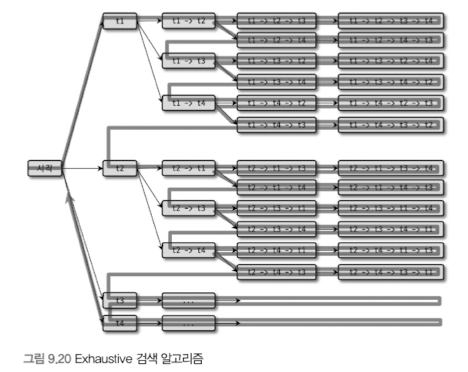

Exhaustive 검색 알고리즘은 MySQL 5.0과 그 이전 버전에서 사용되던 조인 최적화 기법으로, **FROM 절에 명시된 모든 테이블의 조합에 대해 실행 계획의 비용을 계산해서 최적의 조합 1개를 찾는 방법**이다.

그림 9.20은 4개의 테이블(t1~t4)이 Exhaustive 검색 알고리즘으로 처리될 때 최적의 조인 순서를 찾는 방법을 표현한 것이다.

테이블이 20개라면 이 방법으로 처리했을 때 가능한 조인 조합은 모두 20!가 된다.

이전 버전에서 사용되던 Exhaustive 검색 알고리즘에서는 사실 테이블이 10개만 넘어도 실행 계획을 수립하는 데 몇 분이 걸린다. 그리고 테이블이 10개에서 1개만 더 늘어나도 11배의 시간이 더 걸린다.

### Greedy 검색 알고리즘


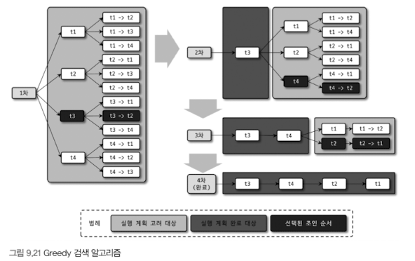

Greedy 검색 알고리즘은 Exhaustive 검색 알고리즘의 시간 소모적인 문제점을 해결하기 위해 MySQL 5.0부터 도입된 조인 최적화 기법이다.

그림 9.21은 4개의 테이블(t1~t4)이 Greedy 검색 알고리즘으로 처리될 때(`optimizer_search_depth` 시스템 변수의 값은 2로 가정) **최적의 조인 순서를 검색하는 방법**을 보여준다.

Greedy는 Exhaustive 검색 알고리즘보다는 조금 복잡한 형태로 최적의 조인 순서를 결정한다. 그림 9.21의 내용을 간단히 순서대로 살펴보자.

1. 전체 N개의 테이블 중에서 `optimizer_search_depth` 시스템 설정 변수에 정의된 개수의 테이블로 가능한 조인 조합을 생성 (해당 변수 값이 2이면 한 번에 최대 2개 테이블까지만 조합해서 비용 계산)
2. 1번에서 생성된 조인 조합 중에서 최소 비용의 실행 계획 하나를 선정
3. 2번에서 선정된 실행 계획의 첫 번째 테이블을 “부분 실행 계획”의 첫 번째 테이블로 선정 
4. 전체 N−1개의 테이블 중(3번에서 선택된 테이블 제외) `optimizer_search_depth` 시스템 설정 변수에 정의된 개수의 테이블로 가능한 조인 조합을 생성
5. 4번에서 생성된 조인 조합들을 하나씩 3번에서 생성된 “부분 실행 계획”에 대해 실행 비용을 계산
6. 5번의 비용 계산 결과, 최적의 실행 계획에서 두 번째 테이블을 3번에서 생성된 “부분 실행 계획”의 두 번째 테이블로 선정
7. 남은 테이블이 모두 없어질 때까지 4~6번까지의 과정을 반복 실행하면서 “부분 실행 계획”에 테이블의 조인 순서를 기록
8. 최종적으로 “부분 실행 계획”이 테이블의 조인 순서로 결정됨

> 즉, 전체 조인 순서를 한 번에 찾는 게 아니라
매 단계마다 가장 비용이 싼 테이블 하나만 확정해 나가는 알고리즘
> 

Greedy 검색 알고리즘은 `optimizer_search_depth` 시스템 변수에 설정된 값에 따라 조인 최적화의 비용이 상당히 줄어들 수 있다. optimizer_search_depth 시스템 변수의 기본값은 62다.

MySQL에서는 조인 최적화를 위한 시스템 변수로 `optimizer_prune_level`과 `optimizer_search_depth`가 제공된다.

- **optimizer_search_depth 시스템 변수**
    
    Greedy 검색 알고리즘과 Exhaustive 검색 알고리즘 중에서 어떤 알고리즘을 사용할지 결정하는 시스템 변수다. `optimizer_search_depth`는 0~62까지의 정수값을 설정할 수 있는데, 1~62까지의 정수값이 설정되면 **Greedy 검색 대상을 지정된 개수로 한정해서 최적의 실행 계획을 산출**한다.
    
    `optimizer_search_depth`가 0으로 설정되면 Greedy 검색을 위한 최적의 조인 검색 테이블의 개수를 MySQL 옵티마이저가 **자동으로 결정**한다.
    
    `optimizer_search_depth` 설정 값과 쿼리의 조인 테이블 개수에 따라 Exhaustive 검색과 Greedy 검색이 **동시에 사용**된다.
    
    - **조인에 사용된 테이블의 개수 > optimizer_search_depth 설정 값**
        - 그 초과 테이블은 Exhaustive 검색이 사용되고 나머지 테이블은 Greedy 검색이 사용된다.
    - **조인에 사용된 테이블의 개수 < optimizer_search_depth 설정 값**
        - Exhaustive 검색만 사용된다.
    
    `optimizer_search_depth`의 기본값은 62인데, 많은 테이블이 조인되는 쿼리에서는 상당히 부담이 될 수도 있다. (실행 계획 수립 비용이 많아 걸림)
    
    특히 `optimizer_prune_level` 시스템 변수가 0으로 설정된 경우에는 `optimizer_search_depth`의 설정값이 쿼리의 성능에 심각한 영향을 미칠 수 있으므로 **`optimizer_search_depth`는 4~5 정도로 설정하는 것이 좋다.**
    
- **optimizer_prune_level 시스템 변수**
    
    optimizer_prune_level 시스템 변수는 MySQL 5.0부터 추가된 Heuristic 검색이 작동하는 방식을 제어한다.
    
    우리가 Exhaustive 검색 알고리즘과 Greedy 검색 알고리즘 중에서 어떤 알고리즘을 사용하더라도 MySQL 옵티마이저는 여러 테이블의 조인 순서를 결정하기 위해 상당히 많은 조인 경로를 비교한다.
    
    Heuristic 검색의 가장 핵심적인 내용은 **다양한 조인 순서의 비용을 계산하는 도중 이미 계산했던 조인 순서의 비용보다 큰 경우에는 언제든지 중간에 포기할 수 있다는 것**이다.
    
    예를 들어, 첫 번째 조인 순서의 실행 비용이 100이라면 그 이후에 비교하는 조인 순서의 비용이 100보다 크면 조인 순서는 끝까지 비교하지 않는다.
    
    그리고 아우터 조인으로 연결되는 테이블은 우선순위에서 제거하는 경험 기반의 최적화도 Heuristic 검색 최적화에는 포함돼 있다.
    
    **optimizer_prune_level이 “1”로 설정되면 옵티마이저는 조인 순서 최적화에 경험 기반의 Heuristic 알고리즘을 사용한다.**
    
    그리고 이 값이 “0”으로 설정되면 경험 기반의 Heuristic 최적화되지 않는다.
    
    실제 Heuristic 조인 최적화는 조인 대상 테이블이 몇 개 되지 않더라도 상당한 성능 차이를 낸다.
    
    **그러므로 특별한 조건이 없다면 optimizer_prune_level을 “0”으로 설정하지 말자.**
    

그렇다면 테이블 조인이 많은 쿼리의 실행 계획 수립이 얼마나 느려질 수 있는지, optimizer_prune_level과 optimizer_search_depth를 조정하면 얼마나 더 빨라질 수 있는지 한 번 살펴보자.

우선 다음과 같이 칼럼 2개로 이루어지고 보조 인덱스를 가진 테이블을 tab01부터 tab30까지 생성하고, 레코드를 2000건 정도 INSERT한다.

```sql
mysql> CREATE TABLE tab01 (
    fd1 char(20) NOT NULL,
    fd2 char(20) DEFAULT NULL,
    PRIMARY KEY (fd1),
    KEY ix_fd2 (fd2)
);
```

테스트를 수행할 테이블은 준비됐으니 이제 다음의 쿼리로 실행 계획을 한 번 확인해 보자.

```sql
SET SESSION optimizer_prune_level = { 0 | 1 };

SET SESSION optimizer_search_depth = { 1 | 5 | 10 | 15 | 20 | 25 | 30 | 35 | 40 | 62 };

EXPLAIN
SELECT *
FROM tab01, tab02, tab03, tab04, tab05, tab06, tab07, tab08, tab09, tab10,
	tab11, tab12, tab13, tab14, tab15, tab16, tab17, tab18, tab19, tab20,
	tab21, tab22, tab23, tab24, tab25, tab26, tab27, tab28, tab29, tab30
WHERE tab01.fd1=tab02.fd1
	AND tab02.fd1=tab03.fd2 AND tab03.fd1=tab04.fd2 AND tab04.fd2=tab05.fd1
  AND tab05.fd2=tab06.fd1 AND tab06.fd2=tab07.fd2 AND tab07.fd1=tab08.fd1
  AND tab08.fd2=tab09.fd1 AND tab09.fd1=tab10.fd2 AND tab10.fd1=tab11.fd2
  AND tab11.fd2=tab12.fd1 AND tab12.fd2=tab13.fd2 AND tab13.fd1=tab14.fd1
  AND tab14.fd2=tab15.fd1 AND tab15.fd1=tab16.fd2 AND tab16.fd1=tab17.fd1
  AND tab17.fd2=tab18.fd2 AND tab18.fd1=tab19.fd1 AND tab19.fd2=tab20.fd2
  AND tab20.fd1=tab21.fd1 AND tab21.fd2=tab22.fd2 AND tab22.fd2=tab23.fd1
  AND tab23.fd1=tab24.fd2 AND tab24.fd2=tab25.fd2 AND tab25.fd1=tab26.fd2
  AND tab26.fd1=tab27.fd2 AND tab27.fd2=tab28.fd1 AND tab28.fd2=tab29.fd1
  AND tab29.fd2=tab30.fd2;
```

먼저 `optimizer_prune_level` 시스템 변수를 1로 고정하고, `optimizer_search_depth` 세션 변수의 값을 1부터 5씩 증가시켜서 62까지 변화시키면서 위 쿼리의 실행 계획 수립에 걸린 시간을 확인한 결과, 거의 시간 차이 없이 0.01초 이내에 완료됐다.

MySQL 5.1 버전에서는 `optimizer_prune_level`을 1로 설정해서 조인 순서 결정에 Heuristic 최적화를 적용해도 `optimizer_search_depth` 세션 변수값이 증가하면 실행 계획 수립에 1초 넘는 시간이 걸렸다.

지금처럼 `optimizer_search_depth` 값 변화와 관계없이 실행 계획 수립이 아주 빠르게 처리되는 것은 MySQL 서버의 조인 최적화 관련 딕셔너리 정보 검색 성능이 버전이 올라갈수록 많이 개선됐기 때문이다.

이번에는 `optimizer_prune_level` 세션 변수를 0으로 고정하고, `optimizer_search_depth` 세션 변수의 값을 1부터 5씩 증가시키면서 실행 계획 수립에 걸리는 시간을 확인했다.

그림 9.22는 `optimizer_search_depth` 값 변화에 따른 실행 계획 수립에 소요된 시간을 보여주는데, `optimizer_search_depth`가 15일 때부터는 실행 계획 수립에만 너무 많은 시간이 소요되어 표시하지 않았다.

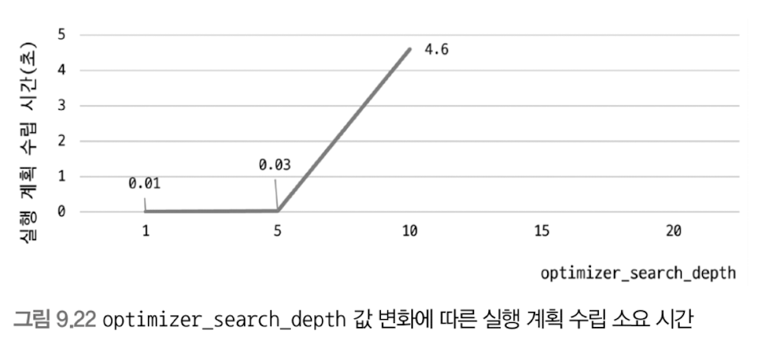

MySQL 8.0 버전의 조인 최적화는 많이 개선되어 `optimizer_search_depth` 변수의 값에는 크게 영향받지 않는 것으로 보인다. 하지만 `optimizer_prune_level`을 0으로 설정하면 optimizer_search_depth 값 변화에 따라 실행 계획 수립에 소요되는 시간이 급증하는 것을 확인할 수 있다.

예전 버전의 MySQL 서버에서는 조인 최적화와 관련된 휴리스틱(Heuristic)의 문제점이 있었지만 MySQL 8.0에서는 이런 조인 최적화 관련 휴리스틱을 비활성화할 필요가 거의 없어졌다.

**`optimizer_prune_level` 시스템 변수의 기본값이 1이므로 조인 관련된 시스템 변수의 조정은 더 이상 필요하지 않을 것으로 보인다.**

# 쿼리 힌트

MySQL 서버는 우리가 서비스하는 비즈니스를 100% 이해하지는 못한다. 따라서 이런 경우에는 옵티마이저에게 쿼리의 실행 계획을 어떻게 수립해야 할지 알려줄 수 있는 방법이 필요하다. 일반적인 RDBMS에서는 이런 목적으로 힌트가 제공되며, MySQL에서도 다양한 옵티마이저 힌트를 제공한다.

MySQL 서버에서 사용 가능한 쿼리 힌트는 다음과 같이 2가지로 구분할 수 있다.

- 인덱스 힌트
- 옵티마이저 힌트

인덱스 힌트는 예전 버전의 MySQL 서버에서 사용되던 `USE INDEX` 같은 힌트를 의미하며, 옵티마이저 힌트는 MySQL 5.6 버전부터 새롭게 추가되기 시작한 힌트들을 지칭한다.

그런데 여기에 포함되지 않는 `STRAIGHT_JOIN`과 같은 힌트들도 있다. 여기서는 옵티마이저 힌트가 아닌 것들은 모두 모아서 인덱스 힌트로 분류해서 살펴보겠다.

## 인덱스 힌트

`STRAIGHT_JOIN`과 `USE INDEX` 등을 포함한 인덱스 힌트들은 모두 MySQL 서버에 옵티마이저 힌트가 도입되기 전에 사용되던 기능들이다.

이들은 모두 SQL의 문법에 맞게 사용해야 하기 때문에 ANSI-SQL 표준 문법을 준수하지 못하게 되는 단점이 있다.

MySQL 5.6 버전부터 추가되기 시작한 옵티마이저 힌트들은 모두 MySQL 서버를 제외한 다른 RDBMS에서는 주석으로 해석하기 때문에 ANSI-SQL 표준을 준수한다고 볼 수 있다.

**그래서 가능하면 인덱스 힌트보다는 옵티마이저 힌트를 사용할 것을 추천한다.**

또한 인덱스 힌트는 **SELECT 명령과 UPDATE 명령에서만 사용**할 수 있다.

### STRAIGHT_JOIN

`STRAIGHT_JOIN`은 옵티마이저 힌트인 동시에 조인 키워드이기도 하다.

`STRAIGHT_JOIN`은 `SELECT`, `UPDATE`, `DELETE` 쿼리에서 여러 개의 테이블이 조인되는 경우 **조인 순서를 고정하는 역할**을 한다.

다음 쿼리는 3개의 테이블을 조인하지만 어느 테이블이 드라이빙 테이블이 되고 어느 테이블이 드리븐 테이블이 될지 알 수 없다. 옵티마이저가 그대로 각 테이블의 통계 정보와 쿼리의 조건을 기반으로 가장 최적이라고 판단되는 순서로 조인한다.

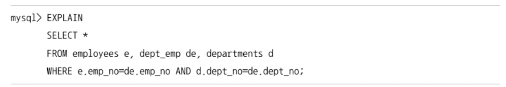

이 쿼리의 실행 계획을 확인해 보면 `departments` 테이블을 드라이빙 테이블로 선택했고, 두 번째로 `dept_emp` 테이블을 읽은 뒤 마지막으로 `employees` 테이블을 읽었음을 알 수 있다.

일반적으로 **조인을 하기 위한 컬럼들의 인덱스 여부로 조인의 순서가 결정**되며, 조인 컬럼의 인덱스에 아무런 문제가 없는 경우에는 **WHERE 조건이 있는 경우 WHERE 조건을 만족하는 레코드가 적은 테이블을 드라이빙으로 선택**한다.

이 쿼리의 경우 `departments` 테이블이 레코드 건수가 가장 적어서 드라이빙으로 선택됐을 것으로 보인다.

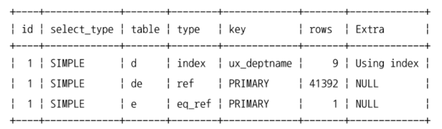

하지만 이 쿼리의 조인 순서를 변경하려는 경우에는 `STRAIGHT_JOIN` 힌트를 사용할 수 있다.

두 쿼리는 힌트의 표기법만 조금 다를 뿐 동일한 쿼리다. 두 예제 모두 `STRAIGHT_JOIN` 키워드가 SELECT 키워드 바로 뒤에 사용됐다는 것에 주의하자.

이처럼 **인덱스 힌트는 사용해야 하는 위치가 이미 결정돼 있으므로 그 이외의 다른 위치에서는 사용하지 않도록 주의하자.**

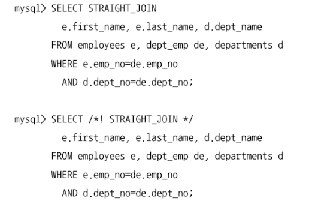

`STRAIGHT_JOIN` 힌트는 옵티마이저가 **FROM 절에 명시된 테이블의 순서대로 조인을 수행하도록 유도한다.**

이 쿼리의 실행 계획을 보면 FROM 절에 명시된 테이블의 순서대로 `employees → dept_emp → departments` 순으로 조인을 수행한다는 것을 알 수 있다.

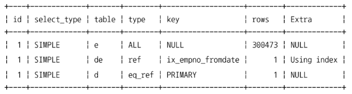

주로 다음 기준에 맞게 조인 순서가 결정되지 않는 경우에만 `STRAIGHT_JOIN` 힌트로 조인 순서를 조정하는 것이 좋다.

- **임시 테이블(인라인 뷰 또는 파생된 테이블)과 일반 테이블의 조인**: 이 경우에는 거의 일반적으로 임시 테이블을 드라이빙 테이블로 선택하는 것이 좋다. 일반 테이블의 조인 칼럼의 인덱스가 없는 경우에는 레코드 건수가 작은 쪽을 먼저 읽도록 드라이빙으로 선택하는 것이 좋은데, 대부분 옵티마이저가 적절한 조인 순서를 선택하기 때문에 쿼리를 작성할 때부터 힌트를 사용할 필요는 없다. 옵티마이저가 실행 계획을 제대로 수립하지 못해서 심각한 성능 저하가 있는 경우에는 힌트를 사용하면 된다.
- **임시 테이블끼리의 조인**: 임시 테이블은 항상 인덱스가 없기 때문에 어느 테이블을 먼저 드라이빙으로 읽어도 무관하므로 크기가 작은 테이블을 드라이빙으로 선택해주는 것이 좋다.
- **일반 테이블끼리의 조인**: 양쪽 테이블 모두 조인 칼럼에 인덱스가 있거나 양쪽 테이블 모두 조인 칼럼에 인덱스가 없는 경우에는 레코드 건수가 적은 테이블을 드라이빙으로 선택해주는 것이 좋으며, 그 이외의 경우에는 조인 칼럼에 인덱스가 없는 테이블을 드라이빙으로 선택하는 것이 좋다.

여기서 언급한 레코드 건수라는 것은 인덱스를 사용할 수 있는 WHERE 조건까지 포함해서 그 조건을 만족하는 레코드 건수를 의미하는 것이지, 무조건 테이블 전체의 레코드 건수를 의미하는 것은 아니다.

다음 예제는 employees 테이블의 건수가 훨씬 많지만 조건을 만족하는 employees 테이블의 레코드는 건수가 훨씬 경우를 생각해볼 수 있다. 이런 경우에는 (옵티마이저가 실행 계획을 잘못 수립하는 경우라면) `STRAIGHT_JOIN` 힌트를 이용해 employees 테이블을 드라이빙 되게 하는 것이 좋다.

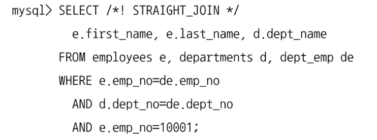

`STRAIGHT_JOIN` 힌트와 비슷한 역할을 하는 옵티마이저 힌트로는 다음과 같은 것들이 있다.

- JOIN_FIXED_ORDER
- JOIN_ORDER
- JOIN_PREFIX
- JOIN_SUFFIX

`JOIN_FIXED_ORDER` 옵티마이저 힌트는 `STRAIGHT_JOIN` 힌트와 동일한 효과를 낸다.

`STRAIGHT_JOIN` 힌트는 한 번 사용되면 **FROM 절의 모든 테이블에 대해 조인 순서가 결정**되는 효과를 낸다.

하지만 나머지 3개의 옵티마이저 힌트는 `STRAIGHT_JOIN`과는 달리 **일부 테이블의 조인 순서에 대해서만 제약**하는 힌트다.

### USE INDEX / FORCE INDEX / IGNORE INDEX

조인의 순서를 변경하는 것 다음으로 자주 사용되는 것이 인덱스 힌트다. 인덱스 힌트는 **사용하려는 인덱스를 가지는 테이블 뒤에 힌트**를 명시해야 한다.

대체로 MySQL 옵티마이저는 어떤 인덱스를 사용해야 할지를 무난하게 잘 선택하는 편이다. 하지만 3~4개 이상의 칼럼을 포함하는 비슷한 인덱스가 여러 개 존재하는 경우에는 가끔 옵티마이저가 실수를 하는데, 이런 경우에는 강제로 특정 인덱스를 사용하도록 힌트를 추가한다.

인덱스 힌트는 크게 다음과 같이 3종류가 있다. 3종류의 인덱스 힌트 모두 키워드 뒤에 사용할 인덱스의 이름을 괄호로 묶어서 사용하며, 괄호 안에 아무것도 없거나 존재하지 않는 인덱스 이름을 사용할 경우에는 쿼리 문법 오류로 처리된다. 또한 별도로 사용자가 부여한 이름이 없는 프라이머리 키는 “PRIMARY”라고 명시하면 된다.

- **USE INDEX**
    
    가장 자주 사용되는 인덱스 힌트로, MySQL 옵티마이저에게 **특정 테이블의 인덱스를 사용하도록 권장하는 힌트** 정도로 생각하면 된다. 대부분의 경우 인덱스 힌트가 주어지면 옵티마이저는 사용자의 힌트를 채택하지만 항상 그 인덱스를 사용하는 것은 아니다.
    
- **FORCE INDEX**
    
    USE INDEX보다 옵티마이저에게 미치는 영향이 더 강한 힌트로 생각하면 된다. 하지만 USE INDEX만으로도 옵티마이저에 대한 영향력이 충분히 크기 때문에 **FORCE INDEX는 거의 사용할 필요가 없어 보인다.** 지금까지 경험으로 보면 대체로 USE INDEX 힌트를 부여했는데도 그 인덱스를 사용하지 않는 경우라면 FORCE INDEX 힌트를 사용해도 그 인덱스를 사용하지 않았다.
    
- **IGNORE INDEX**
    
    USE INDEX나 FORCE INDEX와는 반대로 **특정 인덱스를 사용하지 못하게 하는 용도**로 사용하는 힌트다. 때로는 옵티마이저가 풀 테이블 스캔을 사용하도록 유도하기 위해 IGNORE INDEX 힌트를 사용할 수도 있다.
    

방금 소개한 3종류의 인덱스 힌트 모두 용도를 명시해 줄 수 있다. 용도는 선택 사항이며, 특별히 인덱스 힌트에 용도가 명시되지 않으면(사용 가능한 경우) 주어진 인덱스를 3가지 용도로 사용한다.

- **USE INDEX FOR JOIN**
    
    여기서 JOIN이라는 키워드는 테이블 간의 조인뿐만 아니라 레코드를 검색하기 위한 용도까지 포함하는 용어다. 이미 실행 계획 부분에서도 한 번 언급했듯이 MySQL 서버에서는 하나의 테이블로부터 데이터를 검색하는 작업도 JOIN이라고 표현하기 때문에 FOR JOIN이라는 이름이 붙은 것이다.
    
- **USE INDEX FOR ORDER BY**
    
    명시된 인덱스를 ORDER BY 용도로만 사용할 수 있게 제한한다.
    
- **USE INDEX FOR GROUP BY**
    
    명시된 인덱스를 GROUP BY 용도로만 사용할 수 있게 제한한다.
    

이렇게 용도를 3가지로 나누긴 했지만 ORDER BY나 GROUP BY 작업에서 인덱스를 사용할 수 있다면 나은 성능을 보장하며, 용도는 옵티마이저가 대부분 최적으로 선택하기 때문에 인덱스의 용도까지는 크게 고려하지 않아도 된다.

인덱스 힌트에 대한 이론적 소개는 여기까지 하고 직접 예제를 실행해 보면서 사용법을 살펴보자.

```sql
SELECT * FROM employees WHERE emp_no=10001;

SELECT * FROM employees FORCE INDEX(primary) WHERE emp_no=10001;

SELECT * FROM employees USE INDEX(primary) WHERE emp_no=10001;

SELECT * FROM employees IGNORE INDEX(primary) WHERE emp_no=10001;

SELECT * FROM employees FORCE INDEX(ix_firstname) WHERE emp_no=10001;
```

예제 중 첫 번째부터 세 번째까지의 쿼리는 모두 employees 테이블의 프라이머리 키를 이용해 동일한 실행 계획으로 쿼리를 처리한다. 기본적으로 인덱스 힌트가 주어지지 않아도 “emp_no=10001” 조건이 있기 때문에 프라이머리 키를 사용하는 것이 최적이라는 것을 옵티마이저도 인식하기 때문이다.

네 번째 쿼리는 일부러 인덱스를 사용하지 못하게 힌트를 추가했다. 이런 터무니없는 힌트(프라이머리 키를 통해 조회할 수 있는데 풀 테이블 스캔으로 처리하도록 유도하는 힌트)는 무시할 것이라고 생각할 수도 있겠지만, MySQL 5.5 같은 예전 버전에서는 실제로 프라이머리 키 인덱스 스캔을 마다하고 풀 테이블 스캔을 실행 계획이 사용되기도 했다. 다섯 번째 예제 또한 전혀 관계없는 인덱스를 사용하도록 FORCE INDEX 힌트를 사용했더니 **프라이머리 키는 버리고 풀 테이블 스캔을 하는 형태로 실행 계획이 출력됐다.**

여기 있는 예제는 모두 힌트 사용법의 예시를 위한 것일 뿐이므로 주의해야 한다. 여기 예제로는 없지만 전문 검색(Full Text search) 인덱스가 있는 경우에는 MySQL 옵티마이저는 다른 일반 보조 인덱스(B-Tree 인덱스)를 사용할 수 있는 상황이라고 하더라도 전문 검색 인덱스를 선택하는 경우가 많다. **옵티마이저는 프라이머리 키나 전문 검색 인덱스와 같은 인덱스에 대해서는 선택 시 가중치를 두고 실행 계획을 수립하기 때문이다.**

인덱스의 사용법이나 좋은 실행 계획이 어떤 것인지 판단하기 힘든 상황이라면 힌트를 사용해 강제로 옵티마이저의 실행 계획에 영향을 미치는 것은 피하는 것이 좋다. 이제 MySQL의 옵티마이저도 눈에 띄게 향상되어 쿼리의 최적화를 눈 깜짝할 사이에 처리하기 때문이다. 최적의 실행 계획은 데이터의 성격에 따라서 시시각각 변화하므로 지금 프라이머리 키를 사용하는 것이 좋은 계획이었다고 하더라도 내일은 달라질 수 있기 때문이다. 가능하다면 그때그때 옵티마이저가 당시 통계 정보를 가지고 선택하게 하는 것이 가장 좋다. **가장 훌륭한 최적화는 그 쿼리를 서비스에서 없애 버리거나 튜닝 필요가 없게 데이터를 최소화하는 것이며, 그것이 어렵다면 데이터 모델의 단순화를 통해 쿼리를 간결하게 만들고 힌트가 필요 없게 하는 것이다.** 어떤 방법도 없다면 **그다음으로는 힌트를 선택하는 것인데, 일반적으로 실무에서는 앞쪽의 작업들에 상당한 시간과 작업 능력이 필요하기 때문에 항상 이런 힌트에 의존하는 경우가 많다.**

### SQL_CALC_FOUND_ROWS

MySQL의 `LIMIT`을 사용하는 경우, 조건을 만족하는 레코드가 `LIMIT`에 명시된 수보다 더 많다고 하더라도 `LIMIT`에 명시된 수만큼 만족하는 레코드를 찾으면 즉시 검색 작업을 멈춘다.

하지만 `SQL_CALC_FOUND_ROWS` 힌트가 포함된 쿼리의 경우에는 `LIMIT`을 만족하는 수만큼의 레코드를 찾았다고 하더라도 끝까지 검색을 수행한다.

최종적으로 사용자에게는 `LIMIT`에 제한된 수만큼의 결과 레코드만 반환됨에도 불구하고 말이다.

`SQL_CALC_FOUND_ROWS` 힌트가 사용된 쿼리가 실행된 경우에는 `FOUND_ROWS()`라는 함수를 이용해 `LIMIT`을 제외한 조건을 만족하는 레코드가 전체 몇 건이었는지를 알아낼 수 있다. 

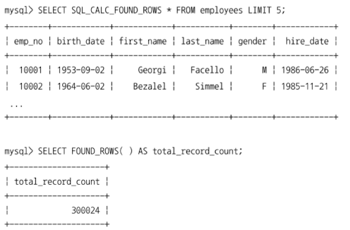

아마도 이 기능은 웹 프로그램의 페이징 기능에 적용하기 위해서 검토했거나 이미 사용하고 있을지도 모른다. **하지만 여기서는 이 힌트의 장점이 아니라 이 힌트를 사용하면 안 되는 경우를 설명하고자 한다.** 우선 `SQL_CALC_FOUND_ROWS`를 사용한 페이징 처리와 `COUNT(*)` 쿼리를 사용하는 예제를 한 번 비교해 보자.

- **SQL_CALC_FOUND_ROWS 사용법**
    
    ```sql
    SELECT SQL_CALC_FOUND_ROWS * FROM employees WHERE first_name='Georgi' LIMIT 0, 20;
    
    SELECT FOUND_ROWS() AS total_record_count;
    ```
    
    - 이 경우에는 한 번의 쿼리 실행으로 필요한 정보 2가지를 모두 가져온 것처럼 보이지만 `FOUND_ROWS()` 함수의 실행을 위해 또 한 번의 쿼리가 필요하기 때문에 쿼리를 2번 실행해야 한다.
        
        이 쿼리의 경우 `first_name='Georgi'` 조건을 처리하기 위해 employees 테이블의 ix_firstname 인덱스를 레인지 스캔으로 실제 값을 읽어오는데, 실제 이 조건을 만족하는 레코드는 전체 253건이다.
        LIMIT 조건이 처음 20개만 가져오도록 했지만 `SQL_CALC_FOUND_ROWS` 힌트 때문에 LIMIT을 만족하는 레코드만 찾아서 중단하지 않고 ix_firstname 인덱스를 통해 실제 데이터를 찾아가는 작업을 253번 실행해야 하며, 디스크 헤더가 특정 위치로 움직일 때까지 기다려야 하는 랜덤 I/O가 253번 일어난다.
        
- **기존 2개의 쿼리로 쪼개어 실행하는 방법**
    
    ```sql
    SELECT COUNT(*) FROM employees WHERE first_name='Georgi';
    
    SELECT * FROM employees WHERE first_name='Georgi' LIMIT 0, 20;
    ```
    
    - 이 방식 또한 쿼리는 2번 실행해야 한다. 우선 전체 조건을 만족하는 건수를 조회하기 위한 첫 번째 쿼리를 살펴보자. WHERE 조건절에 `first_name='Georgi'`가 있기 때문에 똑같이 ix_firstname 인덱스를 레인지 스캔한다.
    이 쿼리에서는 실제 레코드 데이터가 필요한 것이 아니라 건수만 가져오면 되기 때문에 실제 데이터 레코드를 찾아가기 위한 **랜덤 I/O는 발생하지 않는다.** 커버링 인덱스(Covering index) 쿼리이기 때문이다.
    이번에는 실제 데이터를 읽어 오기 위한 두 번째 쿼리를 살펴보자. 이 쿼리는 `SQL_CALC_FOUND_ROWS`에서 첫 번째처럼 ix_firstname 인덱스를 레인지 스캔으로 접근한 후 실제 데이터 레코드를 읽어 가야 하기 때문에 **랜덤 I/O가 발생**한다.
    하지만 **이 쿼리는 LIMIT 0, 20의 제한이 있기 때문에 랜덤 I/O를 253번 실행하는 것이 아니라 20번만 실행한다.**

간단한 예제로 2가지 방식을 비교해 봤는데, 아마 어렵지 않게 어느 쪽 방식이 더 빠른지 쉽게 알 수 있을 것이다. 전기적 처리인 메모리나 CPU의 연산 작업에 비해 기계적 처리인 디스크 작업이 얼마나 느린 작업인지를 고려하면 비교할 수도 없을 만큼 **`SQL_CALC_FOUND_ROWS`를 사용하는 경우가 느리다는 것을 쉽게 알 수 있다.**

SELECT 쿼리 문장이 `UNION(또는 UNION DISTINCT)`으로 연결된 경우에는 `SQL_CALC_FOUND_ROWS` 힌트를 사용해도 `FOUND_ROWS()` 함수로 정확한 레코드 건수를 가져올 수 없다는 것도 문제다.

인덱스나 쿼리의 튜닝이 제대로 됐다면 후자의 방식이 `SQL_CALC_FOUND_ROWS`를 사용하는 방식보다는 빠르게 실행될 것이므로 **`SQL_CALC_FOUND_ROWS`는 사용하지 않는 방향으로 추천한다**.

이는 `SQL_CALC_FOUND_ROWS`는 성능 향상을 위해 만들어진 힌트가 아니라 개발자의 편의를 위해 만들어진 힌트라는 것을 생각하면 당연한 결과일 것이다.

물론 `COUNT(*)` 쿼리나 칼럼값을 읽어오는 `SELECT` 쿼리가 적절히 튜닝되지 않았거나 `WHERE` 조건에 대해서 적절한 인덱스가 준비되지 않은 경우에는 `SQL_CALC_FOUND_ROWS`로 처리하는 것이 빠른 경우도 있다.

이러한 경우라면 어떻게든 쿼리나 인덱스를 튜닝하는 편이 훨씬 더 빠른 결과를 만들어낼 수 있는 방법이 될 것이다. 예외적인 경우도 있을 수 있겠지만, 일반적인 관점에서 본다면 `SQL_CALC_FOUND_ROWS`보다는 레코드 카운트용 쿼리와 데이터를 조회하는 쿼리를 분리하는 것이 더 효율적일 것이다.

> **`SQL_CALC_FOUND_ROWS` 사용 지양을 추천한다. (디스크 I/O 발생 줄이기 위해)
일반적으로는 레코드 카운트용 쿼리와 데이터를 조회하는 쿼리를 분리하는 것이 더 효율적**
> 

## 옵티마이저 힌트

### 옵티마이저 힌트 종류

옵티마이저 힌트는 영향 범위에 따라 다음 4개 그룹으로 나누어 볼 수 있다.

- **인덱스**: 특정 인덱스의 이름을 사용할 수 있는 옵티마이저 힌트
- **테이블**: 특정 테이블의 이름을 사용할 수 있는 옵티마이저 힌트
- **쿼리 블록**: 특정 쿼리 블록에 사용할 수 있는 옵티마이저 힌트로서, 특정 쿼리 블록의 이름을 명시하는 것이 아니라 힌트가 명시된 쿼리 블록에 대해서만 영향을 미치는 옵티마이저 힌트
- **글로벌(쿼리 전체)**: 전체 쿼리에 대해서 영향을 미치는 힌트

하지만 이 구분으로 인해 힌트의 사용 위치가 달라지는 것은 아니다. 그리고 힌트에 인덱스 이름이 명시될 수 있는 경우를 인덱스 수준의 힌트로 구분하고, 테이블 이름까지만 명시될 수 있는 경우를 테이블 수준의 힌트로 구분한다.

또한 특정 힌트는 테이블과 인덱스의 이름을 모두 명시할 수도 있지만 인덱스의 이름을 명시하지 않고 테이블 이름만 명시할 수도 있는데, 이런 경우는 인덱스와 테이블 수준의 힌트가 된다.

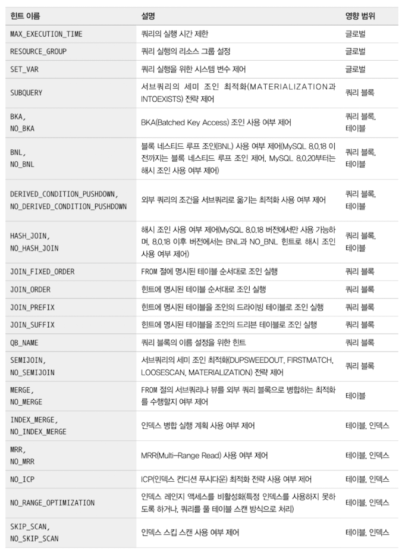

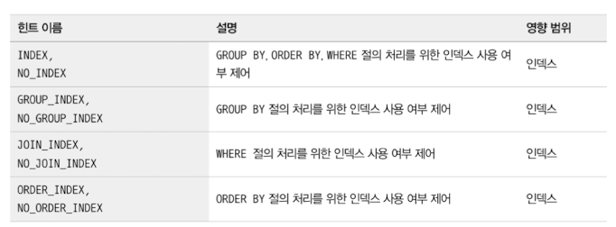

하나의 SQL 문장에서 SELECT 키워드는 여러 번 사용될 수 있다. 이때 각 SELECT 키워드로 시작하는 서브쿼리 영역을 **쿼리 블록**이라고 한다. 특정 쿼리 블록에 영향을 미치는 옵티마이저 힌트는 그 쿼리 블록 내에서 사용할 수도 있지만 외부 쿼리 블록에서 사용할 수도 있다.

이처럼 특정 쿼리 블록을 외부 쿼리 블록에서 사용하려면 `QB_NAME()`힌트를 이용해 해당 쿼리 블록에 이름을 부여해야 한다. 다음 쿼리는 특정 쿼리 블록(서브쿼리)에 대해 `subq1`이라는 이름을 부여하고, 그 쿼리 블록을 힌트에 사용하는 예제다.

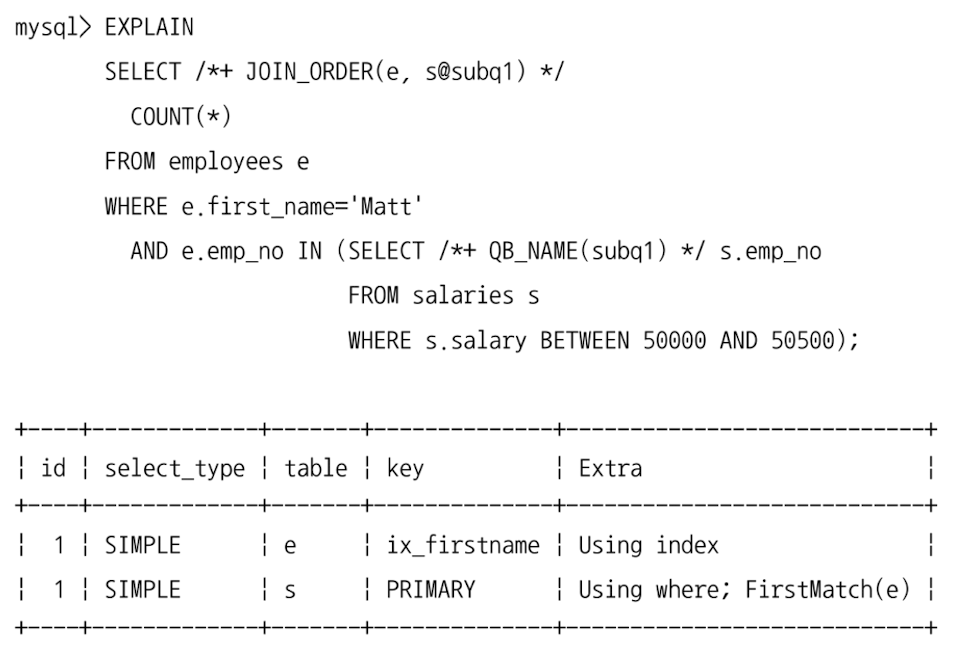

이 예제 쿼리는 서브쿼리에 사용된 salaries 테이블이 세미 조인 최적화를 통해 조인으로 처리될 것을 예상하고 JOIN_ORDER 힌트를 사용한 것이며, 조인의 순서로 외부 쿼리 블록의 employees 테이블과 서브쿼리 블록의 salaries 테이블을 순서대로 조인하게 힌트를 사용한 것이다. 이 예제 쿼리와 같은 힌트 사용은 일반적이지 않지만 쿼리 블록에 대한 이름을 부여하고 그 쿼리 블록 내부의 테이블을 외부 쿼리 블록에서 사용하기 위해서는 이와 같이 사용해야 한다.

### MAX_EXECUTION_TIME

옵티마이저 힌트 중에서 유일하게 쿼리의 실행 계획에 영향을 미치지 않는 힌트이며, 단순히 쿼리의 최대 실행 시간을 설정하는 힌트다.

MAX_EXECUTION_TIME 힌트에는 밀리초 단위의 시간을 설정하는데, 쿼리가 지정된 시간을 초과하면 다음과 같이 쿼리는 실패하게 된다.

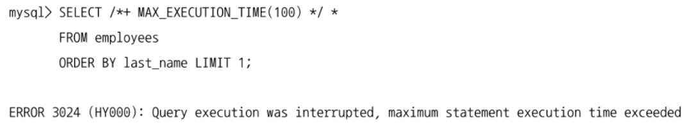

### SET_VAR

옵티마이저 힌트뿐만 아니라 MySQL 서버의 시스템 변수들 또한 쿼리의 실행 계획에 상당한 영향을 미친다.

대표적으로 조인 버퍼의 크기를 설정하는 join_buffer_size 시스템 변수의 경우 쿼리에 아무런 영향을 미치지 않을 것처럼 보인다.

하지만 MySQL 서버의 옵티마이저는 조인 버퍼의 공간이 충분하면 조인 버퍼를 활용하는 형태의 실행 계획을 선택할 수도 있다.

그뿐만 아니라 옵티마이저 힌트로 부족한 경우 optimizer_switch 시스템 변수를 제어해야 할 수도 있다. 이런 경우에는 SET_VAR 힌트를 이용하면 된다.

SET_VAR 힌트는 **실행 계획을 바꾸는 용도**뿐만 아니라 **조인 버퍼나 정렬용 버퍼(소트 버퍼)의 크기를 일시적으로 증가시켜 대용량 처리 쿼리의 성능을 향상시키는 용도**로도 사용할 수 있다.

여기서 예시하지 않은 다양한 형태의 시스템 변수를 조정할 수 있으므로 SET_VAR 힌트는 기억해두자. **하지만 모든 시스템 변수를 SET_VAR 힌트로 조정할 수는 없다는 것도 기억해두자.**

### SEMIJOIN & NO_SEMIJOIN

SEMIJOIN 힌트는 어떤 세부 전략을 사용할지를 제어하는 데 사용할 수 있다.

| 최적화 전략 | 힌트 |
| --- | --- |
| Duplicate Weed-out | SEMIJOIN(DUPSWEEDOUT) |
| First Match | SEMIJOIN(FIRSTMATCH) |
| Loose Scan | SEMIJOIN(LOOSESCAN) |
| Materialization | SEMIJOIN(MATERIALIZATION) |
| Table Pull-out | 없음 |

“Table Pull-out” 최적화 전략은 별도로 힌트를 사용할 수 없다.

“Table Pull-out” 전략은 그 전략을 사용할 수 있다면 항상 더 나은 성능을 보장하기 때문이다.

하지만 다른 최적화 전략들은 상황에 따라 다른 최적화 전략으로 우회하는 것이 더 나은 성능을 낼 수도 있기 때문에 NO_SEMIJOIN 힌트도 제공되는 것이다.

### **SUBQUERY**

서브쿼리 최적화는 세미 조인 최적화가 사용되지 못할 때 사용하는 최적화 방법으로, 서브쿼리는 다음 2가지 형태로 최적화할 수 있다.

| 최적화 방법 | 힌트 |
| --- | --- |
| IN-to-EXISTS | SUBQUERY(INTOEXISTS) |
| Materialization | SUBQUERY(MATERIALIZATION) |

세미 조인 최적화는 주로 IN(subquery) 형태의 쿼리에 사용될 수 있지만 안티 세미 조인(Anti Semi-Join)의 최적화에는 사용될 수 없다.

그래서 주로 안티 세미 조인 최적화에는 위의 2가지 최적화가 사용된다.

서브쿼리 최적화 힌트는 세미 조인 최적화 힌트와 비슷한 형태로, 서브쿼리 힌트를 사용하거나 서브쿼리 쿼리 블록을 지정해서 외부 쿼리 블록에서 최적화 방법을 명시하면 된다.

### BNL & NO_BNL & HASHJOIN & NO_HASHJOIN

MySQL 8.0.19 버전까지는 블록 네스티드 루프(Block Nested Loop) 조인 알고리즘을 사용했지만 MySQL 8.0.18 버전부터 도입된 해시 조인 알고리즘이 MySQL 8.0.20 버전부터는 블록 네스티드 루프 조인까지 대체하도록 개선됐다.

그래서 MySQL 8.0.20 버전부터는 블록 네스티드 루프 조인은 MySQL 서버에서 더 이상 사용되지 않는다.

하지만 BNL 힌트와 NO_BNL 힌트는 MySQL 8.0.20과 그 이후 버전에서도 여전히 사용 가능한데, MySQL 8.0.20 버전과 그 이후 버전에서는 **BNL 힌트를 사용하면 해시 조인을 사용하도록 유도하는 힌트로 용도가 변경**됐다. 대신 HASHJOIN과 NO_HASHJOIN 힌트는 MySQL 8.0.18 버전에서만 유효하며, 그 이후 버전에서는 효력이 없다.

그래서 MySQL 8.0.20과 그 이후 버전에서는 해시 조인을 유도하거나 해시 조인을 사용하지 않게 하고자 한다면 다음 예제 쿼리와 같이 BNL과 NO_BNL 힌트를 사용해야 한다.

### JOIN_FIXED_ORDER & JOIN_ORDER & JOIN_PREFIX & JOIN_SUFFIX

MySQL 서버에서는 조인의 순서를 결정하기 위해 전통적으로 STRAIGHT_JOIN 힌트를 사용해왔다. 하지만 STRAIGHT_JOIN 힌트는 우선 쿼리의 FROM 절에 사용된 테이블의 순서를 조인 순서에 맞게 변경해야 하는 번거로움이 있었다.

또한 STRAIGHT_JOIN은 한 번 사용되면 FROM 절에 명시된 모든 테이블의 조인 순서가 결정되기 때문에 일부는 조인 순서를 강제하고 나머지는 옵티마이저에게 순서를 결정하게 맡기는 것이 불가능했다.

이 같은 단점을 보완하기 위해 옵티마이저 힌트에서는 STRAIGHT_JOIN과 동일한 힌트까지 포함해서 다음과 같이 4개의 힌트를 제공한다.

- **JOIN_FIXED_ORDER**
    
    STRAIGHT_JOIN 힌트와 동일하게 FROM 절의 테이블 순서대로 조인을 실행하게 하는 힌트
    
- **JOIN_ORDER**
    
    FROM 절에 사용된 테이블의 순서가 아니라 힌트에 명시된 테이블의 순서대로 조인을 실행하는 힌트
    
- **JOIN_PREFIX**
    
    조인에서 드라이빙 테이블만 강제하는 힌트
    
- **JOIN_SUFFIX**
    
    조인에서 드리븐 테이블(가장 마지막에 조인돼야 할 테이블)만 강제하는 힌트
    

### MERGE & NO_MERGE

예전 버전의 MySQL 서버에서는 FROM 절에 사용된 서브쿼리를 항상 내부 임시 테이블로 생성했다. 이렇게 생성된 내부 임시 테이블을 파생 테이블이라고 하는데, 이는 불필요한 자원 소모를 유발한다.

그래서 MySQL 5.7과 8.0 버전에서는 가능하면 임시 테이블을 사용하지 않게 FROM 절의 서브쿼리를 외부 쿼리와 병합하는 최적화를 도입했다.

때로는 MySQL 옵티마이저가 내부 쿼리를 외부 쿼리와 병합하는 것이 나을 수도 있고, 때로는 내부 임시 테이블을 생성하는 것이 더 나은 선택일 수도 있다.

하지만 MySQL 옵티마이저는 최적의 방법을 선택하지 못할 수도 있는데, 이때는 MERGE 또는 NO_MERGE 옵티마이저 힌트를 사용하면 된다

### INDEX_MERGE & NO_INDEX_MERGE

MySQL 서버는 가능하다면 테이블당 하나의 인덱스만을 이용해 쿼리를 처리하려고 한다. 하지만 하나의 인덱스만으로 검색 대상 범위를 충분히 좁힐 수 없다면 MySQL 옵티마이저는 사용 가능한 다른 인덱스를 함께 이용하기도 한다.

여러 인덱스를 통해 검색된 레코드로부터 교집합 또는 합집합을 구해서 그 결과를 반환한다. 이처럼 하나의 테이블에 대해 여러 개의 인덱스를 동시에 사용하는 것을 인덱스 머지(Index Merge)라고 한다.

인덱스 머지 실행 계획은 때로는 성능 향상에 도움이 되지만 항상 그렇지는 않을 수도 있다. 인덱스 머지 실행 계획의 사용 여부를 제어하고자 할 때 INDEX_MERGE와 NO_INDEX_MERGE 옵티마이저 힌트를 이용하면 된다.

### NO_ICP

인덱스 컨디션 푸시다운(ICP, Index Condition Pushdown) 최적화는 사용 가능하다면 항상 성능 향상에 도움이 되므로 MySQL 옵티마이저는 최대한 인덱스 컨디션 푸시다운 기능을 사용하는 방향으로 실행 계획을 수립한다.

그래서 MySQL 옵티마이저에서는 ICP 힌트(인덱스 컨디션 푸시다운을 사용하도록 하는 힌트)는 제공되지 않는다.

그런데 인덱스 컨디션 푸시다운으로 인해 여러 실행 계획의 비용 계산이 잘못된다면 결과적으로 잘못된 실행 계획을 수립하게 될 수도 있다.

예를 들어 A 인덱스와 B 인덱스 둘 중에서 하나를 선택해야 하는 상황에서 A 인덱스에서는 인덱스 컨디션 푸시다운이 가능해서 A 인덱스를 사용하는 것이 비용이 낮게 예측됐다고 가정하자.

그렇다면 MySQL 옵티마이저는 A 인덱스를 사용하는 실행 계획을 선택할 것이다. 하지만 실제 서비스에서는 B 인덱스를 선택하는 것이 더 효율적일 수도 있다.

테이블의 데이터 분포는 항상 균등한 것이 아니기 때문에 쿼리 검색 범위에 따라 A 인덱스 또는 B 인덱스가 더 효율적일 수 있다. 이런 경우에는 인덱스 컨디션 푸시다운 최적화를 비활성화해서 조금 더 유연하고 정확하게 실행 계획을 선택하게 할 수 있다.

### SKIP_SCAN & NO_SKIP_SCAN

인덱스 스킵 스캔은 인덱스의 선행 컬럼에 대한 조건이 없어도 옵티마이저가 해당 인덱스를 사용할 수 있게 해주는 매우 훌륭한 최적화 기능이다.

하지만 조건이 누락된 선행 컬럼이 가지는 유니크한 값의 개수가 많아진다면 인덱스 스킵 스캔의 성능은 오히려 더 떨어진다.

MySQL 옵티마이저가 유니크한 값의 개수를 제대로 분석하지 못하거나 잘못된 정보로 인해 비효율적인 인덱스 스킵 스캔을 선택하면 NO_SKIP_SCAN 옵티마이저 힌트를 이용해 인덱스 스킵 스캔을 사용하지 않게 할 수 있다.

### INDEX & NO_INDEX

INDEX와 NO_INDEX 옵티마이저 힌트는 예전 MySQL 서버에서 사용되던 인덱스 힌트를 대체하는 용도로 제공된다.

인덱스 힌트를 대체하는 옵티마이저 힌트는 다음과 같다.

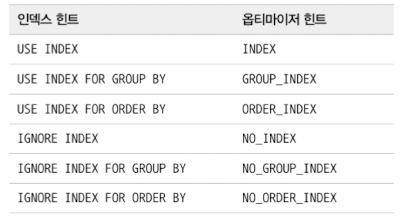

인덱스 힌트는 특정 테이블 뒤에 사용했기 때문에 별도로 힌트 내에 테이블명 없이 인덱스 이름만 나열했다. 하지만 옵티마이저 힌트에는 테이블명과 인덱스 이름을 함께 명시해야 한다.